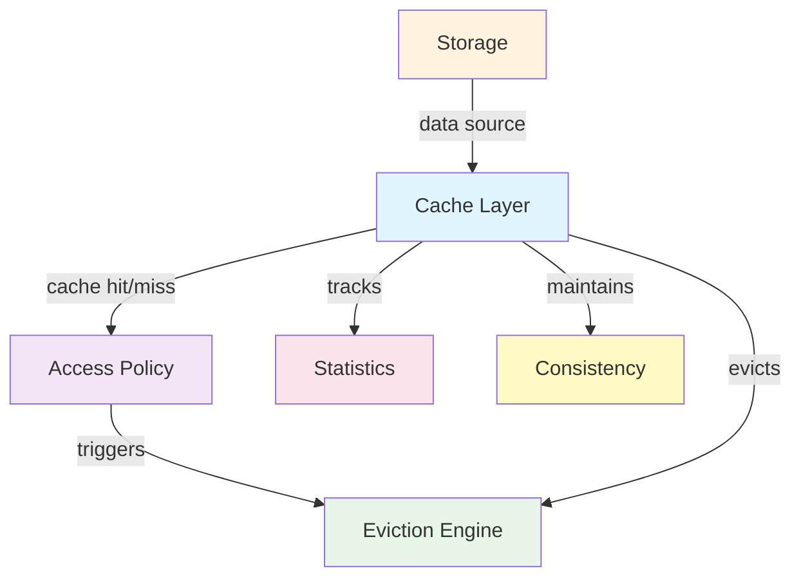
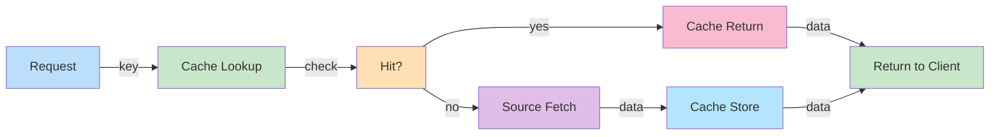
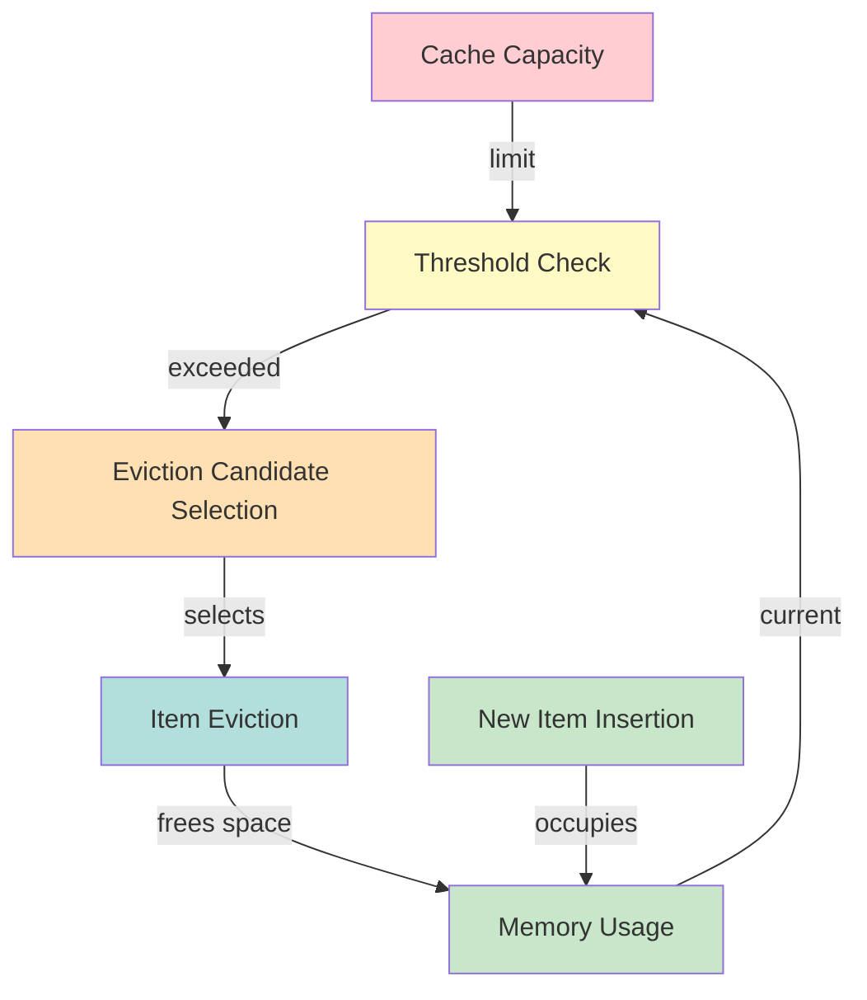
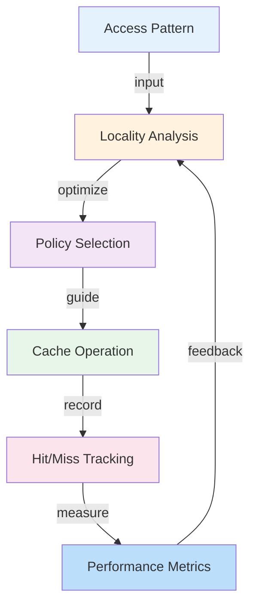
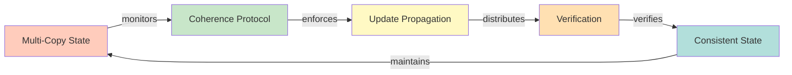

# Cache Eviction Policy Tuning and Optimization

## System Overview

Different workloads benefit from different eviction policies (LRU for sequential, LFU for skewed). Tuning involves analyzing access patterns, comparing policies, and selecting optimal configuration. Some systems (ARC, LIRS) adapt dynamically; others require manual tuning.

**Scale Metrics:**
- Workload-specific optimization, 20-30% hit ratio improvement

## Architecture

### Core Components



### Data Flow Architecture



### Eviction and Memory Management



### Hit Ratio and Performance



### Consistency and Coherence



## Functional Requirements

1. **Fast Retrieval** - O(1) cache lookup, sub-microsecond latency
2. **Capacity Management** - Enforce memory limits, evict items when full
3. **Eviction Policy** - Select items to evict based on policy (LRU, LFU, ARC, etc.)
4. **Consistency** - Maintain consistency with source data, handle invalidation
5. **Expiration** - Support TTL-based expiration with configurable intervals
6. **Statistics** - Track hit/miss ratios, eviction patterns, memory usage
7. **Concurrency** - Thread-safe operations, handle concurrent access

## Non-Functional Requirements

1. **Latency** - Sub-millisecond hit latency, <10ms miss latency with backend
2. **Capacity** - Scale to billions of entries, terabytes of memory
3. **Hit Ratio** - Achieve 90%+ hit ratio for well-optimized workloads
4. **Throughput** - Support millions of operations per second
5. **Memory Efficiency** - Minimize overhead per cached item
6. **Durability** - Survive process crashes (for persistent caches)
7. **Visibility** - Complete metrics and monitoring for performance analysis

## Data Flow Scenarios

### Scenario 1: Cache Hit
1. Client requests item with cache key
2. Cache lookup performed (hash table O(1))
3. Item found in cache, returned immediately
4. Access time recorded (for LRU/LFU tracking)
5. Statistics updated (hit count incremented)

### Scenario 2: Cache Miss and Load
1. Client requests item
2. Cache lookup fails
3. Source/backend queried
4. Data retrieved and loaded into cache
5. Item evicted if capacity exceeded per policy
6. Data returned to client

### Scenario 3: Expiration and Refresh
1. Item's TTL expires
2. Cache marks item as stale
3. Next access triggers reload from source
4. New data cached with fresh TTL
5. Old copy evicted if new copy loaded

### Scenario 4: Thundering Herd Prevention
1. Popular item expires
2. 1000 concurrent requests for same key
3. Only first request loads from source
4. Others wait for first load to complete
5. All requests served from cache after first load

## Back-of-the-Envelope Calculations

**Cache Capacity Planning:**
- DRAM cost: ~$5 per GB
- 1TB cache: $5,000 hardware cost
- Cache hit ratio: 95% for well-tuned workload
- Backend latency: 100ms without cache
- Cache latency: 1ms with cache
- Effective latency with 95% hit ratio: 5.95ms (0.95*1ms + 0.05*100ms)
- Latency improvement: 16x

**Hit Ratio Economics:**
- Application throughput: 10K QPS
- Backend capacity: 100 QPS (100x overloaded without cache)
- To support 10K QPS at 100 QPS backend: need 99% hit ratio
- 95% hit ratio: supports only 1.9K QPS (1900 miss QPS exceeds 100 QPS backend)
- Hit ratio directly determines scalability

**Memory Overhead:**
- Average item size: 1KB
- Metadata per item: 128 bytes (LRU pointers, timestamps, stats)
- Total per item: 1.128KB
- 1M items: 1.128GB
- 1B items: 1.128TB

**TTL and Expiration:**
- Item lifespan: 1 hour (3600 seconds)
- New items/second: 1000
- Items expiring/second: ~0.28 (1000/3600)
- Eviction overhead: minimal for TTL-based expiration

## Interview Questions

### Q1: How would you implement a thread-safe LRU cache?
**Answer:** Design using HashMap + DoublyLinkedList:
```
LRUCache(capacity):
  hashmap = HashMap() # key -> Node
  head = Node() # dummy head
  tail = Node() # dummy tail
  capacity = capacity

get(key):
  if key not in hashmap: return -1
  node = hashmap[key]
  moveToFront(node) # mark as recently used
  return node.value

put(key, value):
  if key in hashmap:
    node = hashmap[key]
    node.value = value
    moveToFront(node)
  else:
    if len(hashmap) == capacity:
      removeLast() # evict LRU item
    node = Node(key, value)
    addToFront(node)
    hashmap[key] = node

moveToFront(node):
  removeNode(node) # O(1) with pointers
  addToFront(node)

removeNode(node):
  node.prev.next = node.next
  node.next.prev = node.prev

addToFront(node):
  node.next = head.next
  node.prev = head
  head.next.prev = node
  head.next = node
```

Time complexity: O(1) for get/put
Space complexity: O(capacity)

Thread safety requires locks:
```
ReentrantReadWriteLock lock;

synchronized get(key):
  lock.readLock().lock()
  try: return node.value
  finally: lock.readLock().unlock()

synchronized put(key, value):
  lock.writeLock().lock()
  try: // update operations
  finally: lock.writeLock().unlock()
```

### Q2: Explain cache invalidation and strategies to prevent stale data.
**Answer:** Cache invalidation is challenging because cached data becomes stale when source changes. Strategies:

1. **TTL-based (Time-To-Live)**
   - Item automatically expires after fixed duration (e.g., 1 hour)
   - Simple but trades consistency for simplicity
   - Good for slowly-changing data
   - Risk: serve stale data until TTL expires

2. **Event-based Invalidation**
   - Source sends event when data changes
   - Cache immediately invalidates item
   - Ensures freshness but requires change notification infrastructure
   - Coupling between source and cache

3. **Consistency Protocols**
   - Write-through: update cache and source atomically
   - Requires locking, increases write latency
   - Quorum reads: read from majority of replicas
   - Ensures strong consistency but increases latency

4. **Refresh-Ahead**
   - Proactively refresh items before expiration
   - Eliminates cold-start latency
   - Risk: refresh non-accessed items (wasted work)

5. **Versioning**
   - Include version in cache key (foo:v1, foo:v2)
   - On data change, new version created
   - Old version eventually expires
   - Enables gradual rollout, avoids breaking clients

**Best practice:** Use hybrid approach
- Short TTL for consistency-critical data (config, auth)
- Long TTL for slowly-changing data (profiles)
- Event-based for real-time requirements (user state)

### Q3: How would you prevent cache thundering herd?
**Answer:** Thundering herd occurs when popular item expires, causing massive spike in backend requests:

**Prevention strategies:**

1. **Probabilistic Expiration**
```
expiration_time = TTL + random(-TTL*0.25, TTL*0.25)
```
Staggers expirations around nominal TTL, spreading refresh load.

2. **Probabilistic Refresh Before Expiration**
```
if random() < 0.1:  # 10% chance
  background_refresh(key)
```
Items refreshed probabilistically before expiration, reducing simultaneous reloads.

3. **Locking During Miss**
```
if cache_miss(key):
  if try_lock(key):  # only one calculator
    data = load_from_backend(key)
    cache_set(key, data)
    unlock(key)
  else:
    wait_for_lock(key)  # others wait for first load
    return cache_get(key)
```
Single calculator with others waiting prevents duplicate backend requests.

4. **Refresh-Ahead with Timeout**
```
if item_age > TTL * 0.8:  # refresh at 80% of TTL
  background_refresh(key, timeout=100ms)
  # if refresh takes >100ms, serve stale but don't retry
```
Proactive refresh with timeout prevents cascading load.

Example impact:
- 100K concurrent requests for expired item
- Without protection: 100K backend requests (overload)
- With probabilistic expiration: ~10K spread over 30 minutes (manageable)
- With locking: 1 backend request + wait (minimal backend impact)

### Q4: What's the trade-off between write-through and write-back caching?
**Answer:**

| Aspect | Write-Through | Write-Back |
|--------|---|---|
| **Write Latency** | High (source latency dominates) | Low (cache latency dominates) |
| **Consistency** | Strong (cache always valid) | Eventual (cache may be ahead of source) |
| **Data Safety** | Safe (source updated before ack) | Risk of data loss if cache fails |
| **Backend Load** | Every write hits backend | Batch writes reduce backend load |
| **Use Case** | Financial transactions, audit logs | User preferences, analytics |

**Write-Through Example:**
```
put(key, value):
  write_to_source(key, value)  // blocking, 100ms latency
  write_to_cache(key, value)
  return success
```
Simple but slow; good for correctness requirements.

**Write-Back Example:**
```
put(key, value):
  write_to_cache(key, value)  // instant, <1ms latency
  background_flush(key, value)  // async
  return success

background_flush(key, value):
  // runs periodically or on flush trigger
  write_to_source(key, value)
```
Fast but risks:
- Cache failure before flush loses data
- Ordering: concurrent writes may flush in different order
- Durability: RAID/replication needed in cache

**Hybrid Approach:**
- Write-back to cache, sync to source with timeout
- Use WAL (Write-Ahead Log) for durability
- Periodically flush or on explicit fsync call

### Q5: How do you measure and optimize cache hit ratio?
**Answer:** Hit ratio = (hits) / (hits + misses). High hit ratio (>90%) indicates good cache performance.

**Measurement:**
```
Track:
  - cache_hits: counter incremented on each cache hit
  - cache_misses: counter incremented on each cache miss
  - hit_ratio = cache_hits / (cache_hits + cache_misses)
  - miss_rate = 1 - hit_ratio

Monitor by:
  - Key type (which keys miss most?)
  - Time of day (weekday vs weekend patterns?)
  - User segment (authenticated vs anonymous?)
```

**Optimization Techniques:**

1. **Increase Cache Capacity**
   - More items fit in cache
   - Hit ratio increases until working set exceeds capacity
   - Law of diminishing returns; 90% hit ratio needs more capacity than 80%

2. **Change Eviction Policy**
   - LRU: good for sequential/temporal patterns
   - LFU: good for skewed frequency (Zipf) distributions
   - ARC: adapts dynamically
   - Test policies with recorded production traces

3. **Adjust TTL**
   - Longer TTL: higher hit ratio but more stale data
   - Shorter TTL: fresher data but lower hit ratio
   - Workload-specific; trade consistency for hit ratio

4. **Improve Key Design**
   - Avoid cache-busting keys (timestamps in key)
   - Group related items with common prefixes
   - Normalize keys (foo vs FOO vs foo/)

5. **Cache-Aware Query Design**
   - Batch queries to improve cache reuse
   - Avoid redundant requests
   - Preload likely-needed items

**Example Optimization:**
- Initial: 60% hit ratio, 1GB cache
- Increase capacity to 2GB: 75% hit ratio
- Switch to ARC: 82% hit ratio
- Adjust TTL from 1h to 2h: 88% hit ratio
- Optimize query patterns: 92% hit ratio

### Q6: Explain multi-tier caching architecture.
**Answer:** Multi-tier caching uses multiple cache layers with different characteristics:

**Typical Architecture:**
```
L1 (Process Local): In-process cache
  - Latency: <1 microsecond
  - Capacity: 1-100MB per process
  - Scope: Single process
  - Example: HashMap in-memory

L2 (Node Local): Single-node cache
  - Latency: <1 millisecond
  - Capacity: 1-100GB per node
  - Scope: Local machine
  - Example: Redis, Memcached local

L3 (Cluster): Distributed cache
  - Latency: 1-10 milliseconds
  - Capacity: Terabytes across cluster
  - Scope: All services
  - Example: Redis Cluster, DynamoDB

Source (Database): Persistent storage
  - Latency: 10-1000 milliseconds
  - Capacity: Unlimited
  - Scope: Permanent storage
  - Example: PostgreSQL, S3
```

**Data Flow:**
1. Check L1: if miss, check L2
2. Check L2: if miss, check L3
3. Check L3: if miss, fetch from source
4. Populate L3, then L2, then L1 on return

**Consistency Challenge:**
L1 and L2 copies may become inconsistent if only L3/source updated. Solution: invalidation propagation or versioning.

**Trade-offs:**
- More tiers: lower miss latency, higher complexity
- Fewer tiers: simpler, higher latency
- Typical sweet spot: 2-3 tiers

**Example with Math:**
- L1 hit latency: 0.001ms, hit rate 50%
- L2 hit latency: 0.1ms, hit rate 80% (given L1 miss)
- L3 hit latency: 1ms, hit rate 95% (given L2 miss)
- Source latency: 100ms

Expected latency:
- 50% * 0.001ms (L1 hit)
- + 50% * 80% * 0.1ms (L1 miss, L2 hit)
- + 50% * 20% * 1ms (L1/L2 miss, L3 hit)
- + 50% * 20% * 5% * 100ms (all miss, source)
- = 0.0005 + 0.04 + 0.1 + 0.5
- = 0.6405ms average (vs 100ms without cache)

## Technology Stack

- **In-Memory Caches**: Redis, Memcached
- **Local Caches**: Ehcache, Caffeine, Guava Cache
- **Distributed**: Redis Cluster, DynamoDB, Hazelcast
- **Cache-Aside Libraries**: Spring Cache, Hibernate Cache
- **Monitoring**: Prometheus, Grafana, New Relic
- **Testing**: Mockito, Testcontainers
- **Serialization**: JSON, Protocol Buffers, MessagePack

## Lessons Learned

1. **Hit Ratio is Critical** - Even 5% improvement can reduce backend load 50%+
2. **Consistency is Hard** - Cache invalidation harder than expected; plan carefully
3. **Thundering Herd is Real** - Protect with locking or probabilistic expiration
4. **Monitor Everything** - Hit ratio, eviction rate, memory usage all important
5. **Profile Your Workload** - Best policy depends on access patterns
6. **TTL Tuning Takes Time** - Start conservative, gradually increase based on staleness tolerance
7. **Multi-Tier Caching Needed** - Single tier bottleneck; L1+L2+L3 provides best latency
8. **Capacity Planning Essential** - Under-sized cache worse than no cache (thrashing)


## Code Implementation

### Python
```python
import asyncio
import aiohttp
from dataclasses import dataclass
from typing import Optional, List
import time, logging

logger = logging.getLogger(__name__)

@dataclass
class ServiceConfig:
    host: str = "localhost"
    port: int = 8080
    timeout_seconds: float = 5.0
    max_retries: int = 3

class ServiceClient:
    """Generic service client with retry and circuit breaker."""
    def __init__(self, config: ServiceConfig):
        self.config = config
        self.base_url = f"http://{config.host}:{config.port}"
        self._failures = 0
        self._circuit_open = False
        self._last_failure: Optional[float] = None

    def _is_circuit_open(self) -> bool:
        if not self._circuit_open:
            return False
        # Half-open after 60s — allow one request through
        if time.time() - self._last_failure > 60:
            self._circuit_open = False
            return False
        return True

    async def call(self, endpoint: str, payload: dict) -> Optional[dict]:
        if self._is_circuit_open():
            logger.warning("Circuit open — fast fail")
            return None

        timeout = aiohttp.ClientTimeout(total=self.config.timeout_seconds)
        async with aiohttp.ClientSession(timeout=timeout) as session:
            for attempt in range(self.config.max_retries):
                try:
                    async with session.post(
                        f"{self.base_url}{endpoint}", json=payload
                    ) as resp:
                        resp.raise_for_status()
                        self._failures = 0              # reset on success
                        return await resp.json()
                except Exception as e:
                    logger.warning(f"Attempt {attempt+1} failed: {e}")
                    if attempt < self.config.max_retries - 1:
                        await asyncio.sleep(2 ** attempt)  # exponential backoff
            # All retries exhausted
            self._failures += 1
            if self._failures >= 5:                     # open circuit
                self._circuit_open = True
                self._last_failure = time.time()
            return None
```

### Java
```java
import java.net.http.*;
import java.net.URI;
import java.time.Duration;
import java.util.concurrent.atomic.*;
import java.util.concurrent.CompletableFuture;

/** Generic resilient service client with circuit breaker + retry. */
public class ServiceClient {
    private final String baseUrl;
    private final HttpClient http;
    private final AtomicInteger failures = new AtomicInteger(0);
    private final AtomicBoolean circuitOpen = new AtomicBoolean(false);
    private volatile long lastFailureTime;

    public ServiceClient(String host, int port) {
        this.baseUrl = "http://" + host + ":" + port;
        this.http = HttpClient.newBuilder()
            .connectTimeout(Duration.ofSeconds(5))
            .build();
    }

    private boolean isCircuitOpen() {
        if (!circuitOpen.get()) return false;
        // Half-open after 60s
        if (System.currentTimeMillis() - lastFailureTime > 60_000) {
            circuitOpen.set(false);
            return false;
        }
        return true;
    }

    public CompletableFuture<String> call(String path, String jsonBody) {
        if (isCircuitOpen())
            return CompletableFuture.failedFuture(
                new RuntimeException("Circuit open"));

        HttpRequest request = HttpRequest.newBuilder()
            .uri(URI.create(baseUrl + path))
            .header("Content-Type", "application/json")
            .POST(HttpRequest.BodyPublishers.ofString(jsonBody))
            .timeout(Duration.ofSeconds(5))
            .build();

        return http.sendAsync(request, HttpResponse.BodyHandlers.ofString())
            .thenApply(resp -> {
                if (resp.statusCode() >= 500) throw new RuntimeException("Server error");
                failures.set(0);  // reset on success
                return resp.body();
            })
            .exceptionally(ex -> {
                if (failures.incrementAndGet() >= 5) {
                    circuitOpen.set(true);
                    lastFailureTime = System.currentTimeMillis();
                }
                return null;
            });
    }
}
```
## Follow-up Questions

1. **How would you handle this at 10x the scale described?**
   - What breaks first? (typically: single DB, single cache node, single region)
   - What architectural changes are required?

2. **What are the consistency vs. availability trade-offs in your design?**
   - Where did you accept eventual consistency?
   - Which operations require strong consistency and why?

3. **How would you debug a sudden latency spike in production?**
   - What metrics would you look at first?
   - What's your runbook for the top 3 likely causes?

4. **How does your design handle partial failures?**
   - What happens if one component is slow (not down)?
   - How do you prevent cascading failures?

5. **What would you change if you had to build this in one week vs. six months?**
   - What corners can safely be cut initially?
   - What must be right from day one?

6. **How would you migrate from the current design to a better one without downtime?**
   - What's the strangler-fig or blue-green strategy here?
   - How do you validate correctness during migration?