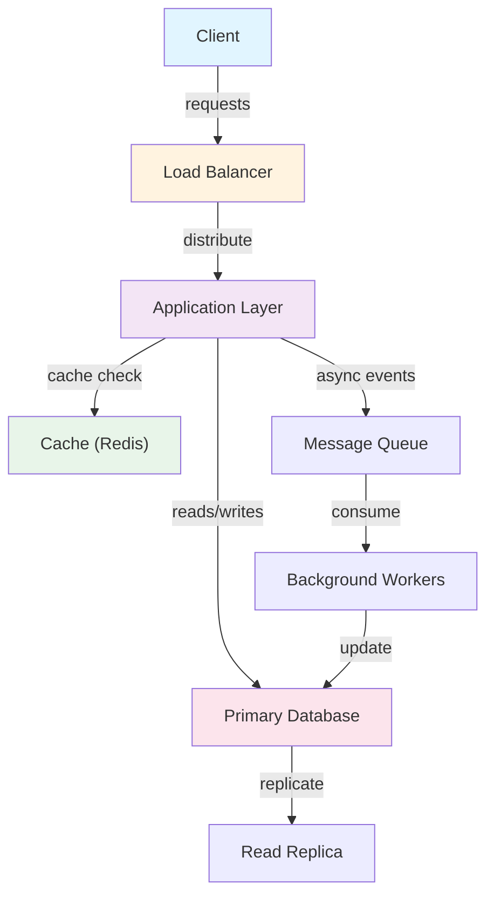
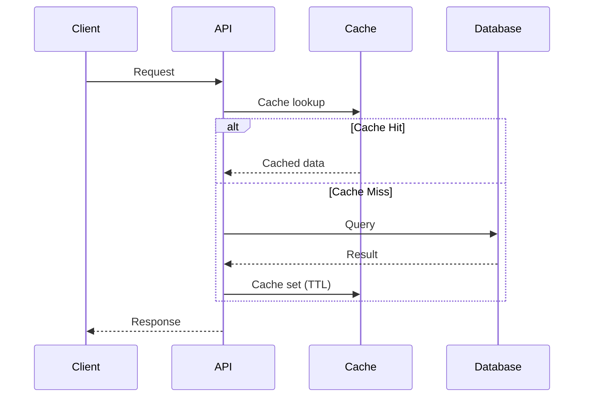
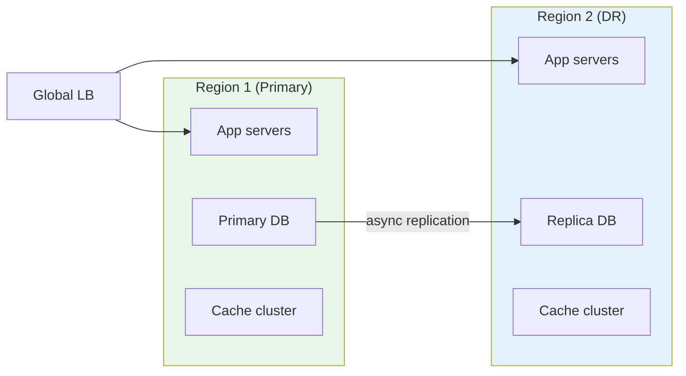

# 02. Core Algorithms

Apply algorithmic thinking to real-world problems with rate limiting, ID generation, and object modeling.

## Problems

### 3. Rate Limiter
**Problem**: Prevent API abuse by limiting request frequency per user.

**Algorithms**:
- Token Bucket: refill tokens over time, allow burst
- Sliding Window: strict rate limiting without burst
- Sliding Window Counter: efficient approximation

**Real-world Use**: API gateways, DDoS prevention, fair resource allocation

### 4. URL Shortener
**Problem**: Convert long URLs to short, memorable codes.

**Algorithms**:
- Counter-based: sequential IDs
- Snowflake: distributed ID generation
- Hash-based: collision detection and retry

**Real-world Use**: URL shortening services (bit.ly, tinyurl), distributed systems

### 5. Parking Lot
**Problem**: Design a system to manage parking across multiple levels with different spot sizes.

**Concepts**:
- Object-oriented design (Vehicle, Level, Spot)
- State management and transitions
- Efficient spot allocation (O(1) availability tracking)

**Real-world Use**: Smart parking systems, resource allocation

## Learning Outcomes

You'll learn:
1. ✅ How to apply algorithm design to real problems
2. ✅ Distributed ID generation at scale
3. ✅ Object-oriented system modeling
4. ✅ Handling concurrency and state
5. ✅ Back-of-envelope capacity planning

## Problem-Solving Approach

1. **Understand Constraints**: Rate limits, latency, capacity
2. **Choose Algorithm**: Analyze trade-offs
3. **Design Data Structures**: Optimize for operations
4. **Handle Edge Cases**: Overflow, collisions, failures
5. **Estimate Scale**: Can it handle 10x, 100x growth?

## Key Algorithms

| Problem | Primary | Alternative |
|---------|---------|-------------|
| Rate Limiter | Token Bucket | Sliding Window |
| URL Shortener | Snowflake ID | Counter + Base62 |
| Parking Lot | State Machine | Graph-based |

## Next Steps

- Implement each algorithm in your preferred language
- Test edge cases thoroughly
- Optimize for your specific constraints
- Move to **Design Patterns** for architectural thinking

## Architecture Diagrams

### System Overview


### Data Flow


### Scaling Architecture

## Code Implementation

### Python
```python
import asyncio
import aiohttp
from dataclasses import dataclass
from typing import Optional, List
import time, logging

logger = logging.getLogger(__name__)

@dataclass
class ServiceConfig:
    host: str = "localhost"
    port: int = 8080
    timeout_seconds: float = 5.0
    max_retries: int = 3

class ServiceClient:
    """Generic service client with retry and circuit breaker."""
    def __init__(self, config: ServiceConfig):
        self.config = config
        self.base_url = f"http://{config.host}:{config.port}"
        self._failures = 0
        self._circuit_open = False
        self._last_failure: Optional[float] = None

    def _is_circuit_open(self) -> bool:
        if not self._circuit_open:
            return False
        # Half-open after 60s — allow one request through
        if time.time() - self._last_failure > 60:
            self._circuit_open = False
            return False
        return True

    async def call(self, endpoint: str, payload: dict) -> Optional[dict]:
        if self._is_circuit_open():
            logger.warning("Circuit open — fast fail")
            return None

        timeout = aiohttp.ClientTimeout(total=self.config.timeout_seconds)
        async with aiohttp.ClientSession(timeout=timeout) as session:
            for attempt in range(self.config.max_retries):
                try:
                    async with session.post(
                        f"{self.base_url}{endpoint}", json=payload
                    ) as resp:
                        resp.raise_for_status()
                        self._failures = 0              # reset on success
                        return await resp.json()
                except Exception as e:
                    logger.warning(f"Attempt {attempt+1} failed: {e}")
                    if attempt < self.config.max_retries - 1:
                        await asyncio.sleep(2 ** attempt)  # exponential backoff
            # All retries exhausted
            self._failures += 1
            if self._failures >= 5:                     # open circuit
                self._circuit_open = True
                self._last_failure = time.time()
            return None
```

### Java
```java
import java.net.http.*;
import java.net.URI;
import java.time.Duration;
import java.util.concurrent.atomic.*;
import java.util.concurrent.CompletableFuture;

/** Generic resilient service client with circuit breaker + retry. */
public class ServiceClient {
    private final String baseUrl;
    private final HttpClient http;
    private final AtomicInteger failures = new AtomicInteger(0);
    private final AtomicBoolean circuitOpen = new AtomicBoolean(false);
    private volatile long lastFailureTime;

    public ServiceClient(String host, int port) {
        this.baseUrl = "http://" + host + ":" + port;
        this.http = HttpClient.newBuilder()
            .connectTimeout(Duration.ofSeconds(5))
            .build();
    }

    private boolean isCircuitOpen() {
        if (!circuitOpen.get()) return false;
        // Half-open after 60s
        if (System.currentTimeMillis() - lastFailureTime > 60_000) {
            circuitOpen.set(false);
            return false;
        }
        return true;
    }

    public CompletableFuture<String> call(String path, String jsonBody) {
        if (isCircuitOpen())
            return CompletableFuture.failedFuture(
                new RuntimeException("Circuit open"));

        HttpRequest request = HttpRequest.newBuilder()
            .uri(URI.create(baseUrl + path))
            .header("Content-Type", "application/json")
            .POST(HttpRequest.BodyPublishers.ofString(jsonBody))
            .timeout(Duration.ofSeconds(5))
            .build();

        return http.sendAsync(request, HttpResponse.BodyHandlers.ofString())
            .thenApply(resp -> {
                if (resp.statusCode() >= 500) throw new RuntimeException("Server error");
                failures.set(0);  // reset on success
                return resp.body();
            })
            .exceptionally(ex -> {
                if (failures.incrementAndGet() >= 5) {
                    circuitOpen.set(true);
                    lastFailureTime = System.currentTimeMillis();
                }
                return null;
            });
    }
}
```

## Back-of-the-Envelope Calculations

**Time vs Data Size:**
- n=1,000: O(n log n) = ~10K ops → <1ms
- n=1,000,000: O(n log n) = ~20M ops → ~20ms
- n=1,000,000,000: O(n log n) = ~30B ops → ~30s
- O(n²) at n=1M: 10¹² ops → hours — impractical

**Memory:**
- Merge sort: O(n) auxiliary = 8MB for 1M 64-bit ints
- QuickSort: O(log n) stack = ~20 frames = negligible
- Radix sort: O(n+k) where k=range — 4GB for 32-bit ints
## Follow-up Questions

1. **How would you handle this at 10x the scale described?**
   - What breaks first? (typically: single DB, single cache node, single region)
   - What architectural changes are required?

2. **What are the consistency vs. availability trade-offs in your design?**
   - Where did you accept eventual consistency?
   - Which operations require strong consistency and why?

3. **How would you debug a sudden latency spike in production?**
   - What metrics would you look at first?
   - What's your runbook for the top 3 likely causes?

4. **How does your design handle partial failures?**
   - What happens if one component is slow (not down)?
   - How do you prevent cascading failures?

5. **What would you change if you had to build this in one week vs. six months?**
   - What corners can safely be cut initially?
   - What must be right from day one?

6. **How would you migrate from the current design to a better one without downtime?**
   - What's the strangler-fig or blue-green strategy here?
   - How do you validate correctness during migration?