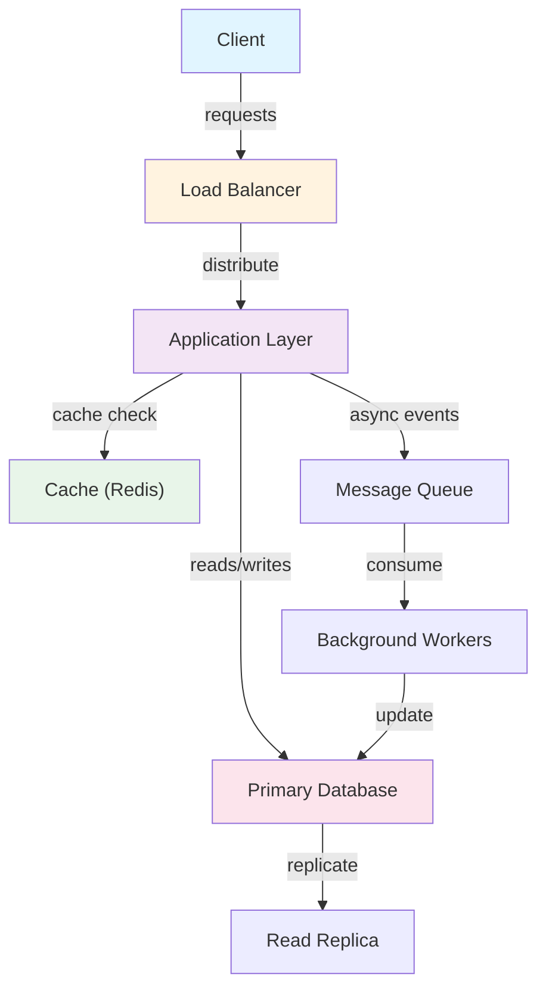
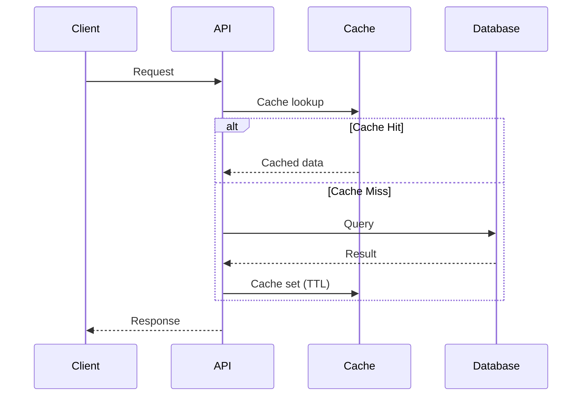
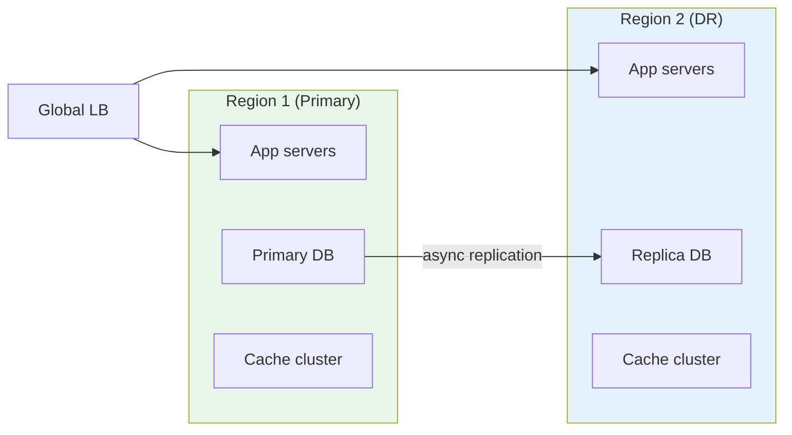

# Gang of Four Design Patterns

Complete documentation of all 23 Gang of Four design patterns with practical examples and decision guide.

## Creational Patterns (5)
Create objects without exposing creation logic.

### 1. [Singleton](01_singleton.md)
**When:** Need exactly one instance (logger, connection pool, configuration)
**Key Benefit:** Single instance globally accessible
**Trade-off:** Hard to test, hides dependencies

### 2. [Factory Method](02_factory_method.md)
**When:** Object type determined at runtime (database drivers, file parsers)
**Key Benefit:** Decouple creation from usage
**Trade-off:** Many subclasses, extra abstraction layer

### 3. [Abstract Factory](03_abstract_factory.md)
**When:** Create families of related objects (UI themes, database families)
**Key Benefit:** Ensure consistency within family, swap families easily
**Trade-off:** Complex, hard to extend families

### 4. [Builder](04_builder.md)
**When:** Objects have many optional parameters (HTTP request, SQL query)
**Key Benefit:** Readable construction, handles optional parameters elegantly
**Trade-off:** Extra classes, overhead for simple objects

### 5. [Prototype](05_prototype.md)
**When:** Object creation expensive, need independent copies (cloning, snapshots)
**Key Benefit:** Efficient creation via copying
**Trade-off:** Cloning complex with circular references

## Structural Patterns (7)
Compose objects into larger structures while keeping them flexible.

### 6. [Adapter](11_adapter.md)
**When:** Integrate incompatible interfaces (legacy code, third-party libraries)
**Key Benefit:** Use existing code without modification
**Trade-off:** Extra layer, may mask poor design

### 7. [Bridge](12_bridge.md)
**When:** Decouple abstraction from implementation (UI widgets on different OS)
**Key Benefit:** Avoid class explosion, vary independently
**Trade-off:** Extra indirection, complex upfront design

### 8. [Composite](13_composite.md)
**When:** Part-whole hierarchies (file system, UI components, menus)
**Key Benefit:** Treat individual and composite objects uniformly
**Trade-off:** Lost type safety, extra indirection

### 9. [Decorator](14_decorator.md)
**When:** Add features dynamically without subclassing (logging, caching, streams)
**Key Benefit:** Stack features, avoid class explosion
**Trade-off:** Many small objects, ordering matters

### 10. [Facade](15_facade.md)
**When:** Simplify complex subsystem (order processing, build system)
**Key Benefit:** Simple interface, decouple clients from subsystem
**Trade-off:** Facade becomes dumping ground, hides details

### 11. [Flyweight](16_flyweight.md)
**When:** Many similar objects causing memory bloat (text editor characters, game particles)
**Key Benefit:** Massive memory savings via sharing
**Trade-off:** Complex, CPU overhead for lookup

### 12. [Proxy](17_proxy.md)
**When:** Control access to objects (lazy loading, access control, logging)
**Key Benefit:** Lazy initialization, transparent access control
**Trade-off:** Extra indirection, added complexity

## Behavioral Patterns (11)
Communicate between objects, distribute responsibility, encapsulate behavior.

### 13. [Chain of Responsibility](21_chain_of_responsibility.md)
**When:** Multiple handlers, request passed until handled (logging levels, approval workflow)
**Key Benefit:** Decouple sender from receiver, flexible handler ordering
**Trade-off:** Request may go unhandled, hard to debug

### 14. [Command](22_command.md)
**When:** Encapsulate request as object (GUI buttons, undo/redo, job queue)
**Key Benefit:** Queue requests, undo/redo, macro commands
**Trade-off:** Many command classes, extra indirection

### 15. [Interpreter](31_interpreter.md)
**When:** Interpret custom language or syntax (expression evaluator, DSL)
**Key Benefit:** Represent language as data, extensible grammar
**Trade-off:** Complex for complex grammars, performance overhead

### 16. [Iterator](23_iterator.md)
**When:** Sequential access without exposing structure (traverse collection, tree)
**Key Benefit:** Hide internal structure, multiple concurrent iterations
**Trade-off:** Extra object overhead, modification during iteration issues

### 17. [Mediator](24_mediator.md)
**When:** Many interconnected objects (dialog with controls, chat room)
**Key Benefit:** Decoupled communication, centralized control
**Trade-off:** Mediator becomes complex, hard to understand flow

### 18. [Memento](25_memento.md)
**When:** Save/restore state (undo/redo, snapshots, transactions)
**Key Benefit:** Preserve encapsulation, save multiple states
**Trade-off:** Memory overhead, serialization complexity

### 19. [Observer](26_observer.md)
**When:** One-to-many dependency (MVC, event systems, reactive programming)
**Key Benefit:** Loose coupling, dynamic subscriptions
**Trade-off:** Notification order unpredictable, memory leaks if not detached

### 20. [State](27_state.md)
**When:** Behavior varies by state (order workflow, connection states)
**Key Benefit:** Eliminate conditionals, encapsulate state behavior
**Trade-off:** Many classes, overkill for few states

### 21. [Strategy](28_strategy.md)
**When:** Multiple algorithms, choose at runtime (payment methods, sorting, compression)
**Key Benefit:** Eliminate conditionals, easy to add algorithms
**Trade-off:** Many strategy classes, overhead for single algorithm

### 22. [Template Method](29_template_method.md)
**When:** Similar algorithms with different details (data processing, report generation)
**Key Benefit:** Code reuse, control flow in base class
**Trade-off:** Rigid structure, subclasses limited to hooks

### 23. [Visitor](30_visitor.md)
**When:** Many operations on complex structure (AST operations, file system operations)
**Key Benefit:** Add operations without changing classes
**Trade-off:** Breaks encapsulation, hard to add new element types

## Decision Guide

### Choose by Problem Type

**"I need to create objects"**
→ Singleton, Factory Method, Abstract Factory, Builder, Prototype

**"I need to compose or adapt objects"**
→ Adapter, Bridge, Composite, Decorator, Facade, Flyweight, Proxy

**"I need objects to communicate"**
→ Chain of Responsibility, Command, Iterator, Mediator, Observer

**"I need to define object behavior"**
→ Interpreter, State, Strategy, Template Method, Visitor, Memento

### Choose by Symptom

**"Too many if/else statements"**
→ Strategy (algorithm choice), State (behavior by state), Visitor (operation choice)

**"Classes too tightly coupled"**
→ Observer, Mediator, Facade, Adapter, Bridge

**"Too many subclasses"**
→ Decorator, Strategy, State, Composite, Flyweight

**"Need to add functionality without modifying existing code"**
→ Decorator, Visitor, Template Method, Observer

**"Need to save/restore/undo state"**
→ Memento, Command, Prototype

**"Need flexible object creation"**
→ Factory Method, Abstract Factory, Builder, Prototype

## Real-World Application Examples

**E-Commerce System:**
- Builder: order configuration (items, shipping, payment)
- Strategy: payment methods (credit card, PayPal, Apple Pay)
- State: order workflow (pending, paid, shipped, delivered)
- Observer: notify inventory on order, notify user on status change
- Composite: product catalog (categories contain products and subcategories)
- Mediator: shopping cart mediates between product, inventory, order

**Text Editor:**
- Command: undo/redo stack (each edit is command)
- Memento: save document snapshots
- Composite: document structure (section contains paragraphs and images)
- Decorator: add formatting (bold, italic, underline)
- Flyweight: share font objects for efficiency
- Iterator: traverse document elements

**Web Framework:**
- Factory Method: create different request handlers
- Adapter: integrate third-party libraries
- Facade: simplify API for developers
- Observer: event listeners (click, change, submit)
- Strategy: different validation rules
- Template Method: HTTP request processing pipeline
- Chain of Responsibility: middleware chain

## Design Patterns vs. Anti-Patterns

**Good use:** Solves real problem, reduces complexity, improves maintainability
**Overuse:** Over-engineering, unnecessary abstraction, added complexity

**Rule of Three:**
Don't introduce pattern until you need it for 3+ similar cases.

**YAGNI (You Aren't Gonna Need It):**
Don't add patterns speculatively. Add when you need them.

## Related Patterns

Many patterns work together:
- Strategy often paired with State
- Decorator similar to Strategy
- Builder similar to Template Method
- Observer used in Mediator
- Command often with Memento for undo
- Factory Method often with Strategy/State

## Learning Path

**Beginner:** Observer, Factory Method, Singleton
**Intermediate:** Strategy, Decorator, Adapter
**Advanced:** Visitor, Mediator, Memento

**Practice:** Implement patterns in your language, recognize patterns in existing code.

## Further Reading

- "Design Patterns: Elements of Reusable Object-Oriented Software" by Gang of Four
- Pattern catalogs: refactoring.guru, sourcemaking.com
- Domain-specific patterns: cloud patterns, microservice patterns, enterprise patterns

## Architecture Diagrams

### System Overview


### Data Flow


### Scaling Architecture

## Code Implementation

### Python
```python
import asyncio
import aiohttp
from dataclasses import dataclass
from typing import Optional, List
import time, logging

logger = logging.getLogger(__name__)

@dataclass
class ServiceConfig:
    host: str = "localhost"
    port: int = 8080
    timeout_seconds: float = 5.0
    max_retries: int = 3

class ServiceClient:
    """Generic service client with retry and circuit breaker."""
    def __init__(self, config: ServiceConfig):
        self.config = config
        self.base_url = f"http://{config.host}:{config.port}"
        self._failures = 0
        self._circuit_open = False
        self._last_failure: Optional[float] = None

    def _is_circuit_open(self) -> bool:
        if not self._circuit_open:
            return False
        # Half-open after 60s — allow one request through
        if time.time() - self._last_failure > 60:
            self._circuit_open = False
            return False
        return True

    async def call(self, endpoint: str, payload: dict) -> Optional[dict]:
        if self._is_circuit_open():
            logger.warning("Circuit open — fast fail")
            return None

        timeout = aiohttp.ClientTimeout(total=self.config.timeout_seconds)
        async with aiohttp.ClientSession(timeout=timeout) as session:
            for attempt in range(self.config.max_retries):
                try:
                    async with session.post(
                        f"{self.base_url}{endpoint}", json=payload
                    ) as resp:
                        resp.raise_for_status()
                        self._failures = 0              # reset on success
                        return await resp.json()
                except Exception as e:
                    logger.warning(f"Attempt {attempt+1} failed: {e}")
                    if attempt < self.config.max_retries - 1:
                        await asyncio.sleep(2 ** attempt)  # exponential backoff
            # All retries exhausted
            self._failures += 1
            if self._failures >= 5:                     # open circuit
                self._circuit_open = True
                self._last_failure = time.time()
            return None
```

### Java
```java
import java.net.http.*;
import java.net.URI;
import java.time.Duration;
import java.util.concurrent.atomic.*;
import java.util.concurrent.CompletableFuture;

/** Generic resilient service client with circuit breaker + retry. */
public class ServiceClient {
    private final String baseUrl;
    private final HttpClient http;
    private final AtomicInteger failures = new AtomicInteger(0);
    private final AtomicBoolean circuitOpen = new AtomicBoolean(false);
    private volatile long lastFailureTime;

    public ServiceClient(String host, int port) {
        this.baseUrl = "http://" + host + ":" + port;
        this.http = HttpClient.newBuilder()
            .connectTimeout(Duration.ofSeconds(5))
            .build();
    }

    private boolean isCircuitOpen() {
        if (!circuitOpen.get()) return false;
        // Half-open after 60s
        if (System.currentTimeMillis() - lastFailureTime > 60_000) {
            circuitOpen.set(false);
            return false;
        }
        return true;
    }

    public CompletableFuture<String> call(String path, String jsonBody) {
        if (isCircuitOpen())
            return CompletableFuture.failedFuture(
                new RuntimeException("Circuit open"));

        HttpRequest request = HttpRequest.newBuilder()
            .uri(URI.create(baseUrl + path))
            .header("Content-Type", "application/json")
            .POST(HttpRequest.BodyPublishers.ofString(jsonBody))
            .timeout(Duration.ofSeconds(5))
            .build();

        return http.sendAsync(request, HttpResponse.BodyHandlers.ofString())
            .thenApply(resp -> {
                if (resp.statusCode() >= 500) throw new RuntimeException("Server error");
                failures.set(0);  // reset on success
                return resp.body();
            })
            .exceptionally(ex -> {
                if (failures.incrementAndGet() >= 5) {
                    circuitOpen.set(true);
                    lastFailureTime = System.currentTimeMillis();
                }
                return null;
            });
    }
}
```

## Back-of-the-Envelope Calculations

**System Load Estimation:**
- 1M daily active users × 10 requests/day = 10M requests/day
- Peak QPS = 10M / 86400 × 3 (peak factor) ≈ 350 QPS
- API server capacity: 1000 QPS/server → 1 server sufficient at peak
- With 2x redundancy: 2 servers minimum

**Storage Estimation:**
- 1M users × 10KB average data = 10GB structured data
- Annual growth: 10GB × 365 = 3.65TB/year
- With 3x replication: 11TB/year
- SSD cost ($0.10/GB): $1,100/year

**Bandwidth:**
- 350 QPS × 10KB response = 3.5MB/sec outbound
- Monthly egress: 3.5MB × 86400 × 30 = 9TB/month
## Follow-up Questions

1. **How would you handle this at 10x the scale described?**
   - What breaks first? (typically: single DB, single cache node, single region)
   - What architectural changes are required?

2. **What are the consistency vs. availability trade-offs in your design?**
   - Where did you accept eventual consistency?
   - Which operations require strong consistency and why?

3. **How would you debug a sudden latency spike in production?**
   - What metrics would you look at first?
   - What's your runbook for the top 3 likely causes?

4. **How does your design handle partial failures?**
   - What happens if one component is slow (not down)?
   - How do you prevent cascading failures?

5. **What would you change if you had to build this in one week vs. six months?**
   - What corners can safely be cut initially?
   - What must be right from day one?

6. **How would you migrate from the current design to a better one without downtime?**
   - What's the strangler-fig or blue-green strategy here?
   - How do you validate correctness during migration?