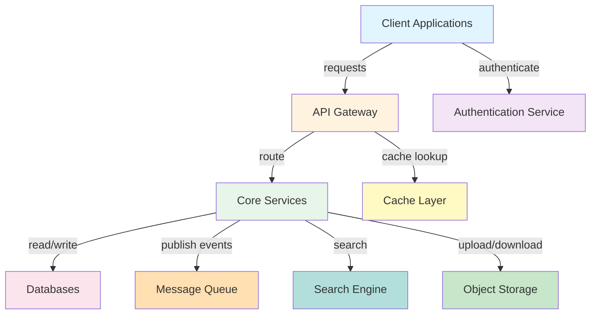
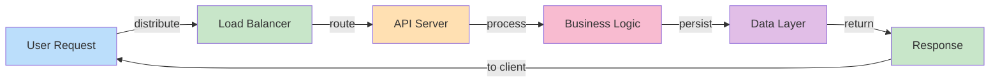
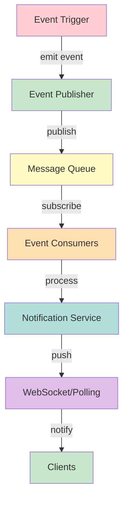
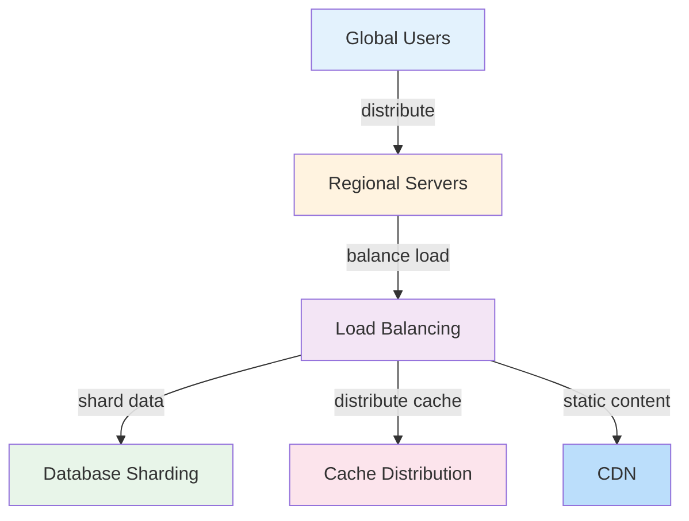

# Netflix Streaming - System Design

## System Overview

Design and architecture of Netflix Streaming including user management, data flow, scalability, and real-time features.

**Scale Metrics:**
- Millions of users, petabyte storage, global scale

## Architecture

### High-Level System Architecture



### Core Components Data Flow



### Real-Time Feature Architecture



### Scalability Architecture



## Functional Requirements

1. **User Management** - Registration, authentication, profile management
2. **Data Persistence** - Reliable storage of user and application data
3. **Scalability** - Handle millions of concurrent users
4. **Real-Time Features** - Live updates, notifications, messaging
5. **Search Capabilities** - Full-text search across data
6. **File Management** - Upload, download, storage of media
7. **Analytics** - User behavior tracking and insights

## Non-Functional Requirements

1. **Availability** - 99.9%+ uptime, no single point of failure
2. **Latency** - Sub-second response times for all user-facing operations
3. **Throughput** - 1M+ QPS for scaling applications
4. **Consistency** - Eventually consistent data with tolerance for delays
5. **Durability** - Zero data loss for critical information
6. **Security** - Encrypted data, secure authentication, privacy protection
7. **Maintainability** - Easy to deploy updates without downtime

## Key Challenges and Solutions

### Challenge 1: Handling Concurrent Users
- Solution: Horizontal scaling with load balancers
- Database sharding by user ID or geography
- In-memory caching to reduce database load

### Challenge 2: Real-Time Updates
- Solution: WebSocket connections for push notifications
- Message queues (Kafka, RabbitMQ) for event distribution
- Eventual consistency model with propagation delays

### Challenge 3: Data Consistency at Scale
- Solution: Distributed transactions with eventual consistency
- Event sourcing for critical operations
- Multi-region replication with conflict resolution

### Challenge 4: Media Storage and Delivery
- Solution: Object storage (S3) for reliable storage
- CDN for global content distribution
- Compression and optimization for bandwidth

## Data Flow Scenarios

### Scenario 1: User Registration
1. User submits registration form with email/password
2. API validates input (email format, password strength)
3. Authentication service creates user account
4. Password hashed and stored securely
5. Confirmation email sent asynchronously
6. Cache updated with new user profile
7. Success response returned to client

### Scenario 2: Feature Interaction (e.g., Follow User)
1. User initiates follow action
2. API validates user exists
3. Follow relationship created in database
4. Event published to message queue
5. Event processed: notifications sent, counters updated
6. Cache invalidated for follower lists
7. Real-time updates pushed to connected clients
8. Success acknowledged to initiating user

### Scenario 3: Search Query
1. User submits search query
2. API forwards to search service
3. Inverted index lookup returns matching items
4. Results ranked by relevance/popularity
5. Results paginated and returned
6. Search query logged for analytics
7. Cached results for popular queries

## Back-of-the-Envelope Calculations

**User Base Scaling:**
- 1M daily active users
- Average session: 30 minutes
- Concurrent users: 1M * (30min / 1440min) = 20K concurrent
- Transactions/user/day: 10 (posts, likes, comments, etc.)
- Total daily transactions: 10M
- Peak QPS: 10M / 86400 seconds = ~115 QPS (accounting for non-uniform distribution, peak 500-1000 QPS)

**Storage Calculation:**
- 1M users × 1MB profile data = 1TB user data
- 10B content items × 1KB metadata = 10TB
- 100B user interactions × 100 bytes = 10TB
- Total: ~20TB structured data
- Media storage (photos, videos) separate: 1PB+ for large platforms

**API Server Capacity:**
- Single server: 1000 requests/second max
- To handle 10K peak QPS: need 10-20 API servers (accounting for redundancy)
- Add 2x for redundancy and surge capacity = 40 API servers

**Database Capacity:**
- Single database: 10K QPS limit
- 100K peak QPS requires 20+ database instances
- Sharding by user ID distributes load

## Interview Questions

### Q1: How would you design a scalable social media feed?
**Answer:** Key considerations:

**Feed Retrieval Architecture:**
- Option 1 (Push): Pre-compute feeds on follow, update in real-time
  - Advantage: fast feed retrieval (cache hit)
  - Disadvantage: high write load, storage for inactive followers

- Option 2 (Pull): Compute feed on-demand from followings
  - Advantage: low storage, handles inactive accounts well
  - Disadvantage: slower feed retrieval

- Option 3 (Hybrid): Hot users push, inactive users pull
  - Best of both: fast for active, efficient for inactive

**Implementation (Hybrid):**
```
retrieveFeed(userId):
    hotFollowings = getHotFollowings(userId)  // celebrities
    regulars = getRegularFollowings(userId)

    // Push: pre-computed for hot
    feedFromHot = fetchFromCache(userId + ":feed")

    // Pull: compute for regulars
    feedFromRegulars = computeFeed(regulars, limit=50)

    // Combine and sort
    feed = mergeSorted([feedFromHot, feedFromRegulars])
    return feed[:limit]
```

**Scaling considerations:**
- Cache: Redis for hot user feeds
- Database: Sharded by user ID
- Batch creation: compute feeds during off-peak
- Invalidation: real-time for celebrities, eventual for others

### Q2: How would you handle distributed transactions across services?
**Answer:** Two-Phase Commit vs Saga Pattern:

**Two-Phase Commit (2PC):**
- Coordinator ensures all services commit or all rollback
- Guarantees consistency but blocking
- Risk: coordinator failure leaves system in limbo

**Saga Pattern (Recommended):**
- Sequence of local transactions with compensations
- Non-blocking, handles failures gracefully
- Trade-off: eventual consistency

Example - Payment processing:
```
Saga: ProcessPayment

1. Debit user account (Transaction A)
   - On failure: compensate by credit

2. Credit merchant account (Transaction B)
   - On failure: compensate by debit

3. Update order status (Transaction C)
   - On failure: compensate by reset status

4. Send confirmation email (Event)
   - On failure: retry asynchronously
```

Coordinator ensures ordering; failures trigger compensation.

### Q3: How would you implement real-time notifications?
**Answer:** Architecture:

**Push Notifications:**
- WebSocket connections to connected clients
- Server pushes updates immediately
- Low latency but requires persistent connections

**Pull Notifications:**
- Clients poll server periodically
- Simple but higher latency and load

**Hybrid Approach:**
```
initializeNotifications(userId):
    // WebSocket for real-time if available
    if supportWebSocket:
        connectWebSocket()
        subscribe(userId + ":notifications")
    else:
        // Fallback to polling
        startPollingTimer(5 seconds)

onEvent(event):
    if event.isNotifiable:
        notificationService.create(event)
        // Push to connected clients
        pubsub.publish(userId + ":notifications", event)
        // Persist for polling clients
        database.insert("notifications", event)

pollingTick():
    unreadNotifications = database.query(
        "notifications WHERE userId=? AND read=false"
    )
    if unreadNotifications:
        pushToClient(unreadNotifications)
```

### Q4: How would you design a recommendation system?
**Answer:** Multi-stage pipeline:

**Stage 1: Candidate Generation**
- Collaborative filtering: find similar users
- Content-based: items similar to user history
- Fast retrieval: 1000s of candidates

**Stage 2: Ranking**
- ML model scores candidates
- Consider: user engagement, diversity, freshness
- Return top 20-50 recommendations

**Stage 3: Post-Processing**
- Diversity: avoid too many similar items
- Freshness: include new items
- Business rules: promote high-margin items

**Implementation:**
```
getRecommendations(userId):
    // Candidate generation
    similarUsers = findSimilarUsers(userId, k=100)
    hotItems = getPopularItems(category=userPref)
    candidates = {}

    for user in similarUsers:
        for item in user.likedItems:
            if item not in candidates:
                candidates[item] = 0
            candidates[item] += similarity(user, userId)

    for item in hotItems:
        candidates[item] = max(candidates[item], 10)

    // Ranking
    scored = []
    for item, score in candidates.items():
        mlScore = mlModel.predict(userId, item)
        finalScore = score * mlScore
        scored.append((item, finalScore))

    ranked = sorted(scored, key=lambda x: x[1], reverse=True)

    // Post-processing
    recommendations = diversify(ranked[:50])
    return recommendations[:20]
```

### Q5: How would you ensure data consistency in a distributed system?
**Answer:** Multiple layers:

**Transaction Level:**
- ACID transactions for single database
- Locks prevent concurrent modification
- Rollback on failure

**Service Level:**
- Saga patterns for multi-service transactions
- Eventual consistency model
- Idempotent operations

**Data Level:**
- Event sourcing: immutable log of changes
- Allows replay and reconciliation
- Single source of truth

**Reconciliation:**
- Periodic consistency checks
- Compare expected vs actual state
- Fix discrepancies asynchronously

**Example:**
```
// Consistent payment flow
processPayment(paymentId, userId, amount):
    // Write event to immutable log
    events.append(PaymentInitiated(paymentId, userId, amount))

    try:
        debit(userId, amount)
        events.append(PaymentDebited(paymentId))

        credit(merchantId, amount)
        events.append(PaymentCredited(paymentId))

        updateOrderStatus(orderId, PAID)
        events.append(PaymentCompleted(paymentId))

    except Exception as e:
        // Can always replay events to determine state
        events.append(PaymentFailed(paymentId, str(e)))
        // Compensate based on events
        compensate(events)
```

### Q6: How would you handle a traffic spike?
**Answer:** Multi-level defense:

**Immediate (Load Shedding):**
- Return 429 Too Many Requests
- Prioritize critical paths
- Queuing with timeouts

**Caching:**
- Increase cache TTL temporarily
- Pre-cache popular content
- Reduce database load

**Horizontal Scaling:**
- Spin up additional servers automatically
- Takes 1-5 minutes
- Temporary fix until traffic normalized

**Rate Limiting:**
- Per-user request limits
- Gradual backoff
- Prevent single user from monopolizing resources

**Example implementation:**
```
handleRequest(request):
    // Check rate limit
    userLimit = getRateLimit(request.userId)
    if requests[request.userId] > userLimit:
        return 429_TooManyRequests()

    // Try cache first
    cached = cache.get(request.key)
    if cached:
        return cached

    // If load high, queue with timeout
    if systemLoad > 80%:
        queueId = queue.add(request, timeout=5s)
        return waitForCompletion(queueId)

    // Normal processing
    return processRequest(request)
```

## Technology Stack

- **Languages**: Python, Java, Go, Node.js
- **Frameworks**: Django, Spring Boot, Express, FastAPI
- **Databases**: PostgreSQL, MySQL, MongoDB, DynamoDB
- **Caching**: Redis, Memcached
- **Message Queues**: Kafka, RabbitMQ
- **Search**: Elasticsearch, Algolia
- **Storage**: S3, GCS, Azure Blob Storage
- **Monitoring**: Prometheus, Grafana, DataDog
- **Container**: Docker, Kubernetes

## Lessons Learned

1. **Scale Early** - Design for scale from the start; retrofitting is painful
2. **Caching is Key** - 90% of performance improvements from proper caching
3. **Monitoring Essential** - Can't optimize what you don't measure
4. **Consistency is Expensive** - Eventual consistency simplifies architecture
5. **Redundancy Everywhere** - Single points of failure become actual failures
6. **Test Failure Scenarios** - Regular chaos engineering prevents surprises
7. **Document Architecture** - Team needs shared understanding for decisions


## Code Implementation

### Python
```python
import asyncio
import aiohttp
from dataclasses import dataclass
from typing import Optional, List
import time, logging

logger = logging.getLogger(__name__)

@dataclass
class ServiceConfig:
    host: str = "localhost"
    port: int = 8080
    timeout_seconds: float = 5.0
    max_retries: int = 3

class ServiceClient:
    """Generic service client with retry and circuit breaker."""
    def __init__(self, config: ServiceConfig):
        self.config = config
        self.base_url = f"http://{config.host}:{config.port}"
        self._failures = 0
        self._circuit_open = False
        self._last_failure: Optional[float] = None

    def _is_circuit_open(self) -> bool:
        if not self._circuit_open:
            return False
        # Half-open after 60s — allow one request through
        if time.time() - self._last_failure > 60:
            self._circuit_open = False
            return False
        return True

    async def call(self, endpoint: str, payload: dict) -> Optional[dict]:
        if self._is_circuit_open():
            logger.warning("Circuit open — fast fail")
            return None

        timeout = aiohttp.ClientTimeout(total=self.config.timeout_seconds)
        async with aiohttp.ClientSession(timeout=timeout) as session:
            for attempt in range(self.config.max_retries):
                try:
                    async with session.post(
                        f"{self.base_url}{endpoint}", json=payload
                    ) as resp:
                        resp.raise_for_status()
                        self._failures = 0              # reset on success
                        return await resp.json()
                except Exception as e:
                    logger.warning(f"Attempt {attempt+1} failed: {e}")
                    if attempt < self.config.max_retries - 1:
                        await asyncio.sleep(2 ** attempt)  # exponential backoff
            # All retries exhausted
            self._failures += 1
            if self._failures >= 5:                     # open circuit
                self._circuit_open = True
                self._last_failure = time.time()
            return None
```

### Java
```java
import java.net.http.*;
import java.net.URI;
import java.time.Duration;
import java.util.concurrent.atomic.*;
import java.util.concurrent.CompletableFuture;

/** Generic resilient service client with circuit breaker + retry. */
public class ServiceClient {
    private final String baseUrl;
    private final HttpClient http;
    private final AtomicInteger failures = new AtomicInteger(0);
    private final AtomicBoolean circuitOpen = new AtomicBoolean(false);
    private volatile long lastFailureTime;

    public ServiceClient(String host, int port) {
        this.baseUrl = "http://" + host + ":" + port;
        this.http = HttpClient.newBuilder()
            .connectTimeout(Duration.ofSeconds(5))
            .build();
    }

    private boolean isCircuitOpen() {
        if (!circuitOpen.get()) return false;
        // Half-open after 60s
        if (System.currentTimeMillis() - lastFailureTime > 60_000) {
            circuitOpen.set(false);
            return false;
        }
        return true;
    }

    public CompletableFuture<String> call(String path, String jsonBody) {
        if (isCircuitOpen())
            return CompletableFuture.failedFuture(
                new RuntimeException("Circuit open"));

        HttpRequest request = HttpRequest.newBuilder()
            .uri(URI.create(baseUrl + path))
            .header("Content-Type", "application/json")
            .POST(HttpRequest.BodyPublishers.ofString(jsonBody))
            .timeout(Duration.ofSeconds(5))
            .build();

        return http.sendAsync(request, HttpResponse.BodyHandlers.ofString())
            .thenApply(resp -> {
                if (resp.statusCode() >= 500) throw new RuntimeException("Server error");
                failures.set(0);  // reset on success
                return resp.body();
            })
            .exceptionally(ex -> {
                if (failures.incrementAndGet() >= 5) {
                    circuitOpen.set(true);
                    lastFailureTime = System.currentTimeMillis();
                }
                return null;
            });
    }
}
```
## Follow-up Questions

1. **How would you handle this at 10x the scale described?**
   - What breaks first? (typically: single DB, single cache node, single region)
   - What architectural changes are required?

2. **What are the consistency vs. availability trade-offs in your design?**
   - Where did you accept eventual consistency?
   - Which operations require strong consistency and why?

3. **How would you debug a sudden latency spike in production?**
   - What metrics would you look at first?
   - What's your runbook for the top 3 likely causes?

4. **How does your design handle partial failures?**
   - What happens if one component is slow (not down)?
   - How do you prevent cascading failures?

5. **What would you change if you had to build this in one week vs. six months?**
   - What corners can safely be cut initially?
   - What must be right from day one?

6. **How would you migrate from the current design to a better one without downtime?**
   - What's the strangler-fig or blue-green strategy here?
   - How do you validate correctness during migration?