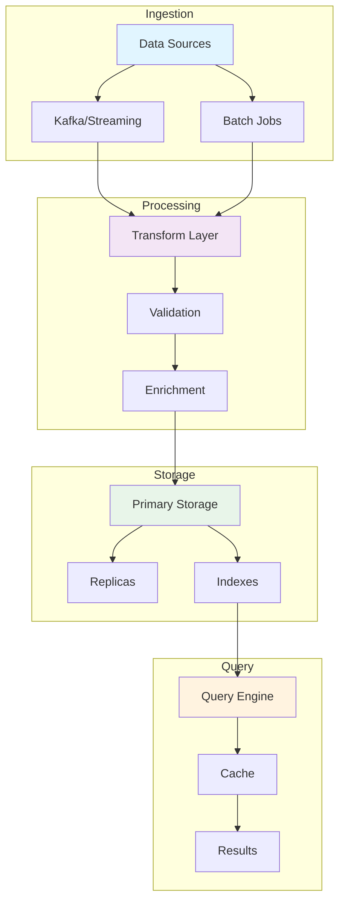
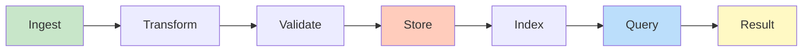
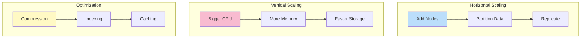
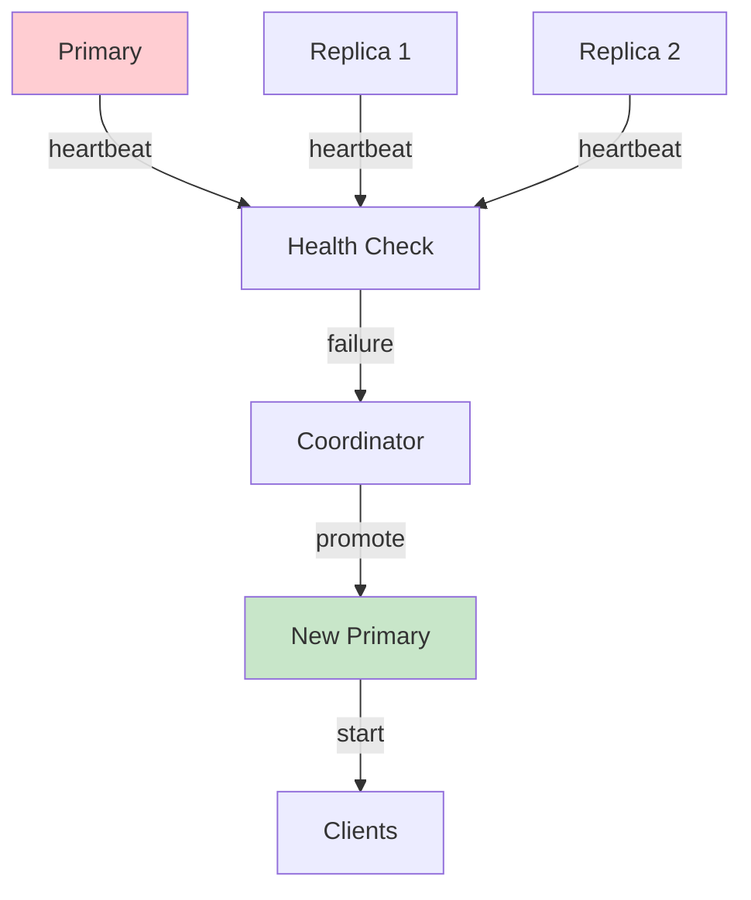
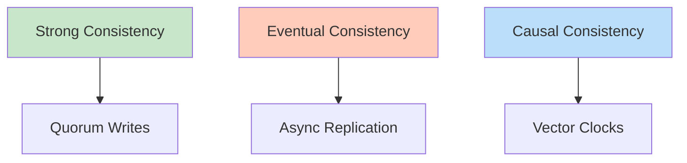

# NoSQL Database

## Problem Statement

### Functional Requirements
- Flexible schema with dynamic document structure
- Horizontal scaling with automatic sharding
- Eventual consistency across replicas
- Support transactions within document/shard
- High availability with multi-region replication

### Non-Functional Requirements
- Throughput: 1M+ operations/second
- Latency: < 10ms p99 read/write
- Availability: 99.99% across regions
- Consistency: Eventual with configurable levels
- Scalability: Petabytes across clusters

## System Overview

**Scale Metrics:**
- Throughput: Millions to billions of operations per second
- Latency: Milliseconds to seconds depending on workload
- Data volume: Terabytes to Petabytes
- Concurrent users: Millions
- Availability: 99.99% to 99.999% uptime SLA

**Key Components:**
- Data ingestion and processing
- Storage and indexing
- Query execution and optimization
- Replication and consistency
- Monitoring and recovery

## Architecture Diagrams

### System Architecture



### Data Flow



### Scalability Strategy



### Failover Mechanism



### Consistency Models



## Data Flow Scenarios

### Scenario 1: Normal Operation
1. Data arrives from sources
2. Transform and validate
3. Store in primary location
4. Replicate to secondaries
5. Index for fast queries
6. Serve queries from cache/indexes

### Scenario 2: Node Failure
1. Health checker detects failure
2. Coordinator marks node offline
3. Promote replica to primary
4. Redirect new writes to primary
5. Background catch-up of failed node

### Scenario 3: Network Partition
1. Network split into partitions
2. Majority partition continues
3. Minority partition read-only
4. When partition heals, sync up
5. Consistency resolved via repair

## Performance Optimization

### Query Optimization
- **Predicate pushdown**: Filter at source
- **Columnar projection**: Only needed columns
- **Indexing**: Fast lookup for hot columns
- **Caching**: Cache popular queries

### Storage Optimization
- **Compression**: 5-10x data reduction
- **Partitioning**: Scan only relevant partitions
- **Tiering**: Hot/warm/cold data
- **Deduplication**: Remove redundant data

### Cost Optimization
- **Spot instances**: Save 70% on compute
- **Reserved capacity**: Stable baseline
- **Data lifecycle**: Archive old data
- **Monitoring**: Identify waste

## Back-of-Envelope Calculations

### Daily Traffic
```
Daily requests: 1 billion
Avg request size: 10 KB
Avg response size: 50 KB
Daily data volume: 50 TB
Peak hour: 10% of daily
Peak RPS: 115,000
```

### Storage Requirements
```
Daily data: 50 TB
Retention: 3 years
Total storage: 54.7 PB
Compression: 5x → 11 PB
Replication: 3x → 33 PB
Backups: 2 years → 67 PB
```

### Compute Needs
```
Processing time: 100ms per request
Parallelism: 1000 threads
CPUs needed: 115,000 RPS / 10 RPS per core = 11,500 cores
Servers (16 cores each): 719 servers
Regional redundancy (3x): 2,157 servers
Cost: $2,157 × $1,000/month = $2.16M/month
```

### Network Bandwidth
```
Inbound: 115,000 RPS × 10 KB = 1.15 GB/s
Outbound: 115,000 RPS × 50 KB = 5.75 GB/s
Replication: 17% data is written = 2 GB/s
Total peak: 8.9 GB/s ≈ 71 Tbps
```

## Interview Questions & Answers

### Q1: Design a data system for 1B records

**Answer:**
1. **Clarify**: Volume, velocity, variety, consistency needs
2. **Back-of-envelope**: 1B records × 1KB = 1TB + replication
3. **High-level design**:
   - Ingest layer (Kafka/Pub-Sub)
   - Stream processing (Spark/Flink)
   - Storage (HDFS/S3 with partitions)
   - Query layer (Presto/Trino)
4. **Scalability**: Sharding by date, horizontal partition
5. **Tradeoffs**: Cost vs query speed, consistency vs availability

### Q2: How do you handle failures?

**Answer:**
- **Replication**: 3+ replicas for durability
- **Detection**: Heartbeat + timeout
- **Failover**: Promote replica in < 30 seconds
- **Recovery**: Catch-up from log/replicas
- **Testing**: Chaos engineering for resilience

### Q3: What's your consistency model?

**Answer:**
- **Strong**: Critical data, transaction logs (quorum writes)
- **Eventual**: Analytics, caches (async replication)
- **Per-operation**: Different SLAs based on importance

### Q4: How do you optimize for cost?

**Answer:**
- **Tiering**: Hot data on fast storage, cold on S3
- **Compression**: 10:1 for historical data
- **Dedup**: Remove redundant data
- **Spot instances**: Batch jobs on cheap compute

### Q5: How do you handle schema evolution?

**Answer:**
- **Versioning**: Support multiple schema versions
- **Backward compat**: New code reads old data
- **Forward compat**: Old code ignores new fields
- **Migration**: Gradual rollout of schema

### Q6: What monitoring would you implement?

**Answer:**
- **Metrics**: Throughput, latency, errors per component
- **Alerts**: Thresholds for SLA violations
- **Logs**: Debug queries and failures
- **Tracing**: End-to-end request flow
- **Dashboards**: Real-time system health

## Technology Stack

| Layer | Tech | Why |
|-------|------|-----|
| Ingestion | Kafka, Pub/Sub | Scalable, durable message broker |
| Processing | Spark, Flink | Distributed computation |
| Storage | HDFS, S3, GCS | Cost-effective bulk storage |
| Query | Presto, BigQuery | SQL on distributed data |
| Cache | Redis, Memcached | Sub-ms access to hot data |
| Monitoring | Prometheus, ELK | Observability |

## Lessons Learned

1. **Separate compute from storage**: Optimize independently for cost
2. **Compression matters**: 10x data reduction saves millions
3. **Replication is critical**: Every failure scenario needs recovery
4. **Monitor everything**: Can't optimize what you don't measure
5. **Start simple**: Complex architecture is not always necessary

## Related Topics

- Stream processing and stateful computations
- Distributed database design
- Data pipeline orchestration
- Monitoring and observability
- Cloud infrastructure and cost optimization


## Code Implementation

### Python
```python
import sqlite3
import contextlib
from typing import Generator, Any
from dataclasses import dataclass

@dataclass
class User:
    id: int
    email: str
    name: str

class UserRepository:
    """Repository with connection pooling, parameterized queries, and transactions."""
    def __init__(self, db_path: str = ":memory:"):
        self.conn = sqlite3.connect(db_path, check_same_thread=False)
        self.conn.row_factory = sqlite3.Row
        self._create_schema()

    def _create_schema(self) -> None:
        self.conn.executescript("""
            CREATE TABLE IF NOT EXISTS users (
                id    INTEGER PRIMARY KEY AUTOINCREMENT,
                email TEXT    NOT NULL UNIQUE,
                name  TEXT    NOT NULL
            );
            CREATE INDEX IF NOT EXISTS idx_users_email ON users(email);
        """)

    @contextlib.contextmanager
    def transaction(self) -> Generator:
        """Explicit transaction with automatic rollback on error."""
        try:
            yield self.conn
            self.conn.commit()
        except Exception:
            self.conn.rollback()
            raise

    def insert(self, email: str, name: str) -> int:
        with self.transaction() as conn:
            cur = conn.execute(
                "INSERT INTO users (email, name) VALUES (?, ?)",
                (email, name),            # parameterized — prevents SQL injection
            )
            return cur.lastrowid

    def get_by_email(self, email: str) -> User | None:
        row = self.conn.execute(
            "SELECT id, email, name FROM users WHERE email = ?", (email,)
        ).fetchone()
        return User(**dict(row)) if row else None

repo = UserRepository()
uid = repo.insert("alice@example.com", "Alice")
print(repo.get_by_email("alice@example.com"))
```

### Java
```java
import java.sql.*;
import java.util.Optional;

public class UserRepository {
    private final DataSource dataSource;

    public UserRepository(DataSource dataSource) {
        this.dataSource = dataSource;
    }

    /** Insert user — parameterized query prevents SQL injection. */
    public long insert(String email, String name) throws SQLException {
        String sql = "INSERT INTO users (email, name) VALUES (?, ?)";
        try (Connection conn = dataSource.getConnection();
             PreparedStatement ps = conn.prepareStatement(sql, Statement.RETURN_GENERATED_KEYS)) {
            ps.setString(1, email);
            ps.setString(2, name);
            ps.executeUpdate();
            try (ResultSet keys = ps.getGeneratedKeys()) {
                return keys.next() ? keys.getLong(1) : -1;
            }
        }
    }

    /** Fetch by email using indexed column. */
    public Optional<User> findByEmail(String email) throws SQLException {
        String sql = "SELECT id, email, name FROM users WHERE email = ?";
        try (Connection conn = dataSource.getConnection();
             PreparedStatement ps = conn.prepareStatement(sql)) {
            ps.setString(1, email);
            try (ResultSet rs = ps.executeQuery()) {
                if (rs.next())
                    return Optional.of(new User(rs.getLong("id"),
                                                rs.getString("email"),
                                                rs.getString("name")));
            }
        }
        return Optional.empty();
    }

    /** Transactional batch insert — all-or-nothing. */
    public void batchInsert(java.util.List<User> users) throws SQLException {
        String sql = "INSERT INTO users (email, name) VALUES (?, ?)";
        try (Connection conn = dataSource.getConnection()) {
            conn.setAutoCommit(false);  // start transaction
            try (PreparedStatement ps = conn.prepareStatement(sql)) {
                for (User u : users) {
                    ps.setString(1, u.email()); ps.setString(2, u.name());
                    ps.addBatch();
                }
                ps.executeBatch();
                conn.commit();          // commit only if all succeed
            } catch (SQLException e) {
                conn.rollback();        // rollback on any failure
                throw e;
            }
        }
    }
}
```

## Back-of-the-Envelope Calculations

**Index Impact:**
- Table: 100M rows, 100 bytes each = 10GB
- Full table scan: 10GB / 500MB/s = 20 seconds
- B-tree index lookup: log₂(100M) ≈ 27 comparisons → <1ms
- Index storage: 100M × 8 bytes (rowid) × 2 (overhead) = 1.6GB

**Query Throughput:**
- Single DB: 10K simple queries/sec
- With connection pool (20 connections): ~5K TPS
- Read replica: 3 replicas → 15K read TPS
- Write throughput limited by leader: 2K TPS
## Follow-up Questions

1. **How would you handle this at 10x the scale described?**
   - What breaks first? (typically: single DB, single cache node, single region)
   - What architectural changes are required?

2. **What are the consistency vs. availability trade-offs in your design?**
   - Where did you accept eventual consistency?
   - Which operations require strong consistency and why?

3. **How would you debug a sudden latency spike in production?**
   - What metrics would you look at first?
   - What's your runbook for the top 3 likely causes?

4. **How does your design handle partial failures?**
   - What happens if one component is slow (not down)?
   - How do you prevent cascading failures?

5. **What would you change if you had to build this in one week vs. six months?**
   - What corners can safely be cut initially?
   - What must be right from day one?

6. **How would you migrate from the current design to a better one without downtime?**
   - What's the strangler-fig or blue-green strategy here?
   - How do you validate correctness during migration?