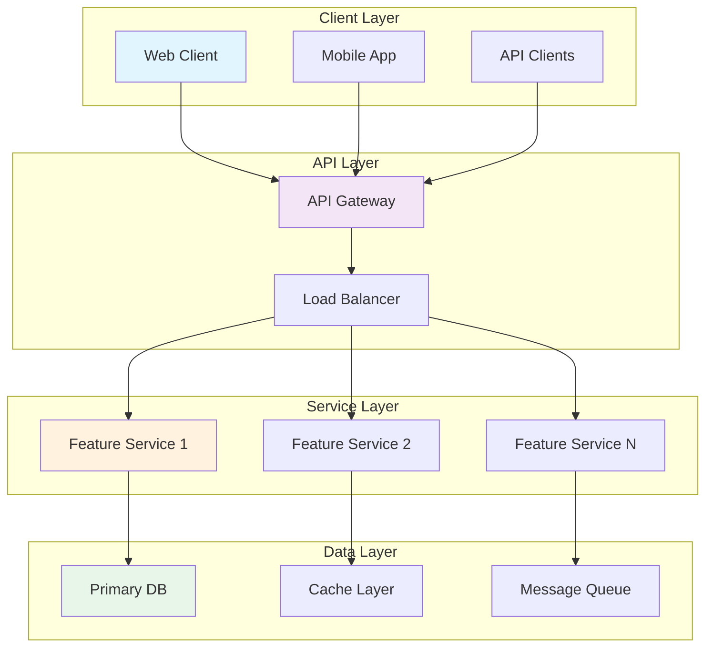
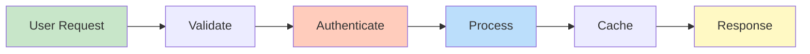
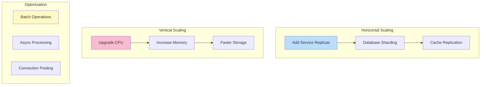
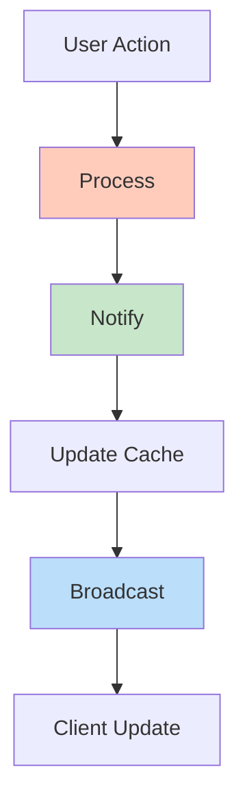
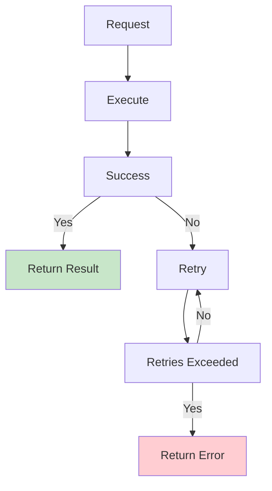

# Messaging System

## Problem Statement

### Functional Requirements
- Send and receive direct messages
- Support group messaging
- Display message read status
- Support message deletion and editing
- Enable file and media sharing in messages

### Non-Functional Requirements
- Latency: Message delivery < 500ms p99
- Throughput: 10M+ messages/second
- Durability: Message persistence
- Ordering: Maintain message order
- Scalability: Support 1B+ concurrent conversations

## System Overview

**Scale Metrics:**
- Throughput: Millions of operations per second
- Latency: Milliseconds to seconds depending on operation
- Data volume: Terabytes to Petabytes
- Concurrent users: Millions to billions
- Availability: 99.99% to 99.999% uptime SLA

**Key Components:**
- User-facing API endpoints
- Data persistence layer
- Caching and optimization
- Real-time messaging
- Analytics and monitoring

## Architecture Diagrams

### System Architecture



### Request Flow



### Scalability Architecture



### Real-Time Updates



### Error Handling



## Data Flow Scenarios

### Scenario 1: Normal Operation
1. User sends request through API
2. Authenticate and authorize user
3. Validate input parameters
4. Process business logic
5. Update database and cache
6. Send response to user
7. Broadcast real-time updates

### Scenario 2: High Traffic Spike
1. Rate limiter detects surge
2. Queue requests if necessary
3. Load balance across servers
4. Serve from cache when possible
5. Gracefully degrade non-critical features
6. Queue background tasks

### Scenario 3: Data Inconsistency
1. Detect stale cache entry
2. Invalidate cache
3. Fetch fresh data from database
4. Update cache with fresh data
5. Send updated data to client
6. Log for monitoring

## Performance Optimization

### Caching Strategy
- **Write-through**: Cache and DB always in sync
- **Write-back**: Async cache writes, higher throughput
- **TTL-based**: Automatic invalidation after time

### Database Optimization
- **Indexing**: Fast lookups on frequently queried columns
- **Sharding**: Distribute data for parallel processing
- **Replication**: Read scaling and high availability

### Async Processing
- **Message Queue**: Decouple services
- **Background Jobs**: Process expensive operations
- **Webhooks**: Event-driven updates

## Back-of-Envelope Calculations

### User Base and Traffic
```
Daily Active Users: 500M
Requests per user per day: 100
Daily total requests: 50B
Requests per second: 50B / 86400 ≈ 578K RPS
Peak hour (10x): 5.78M RPS
```

### Storage Requirements
```
Data per user: 100 KB (profile, preferences, settings)
Total user data: 500M × 100 KB = 50 TB
Cache hit rate: 90%
Cache miss storage: 50 TB × 10% = 5 TB
Database storage with replication: 50 TB × 3 = 150 TB
```

### Compute Resources
```
CPU per RPS: 1 core for 10K RPS
CPUs needed for peak: 5.78M / 10K = 578 cores
Servers (32 cores each): 578 / 32 ≈ 18 servers
Redundancy (3x): 54 servers per region
Global (10 regions): 540 servers
```

### Network Bandwidth
```
Average request size: 5 KB
Average response size: 20 KB
Inbound bandwidth: 578K RPS × 5 KB = 2.89 GB/s
Outbound bandwidth: 578K RPS × 20 KB = 11.56 GB/s
Total peak: 14.45 GB/s ≈ 116 Tbps
```

## Interview Questions & Answers

### Q1: Design a social feed for 500M users

**Answer:**
1. **Clarify**: Content types, update frequency, ranking
2. **High-level design**: Feed service, user graph, ranking engine
3. **Scalability**: Sharding by user ID, cache recent feeds
4. **Ranking**: Engagement score = likes × 2 + comments × 3 + shares × 5
5. **Challenges**: Feed staleness, thundering herd during viral posts
6. **Trade-offs**: Consistency vs freshness, cost vs latency

### Q2: Handle 10M concurrent users

**Answer:**
- **Load balancing**: Distribute across regions/zones
- **Horizontal scaling**: Stateless services with replicas
- **Caching**: Cache hot data (trending, recent posts)
- **Database**: Read replicas for scaling reads
- **Async**: Background jobs for non-critical tasks
- **Circuit breaker**: Prevent cascade failures

### Q3: What about real-time updates?

**Answer:**
- **WebSockets**: Long-lived connections for real-time
- **Message Queue**: Decouple publishers from subscribers
- **Fan-out**: Broadcast updates to followers efficiently
- **Rate limiting**: Prevent overwhelming clients
- **Batching**: Group updates to reduce network traffic

### Q4: How do you handle notifications?

**Answer:**
- **Queue**: Decouple notification generation from delivery
- **Multi-channel**: Email, push, SMS, in-app
- **Deduplication**: Avoid duplicate notifications
- **User preferences**: Respect notification settings
- **Retry**: Exponential backoff for failed deliveries

### Q5: Design comment system for massive scale

**Answer:**
1. **Hierarchy**: Tree structure for nested comments
2. **Storage**: Store in database with B-tree indexing
3. **Caching**: Cache top comments per post
4. **Pagination**: Load comments in batches
5. **Real-time**: Websocket for new comments
6. **Scalability**: Shard by post ID

### Q6: How to prevent abuse and moderation at scale?

**Answer:**
- **Detection**: Pattern matching on spam/abuse indicators
- **Rate limiting**: Prevent spam posting
- **User reporting**: Crowdsource moderation signals
- **ML models**: Train on reported content
- **Action queue**: Process reports efficiently
- **Appeal process**: Allow user appeals

## Technology Stack

| Component | Technology | Why |
|-----------|-----------|-----|
| API Gateway | Nginx, Envoy | Load balancing, request routing |
| Services | Node.js, Java, Go | High concurrency, low latency |
| Database | PostgreSQL, MongoDB | ACID, flexible schema options |
| Cache | Redis, Memcached | Sub-millisecond access |
| Message Queue | Kafka, RabbitMQ | Reliable async processing |
| Real-time | WebSocket, Server-Sent Events | Live updates to clients |
| Monitoring | Prometheus, DataDog | Performance and error tracking |

## Lessons Learned

1. **Start simple**: Basic implementation handles more than you'd expect
2. **Measure everything**: Instrument before optimizing
3. **Cache is critical**: 10-100x latency improvement
4. **Async is essential**: Decouple services for scalability
5. **Real-time is hard**: Trade-offs between latency and cost

## Related Topics

- Load balancing and API gateway design
- Database sharding and partitioning
- Caching strategies and invalidation
- Message queue and pub/sub systems
- WebSocket and real-time communication
- User authentication and authorization
- Rate limiting and throttling
- Monitoring and alerting systems


## Code Implementation

### Python
```python
from kafka import KafkaProducer, KafkaConsumer
import json, time
from typing import Any

class EventProducer:
    """Kafka producer with serialization and retry."""
    def __init__(self, bootstrap_servers: str = "localhost:9092"):
        self.producer = KafkaProducer(
            bootstrap_servers=bootstrap_servers,
            value_serializer=lambda v: json.dumps(v).encode(),
            key_serializer=lambda k: k.encode() if k else None,
            acks="all",                  # wait for all replicas
            retries=3,
            batch_size=16384,            # 16KB batch
            linger_ms=5,                 # wait 5ms to batch
        )

    def send(self, topic: str, key: str, event: dict[str, Any]) -> None:
        future = self.producer.send(topic, key=key, value=event)
        record = future.get(timeout=10)  # block until acknowledged
        print(f"Sent to {record.topic}:{record.partition}@{record.offset}")

class EventConsumer:
    """Kafka consumer with manual offset commit for reliability."""
    def __init__(self, topics: list[str], group_id: str):
        self.consumer = KafkaConsumer(
            *topics,
            bootstrap_servers="localhost:9092",
            group_id=group_id,
            auto_offset_reset="earliest",
            enable_auto_commit=False,    # manual commit for at-least-once
            value_deserializer=lambda m: json.loads(m.decode()),
        )

    def run(self) -> None:
        for msg in self.consumer:
            try:
                self.process(msg.value)
                self.consumer.commit()   # commit only after successful processing
            except Exception as e:
                print(f"Failed: {e}")   # dead-letter queue in production

    def process(self, event: dict) -> None:
        print(f"Processing: {event}")
```

### Java
```java
import org.apache.kafka.clients.producer.*;
import org.apache.kafka.clients.consumer.*;
import java.util.*;

public class KafkaExample {

    // ── Producer ────────────────────────────────────────────────────────────
    public static KafkaProducer<String, String> createProducer() {
        Properties props = new Properties();
        props.put(ProducerConfig.BOOTSTRAP_SERVERS_CONFIG, "localhost:9092");
        props.put(ProducerConfig.KEY_SERIALIZER_CLASS_CONFIG,
                  "org.apache.kafka.common.serialization.StringSerializer");
        props.put(ProducerConfig.VALUE_SERIALIZER_CLASS_CONFIG,
                  "org.apache.kafka.common.serialization.StringSerializer");
        props.put(ProducerConfig.ACKS_CONFIG, "all");      // durability
        props.put(ProducerConfig.RETRIES_CONFIG, 3);
        return new KafkaProducer<>(props);
    }

    public static void sendEvent(KafkaProducer<String, String> producer,
                                  String topic, String key, String value) {
        ProducerRecord<String, String> record = new ProducerRecord<>(topic, key, value);
        producer.send(record, (metadata, ex) -> {
            if (ex != null) ex.printStackTrace();
            else System.out.printf("Sent %s:%d@%d%n",
                    metadata.topic(), metadata.partition(), metadata.offset());
        });
    }

    // ── Consumer ────────────────────────────────────────────────────────────
    public static KafkaConsumer<String, String> createConsumer(String groupId) {
        Properties props = new Properties();
        props.put(ConsumerConfig.BOOTSTRAP_SERVERS_CONFIG, "localhost:9092");
        props.put(ConsumerConfig.GROUP_ID_CONFIG, groupId);
        props.put(ConsumerConfig.AUTO_OFFSET_RESET_CONFIG, "earliest");
        props.put(ConsumerConfig.ENABLE_AUTO_COMMIT_CONFIG, false); // manual commit
        props.put(ConsumerConfig.KEY_DESERIALIZER_CLASS_CONFIG,
                  "org.apache.kafka.common.serialization.StringDeserializer");
        props.put(ConsumerConfig.VALUE_DESERIALIZER_CLASS_CONFIG,
                  "org.apache.kafka.common.serialization.StringDeserializer");
        return new KafkaConsumer<>(props);
    }
}
```

## Back-of-the-Envelope Calculations

**System Load Estimation:**
- 1M daily active users × 10 requests/day = 10M requests/day
- Peak QPS = 10M / 86400 × 3 (peak factor) ≈ 350 QPS
- API server capacity: 1000 QPS/server → 1 server sufficient at peak
- With 2x redundancy: 2 servers minimum

**Storage Estimation:**
- 1M users × 10KB average data = 10GB structured data
- Annual growth: 10GB × 365 = 3.65TB/year
- With 3x replication: 11TB/year
- SSD cost ($0.10/GB): $1,100/year

**Bandwidth:**
- 350 QPS × 10KB response = 3.5MB/sec outbound
- Monthly egress: 3.5MB × 86400 × 30 = 9TB/month
## Follow-up Questions

1. **How would you handle this at 10x the scale described?**
   - What breaks first? (typically: single DB, single cache node, single region)
   - What architectural changes are required?

2. **What are the consistency vs. availability trade-offs in your design?**
   - Where did you accept eventual consistency?
   - Which operations require strong consistency and why?

3. **How would you debug a sudden latency spike in production?**
   - What metrics would you look at first?
   - What's your runbook for the top 3 likely causes?

4. **How does your design handle partial failures?**
   - What happens if one component is slow (not down)?
   - How do you prevent cascading failures?

5. **What would you change if you had to build this in one week vs. six months?**
   - What corners can safely be cut initially?
   - What must be right from day one?

6. **How would you migrate from the current design to a better one without downtime?**
   - What's the strangler-fig or blue-green strategy here?
   - How do you validate correctness during migration?