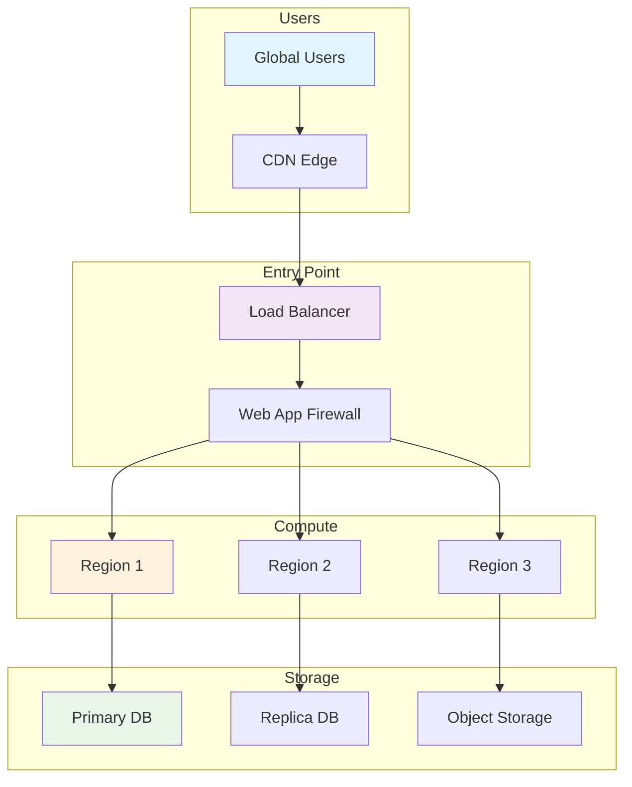
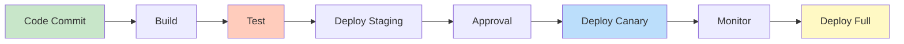
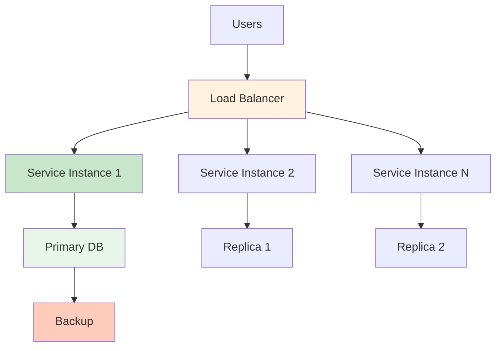
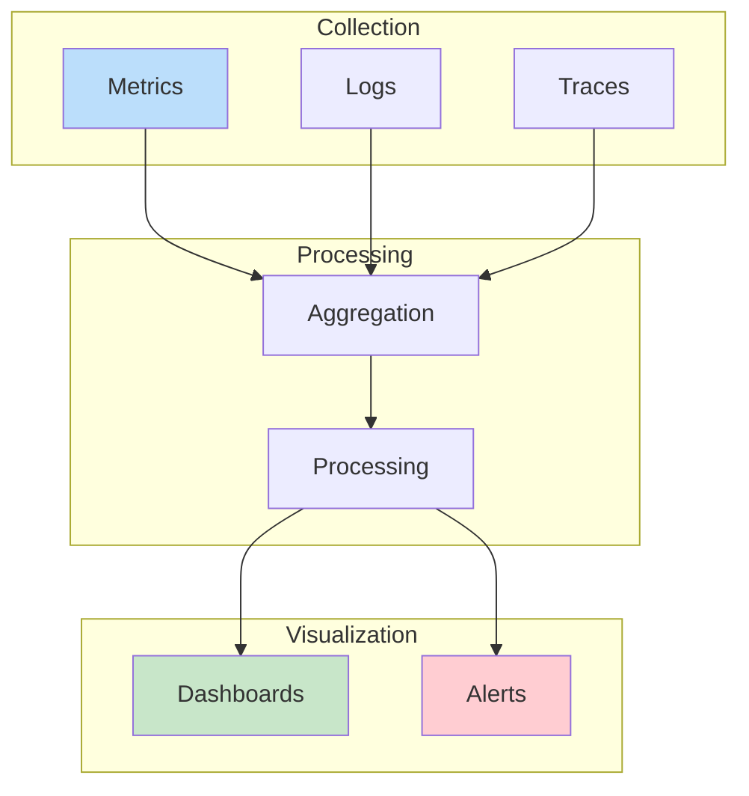
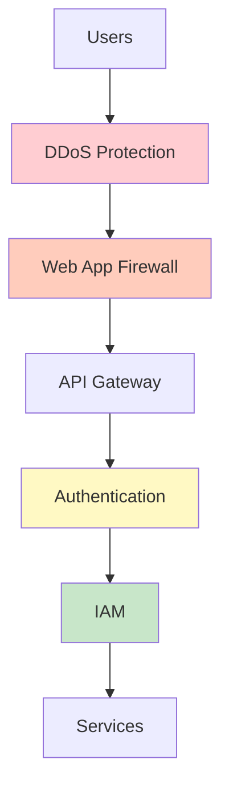

# Distributed Tracing System

## Problem Statement

### Functional Requirements
- Trace requests across multiple services
- Identify performance bottlenecks
- Correlate logs with traces
- Support sampling to reduce overhead
- Enable root cause analysis

### Non-Functional Requirements
- Overhead: < 5% performance impact
- Latency: Traces available < 5 seconds
- Throughput: Collect 1M+ trace events/second
- Retention: 7 days of trace data
- Queryability: Fast trace search

## System Overview

**Scale Metrics:**
- Throughput: Millions of operations per second
- Latency: Milliseconds depending on operation
- Infrastructure: Multi-region global deployment
- Availability: 99.99% to 99.999% uptime SLA
- Cost: Optimized for efficiency and scalability

**Key Components:**
- Cloud infrastructure and networking
- Container orchestration and deployment
- Monitoring and observability
- Security and access control
- Disaster recovery and backups

## Architecture Diagrams

### Infrastructure Architecture



### Deployment Pipeline



### High Availability



### Monitoring and Observability



### Security Layers



## Data Flow Scenarios

### Scenario 1: Normal Request Flow
1. User request hits CDN
2. CDN serves cached content if available
3. Request routed through DDoS protection
4. WAF validates request
5. Load balancer routes to healthy instance
6. Service processes request
7. Response cached at CDN
8. Response returned to user

### Scenario 2: Auto-scaling Event
1. Metrics show CPU utilization > 80%
2. Auto-scaler provisions new instances
3. Instances join load balancer pool
4. Traffic gradually shifted to new instances
5. Old instances scaled down after demand decreases
6. Cost optimized for current load

### Scenario 3: Failover and Recovery
1. Health check detects instance failure
2. Load balancer removes from pool
3. Auto-scaler spins up replacement
4. Replacement instances joins cluster
5. Data replicated from primary DB
6. Service continues without interruption

## Performance Optimization

### Infrastructure Optimization
- **Caching**: CDN for static content, API response caching
- **Compression**: GZIP for responses, efficient storage
- **Connection pooling**: Reuse connections to reduce overhead
- **Batching**: Group operations for efficiency

### Resource Optimization
- **Right-sizing**: Match resources to actual workload
- **Auto-scaling**: Scale with demand dynamically
- **Reserved capacity**: Baseline + burst capacity
- **Spot instances**: Use cheap instances for batch jobs

### Cost Optimization
- **Reserved instances**: 30-50% discount for committed capacity
- **Spot instances**: 70% discount for flexible workloads
- **Data transfer**: Minimize cross-region transfers
- **Storage**: Archive old data to cheaper tiers

## Back-of-Envelope Calculations

### Global Infrastructure
```
Daily active users: 100M
Requests per user: 50
Daily requests: 5B
Average RPS: 57,870
Peak hour RPS (10x): 578,700
Regions: 3 (Americas, EMEA, APAC)
Servers per region: 200 servers per 1M peak RPS
Total servers: 3 × 200 × 0.6 = 360 servers
Server cost: 360 × $2,000/month = $720K/month
```

### Storage Infrastructure
```
Data per user: 100 KB
Total user data: 100M × 100 KB = 10 TB
Backups: 30 daily, 12 monthly = 42 copies
Total backup storage: 10 TB × 42 = 420 TB
Archive (cold storage): 50% = 210 TB
Data transfer: 10 TB/day × 30 days = 300 TB/month
Bandwidth cost: 300 TB × $0.02/GB = $6M/month
```

### Deployment Infrastructure
```
Code commits per day: 500
Builds per commit: 1
Build time: 10 minutes average
Build parallelism: 50 concurrent
Build servers needed: 500 × 10 / 60 / 50 = 2 servers
Deployment frequency: 50 per day
Deployment time: 5 minutes average
Staging capacity: 50/24 = ~2 extra servers
Total CI/CD cost: ~$10K/month
```

## Interview Questions & Answers

### Q1: Design multi-region infrastructure for 100M users

**Answer:**
1. **Regions**: Deploy in 3 regions (US, EU, APAC) for latency
2. **Database**: Primary in US, read replicas in EU/APAC
3. **CDN**: Cache static assets globally
4. **Load balancing**: Cross-region failover with DNS
5. **Data sync**: Asynchronous replication with conflict resolution
6. **Compliance**: Data residency requirements per region

### Q2: How do you achieve 99.99% availability?

**Answer:**
- **Redundancy**: No single point of failure
- **Health checks**: Detect failures in < 10 seconds
- **Auto-failover**: Automatic switchover to healthy instances
- **Chaos testing**: Regularly test failure scenarios
- **Monitoring**: Real-time alerts on anomalies
- **Runbooks**: Automated recovery procedures

### Q3: Implement zero-downtime deployment

**Answer:**
- **Blue-Green**: Two identical environments, switch traffic
- **Canary**: Deploy to 1%, monitor, then roll out
- **Rolling**: Gradually replace old version
- **DB migrations**: Backward-compatible schema changes
- **Feature flags**: Enable features independently
- **Monitoring**: Detect issues within seconds

### Q4: How to secure infrastructure?

**Answer:**
- **Network**: VPC, security groups, NACLs
- **WAF**: OWASP Top 10 protection
- **DDoS**: Mitigation at CDN edge
- **Encryption**: TLS for transport, AES for storage
- **IAM**: Least privilege access control
- **Audit**: Complete logging of all access

### Q5: Design disaster recovery strategy

**Answer:**
- **RTO**: 15 minutes maximum
- **RPO**: 5 minutes maximum
- **Backup**: Daily snapshots, 30-day retention
- **Replication**: Real-time to secondary region
- **Testing**: Monthly DR drills
- **Documentation**: Updated runbooks

### Q6: Cost optimization strategies

**Answer:**
- **Reserved instances**: 1-3 year commitment
- **Spot instances**: Batch jobs, non-critical workloads
- **Auto-scaling**: Match capacity to demand
- **Data transfer**: Minimize cross-region, use CDN
- **Storage**: Tiered (hot/warm/cold)
- **Monitoring**: Track costs per service

## Technology Stack

| Component | Technology | Why |
|-----------|-----------|-----|
| Container Orchestration | Kubernetes | Industry standard, feature-rich |
| Container Runtime | Docker | Lightweight, portable |
| Service Mesh | Istio | Advanced traffic management |
| Monitoring | Prometheus | Time-series metrics |
| Logging | ELK Stack | Full-text search, analysis |
| Tracing | Jaeger | Distributed request tracing |
| CI/CD | Jenkins/GitLab | Flexible, extensible |
| IaC | Terraform | Multi-cloud support |
| CDN | CloudFront/Akamai | Global edge locations |

## Lessons Learned

1. **Automate everything**: Manual processes don't scale
2. **Failure is inevitable**: Design for it from the start
3. **Observability is critical**: Instrument before optimizing
4. **Cost grows with complexity**: Measure and optimize regularly
5. **Security is not optional**: Build it in from the beginning

## Related Topics

- Kubernetes and container orchestration
- Cloud providers (AWS, GCP, Azure)
- Networking and load balancing
- Database replication and backups
- Security and compliance
- Cost optimization and FinOps
- Site reliability engineering (SRE)


## Code Implementation

### Python
```python
import asyncio
import aiohttp
from dataclasses import dataclass
from typing import Optional, List
import time, logging

logger = logging.getLogger(__name__)

@dataclass
class ServiceConfig:
    host: str = "localhost"
    port: int = 8080
    timeout_seconds: float = 5.0
    max_retries: int = 3

class ServiceClient:
    """Generic service client with retry and circuit breaker."""
    def __init__(self, config: ServiceConfig):
        self.config = config
        self.base_url = f"http://{config.host}:{config.port}"
        self._failures = 0
        self._circuit_open = False
        self._last_failure: Optional[float] = None

    def _is_circuit_open(self) -> bool:
        if not self._circuit_open:
            return False
        # Half-open after 60s — allow one request through
        if time.time() - self._last_failure > 60:
            self._circuit_open = False
            return False
        return True

    async def call(self, endpoint: str, payload: dict) -> Optional[dict]:
        if self._is_circuit_open():
            logger.warning("Circuit open — fast fail")
            return None

        timeout = aiohttp.ClientTimeout(total=self.config.timeout_seconds)
        async with aiohttp.ClientSession(timeout=timeout) as session:
            for attempt in range(self.config.max_retries):
                try:
                    async with session.post(
                        f"{self.base_url}{endpoint}", json=payload
                    ) as resp:
                        resp.raise_for_status()
                        self._failures = 0              # reset on success
                        return await resp.json()
                except Exception as e:
                    logger.warning(f"Attempt {attempt+1} failed: {e}")
                    if attempt < self.config.max_retries - 1:
                        await asyncio.sleep(2 ** attempt)  # exponential backoff
            # All retries exhausted
            self._failures += 1
            if self._failures >= 5:                     # open circuit
                self._circuit_open = True
                self._last_failure = time.time()
            return None
```

### Java
```java
import java.net.http.*;
import java.net.URI;
import java.time.Duration;
import java.util.concurrent.atomic.*;
import java.util.concurrent.CompletableFuture;

/** Generic resilient service client with circuit breaker + retry. */
public class ServiceClient {
    private final String baseUrl;
    private final HttpClient http;
    private final AtomicInteger failures = new AtomicInteger(0);
    private final AtomicBoolean circuitOpen = new AtomicBoolean(false);
    private volatile long lastFailureTime;

    public ServiceClient(String host, int port) {
        this.baseUrl = "http://" + host + ":" + port;
        this.http = HttpClient.newBuilder()
            .connectTimeout(Duration.ofSeconds(5))
            .build();
    }

    private boolean isCircuitOpen() {
        if (!circuitOpen.get()) return false;
        // Half-open after 60s
        if (System.currentTimeMillis() - lastFailureTime > 60_000) {
            circuitOpen.set(false);
            return false;
        }
        return true;
    }

    public CompletableFuture<String> call(String path, String jsonBody) {
        if (isCircuitOpen())
            return CompletableFuture.failedFuture(
                new RuntimeException("Circuit open"));

        HttpRequest request = HttpRequest.newBuilder()
            .uri(URI.create(baseUrl + path))
            .header("Content-Type", "application/json")
            .POST(HttpRequest.BodyPublishers.ofString(jsonBody))
            .timeout(Duration.ofSeconds(5))
            .build();

        return http.sendAsync(request, HttpResponse.BodyHandlers.ofString())
            .thenApply(resp -> {
                if (resp.statusCode() >= 500) throw new RuntimeException("Server error");
                failures.set(0);  // reset on success
                return resp.body();
            })
            .exceptionally(ex -> {
                if (failures.incrementAndGet() >= 5) {
                    circuitOpen.set(true);
                    lastFailureTime = System.currentTimeMillis();
                }
                return null;
            });
    }
}
```

## Back-of-the-Envelope Calculations

**System Load Estimation:**
- 1M daily active users × 10 requests/day = 10M requests/day
- Peak QPS = 10M / 86400 × 3 (peak factor) ≈ 350 QPS
- API server capacity: 1000 QPS/server → 1 server sufficient at peak
- With 2x redundancy: 2 servers minimum

**Storage Estimation:**
- 1M users × 10KB average data = 10GB structured data
- Annual growth: 10GB × 365 = 3.65TB/year
- With 3x replication: 11TB/year
- SSD cost ($0.10/GB): $1,100/year

**Bandwidth:**
- 350 QPS × 10KB response = 3.5MB/sec outbound
- Monthly egress: 3.5MB × 86400 × 30 = 9TB/month
## Follow-up Questions

1. **How would you handle this at 10x the scale described?**
   - What breaks first? (typically: single DB, single cache node, single region)
   - What architectural changes are required?

2. **What are the consistency vs. availability trade-offs in your design?**
   - Where did you accept eventual consistency?
   - Which operations require strong consistency and why?

3. **How would you debug a sudden latency spike in production?**
   - What metrics would you look at first?
   - What's your runbook for the top 3 likely causes?

4. **How does your design handle partial failures?**
   - What happens if one component is slow (not down)?
   - How do you prevent cascading failures?

5. **What would you change if you had to build this in one week vs. six months?**
   - What corners can safely be cut initially?
   - What must be right from day one?

6. **How would you migrate from the current design to a better one without downtime?**
   - What's the strangler-fig or blue-green strategy here?
   - How do you validate correctness during migration?