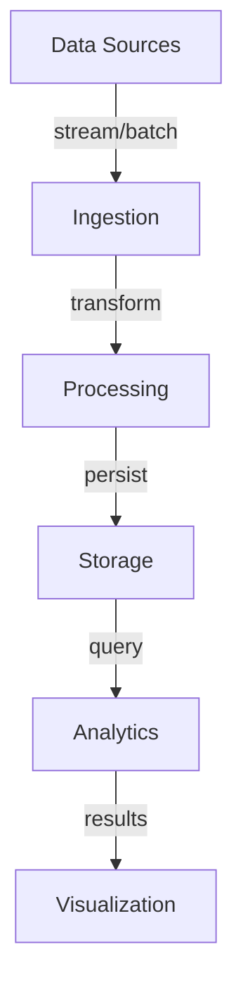

# Query Optimization

## System Overview

Comprehensive coverage of query optimization in modern data analytics systems.

**Scale Metrics:**
- Petabyte-scale analytics, sub-second queries, 1000s QPS

## Architecture



## Core Concepts

Key aspects of query optimization:
- Performance optimization strategies
- Scalability considerations
- Real-world implementation patterns
- Trade-offs and best practices

## Functional Requirements

1. **Data Ingestion** - Multiple data sources
2. **Transformation** - ETL/ELT pipelines
3. **Querying** - Efficient analytics queries
4. **Aggregation** - Pre-computed results
5. **Reporting** - Dashboards and reports
6. **Analysis** - Exploratory analytics

## Non-Functional Requirements

1. **Performance** - Sub-second query latency
2. **Scalability** - Petabyte capacity
3. **Throughput** - 1000s concurrent queries
4. **Availability** - 99.9%+ uptime
5. **Consistency** - Eventual consistency
6. **Cost** - Optimize $/GB

## Back-of-the-Envelope

- 1M users, 100 events/user/day = 100M events
- 1KB per event = 100GB/day
- 3TB/month, 36TB/year
- 10:1 compression = 3.6TB compressed
- 7-year retention = 25TB

## Interview Questions

### Q1: Core design principles?
**Answer:** Focus on partitioning, columnar storage, materialized views, and query optimization to achieve sub-second latency at scale.

### Q2: Performance optimization?
**Answer:** Combine partitioning, column projection, predicate pushdown, and distributed execution for optimal query performance.

### Q3: Scalability strategy?
**Answer:** Horizontal scaling with distributed query execution, data partitioning, and caching layers.

## Technology Stack

- **Warehouses**: Snowflake, BigQuery, Redshift
- **Lakes**: Delta Lake, Iceberg
- **Processing**: Spark, Presto
- **Ingestion**: Kafka, Dataflow
- **Viz**: Tableau, Looker

## Lessons Learned

1. Partition everything - critical for performance
2. Columnar storage - 10x scan speedup
3. Materialized views - fast reporting
4. Monitor costs - storage grows quickly
5. Test at scale - plan ahead


## Code Implementation

### Python
```python
import sqlite3
import contextlib
from typing import Generator, Any
from dataclasses import dataclass

@dataclass
class User:
    id: int
    email: str
    name: str

class UserRepository:
    """Repository with connection pooling, parameterized queries, and transactions."""
    def __init__(self, db_path: str = ":memory:"):
        self.conn = sqlite3.connect(db_path, check_same_thread=False)
        self.conn.row_factory = sqlite3.Row
        self._create_schema()

    def _create_schema(self) -> None:
        self.conn.executescript("""
            CREATE TABLE IF NOT EXISTS users (
                id    INTEGER PRIMARY KEY AUTOINCREMENT,
                email TEXT    NOT NULL UNIQUE,
                name  TEXT    NOT NULL
            );
            CREATE INDEX IF NOT EXISTS idx_users_email ON users(email);
        """)

    @contextlib.contextmanager
    def transaction(self) -> Generator:
        """Explicit transaction with automatic rollback on error."""
        try:
            yield self.conn
            self.conn.commit()
        except Exception:
            self.conn.rollback()
            raise

    def insert(self, email: str, name: str) -> int:
        with self.transaction() as conn:
            cur = conn.execute(
                "INSERT INTO users (email, name) VALUES (?, ?)",
                (email, name),            # parameterized — prevents SQL injection
            )
            return cur.lastrowid

    def get_by_email(self, email: str) -> User | None:
        row = self.conn.execute(
            "SELECT id, email, name FROM users WHERE email = ?", (email,)
        ).fetchone()
        return User(**dict(row)) if row else None

repo = UserRepository()
uid = repo.insert("alice@example.com", "Alice")
print(repo.get_by_email("alice@example.com"))
```

### Java
```java
import java.sql.*;
import java.util.Optional;

public class UserRepository {
    private final DataSource dataSource;

    public UserRepository(DataSource dataSource) {
        this.dataSource = dataSource;
    }

    /** Insert user — parameterized query prevents SQL injection. */
    public long insert(String email, String name) throws SQLException {
        String sql = "INSERT INTO users (email, name) VALUES (?, ?)";
        try (Connection conn = dataSource.getConnection();
             PreparedStatement ps = conn.prepareStatement(sql, Statement.RETURN_GENERATED_KEYS)) {
            ps.setString(1, email);
            ps.setString(2, name);
            ps.executeUpdate();
            try (ResultSet keys = ps.getGeneratedKeys()) {
                return keys.next() ? keys.getLong(1) : -1;
            }
        }
    }

    /** Fetch by email using indexed column. */
    public Optional<User> findByEmail(String email) throws SQLException {
        String sql = "SELECT id, email, name FROM users WHERE email = ?";
        try (Connection conn = dataSource.getConnection();
             PreparedStatement ps = conn.prepareStatement(sql)) {
            ps.setString(1, email);
            try (ResultSet rs = ps.executeQuery()) {
                if (rs.next())
                    return Optional.of(new User(rs.getLong("id"),
                                                rs.getString("email"),
                                                rs.getString("name")));
            }
        }
        return Optional.empty();
    }

    /** Transactional batch insert — all-or-nothing. */
    public void batchInsert(java.util.List<User> users) throws SQLException {
        String sql = "INSERT INTO users (email, name) VALUES (?, ?)";
        try (Connection conn = dataSource.getConnection()) {
            conn.setAutoCommit(false);  // start transaction
            try (PreparedStatement ps = conn.prepareStatement(sql)) {
                for (User u : users) {
                    ps.setString(1, u.email()); ps.setString(2, u.name());
                    ps.addBatch();
                }
                ps.executeBatch();
                conn.commit();          // commit only if all succeed
            } catch (SQLException e) {
                conn.rollback();        // rollback on any failure
                throw e;
            }
        }
    }
}
```
## Follow-up Questions

1. **How would you handle this at 10x the scale described?**
   - What breaks first? (typically: single DB, single cache node, single region)
   - What architectural changes are required?

2. **What are the consistency vs. availability trade-offs in your design?**
   - Where did you accept eventual consistency?
   - Which operations require strong consistency and why?

3. **How would you debug a sudden latency spike in production?**
   - What metrics would you look at first?
   - What's your runbook for the top 3 likely causes?

4. **How does your design handle partial failures?**
   - What happens if one component is slow (not down)?
   - How do you prevent cascading failures?

5. **What would you change if you had to build this in one week vs. six months?**
   - What corners can safely be cut initially?
   - What must be right from day one?

6. **How would you migrate from the current design to a better one without downtime?**
   - What's the strangler-fig or blue-green strategy here?
   - How do you validate correctness during migration?