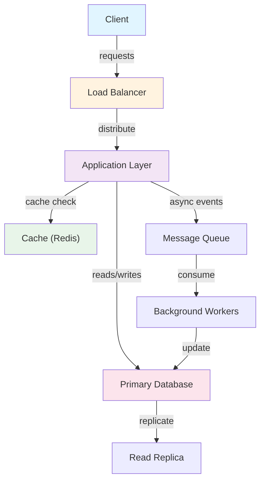
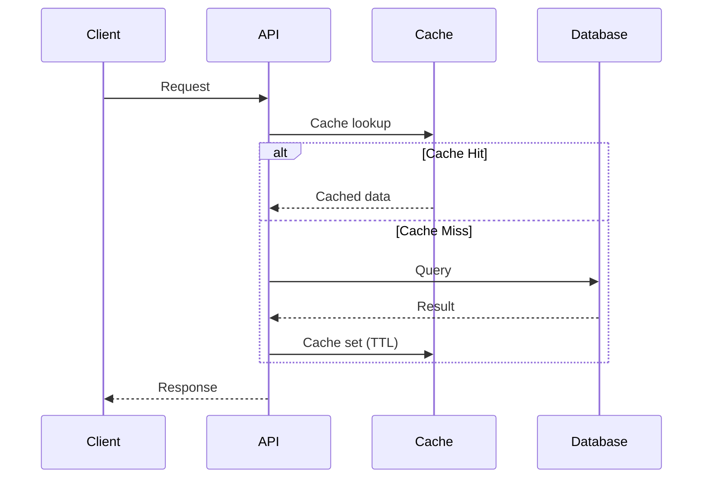
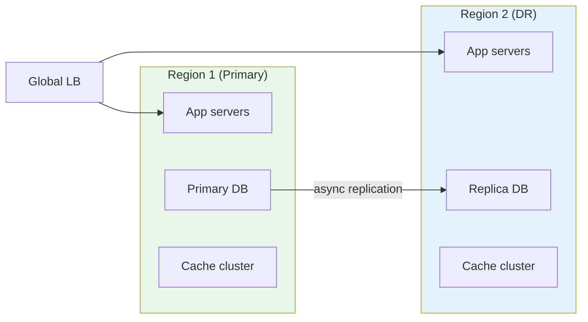

# NP-Complete Problems

## Overview

NP-Complete Problems are algorithms that solve NP-hard problems or use advanced techniques.

## Complexity

- Classical approach: Exponential or polynomial approximation
- This approach: Optimized via heuristics or randomization
- Trade-offs: Approximation ratio, probability of correctness

## Applications

NP-Complete Problems appear in:
- Optimization problems (logistics, scheduling)
- Machine learning (hyperparameter optimization)
- Approximation schemes (TSP, knapsack)
- Probabilistic methods (Monte Carlo simulation)

## Variants

1. Exact algorithms - correct but slow
2. Approximation algorithms - fast, near-optimal
3. Heuristic algorithms - practical, no guarantees
4. Randomized algorithms - probabilistic correctness
5. Parallel algorithms - distributed execution

## Key Insights

- Use approximation when exact is intractable
- Randomization can reduce complexity
- Heuristics often work well in practice
- Problem-specific optimizations essential

## When to Use

- NP-hard problems needing solution
- Real-time constraints (heuristic better than exact)
- Large problem instances (approximation acceptable)
- Probabilistic methods for Monte Carlo

## Complexity Classes

- P: Polynomial time solvable
- NP: Non-deterministic polynomial (guess-and-check)
- NP-Hard: At least as hard as NP problems
- NP-Complete: NP and NP-hard

## Implementation Notes

- Choose algorithm based on problem size
- Tune parameters for your specific instance
- Combine multiple heuristics for better results
- Validate results against known benchmarks

## References

- Research papers on specific algorithms
- Competition platforms (ICPC, IOI)
- Algorithm design textbooks
- Online judge problem solutions

## Trade-offs

| Aspect | Exact | Approximation | Heuristic |
|--------|-------|---|---|
| Correctness | Guaranteed | Ratio bound | Probabilistic |
| Speed | Slow | Fast | Fastest |
| Memory | High | Medium | Low |
| Implementation | Complex | Medium | Simple |

## Architecture Diagrams

### System Overview


### Data Flow


### Scaling Architecture

## Code Implementation

### Python
```python
import asyncio
import aiohttp
from dataclasses import dataclass
from typing import Optional, List
import time, logging

logger = logging.getLogger(__name__)

@dataclass
class ServiceConfig:
    host: str = "localhost"
    port: int = 8080
    timeout_seconds: float = 5.0
    max_retries: int = 3

class ServiceClient:
    """Generic service client with retry and circuit breaker."""
    def __init__(self, config: ServiceConfig):
        self.config = config
        self.base_url = f"http://{config.host}:{config.port}"
        self._failures = 0
        self._circuit_open = False
        self._last_failure: Optional[float] = None

    def _is_circuit_open(self) -> bool:
        if not self._circuit_open:
            return False
        # Half-open after 60s — allow one request through
        if time.time() - self._last_failure > 60:
            self._circuit_open = False
            return False
        return True

    async def call(self, endpoint: str, payload: dict) -> Optional[dict]:
        if self._is_circuit_open():
            logger.warning("Circuit open — fast fail")
            return None

        timeout = aiohttp.ClientTimeout(total=self.config.timeout_seconds)
        async with aiohttp.ClientSession(timeout=timeout) as session:
            for attempt in range(self.config.max_retries):
                try:
                    async with session.post(
                        f"{self.base_url}{endpoint}", json=payload
                    ) as resp:
                        resp.raise_for_status()
                        self._failures = 0              # reset on success
                        return await resp.json()
                except Exception as e:
                    logger.warning(f"Attempt {attempt+1} failed: {e}")
                    if attempt < self.config.max_retries - 1:
                        await asyncio.sleep(2 ** attempt)  # exponential backoff
            # All retries exhausted
            self._failures += 1
            if self._failures >= 5:                     # open circuit
                self._circuit_open = True
                self._last_failure = time.time()
            return None
```

### Java
```java
import java.net.http.*;
import java.net.URI;
import java.time.Duration;
import java.util.concurrent.atomic.*;
import java.util.concurrent.CompletableFuture;

/** Generic resilient service client with circuit breaker + retry. */
public class ServiceClient {
    private final String baseUrl;
    private final HttpClient http;
    private final AtomicInteger failures = new AtomicInteger(0);
    private final AtomicBoolean circuitOpen = new AtomicBoolean(false);
    private volatile long lastFailureTime;

    public ServiceClient(String host, int port) {
        this.baseUrl = "http://" + host + ":" + port;
        this.http = HttpClient.newBuilder()
            .connectTimeout(Duration.ofSeconds(5))
            .build();
    }

    private boolean isCircuitOpen() {
        if (!circuitOpen.get()) return false;
        // Half-open after 60s
        if (System.currentTimeMillis() - lastFailureTime > 60_000) {
            circuitOpen.set(false);
            return false;
        }
        return true;
    }

    public CompletableFuture<String> call(String path, String jsonBody) {
        if (isCircuitOpen())
            return CompletableFuture.failedFuture(
                new RuntimeException("Circuit open"));

        HttpRequest request = HttpRequest.newBuilder()
            .uri(URI.create(baseUrl + path))
            .header("Content-Type", "application/json")
            .POST(HttpRequest.BodyPublishers.ofString(jsonBody))
            .timeout(Duration.ofSeconds(5))
            .build();

        return http.sendAsync(request, HttpResponse.BodyHandlers.ofString())
            .thenApply(resp -> {
                if (resp.statusCode() >= 500) throw new RuntimeException("Server error");
                failures.set(0);  // reset on success
                return resp.body();
            })
            .exceptionally(ex -> {
                if (failures.incrementAndGet() >= 5) {
                    circuitOpen.set(true);
                    lastFailureTime = System.currentTimeMillis();
                }
                return null;
            });
    }
}
```

## Back-of-the-Envelope Calculations

**System Load Estimation:**
- 1M daily active users × 10 requests/day = 10M requests/day
- Peak QPS = 10M / 86400 × 3 (peak factor) ≈ 350 QPS
- API server capacity: 1000 QPS/server → 1 server sufficient at peak
- With 2x redundancy: 2 servers minimum

**Storage Estimation:**
- 1M users × 10KB average data = 10GB structured data
- Annual growth: 10GB × 365 = 3.65TB/year
- With 3x replication: 11TB/year
- SSD cost ($0.10/GB): $1,100/year

**Bandwidth:**
- 350 QPS × 10KB response = 3.5MB/sec outbound
- Monthly egress: 3.5MB × 86400 × 30 = 9TB/month
## Follow-up Questions

1. **How would you handle this at 10x the scale described?**
   - What breaks first? (typically: single DB, single cache node, single region)
   - What architectural changes are required?

2. **What are the consistency vs. availability trade-offs in your design?**
   - Where did you accept eventual consistency?
   - Which operations require strong consistency and why?

3. **How would you debug a sudden latency spike in production?**
   - What metrics would you look at first?
   - What's your runbook for the top 3 likely causes?

4. **How does your design handle partial failures?**
   - What happens if one component is slow (not down)?
   - How do you prevent cascading failures?

5. **What would you change if you had to build this in one week vs. six months?**
   - What corners can safely be cut initially?
   - What must be right from day one?

6. **How would you migrate from the current design to a better one without downtime?**
   - What's the strangler-fig or blue-green strategy here?
   - How do you validate correctness during migration?