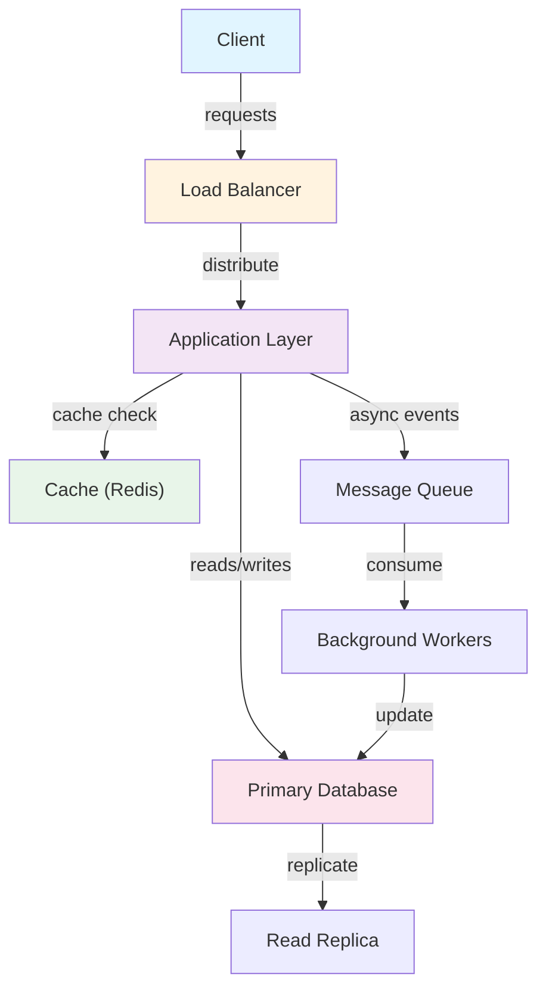
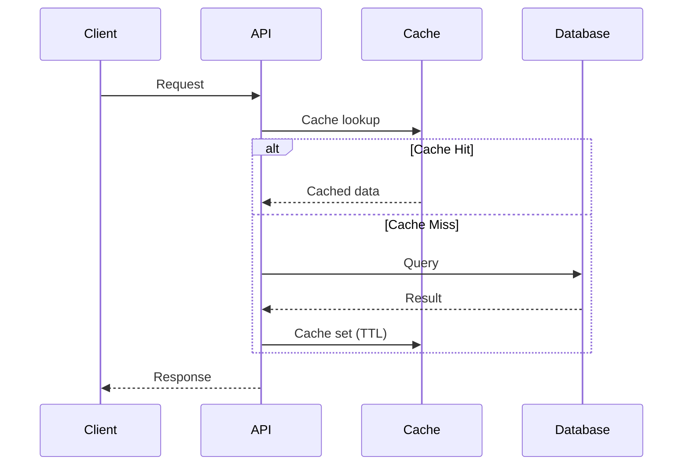
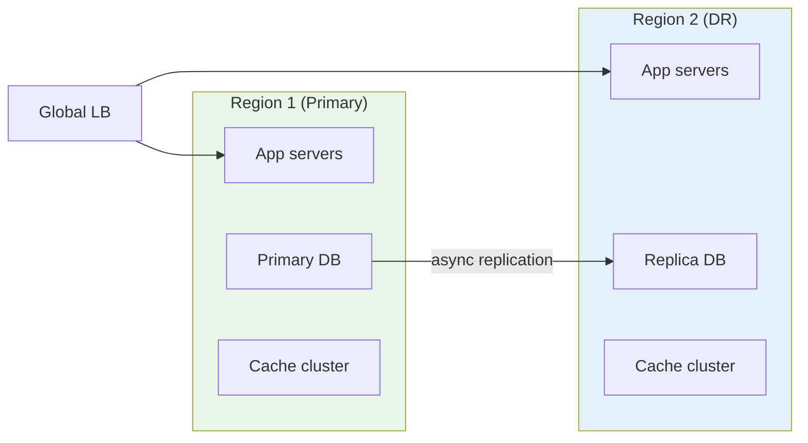

# API Gateway

## Overview

API Gateway provides a proven solution to recurring design problems.

## Problem

Common issues API Gateway solves:
- Structural complexity
- Behavioral coordination
- Object creation
- Communication patterns
- State management

## Solution

The pattern suggests:
- Component organization
- Interaction protocols
- Instantiation mechanism
- Responsibility distribution

## Structure

Components:
- Participant roles
- Relationships and interactions
- Collaboration sequence

## Benefits

- Code reusability
- Maintainability
- Scalability
- Testability
- Performance

## Trade-offs

- Added complexity for simple problems
- More components to manage
- Potential performance overhead
- Learning curve for team

## When to Apply

Use API Gateway when:
- Problem matches pattern description
- Benefits outweigh complexity costs
- Team understands the pattern
- Problem is recurring

## Related Patterns

- Complementary patterns
- Alternative approaches
- Conflicting patterns

## Implementation

Key considerations:
- Language features availability
- Framework support
- Performance implications
- Testing strategies

## Real-World Examples

- API Gateway used in popular frameworks
- Production system implementations
- Open source projects
- Enterprise applications

## Anti-Patterns

Common mistakes:
- Over-engineering simple problems
- Misapplication of pattern
- Incorrect implementation
- Ignoring trade-offs

## References

- Gang of Four design patterns book
- Architecture pattern references
- Pattern repositories
- Framework documentation

## Architecture Diagrams

### System Overview


### Data Flow


### Scaling Architecture

## Code Implementation

### Python
```python
import asyncio
import aiohttp
from typing import Optional
import time

class HTTPClient:
    """Async HTTP client with retry, timeout, and connection pooling."""
    def __init__(self, base_url: str, timeout: int = 5, max_retries: int = 3):
        self.base_url = base_url
        self.timeout = aiohttp.ClientTimeout(total=timeout)
        self.max_retries = max_retries
        self._session: Optional[aiohttp.ClientSession] = None

    async def __aenter__(self):
        connector = aiohttp.TCPConnector(limit=100, limit_per_host=30)
        self._session = aiohttp.ClientSession(
            base_url=self.base_url,
            timeout=self.timeout,
            connector=connector,
        )
        return self

    async def __aexit__(self, *args):
        await self._session.close()

    async def get(self, path: str, **kwargs) -> dict:
        for attempt in range(self.max_retries):
            try:
                async with self._session.get(path, **kwargs) as resp:
                    resp.raise_for_status()
                    return await resp.json()
            except aiohttp.ClientError as e:
                if attempt == self.max_retries - 1:
                    raise
                wait = 2 ** attempt        # exponential backoff
                await asyncio.sleep(wait)

async def main():
    async with HTTPClient("https://api.example.com") as client:
        data = await client.get("/users/123")
        print(data)

asyncio.run(main())
```

### Java
```java
import java.net.URI;
import java.net.http.*;
import java.time.Duration;
import java.util.concurrent.CompletableFuture;

public class HttpClientExample {
    private static final HttpClient client = HttpClient.newBuilder()
        .connectTimeout(Duration.ofSeconds(5))
        .version(HttpClient.Version.HTTP_2)
        .build();

    /** Async GET with JSON parsing. */
    public static CompletableFuture<String> getAsync(String url) {
        HttpRequest request = HttpRequest.newBuilder()
            .uri(URI.create(url))
            .timeout(Duration.ofSeconds(10))
            .header("Accept", "application/json")
            .GET()
            .build();
        return client.sendAsync(request, HttpResponse.BodyHandlers.ofString())
            .thenApply(HttpResponse::body);
    }

    /** POST JSON payload. */
    public static HttpResponse<String> postJson(String url, String json) throws Exception {
        HttpRequest request = HttpRequest.newBuilder()
            .uri(URI.create(url))
            .header("Content-Type", "application/json")
            .POST(HttpRequest.BodyPublishers.ofString(json))
            .build();
        return client.send(request, HttpResponse.BodyHandlers.ofString());
    }

    public static void main(String[] args) throws Exception {
        // Async GET
        getAsync("https://api.example.com/users/1")
            .thenAccept(body -> System.out.println("Response: " + body))
            .join();

        // Sync POST
        String payload = "{"name":"Alice","email":"alice@example.com"}";
        HttpResponse<String> resp = postJson("https://api.example.com/users", payload);
        System.out.println("Status: " + resp.statusCode());
    }
}
```

## Back-of-the-Envelope Calculations

**System Load Estimation:**
- 1M daily active users × 10 requests/day = 10M requests/day
- Peak QPS = 10M / 86400 × 3 (peak factor) ≈ 350 QPS
- API server capacity: 1000 QPS/server → 1 server sufficient at peak
- With 2x redundancy: 2 servers minimum

**Storage Estimation:**
- 1M users × 10KB average data = 10GB structured data
- Annual growth: 10GB × 365 = 3.65TB/year
- With 3x replication: 11TB/year
- SSD cost ($0.10/GB): $1,100/year

**Bandwidth:**
- 350 QPS × 10KB response = 3.5MB/sec outbound
- Monthly egress: 3.5MB × 86400 × 30 = 9TB/month
## Follow-up Questions

1. **How would you handle this at 10x the scale described?**
   - What breaks first? (typically: single DB, single cache node, single region)
   - What architectural changes are required?

2. **What are the consistency vs. availability trade-offs in your design?**
   - Where did you accept eventual consistency?
   - Which operations require strong consistency and why?

3. **How would you debug a sudden latency spike in production?**
   - What metrics would you look at first?
   - What's your runbook for the top 3 likely causes?

4. **How does your design handle partial failures?**
   - What happens if one component is slow (not down)?
   - How do you prevent cascading failures?

5. **What would you change if you had to build this in one week vs. six months?**
   - What corners can safely be cut initially?
   - What must be right from day one?

6. **How would you migrate from the current design to a better one without downtime?**
   - What's the strangler-fig or blue-green strategy here?
   - How do you validate correctness during migration?