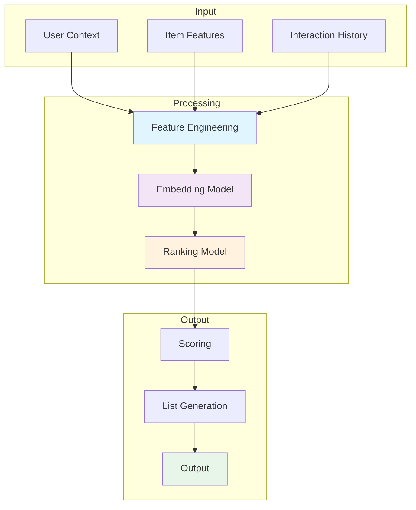
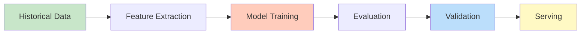
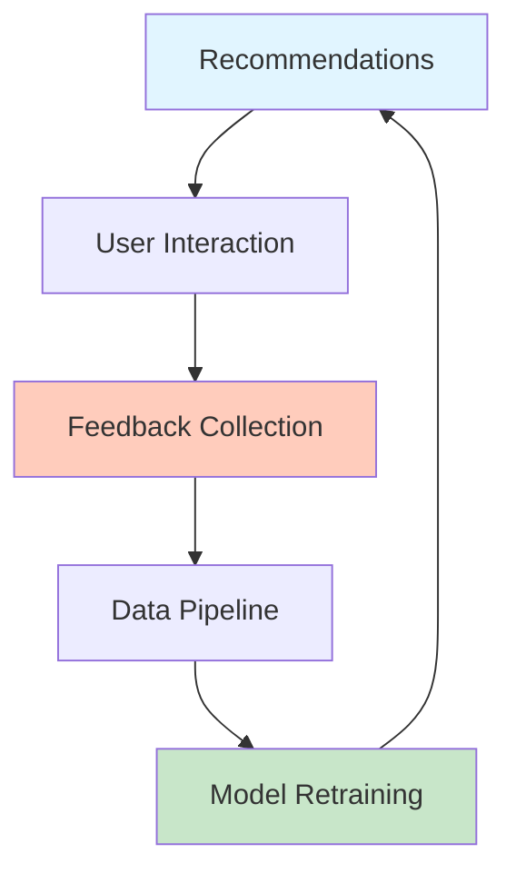
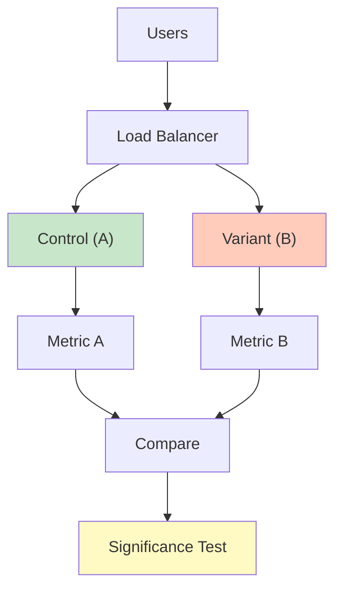
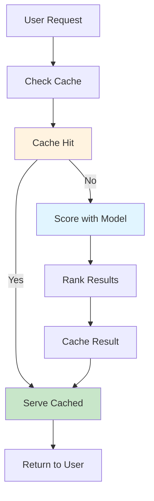

# Explainability in ML Models

## Problem Statement

### Functional Requirements
- Explain recommendation reasoning
- Identify influential features
- Support rule-based explanations
- Enable user feedback on explanations
- Track explanation quality

### Non-Functional Requirements
- Latency: Generate explanations < 100ms
- Coverage: Explain 95%+ of recommendations
- Faithfulness: Explanations match model logic
- Simplicity: Avg < 5 explanation items
- Trust: Increase user trust in recommendations

## System Overview

**Scale Metrics:**
- Throughput: Millions of recommendations per second
- Latency: Milliseconds for recommendation generation
- Data volume: Terabytes of interaction history
- Model complexity: Millions of parameters
- Availability: 99.99% service uptime

**Key Components:**
- Feature engineering and preprocessing
- Model training and optimization
- Real-time scoring and ranking
- Feedback loop and offline evaluation
- Monitoring and experimentation

## Architecture Diagrams

### Recommendation System Architecture



### Model Training Pipeline



### Feedback Loop



### A/B Testing Framework



### Real-Time Serving



## Data Flow Scenarios

### Scenario 1: Training New Model
1. Collect historical user interactions
2. Extract features from raw data
3. Train recommendation model
4. Evaluate on hold-out test set
5. Compare with baseline model
6. Deploy to serving infrastructure

### Scenario 2: Real-Time Scoring
1. User requests recommendations
2. Fetch user profile and context
3. Retrieve candidate items
4. Score candidates with model
5. Re-rank by diversity and freshness
6. Return top-K recommendations

### Scenario 3: Online A/B Test
1. Split traffic between variants
2. Serve variant A (control) to 50%
3. Serve variant B (test) to 50%
4. Collect metrics from both
5. Run significance test
6. Deploy winner if significant

## Performance Optimization

### Model Optimization
- **Distillation**: Compress large models
- **Quantization**: Reduce precision for speed
- **Pruning**: Remove unimportant parameters
- **Caching**: Pre-compute common scores

### Inference Optimization
- **Batching**: Process multiple requests together
- **GPU acceleration**: Use GPUs for scoring
- **Approximate search**: Fast similarity lookup
- **Caching**: Cache popular recommendations

### Data Optimization
- **Sampling**: Train on representative sample
- **Bucketing**: Group similar items
- **Filtering**: Remove noise and outliers
- **Compression**: Efficient feature storage

## Back-of-Envelope Calculations

### User and Item Scale
```
Daily active users: 100M
Items in catalog: 1M
Interactions per user per day: 10
Daily interactions: 1B
Training data: 3 years = 1T interactions
Model parameters: 10M-1B depending on approach
```

### Compute Requirements
```
Training:
- Batch size: 10K examples
- Epochs: 10
- Total batches: (1B / 10K) × 10 = 1M batches
- Time per batch: 100ms
- Total training time: 100M seconds ≈ 27 hours

Serving:
- Scoring latency: 10ms per item per model
- Candidates per request: 1000 items
- Scoring: 1000 × 10ms = 10 seconds
- With caching: 100ms (1% miss rate)
- With approximation: 10ms
```

### Storage Requirements
```
Interaction history: 1T × 100 bytes = 100 TB
Models: 1B parameters × 4 bytes = 4 GB
Embeddings: 1M items × 100 dims × 4 bytes = 400 MB
Feature cache: 1M items × 10 KB = 10 TB
Total: ~110 TB
```

## Interview Questions & Answers

### Q1: Design recommendation system for YouTube

**Answer:**
1. **Scale**: 100M users, 1B videos, 1B interactions/day
2. **Architecture**:
   - Feature pipeline: User, video, context features
   - Candidate generation: Retrieval of 1000 candidates
   - Ranking: Deep learning model to rank candidates
   - Serving: Real-time with caching
3. **Models**:
   - Candidate: Collaborative filtering for recall
   - Ranking: Deep neural network for relevance
4. **Optimization**: GPU scoring, caching, A/B testing
5. **Challenges**: Cold-start, diversity, fairness, freshness

### Q2: Handle cold-start for new users

**Answer:**
- **Content-based**: Use item features if available
- **Demographic**: Recommend popular items to new users
- **Exploration**: Recommend diverse items to learn preferences
- **Collaborative**: Find similar users with data
- **Hybrid**: Combine multiple approaches
- **Feedback**: Quick onboarding with explicit feedback

### Q3: Ensure recommendation diversity

**Answer:**
- **Diversify candidates**: Retrieve from multiple sources
- **Re-ranking**: Penalize similar items in ranking
- **Embedding distance**: Maximize pairwise distances
- **Category balance**: Ensure diverse content types
- **Exploration**: Recommend unknown items
- **User preference**: Learn diversity preference

### Q4: Detect and handle model drift

**Answer:**
- **Monitor**: Track RMSE, AUC over time
- **Baseline**: Compare with production model
- **Retrain**: Automated retraining on schedule
- **Detect**: Sudden > 5% drop triggers alert
- **Evaluate**: Online A/B test before deployment
- **Rollback**: Quick rollback if degradation

### Q5: Design A/B testing framework

**Answer:**
- **Randomization**: Consistent hash for user assignment
- **Metrics**: Engagement, CTR, conversion, revenue
- **Duration**: Run for 1-2 weeks minimum
- **Size**: Minimum 100K users per variant
- **Stats**: Power = 0.8, significance = 0.05
- **Logging**: Track all experiments and results

### Q6: Optimize for long-term user satisfaction

**Answer:**
- **Beyond clicks**: Optimize for likes, shares, watch time
- **Diversity**: Avoid excessive repetition
- **Novelty**: Recommend new content occasionally
- **RL approach**: Model long-term value
- **Feedback**: Learn from user satisfaction signals
- **Offline test**: Predict satisfaction before online test

## Technology Stack

| Component | Technology | Why |
|-----------|-----------|-----|
| Training | TensorFlow, PyTorch | Flexible deep learning |
| Serving | TFServing, KServe | Low-latency inference |
| Features | Spark, Airflow | Large-scale pipelines |
| Storage | HBase, Cassandra | Fast key-value access |
| Evaluation | Spark MLlib | Distributed metrics |
| Experimentation | Statsmodels | Statistical testing |
| Monitoring | Prometheus, Datadog | Real-time metrics |

## Lessons Learned

1. **Data quality matters**: Garbage in, garbage out
2. **Measure offline and online**: Offline metrics != online results
3. **Diversity is important**: Pure relevance = boring
4. **Fresh content works**: Stale recommendations hurt engagement
5. **User feedback is gold**: Learn from interactions quickly

## Related Topics

- Collaborative filtering and matrix factorization
- Deep learning for recommendations
- Ranking algorithms and loss functions
- A/B testing and experimentation
- Feature engineering for recommendation
- Real-time serving and caching
- Offline evaluation metrics
- Fairness and explainability in ML


## Code Implementation

### Python
```python
import numpy as np
from dataclasses import dataclass
from typing import Optional

@dataclass
class MatrixFactorization:
    """Collaborative filtering via gradient descent ALS."""
    n_users: int
    n_items: int
    n_factors: int = 50
    learning_rate: float = 0.01
    regularization: float = 0.02
    n_epochs: int = 20

    def __post_init__(self):
        # Initialize latent factor matrices
        self.U = np.random.normal(0, 0.1, (self.n_users, self.n_factors))
        self.V = np.random.normal(0, 0.1, (self.n_items, self.n_factors))

    def fit(self, ratings: list[tuple[int, int, float]]) -> "MatrixFactorization":
        for epoch in range(self.n_epochs):
            total_loss = 0.0
            for user_id, item_id, rating in ratings:
                pred = np.dot(self.U[user_id], self.V[item_id])
                err = rating - pred
                # Gradient step with L2 regularization
                self.U[user_id] += self.learning_rate * (
                    err * self.V[item_id] - self.regularization * self.U[user_id]
                )
                self.V[item_id] += self.learning_rate * (
                    err * self.U[user_id] - self.regularization * self.V[item_id]
                )
                total_loss += err ** 2
            if epoch % 5 == 0:
                print(f"Epoch {epoch}: RMSE={np.sqrt(total_loss/len(ratings)):.4f}")
        return self

    def predict(self, user_id: int, item_id: int) -> float:
        return float(np.dot(self.U[user_id], self.V[item_id]))

    def recommend(self, user_id: int, top_k: int = 10) -> list[tuple[int, float]]:
        scores = self.U[user_id] @ self.V.T          # dot product with all items
        top_items = np.argsort(-scores)[:top_k]
        return [(int(i), float(scores[i])) for i in top_items]

# Demo
ratings = [(0,0,5.0),(0,1,3.0),(1,0,4.0),(1,2,2.0),(2,1,5.0),(2,2,4.0)]
model = MatrixFactorization(n_users=3, n_items=3, n_factors=10, n_epochs=10)
model.fit(ratings)
print(model.recommend(0, top_k=3))
```

### Java
```java
import java.util.*;

public class CollaborativeFilter {
    private final double[][] userFactors;  // U: users x factors
    private final double[][] itemFactors;  // V: items x factors
    private final int nFactors;
    private final double lr, reg;

    public CollaborativeFilter(int nUsers, int nItems, int nFactors) {
        this.nFactors = nFactors; this.lr = 0.01; this.reg = 0.02;
        Random rng = new Random(42);
        userFactors = new double[nUsers][nFactors];
        itemFactors = new double[nItems][nFactors];
        // Random initialization
        for (double[] row : userFactors) for (int j = 0; j < nFactors; j++) row[j] = rng.nextGaussian() * 0.1;
        for (double[] row : itemFactors) for (int j = 0; j < nFactors; j++) row[j] = rng.nextGaussian() * 0.1;
    }

    public void train(int[][] userItem, double[] ratings) {
        for (int epoch = 0; epoch < 20; epoch++) {
            for (int k = 0; k < userItem.length; k++) {
                int u = userItem[k][0], i = userItem[k][1];
                double pred = dot(userFactors[u], itemFactors[i]);
                double err = ratings[k] - pred;
                for (int f = 0; f < nFactors; f++) {
                    double uf = userFactors[u][f], vf = itemFactors[i][f];
                    userFactors[u][f] += lr * (err * vf - reg * uf);
                    itemFactors[i][f] += lr * (err * uf - reg * vf);
                }
            }
        }
    }

    public double predict(int user, int item) { return dot(userFactors[user], itemFactors[item]); }

    private double dot(double[] a, double[] b) {
        double s = 0; for (int i = 0; i < a.length; i++) s += a[i] * b[i]; return s;
    }
}
```

## Back-of-the-Envelope Calculations

**Model Scale:**
- Users: 100M, Items: 10M, Factors: 128
- U matrix: 100M × 128 × 4 bytes = 51GB
- V matrix: 10M × 128 × 4 bytes = 5.1GB
- Training: 1B ratings × 20 epochs × 128 ops = 2.56T FLOPs → ~1h on A100

**Serving Latency:**
- ANN search (FAISS) 10M items: <10ms
- Scoring top-1000 candidates: 1000 × 128 dot products = 128K FLOPs → <1ms
- Total recommendation latency budget: 50ms
  - Retrieval: 10ms, Scoring: 5ms, Post-processing: 5ms, Overhead: 30ms

**Data Freshness:**
- Real-time signals (clicks in last hour): <1min delay
- Batch model retrain: daily
- Feature store update: every 15min
## Follow-up Questions

1. **How would you handle this at 10x the scale described?**
   - What breaks first? (typically: single DB, single cache node, single region)
   - What architectural changes are required?

2. **What are the consistency vs. availability trade-offs in your design?**
   - Where did you accept eventual consistency?
   - Which operations require strong consistency and why?

3. **How would you debug a sudden latency spike in production?**
   - What metrics would you look at first?
   - What's your runbook for the top 3 likely causes?

4. **How does your design handle partial failures?**
   - What happens if one component is slow (not down)?
   - How do you prevent cascading failures?

5. **What would you change if you had to build this in one week vs. six months?**
   - What corners can safely be cut initially?
   - What must be right from day one?

6. **How would you migrate from the current design to a better one without downtime?**
   - What's the strangler-fig or blue-green strategy here?
   - How do you validate correctness during migration?