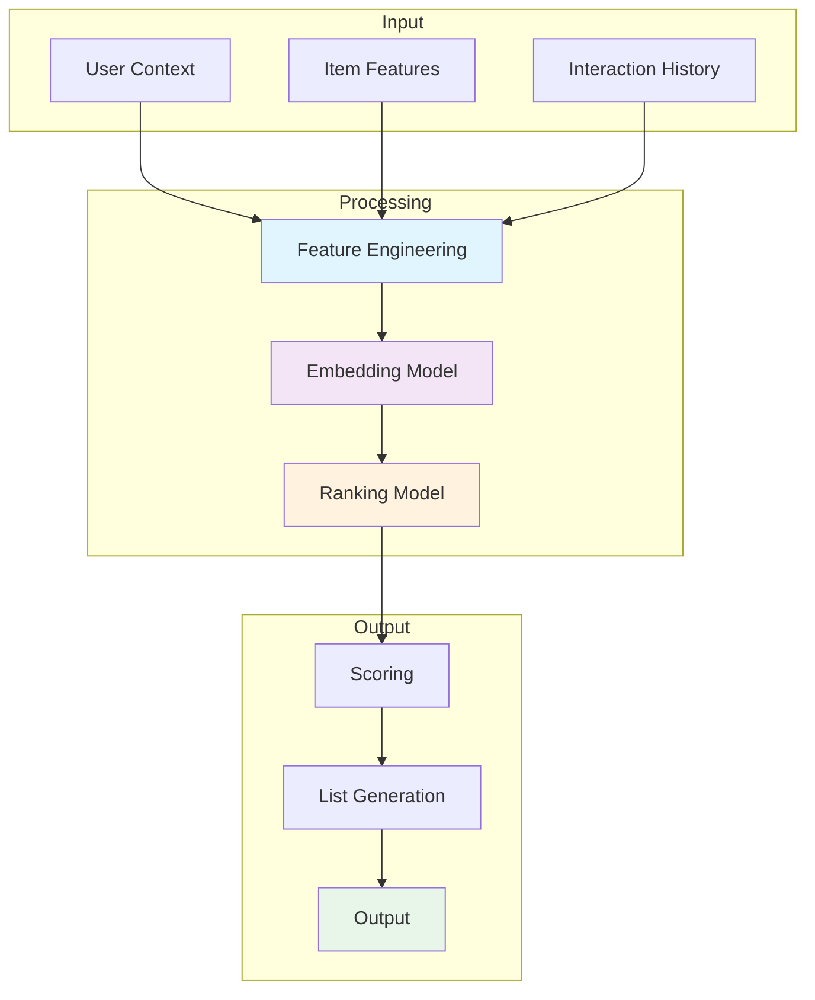
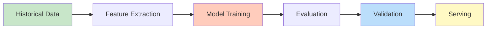
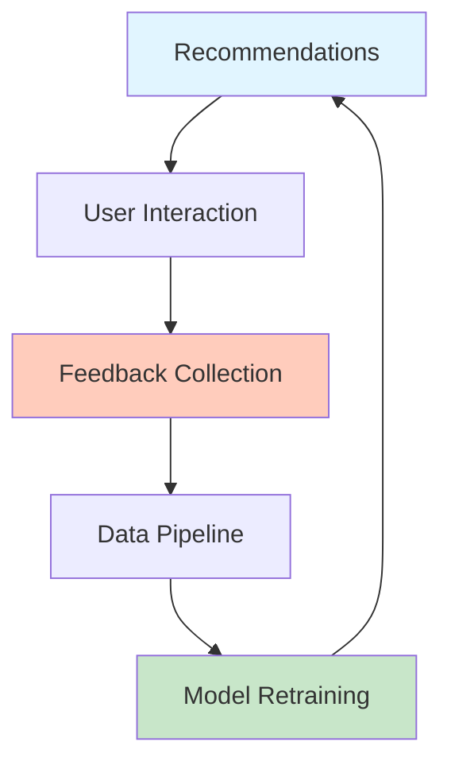
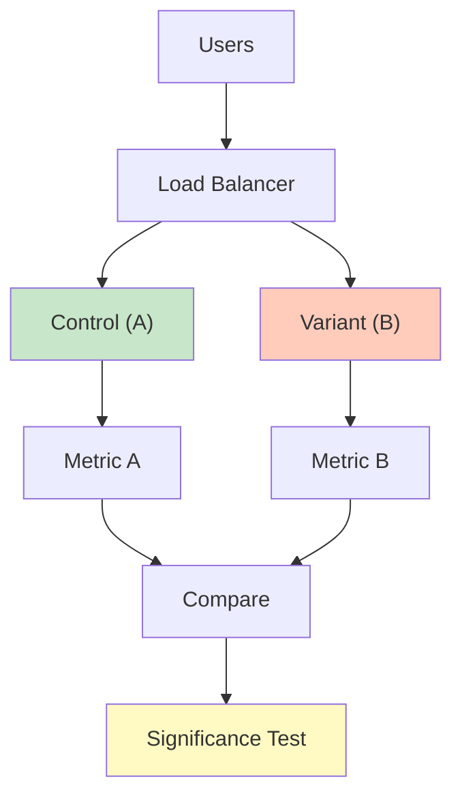
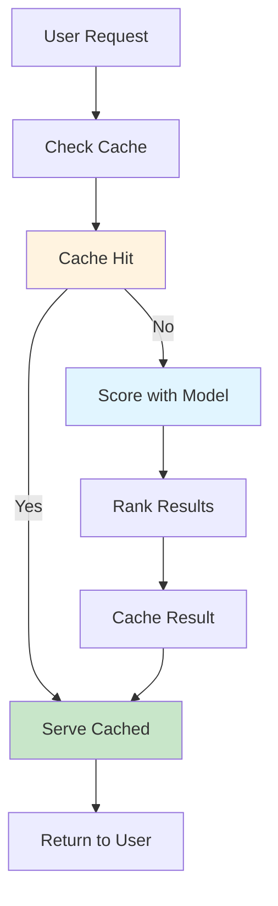

# Feedback Loop Management

## Problem Statement

### Functional Requirements
- Capture user feedback on recommendations
- Use feedback to improve model
- Handle selection bias in feedback
- Track feedback quality
- Enable feedback-driven optimization

### Non-Functional Requirements
- Latency: Incorporate feedback < 1 hour
- Bias mitigation: IPS or SNIPS unbiased learning
- Coverage: Capture feedback for 50%+ interactions
- Quality: Filter low-quality feedback
- Scalability: Process 1M+ feedback/day

## System Overview

**Scale Metrics:**
- Throughput: Millions of recommendations per second
- Latency: Milliseconds for recommendation generation
- Data volume: Terabytes of interaction history
- Model complexity: Millions of parameters
- Availability: 99.99% service uptime

**Key Components:**
- Feature engineering and preprocessing
- Model training and optimization
- Real-time scoring and ranking
- Feedback loop and offline evaluation
- Monitoring and experimentation

## Architecture Diagrams

### Recommendation System Architecture



### Model Training Pipeline



### Feedback Loop



### A/B Testing Framework



### Real-Time Serving



## Data Flow Scenarios

### Scenario 1: Training New Model
1. Collect historical user interactions
2. Extract features from raw data
3. Train recommendation model
4. Evaluate on hold-out test set
5. Compare with baseline model
6. Deploy to serving infrastructure

### Scenario 2: Real-Time Scoring
1. User requests recommendations
2. Fetch user profile and context
3. Retrieve candidate items
4. Score candidates with model
5. Re-rank by diversity and freshness
6. Return top-K recommendations

### Scenario 3: Online A/B Test
1. Split traffic between variants
2. Serve variant A (control) to 50%
3. Serve variant B (test) to 50%
4. Collect metrics from both
5. Run significance test
6. Deploy winner if significant

## Performance Optimization

### Model Optimization
- **Distillation**: Compress large models
- **Quantization**: Reduce precision for speed
- **Pruning**: Remove unimportant parameters
- **Caching**: Pre-compute common scores

### Inference Optimization
- **Batching**: Process multiple requests together
- **GPU acceleration**: Use GPUs for scoring
- **Approximate search**: Fast similarity lookup
- **Caching**: Cache popular recommendations

### Data Optimization
- **Sampling**: Train on representative sample
- **Bucketing**: Group similar items
- **Filtering**: Remove noise and outliers
- **Compression**: Efficient feature storage

## Back-of-Envelope Calculations

### User and Item Scale
```
Daily active users: 100M
Items in catalog: 1M
Interactions per user per day: 10
Daily interactions: 1B
Training data: 3 years = 1T interactions
Model parameters: 10M-1B depending on approach
```

### Compute Requirements
```
Training:
- Batch size: 10K examples
- Epochs: 10
- Total batches: (1B / 10K) × 10 = 1M batches
- Time per batch: 100ms
- Total training time: 100M seconds ≈ 27 hours

Serving:
- Scoring latency: 10ms per item per model
- Candidates per request: 1000 items
- Scoring: 1000 × 10ms = 10 seconds
- With caching: 100ms (1% miss rate)
- With approximation: 10ms
```

### Storage Requirements
```
Interaction history: 1T × 100 bytes = 100 TB
Models: 1B parameters × 4 bytes = 4 GB
Embeddings: 1M items × 100 dims × 4 bytes = 400 MB
Feature cache: 1M items × 10 KB = 10 TB
Total: ~110 TB
```

## Interview Questions & Answers

### Q1: Design recommendation system for YouTube

**Answer:**
1. **Scale**: 100M users, 1B videos, 1B interactions/day
2. **Architecture**:
   - Feature pipeline: User, video, context features
   - Candidate generation: Retrieval of 1000 candidates
   - Ranking: Deep learning model to rank candidates
   - Serving: Real-time with caching
3. **Models**:
   - Candidate: Collaborative filtering for recall
   - Ranking: Deep neural network for relevance
4. **Optimization**: GPU scoring, caching, A/B testing
5. **Challenges**: Cold-start, diversity, fairness, freshness

### Q2: Handle cold-start for new users

**Answer:**
- **Content-based**: Use item features if available
- **Demographic**: Recommend popular items to new users
- **Exploration**: Recommend diverse items to learn preferences
- **Collaborative**: Find similar users with data
- **Hybrid**: Combine multiple approaches
- **Feedback**: Quick onboarding with explicit feedback

### Q3: Ensure recommendation diversity

**Answer:**
- **Diversify candidates**: Retrieve from multiple sources
- **Re-ranking**: Penalize similar items in ranking
- **Embedding distance**: Maximize pairwise distances
- **Category balance**: Ensure diverse content types
- **Exploration**: Recommend unknown items
- **User preference**: Learn diversity preference

### Q4: Detect and handle model drift

**Answer:**
- **Monitor**: Track RMSE, AUC over time
- **Baseline**: Compare with production model
- **Retrain**: Automated retraining on schedule
- **Detect**: Sudden > 5% drop triggers alert
- **Evaluate**: Online A/B test before deployment
- **Rollback**: Quick rollback if degradation

### Q5: Design A/B testing framework

**Answer:**
- **Randomization**: Consistent hash for user assignment
- **Metrics**: Engagement, CTR, conversion, revenue
- **Duration**: Run for 1-2 weeks minimum
- **Size**: Minimum 100K users per variant
- **Stats**: Power = 0.8, significance = 0.05
- **Logging**: Track all experiments and results

### Q6: Optimize for long-term user satisfaction

**Answer:**
- **Beyond clicks**: Optimize for likes, shares, watch time
- **Diversity**: Avoid excessive repetition
- **Novelty**: Recommend new content occasionally
- **RL approach**: Model long-term value
- **Feedback**: Learn from user satisfaction signals
- **Offline test**: Predict satisfaction before online test

## Technology Stack

| Component | Technology | Why |
|-----------|-----------|-----|
| Training | TensorFlow, PyTorch | Flexible deep learning |
| Serving | TFServing, KServe | Low-latency inference |
| Features | Spark, Airflow | Large-scale pipelines |
| Storage | HBase, Cassandra | Fast key-value access |
| Evaluation | Spark MLlib | Distributed metrics |
| Experimentation | Statsmodels | Statistical testing |
| Monitoring | Prometheus, Datadog | Real-time metrics |

## Lessons Learned

1. **Data quality matters**: Garbage in, garbage out
2. **Measure offline and online**: Offline metrics != online results
3. **Diversity is important**: Pure relevance = boring
4. **Fresh content works**: Stale recommendations hurt engagement
5. **User feedback is gold**: Learn from interactions quickly

## Related Topics

- Collaborative filtering and matrix factorization
- Deep learning for recommendations
- Ranking algorithms and loss functions
- A/B testing and experimentation
- Feature engineering for recommendation
- Real-time serving and caching
- Offline evaluation metrics
- Fairness and explainability in ML


## Code Implementation

### Python
```python
import redis
import time
from dataclasses import dataclass, field
from typing import Optional

r = redis.Redis(decode_responses=True)

@dataclass
class Post:
    post_id: str
    author_id: str
    content: str
    timestamp: float = field(default_factory=time.time)

class FeedService:
    """Hybrid push-pull feed: push for regular users, pull for celebrities."""
    CELEBRITY_THRESHOLD = 1_000_000   # followers

    def publish_post(self, post: Post, follower_count: int) -> None:
        """Push post to follower feeds (fanout on write for small accounts)."""
        post_data = f"{post.post_id}:{post.timestamp}"
        # Store post metadata
        r.hset(f"post:{post.post_id}", mapping={
            "content": post.content,
            "author": post.author_id,
            "ts": post.timestamp,
        })
        if follower_count < self.CELEBRITY_THRESHOLD:
            # Push to each follower's feed sorted set (score = timestamp)
            followers = r.smembers(f"followers:{post.author_id}")
            pipe = r.pipeline()
            for follower_id in followers:
                pipe.zadd(f"feed:{follower_id}", {post.post_id: post.timestamp})
                pipe.zremrangebyrank(f"feed:{follower_id}", 0, -1001)  # cap at 1000
            pipe.execute()

    def get_feed(self, user_id: str, limit: int = 20) -> list[dict]:
        """Get merged feed: own feed (pushed) + celebrity followings (pulled)."""
        post_ids = r.zrevrange(f"feed:{user_id}", 0, limit - 1, withscores=False)
        return [r.hgetall(f"post:{pid}") for pid in post_ids]
```

### Java
```java
import redis.clients.jedis.*;
import java.util.*;

public class FeedService {
    private static final int CELEBRITY_THRESHOLD = 1_000_000;
    private final JedisPool jedisPool;

    public FeedService(JedisPool jedisPool) { this.jedisPool = jedisPool; }

    public void publishPost(String postId, String authorId, String content,
                             long followerCount) {
        try (Jedis jedis = jedisPool.getResource()) {
            double timestamp = System.currentTimeMillis() / 1000.0;
            // Store post metadata
            jedis.hset("post:" + postId, Map.of(
                "content", content, "author", authorId, "ts", String.valueOf(timestamp)
            ));
            if (followerCount < CELEBRITY_THRESHOLD) {
                // Fanout on write — push to each follower's feed
                Set<String> followers = jedis.smembers("followers:" + authorId);
                Pipeline pipe = jedis.pipelined();
                for (String followerId : followers) {
                    pipe.zadd("feed:" + followerId, timestamp, postId);
                    pipe.zremrangeByRank("feed:" + followerId, 0, -1001); // keep 1000
                }
                pipe.sync();
            }
        }
    }

    public List<Map<String, String>> getFeed(String userId, int limit) {
        try (Jedis jedis = jedisPool.getResource()) {
            List<String> postIds = new ArrayList<>(
                jedis.zrevrangeByScore("feed:" + userId, "+inf", "-inf",
                                       0, limit));
            List<Map<String, String>> posts = new ArrayList<>();
            for (String pid : postIds) posts.add(jedis.hgetAll("post:" + pid));
            return posts;
        }
    }
}
```

## Back-of-the-Envelope Calculations

**System Load Estimation:**
- 1M daily active users × 10 requests/day = 10M requests/day
- Peak QPS = 10M / 86400 × 3 (peak factor) ≈ 350 QPS
- API server capacity: 1000 QPS/server → 1 server sufficient at peak
- With 2x redundancy: 2 servers minimum

**Storage Estimation:**
- 1M users × 10KB average data = 10GB structured data
- Annual growth: 10GB × 365 = 3.65TB/year
- With 3x replication: 11TB/year
- SSD cost ($0.10/GB): $1,100/year

**Bandwidth:**
- 350 QPS × 10KB response = 3.5MB/sec outbound
- Monthly egress: 3.5MB × 86400 × 30 = 9TB/month
## Follow-up Questions

1. **How would you handle this at 10x the scale described?**
   - What breaks first? (typically: single DB, single cache node, single region)
   - What architectural changes are required?

2. **What are the consistency vs. availability trade-offs in your design?**
   - Where did you accept eventual consistency?
   - Which operations require strong consistency and why?

3. **How would you debug a sudden latency spike in production?**
   - What metrics would you look at first?
   - What's your runbook for the top 3 likely causes?

4. **How does your design handle partial failures?**
   - What happens if one component is slow (not down)?
   - How do you prevent cascading failures?

5. **What would you change if you had to build this in one week vs. six months?**
   - What corners can safely be cut initially?
   - What must be right from day one?

6. **How would you migrate from the current design to a better one without downtime?**
   - What's the strangler-fig or blue-green strategy here?
   - How do you validate correctness during migration?