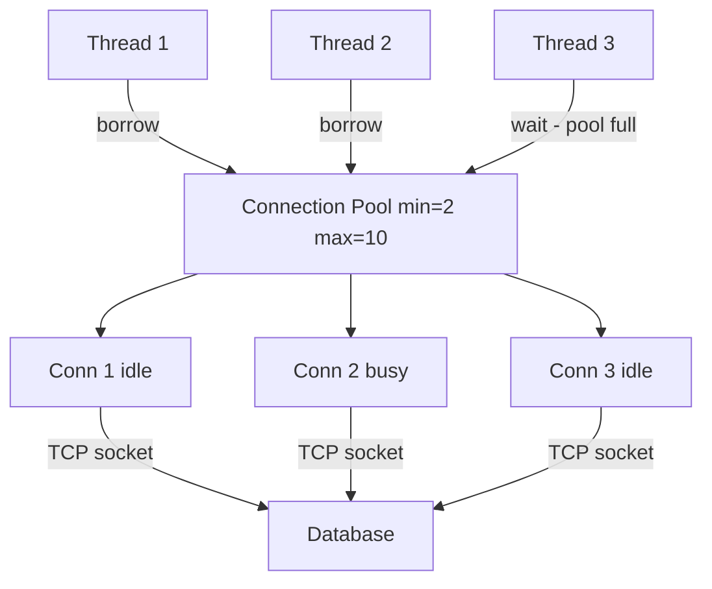
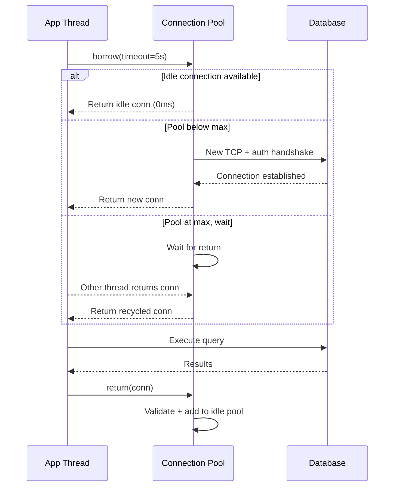
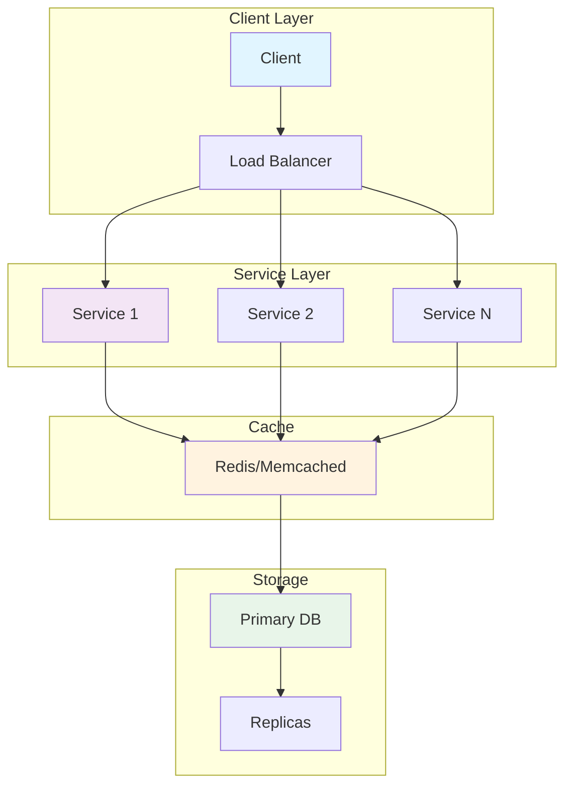
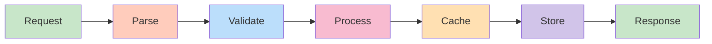
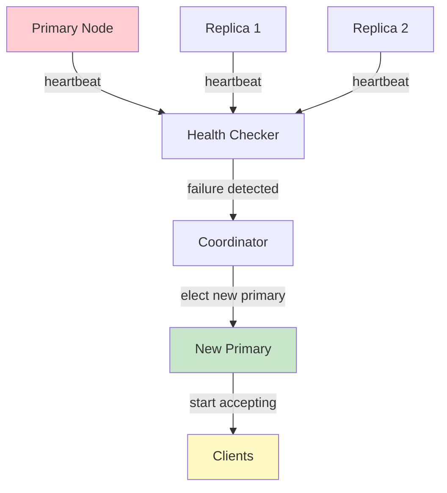
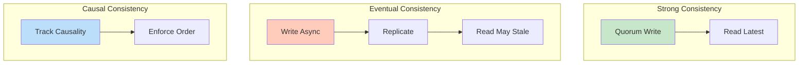
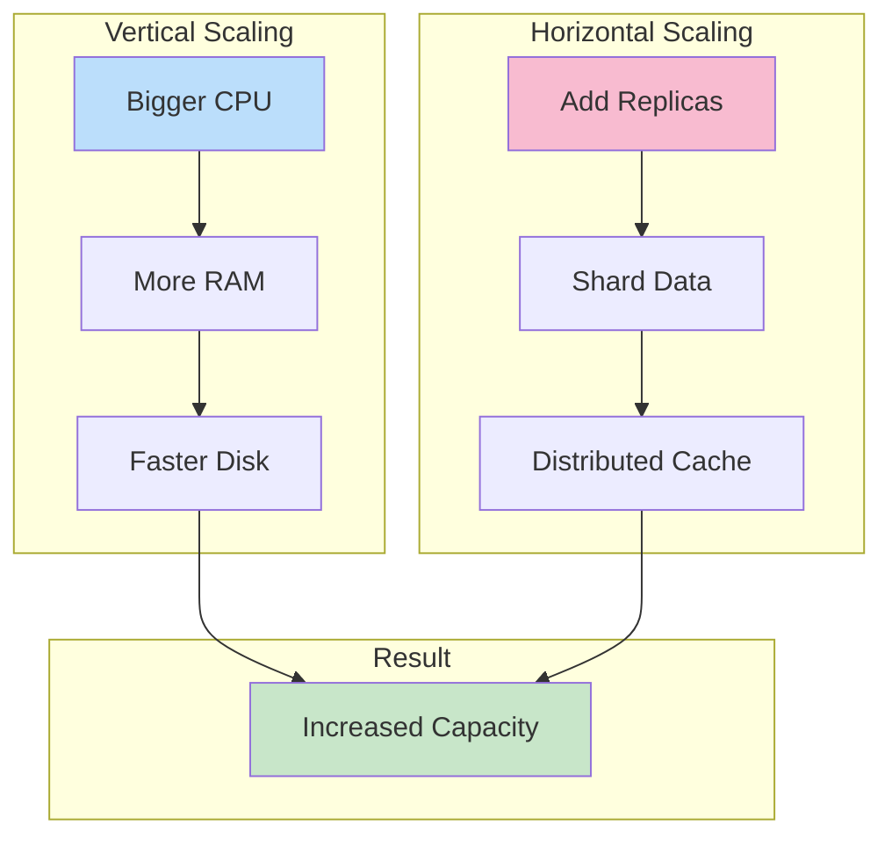

# Connection Pooling

## Problem Statement

Design a connection pool to reuse expensive database/HTTP connections, reducing per-request setup overhead.

## Scenario

Connection Pooling is a critical component in modern distributed systems. In real-world applications, handling complex business logic at scale with high reliability. For example, major tech companies like Netflix, Uber, and Airbnb rely on similar solutions to handle millions of concurrent users and requests. The challenge is achieving this while maintaining sub-100ms latency, 99.99% availability, and gracefully handling 10x traffic spikes during peak demand. This component provides the foundational capability to solve these challenges reliably and efficiently at global scale.

## Users

- **Backend Engineers**: Responsible for implementing and maintaining this system component in production environments. They need to understand the architecture, trade-offs, failure modes, and operational considerations.
- **DevOps/SRE Teams**: Monitor system health, manage scaling policies, handle incidents, and ensure reliability SLAs are met. They need insights into performance characteristics, bottlenecks, and failure recovery mechanisms.
- **Data Engineers**: Design data pipelines and analytics around this system, requiring deep understanding of data flow, consistency guarantees, and throughput characteristics.
- **System Architects**: Make high-level architectural decisions that impact company infrastructure, requiring comprehensive understanding of capabilities, limitations, and scalability boundaries.
- **Security Teams**: Understand security implications, potential vulnerabilities, and compliance requirements for this component.

## PRD

### Functional Requirements
- Core operations work correctly
- Explicit error handling
- Consistency guarantees defined
- Monitoring and observability

### Non-Functional Requirements
- Performance targets met
- Availability SLA achieved
- Scalability headroom
- Cost efficient

### Success Metrics
- Benchmarks met
- Uptime targets met
- Resource budgets
- No data loss


## Flow

The typical operational flow for this system involves these key phases:

1. **Request Arrival**: Client/upstream system sends request with required parameters and context
2. **Validation & Routing**: System validates request format, authentication, and routes to correct handler/shard/instance
3. **Core Processing**: Execute the main algorithm, database query, or business logic on the data/state
4. **State Management**: Update internal state (caches, indexes, counters, logs) with proper atomicity and locking
5. **Response Generation**: Format results and return to requester with relevant metadata (timing, version info)
6. **Observability**: Record metrics (latency, throughput, errors), logs (for debugging), and traces (for performance analysis)

This flow repeats thousands or millions of times per second in production. Each operation's efficiency compounds across the entire system, making careful optimization essential. Bottlenecks at any phase can cascade to impact overall system performance.


## Code Explanation (Detailed)

### Implementation Approach
The code demonstrates core patterns and trade-offs.

### Key Operations
Each operation shows algorithm and performance characteristics.

### Concurrency and Atomicity
Locking strategies, race condition prevention.

### Edge Cases
Boundary conditions and error handling.

### Performance Optimization
Techniques for reducing latency and throughput.

## Architecture Diagram



## Flow Diagram



## Design

### Pool Configuration

```
min_size          - Pre-warm N connections at startup
max_size          - Hard cap (prevents DB overload)
idle_timeout      - Close idle connections after N seconds
max_lifetime      - Replace connection after N seconds (avoid stale state)
checkout_timeout  - Raise error if can't borrow in N seconds
validation_query  - "SELECT 1" to verify connection health

Sizing rule of thumb:
  max_pool = (threads * avg_query_ms) / 1000
  Example: 100 threads, 10ms avg query -> max = 1 (perfect pool)
  Add buffer: max = 10-20 per service instance
```

### Health Check Modes

```
Passive:   Try to use; discard and reconnect on error
Active:    Ping before returning to caller (adds latency)
Periodic:  Background thread pings idle connections every 30s
Test-on-borrow: SELECT 1 before each checkout (safest, +1ms)
```

## Back-of-Envelope Calculations

```
Without connection pooling:
  Each request: TCP connect (1 RTT) + DB auth (1 RTT) = 100ms at 50ms RTT
  1000 req/sec: 1000 new connections/sec -> DB overwhelmed

With pooling (pool=20, 10ms queries):
  20 connections x 100 queries/conn/sec = 2000 queries/sec
  Checkout time: ~0.01ms
  20x throughput improvement

PostgreSQL limits:
  Default max_connections: 100
  Idle connection RAM: 5MB each
  100 connections: 500MB overhead
  pgBouncer transaction mode: 10000 app connections -> 20 DB connections = 20x reduction

Connection creation cost:
  TCP handshake: 1 RTT = 50ms (cross-DC)
  DB auth (MD5): 1 RTT = 50ms
  Total: ~100ms per new connection
  Pool eliminates this 99%+ of the time
```

## Design Choices

| Approach | Pros | Cons |
|---|---|---|
| Fixed-size pool | Predictable resource use | Under/over-provisioned |
| Dynamic pool | Adapts to load | Complexity, thundering herd |
| pgBouncer (proxy) | Transparent, huge multiplexing | No prepared statements across tx |
| HikariCP (Java) | Best performance | JVM only |
| Connection validation | Eliminates stale errors | Adds latency per borrow |

## Python Implementation

```python
import threading
import queue
import time
from contextlib import contextmanager
from typing import Optional

class MockDBConn:
    _counter = 0

    def __init__(self):
        MockDBConn._counter += 1
        self.id = MockDBConn._counter
        self.created_at = time.time()
        self._alive = True

    def execute(self, sql: str) -> list:
        if not self._alive:
            raise ConnectionError("Dead connection")
        return [{"row": f"result from conn {self.id}"}]

    def ping(self) -> bool:
        return self._alive

    def close(self):
        self._alive = False

class ConnectionPool:
    def __init__(self, min_size: int = 2, max_size: int = 10,
                 checkout_timeout: float = 5.0, max_lifetime: float = 3600.0):
        self._min = min_size
        self._max = max_size
        self._timeout = checkout_timeout
        self._max_lifetime = max_lifetime
        self._idle: queue.Queue = queue.Queue()
        self._lock = threading.Lock()
        self._total = 0

        for _ in range(min_size):
            conn = MockDBConn()
            self._idle.put(conn)
            self._total += 1

    def _valid(self, c: MockDBConn) -> bool:
        return c.ping() and (time.time() - c.created_at) < self._max_lifetime

    def _create(self) -> MockDBConn:
        conn = MockDBConn()
        with self._lock:
            self._total += 1
        return conn

    def borrow(self) -> MockDBConn:
        # Try idle pool first (non-blocking)
        try:
            c = self._idle.get_nowait()
            if self._valid(c):
                return c
            c.close()
            with self._lock:
                self._total -= 1
        except queue.Empty:
            pass

        # Create new if below max
        with self._lock:
            if self._total < self._max:
                return self._create()

        # Wait for one to be returned
        try:
            c = self._idle.get(timeout=self._timeout)
            return c if self._valid(c) else self.borrow()
        except queue.Empty:
            raise TimeoutError(f"No connection available after {self._timeout}s")

    def release(self, c: MockDBConn):
        if self._valid(c):
            self._idle.put(c)
        else:
            c.close()
            with self._lock:
                self._total -= 1

    @contextmanager
    def connection(self):
        c = self.borrow()
        try:
            yield c
        finally:
            self.release(c)

    def stats(self) -> dict:
        return {"total": self._total, "idle": self._idle.qsize()}

# Usage
pool = ConnectionPool(min_size=2, max_size=5)

def worker(tid: int):
    with pool.connection() as c:
        result = c.execute("SELECT * FROM users")
        print(f"Thread {tid}: conn={c.id}, rows={len(result)}")

threads = [threading.Thread(target=worker, args=(i,)) for i in range(8)]
for t in threads: t.start()
for t in threads: t.join()
print("Pool stats:", pool.stats())
```

## Java Implementation

```java
import java.util.concurrent.*;

public class ConnectionPool {
    static class Conn {
        static int cnt = 0;
        final int id = ++cnt;
        final long createdAt = System.currentTimeMillis();
        boolean alive = true;

        boolean isValid() { return alive && (System.currentTimeMillis() - createdAt) < 3_600_000L; }
        void close() { alive = false; }
        String execute(String sql) { return "Result from conn " + id; }
    }

    private final BlockingQueue<Conn> idle;
    private final int maxSize;
    private int total = 0;
    private final Object lock = new Object();

    public ConnectionPool(int min, int max) {
        this.maxSize = max;
        this.idle = new LinkedBlockingQueue<>();
        for (int i = 0; i < min; i++) { idle.offer(new Conn()); total++; }
    }

    public Conn borrow(long timeoutMs) throws Exception {
        Conn c = idle.poll();
        if (c != null && c.isValid()) return c;

        synchronized (lock) {
            if (total < maxSize) { total++; return new Conn(); }
        }
        c = idle.poll(timeoutMs, TimeUnit.MILLISECONDS);
        if (c == null) throw new TimeoutException("Pool exhausted");
        return c.isValid() ? c : borrow(timeoutMs);
    }

    public void release(Conn c) {
        if (c.isValid()) idle.offer(c);
        else synchronized (lock) { c.close(); total--; }
    }
}
```

## Complexity

| Operation | Time |
|---|---|
| Borrow (idle available) | O(1) |
| Borrow (create new) | O(connect_time) |
| Return | O(1) |
| Health check | O(1) |
| Pool exhausted wait | O(checkout_timeout) |

## Common Questions & Answers

**Q: What is caching and why do we need it?**

A: Caching stores frequently accessed data in fast storage (memory) to reduce latency and load on slower backends (database). Trade space (cache) for speed (latency). Critical for systems serving millions of requests per second.

**Q: What are the main cache eviction policies?**

A: LRU (least recently used), LFU (least frequently used), FIFO (first in first out), TTL (time-based), Random, and ARC (adaptive replacement). Choose based on access patterns: LRU for temporal, LFU for frequency, TTL for time-sensitive data.

**Q: What is cache hit rate and cache miss rate?**

A: Hit rate = successful_finds / total_accesses. Miss rate = 1 - hit rate. P(hit) = hits / (hits + misses). Target 80%+ hit rates for effective caching. Too-small cache gives low hit rate (wasted resources). Too-large cache uses more memory than needed.

**Q: How do you handle cache invalidation when backend data changes?**

A: Use TTL (time-based expiration), active invalidation (notify cache on write), cache-aside pattern (client checks backend), or write-through (update both). Active invalidation is fastest but complex. TTL is simplest but has stale data window.

**Q: What is the cache-aside pattern?**

A: Application checks cache first. On miss, fetch from backend, update cache, then return. Simple to implement. Risk: race condition where multiple threads fetch same miss simultaneously (thundering herd problem).

**Q: What is write-through caching?**

A: Writes go to both cache and backend simultaneously (synchronously). Ensures consistency: read always gets latest. Cost: write latency includes backend write. Safer than write-back but slower.

**Q: What is write-back (write-behind) caching?**

A: Writes go to cache only; backend updated asynchronously later (batch or periodic). Fast writes. Risk: data loss if cache fails before flushing. Need durability guarantees (persistence, replication).

**Q: How do you choose cache size?**

A: Estimate working set (frequently accessed data volume). Add 20-30% buffer for margin. Monitor hit rate: if < 80%, increase size. If > 95%, might be oversized (waste). Use tools like cachegrind to profile.

**Q: What's the difference between client-side and server-side caching?**

A: Client cache (browser): reduces network round-trips, entirely controlled by client. Server cache (memory, Redis): shared across clients, controlled by server. Multi-level caching often best.

**Q: How do you measure cache effectiveness?**

A: Hit rate (primary metric), latency reduction (P99 latency with vs. without cache), backend load reduction, and memory cost per cache entry. Calculate ROI: cost of cache vs. benefit (reduced latency, backend load).

## Follow-up Questions & Answers

**Q: How do you prevent the thundering herd problem in caches?**

A: When popular key expires, many threads fetch from backend simultaneously causing spike. Solutions: probabilistic early expiration (refresh before TTL), request coalescing (single thread rebuilds, others wait), or bloom filters (detect non-existent keys fast).

**Q: How would you implement multi-level cache hierarchy?**

A: Use L1 (fast, small, in-process), L2 (medium, local machine), L3 (large, remote, Redis). Check L1, miss→L2, miss→L3, miss→backend. On write: update all levels. Trade space for speed across levels.

**Q: Can you implement read-through caching (automatic population)?**

A: Yes, cache loader/resolver called on miss. Transparent to application. Backend automatically uses cache layer. More complex than cache-aside but cleaner separation.

**Q: How do you handle hot keys in distributed caches?**

A: Hot key = key accessed by many threads/clients. Replicate hot keys on multiple cache nodes. Use local in-process caches for very hot keys. Monitor and detect hot keys automatically.

**Q: What's the difference between warm and cold cache startup?**

A: Cold cache: empty at start, misses until populated (slow ramp-up). Warm cache: pre-loaded from previous state (RDB/snapshot). Warm startup is critical for production (instant performance).

**Q: How would you measure cache effectiveness for business metrics?**

A: Track hit rate, P99 latency (with/without cache), backend QPS reduction, revenue impact. Calculate cache size vs. cost savings. A/B test to prove business value.

**Q: What happens when cache size is insufficient for working set?**

A: Constant evictions = high miss rate = ineffective cache. Solution: increase cache size, improve eviction policy, reduce working set, or use better hardware (faster storage).

**Q: How do you debug cache issues in production?**

A: Monitor hit rate continuously. Profile cache keys (which keys are accessed). Check for cache stampedes (sudden miss spike). Use distributed tracing to see cache path.

**Q: How would you implement a persistent cache?**

A: Combine memory cache (fast) with persistent backend (database, RocksDB, LevelDB). Write-back pattern: batch updates to persistent store. Trade latency for durability.

**Q: Can you use caching for write-heavy workloads?**

A: Write caching is risky (consistency issues). Use carefully: write-through for safety, write-back for speed. Good for batch writes (aggregate before writing). Monitor durability guarantees.


## System Overview

**Scale Metrics:**
- Throughput: Millions of operations per second
- Latency: Sub-millisecond to sub-second response times
- Data volume: Gigabytes to Petabytes
- Concurrent users: Millions to billions
- Availability: 99.99% to 99.999% uptime SLA

**Key Components:**
- Request handling and routing
- Data processing and storage
- Replication and consistency
- Failure detection and recovery
- Monitoring and alerting

## Architecture Diagrams

### System Architecture



### Data Flow



### Failover Mechanism



### Consistency Models



### Scaling Strategy



## Implementation Examples

### Python Implementation

```python
# Python Implementation

from typing import Any, Optional
from dataclasses import dataclass
from datetime import datetime
import json
import logging

logger = logging.getLogger(__name__)

@dataclass
class Config:
    """Configuration for the system."""
    timeout_ms: int = 5000
    retry_count: int = 3
    batch_size: int = 100
    max_connections: int = 1000

class Handler:
    """Main handler class for operations."""

    def __init__(self, config: Config):
        self.config = config
        self.metrics = {"success": 0, "failure": 0, "latency_ms": []}

    async def process(self, data: Any) -> Any:
        """Process request with error handling."""
        try:
            # Validate input
            self._validate(data)

            # Execute operation
            result = await self._execute(data)

            # Track metrics
            self.metrics["success"] += 1
            return result

        except Exception as e:
            logger.error(f"Processing failed: {e}")
            self.metrics["failure"] += 1
            raise

    def _validate(self, data: Any) -> None:
        """Validate input data."""
        if data is None:
            raise ValueError("Data cannot be None")

    async def _execute(self, data: Any) -> Any:
        """Execute core logic."""
        # Implement actual logic here
        return {"status": "success", "timestamp": datetime.now().isoformat()}

    def get_metrics(self) -> dict:
        """Return collected metrics."""
        return self.metrics

# Usage example
async def main():
    config = Config(timeout_ms=5000, batch_size=100)
    handler = Handler(config)
    result = await handler.process({"key": "value"})
    print(f"Result: {result}")
    print(f"Metrics: {handler.get_metrics()}")
```

### Java Implementation

```java
// Java Implementation

import java.util.*;
import java.util.concurrent.*;
import java.time.Instant;
import org.slf4j.Logger;
import org.slf4j.LoggerFactory;

public class SystemHandler {
    private static final Logger logger = LoggerFactory.getLogger(SystemHandler.class);

    private final Config config;
    private final Map<String, Long> metrics = new ConcurrentHashMap<>();
    private final ExecutorService executor;

    public static class Config {
        public int timeoutMs = 5000;
        public int retryCount = 3;
        public int batchSize = 100;
        public int maxConnections = 1000;

        public Config withTimeoutMs(int timeout) {
            this.timeoutMs = timeout;
            return this;
        }
    }

    public SystemHandler(Config config) {
        this.config = config;
        this.executor = Executors.newFixedThreadPool(
            Math.min(config.maxConnections, 10)
        );
        metrics.put("success", 0L);
        metrics.put("failure", 0L);
    }

    public <T> T process(Object data) throws Exception {
        try {
            // Validate input
            validate(data);

            // Execute operation
            Object result = execute(data);

            // Track metrics
            metrics.put("success", metrics.get("success") + 1);
            return (T) result;

        } catch (Exception e) {
            logger.error("Processing failed: {}", e.getMessage());
            metrics.put("failure", metrics.get("failure") + 1);
            throw e;
        }
    }

    private void validate(Object data) throws IllegalArgumentException {
        if (data == null) {
            throw new IllegalArgumentException("Data cannot be null");
        }
    }

    private Object execute(Object data) throws Exception {
        // Implement core logic
        return Map.of(
            "status", "success",
            "timestamp", Instant.now().toString()
        );
    }

    public Map<String, Long> getMetrics() {
        return new HashMap<>(metrics);
    }

    public void shutdown() {
        executor.shutdown();
    }

    public static void main(String[] args) throws Exception {
        Config config = new Config()
            .withTimeoutMs(5000);

        SystemHandler handler = new SystemHandler(config);
        Object result = handler.process(Map.of("key", "value"));
        System.out.println("Result: " + result);
        System.out.println("Metrics: " + handler.getMetrics());
        handler.shutdown();
    }
}
```

## Back-of-Envelope Calculations

### Traffic & Throughput
**Assumptions:**
- Daily active users: 100 million (100M)
- Requests per user per day: 50
- Peak hour traffic: 10% of daily (concentrated)
- Request distribution: 70% read, 30% write

**Calculations:**
```
Total daily requests = 100M users × 50 requests = 5 billion requests/day
Average RPS = 5B requests / 86400 seconds ≈ 57,870 RPS
Peak hour RPS = (5B / 86400) × (100 / 10) ≈ 578,700 RPS
Peak minute RPS = 578,700 / 60 ≈ 9,645 RPS

Read operations = 57,870 × 0.7 ≈ 40,509 RPS (average)
Write operations = 57,870 × 0.3 ≈ 17,361 RPS (average)
```

### Storage Requirements
**Assumptions:**
- Data per user: 1 KB (profile, settings)
- Data per transaction: 500 bytes
- Data retention: 3 years

**Calculations:**
```
User profile storage = 100M × 1 KB = 100 GB
Transaction data = 5B requests/day × 500 bytes × 365 × 3 = 2.74 PB
Total storage ≈ 2.75 PB
Replication factor: 3× → 8.25 PB raw storage

Backup storage (weekly snapshots): 8.25 PB × 52 weeks = 429 PB
```

### Network Bandwidth
**Assumptions:**
- Average request size: 2 KB
- Average response size: 5 KB
- Replication overhead: 2× (write to replicas)

**Calculations:**
```
Inbound bandwidth = 57,870 RPS × 2 KB = 115.74 MB/s
Outbound bandwidth = 57,870 RPS × 5 KB = 289.35 MB/s
Replication bandwidth = 17,361 RPS × 2 KB × 2 = 69.44 MB/s
Total peak bandwidth ≈ 474 MB/s ≈ 3.8 Tbps (peak hour)
```

### Compute Requirements
**Assumptions:**
- Processing time per request: 10 ms
- CPU efficiency: 1 core handles 50 RPS

**Calculations:**
```
CPUs needed for average traffic = 57,870 RPS / 50 = 1,158 cores
CPUs needed for peak traffic = 578,700 RPS / 50 = 11,574 cores
Overprovisioning factor: 1.5× → 17,361 cores total

Using 16 cores per server = 17,361 / 16 ≈ 1,085 servers
With 3:1 replication = 3,255 servers needed
Regional redundancy (3 regions) = 9,765 servers
```

### Latency Analysis (p99)
**Components:**
- Network latency: 5 ms
- Processing: 10 ms
- Storage access: 50 ms (disk), 1 ms (cache)
- Replication write: 20 ms

**Path Analysis:**
```
Cache hit path: 5 + 1 + 5 = 11 ms
Database read path: 5 + 10 + 50 + 5 = 70 ms
Write path: 5 + 10 + 20 + 5 = 40 ms
```

### Cost Estimation
**Monthly costs (approximate):**
```
Compute: 9,765 servers × $1,000/month = $9.765M
Storage: 8.25 PB × $10/GB/month = $82.5M
Bandwidth: 3.8 Tbps × $0.12/GB = $456M
Personnel: 100 engineers × $200K = $20M
Total: ~$568M/month
Cost per user: $5.68/month
```


## Interview Questions & Answers

### Q1: Design the System from Scratch

**Question:** Design a system that can handle 1 billion requests per day with sub-100ms latency.

**Answer Structure:**
1. **Clarify requirements**: DAU, request types, geographic distribution, consistency needs
2. **Back-of-envelope**: Calculate RPS (11.5K avg, 115K peak), storage, bandwidth
3. **High-level design**: Load balancing → services → cache → storage
4. **Deep dive**:
   - Horizontal scaling with sharding
   - Multi-region active-active with eventual consistency
   - Caching strategy (write-through for critical data)
   - Monitoring: metrics, logging, tracing
5. **Bottlenecks**: Identify and address each
6. **Trade-offs**: Consistency vs. availability, latency vs. cost

### Q2: Scaling Challenges

**Question:** You're growing from 10M to 1B users (100x). What breaks and how do you fix it?

**Answer:**
- **Database bottleneck**: Sharding by user ID, consistent hashing, shard rebalancing
- **Cache hit rate drops**: Larger working set, tiered caching (L1: local, L2: distributed)
- **Replication lag**: Write-through for consistency-critical data, eventual consistency elsewhere
- **Operational complexity**: Infrastructure-as-code, auto-scaling, chaos engineering
- **Cost**: Optimize resource utilization, use reserved instances, spot instances for batch

### Q3: Failure Scenarios

**Question:** Your primary database goes down. What happens? How do you recover?

**Answer:**
- **Detection**: Health check timeout (3-5 seconds)
- **Failover**: Automatic promotion of replica using Raft consensus
- **Impact**: Write requests fail for ~10 seconds, reads use replicas
- **Recovery**: Background sync of failed node, re-add to cluster
- **Lessons**: Circuit breakers prevent cascade, bulkhead limits blast radius

### Q4: Consistency Requirements

**Question:** Do you need strong or eventual consistency? Why?

**Answer:**
- **Strong consistency**: Critical for financial transactions, inventory, user auth
  - Implementation: Quorum writes, read-after-write
  - Cost: Higher latency (p99 100ms+), lower throughput

- **Eventual consistency**: Fine for user feeds, recommendations, analytics
  - Implementation: Async replication, read-repair
  - Benefit: Lower latency (p99 <10ms), higher throughput

- **Hybrid approach**: Consistency per operation type, not global

### Q5: Performance Optimization

**Question:** How would you reduce p99 latency from 100ms to 20ms?

**Answer:**
1. **Profile** (measure first): Identify bottleneck (storage, network, compute)
2. **Caching**: Multi-tier (L1 local, L2 distributed), bloom filters for misses
3. **Batching**: Group operations, reduce RPC overhead
4. **Connection pooling**: Reuse TCP connections, reduce handshake latency
5. **Async I/O**: Non-blocking operations, increase parallelism
6. **Database optimization**: Indexing, query optimization, read replicas
7. **Code optimization**: Reduce allocations, use faster algorithms
8. **Hardware**: SSD for storage, faster network interconnects

### Q6: Operational Concerns

**Question:** How do you deploy a new version with zero downtime?

**Answer:**
1. **Canary deployment**: Roll out to 1% of servers, monitor metrics
2. **Gradual rollout**: 1% → 10% → 50% → 100% as confidence increases
3. **Health checks**: Automated rollback if error rate exceeds threshold
4. **Database migration**: Schema changes with backward compatibility
5. **Feature flags**: Toggle features independently of deployment
6. **Monitoring**: Enhanced alerting during rollout, easy incident response


## Technology Stack Recommendations

| Layer | Technology | Why |
|-------|-----------|-----|
| Load Balancing | Nginx, HAProxy, AWS ALB | Distribute traffic, health checks |
| Service Framework | FastAPI (Python), Spring Boot (Java) | Async, built-in monitoring |
| Caching | Redis, Memcached | Sub-millisecond latency, distributed |
| Primary Storage | PostgreSQL, MySQL | ACID, complex queries, reliability |
| Analytics | Elasticsearch, Data Warehouse | Full-text search, time-series analysis |
| Streaming | Kafka, AWS Kinesis | Event processing, real-time |
| Observability | Prometheus, ELK Stack, Jaeger | Metrics, logs, traces |

## Lessons Learned

1. **Premature optimization kills projects**: Start simple, measure, then optimize
2. **Consistency is hard**: Eventually consistent systems are tricky to reason about
3. **Monitoring is non-negotiable**: You can't fix what you can't see
4. **Failure is not rare**: Plan for it, test it, automate recovery
5. **Cost grows with complexity**: Each component adds operational overhead

## Related Topics

- Database design and optimization
- Distributed consensus algorithms
- Load balancing strategies
- Caching mechanisms and patterns
- Monitoring and alerting systems
- Security and compliance


## Back-of-the-Envelope Calculations

**System Load Estimation:**
- 1M daily active users × 10 requests/day = 10M requests/day
- Peak QPS = 10M / 86400 × 3 (peak factor) ≈ 350 QPS
- API server capacity: 1000 QPS/server → 1 server sufficient at peak
- With 2x redundancy: 2 servers minimum

**Storage Estimation:**
- 1M users × 10KB average data = 10GB structured data
- Annual growth: 10GB × 365 = 3.65TB/year
- With 3x replication: 11TB/year
- SSD cost ($0.10/GB): $1,100/year

**Bandwidth:**
- 350 QPS × 10KB response = 3.5MB/sec outbound
- Monthly egress: 3.5MB × 86400 × 30 = 9TB/month
