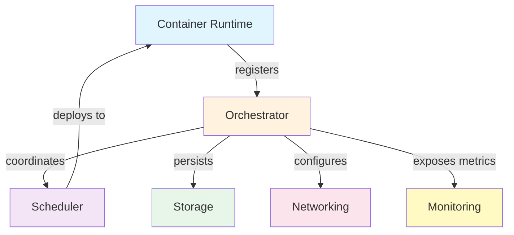
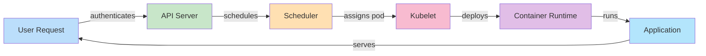
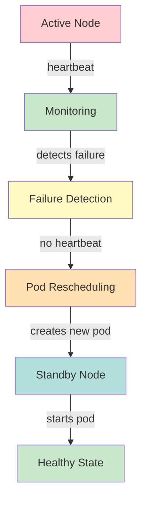
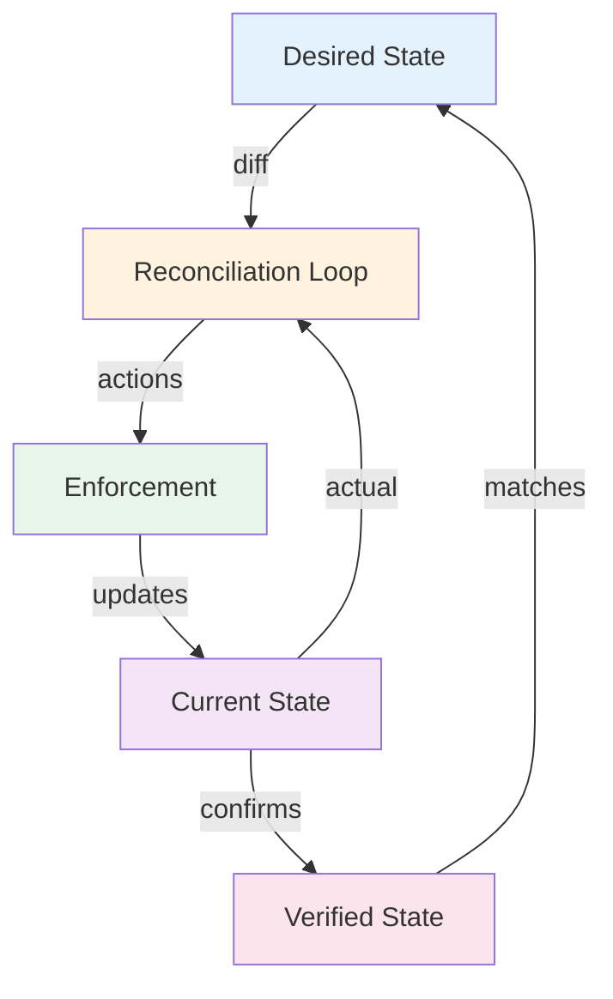

# Workload Isolation and Namespace Management

## System Overview

Kubernetes namespaces provide logical isolation of resources within a cluster, enabling multi-tenancy. Resource quotas limit namespace consumption, preventing any tenant from monopolizing cluster resources. Network policies and RBAC per namespace enforce strong isolation, making namespaces suitable for multi-tenant scenarios.

**Scale Metrics:**
- 1000+ namespaces, strict isolation, resource quotas

## Architecture

### Core Components



### Data Flow Architecture



### Failover and Recovery



### Consistency and State Management



### Scaling Architecture

```mermaid
graph LR
    A["Scaling Event"]
    B["Metrics Evaluation"]
    C["Decision Engine"]
    D["Scale Up/Down"]
    E["Resource Adjustment"]
    F["New Equilibrium"]

    A -->|collect metrics| B
    B -->|evaluate thresholds| C
    C -->|calculate replicas| D
    D -->|create/delete pods| E
    E -->|rebalance load| F

    style A fill:#ffccbc
    style B fill:#c8e6c9
    style C fill:#fff9c4
    style D fill:#ffe0b2
    style E fill:#b2dfdb
    style F fill:#c8e6c9
```



## Functional Requirements

1. **Resource Management** - Allocate and manage container resources (CPU, memory, storage) with strict enforcement of limits
2. **Scheduling** - Intelligently place containers on nodes based on resource requirements, affinity rules, and constraints
3. **Self-Healing** - Automatically restart failed containers, replace unhealthy pods, and rebalance workloads
4. **Rolling Updates** - Deploy new versions with zero downtime, automatic rollback on failure
5. **Service Discovery** - Maintain stable service endpoints, DNS resolution, and internal load balancing
6. **Networking** - Manage pod-to-pod, pod-to-service, and external networking with security enforcement
7. **Storage Orchestration** - Mount and provision persistent storage dynamically with topology awareness
8. **Configuration Management** - Decouple configuration from container images, enable secrets management

## Non-Functional Requirements

1. **Availability** - 99.99% uptime for core cluster services, automatic failover <30s
2. **Performance** - Pod scheduling latency <5s, 1M+ pod capacity per cluster
3. **Security** - Multi-tenant isolation, encrypted communication, RBAC, audit logging
4. **Scalability** - Linear scaling to 10K+ nodes, support 100K+ pods
5. **Observability** - Complete metrics, logs, and traces for all components and workloads
6. **Reliability** - Persistent state in etcd with quorum-based consensus, persistent volume durability
7. **Maintainability** - API-first declarative management, GitOps-friendly configuration

## Data Flow Scenarios

### Scenario 1: Pod Deployment
1. User submits Pod specification via kubectl
2. API Server validates and stores in etcd
3. Scheduler observes unscheduled pod
4. Scheduler evaluates node suitability (resources, affinity, taints)
5. Scheduler binds pod to selected node
6. Kubelet observes pod binding
7. Kubelet creates container via container runtime
8. Container runtime pulls image and starts container
9. Kubelet reports status back to API Server
10. Pod becomes "Running" when ready

### Scenario 2: Node Failure and Recovery
1. Monitoring detects node heartbeat loss
2. Node marked as "NotReady" after grace period
3. Pod eviction begins (respecting PDBs)
4. Pods are terminated on failed node
5. Scheduler finds alternative nodes for evicted pods
6. Replicas are created on healthy nodes
7. Services automatically route traffic to new pods
8. Failed node removed from load balancing

### Scenario 3: Rolling Update Deployment
1. New Deployment specification provided
2. Deployment controller creates new ReplicaSet
3. New ReplicaSet scales up gradually (maxSurge = 1)
4. Old ReplicaSet scales down gradually (maxUnavailable = 0)
5. Readiness probes verify new pods are healthy
6. Traffic gradually shifts to new pods
7. Old pods terminated once new pods are ready
8. Rollback available by reverting to previous ReplicaSet

### Scenario 4: Autoscaling Based on Metrics
1. Metrics collected every 15s from pods
2. HPA controller evaluates CPU/memory utilization
3. Utilization exceeds threshold (80%)
4. HPA calculates desired replica count
5. Deployment scales up to new replica count
6. New pods scheduled and started
7. Traffic distributed across replicas
8. Metrics decrease as load spreads

## Back-of-the-Envelope Calculations

**Cluster Capacity Planning:**
- Nodes: 1000, CPU: 4-core/node, Memory: 32GB/node
- Total capacity: 4,000 cores, 32TB RAM
- Average pod: 0.5 cores, 512MB memory
- Max pods per node: 110 (k8s limit) or resource constrained (32-64 typical)
- Usable capacity: ~1,500 cores, ~10TB RAM (accounting for system, buffer)
- Pod capacity: 20,000-30,000 pods

**API Server Load:**
- Pod deployment rate: 100 pods/min = 1.67 pods/sec
- Watch operations: 1 per client (dashboards, controllers)
- Estimated QPS: 100 list/watch operations/sec + mutations
- Total load: 500-1000 QPS typical, can spike to 10K+

**Storage (etcd):**
- Pod size in etcd: ~2KB average
- Config/Secrets/PVs: ~1KB each
- 30,000 pods * 2KB = 60MB just for pods
- Total cluster state: 200-500MB typical
- Snapshot time: 30-60 seconds for large clusters
- Backup frequency: Daily full backups, hourly incremental

**Network:**
- Pod-to-pod traffic: 100Mbps-10Gbps total depending on workload
- Service discovery queries: 1M+ QPS across cluster
- Ingress traffic: 1M+ requests/sec across clusters
- CNI overhead: 1-5% latency per packet processed

## Interview Questions

### Q1: How does Kubernetes schedule pods on nodes?
**Answer:** Kubernetes uses a multi-step scheduling process:
1. **Filtering Phase** - Evaluates all nodes for feasibility (resource availability, affinity rules, taints)
2. **Scoring Phase** - Ranks remaining nodes based on priorities (resource balance, zone distribution, cache affinity)
3. **Binding** - Selects highest-scoring node and binds pod to it
4. **Post-binding** - Plugins (extenders) can provide final approval

For 10K pods:
- Filtering reduces candidate nodes from 1000 to 100 (~10%)
- Scoring evaluates plugins for 100 nodes (~2-5ms)
- Total scheduling latency: <100ms per pod with proper configuration
- Can process 100+ pods/sec with optimized scheduler

Best practices:
- Set resource requests/limits to enable accurate filtering
- Use node selectors/affinity for topology requirements
- Implement PodDisruptionBudgets for safety
- Monitor scheduler performance and latency percentiles

### Q2: What is a StatefulSet and when should you use it?
**Answer:** StatefulSets manage stateful applications with:
- **Stable Network Identity** - Pod ${HOSTNAME}.${HEADLESS_SERVICE}.${NAMESPACE}.svc.cluster.local
- **Ordered Deployment/Scaling** - Pods created in order, scaled sequentially
- **Persistent Storage** - Each pod bound to dedicated PersistentVolume
- **Graceful Termination** - Ordered shutdown respecting pod disruption budgets

Use StatefulSets for:
- **Databases** (MySQL, PostgreSQL, MongoDB) - require stable identities and persistent data
- **Message Brokers** (Kafka, RabbitMQ) - stateful queue management
- **Distributed Systems** (Zookeeper, etcd) - consensus-based state management
- **Cache Clusters** (Redis, Memcached) - shared state across pods

Example deployment:
```yaml
apiVersion: apps/v1
kind: StatefulSet
metadata:
  name: mysql
spec:
  serviceName: mysql
  replicas: 3
  selector:
    matchLabels:
      app: mysql
  template:
    metadata:
      labels:
        app: mysql
    spec:
      containers:
      - name: mysql
        image: mysql:8.0
        resources:
          requests:
            cpu: 1
            memory: 2Gi
        volumeMounts:
        - name: data
          mountPath: /var/lib/mysql
  volumeClaimTemplates:
  - metadata:
      name: data
    spec:
      accessModes: [ "ReadWriteOnce" ]
      storageClassName: fast-ssd
      resources:
        requests:
          storage: 100Gi
```

Trade-offs:
- More complex than Deployments but necessary for stateful workloads
- Scaling down is slower (ordered), use if you need strong ordering guarantees

### Q3: How would you design a highly available Kubernetes cluster?
**Answer:** Multi-level redundancy:

**Control Plane HA:**
- Run 3+ API servers (odd number for etcd quorum)
- Use external etcd cluster (5+ nodes for quorum)
- Multiple scheduler instances (leader-elected)
- Multiple controller-manager instances (leader-elected)
- Load balancer in front of API servers for DNS stability

**Worker Node HA:**
- Distribute workloads across 3+ availability zones
- Use anti-affinity rules to spread pods across zones
- Implement Pod Disruption Budgets (minAvailable: 2+ replicas)
- Use managed node pools with auto-recovery

**Data HA:**
- Persistent volumes with multi-zone replication
- Regular etcd snapshots (hourly) to off-cluster storage
- Disaster recovery procedure tested monthly

**Example HA Setup (production):**
- 9 control plane nodes (3 zones, 3 nodes per zone)
- 30 worker nodes minimum (10 per zone)
- 3x database cluster in separate zones
- Load balancer across all zones
- Expected availability: 99.99%

**Failure scenarios covered:**
- Single node failure: <30s pod rescheduling
- Zone failure: service continues via other zones
- Control plane failure: cluster unstable but workloads running
- Multi-zone failure: workload loss but infrastructure not corrupted

### Q4: What strategies would you use to optimize cloud costs in Kubernetes?
**Answer:** Multi-pronged approach:

**Right-Sizing:**
- Use VPA to analyze resource usage patterns
- Set appropriate requests/limits (typically 50-80% of peak usage)
- Reserved instances for baseline capacity (40-60% of average)
- Spot instances for burstable, interruptible workloads (20-40%)

**Workload Consolidation:**
- Implement bin packing strategies in scheduler
- Use namespace-level resource quotas
- Preemption policies for priority workloads
- Pod priority and preemption to evict low-priority pods

**Cluster Optimization:**
- Right-size node instance types for workload mix
- Implement cluster autoscaling (scale down unused nodes)
- Remove unused resources (orphaned PVCs, leaked LoadBalancer services)
- Use node affinity to optimize zone distribution

**Example Cost Breakdown (10K pod cluster):**
- Compute (30 worker nodes): $3,000/month
- Storage (500TB PVs): $5,000/month
- Data transfer: $2,000/month
- Control plane: $1,000/month
- **Total: $11,000/month = $1.10 per pod/month**

Optimization potential:
- Right-sizing: 20-30% savings
- Spot instances: 40-60% savings on compute
- Reserved instances: 30-50% savings on baseline
- **Total potential: 40-50% cost reduction**

### Q5: How do you implement network policies in Kubernetes?
**Answer:** Network policies enforce zero-trust networking:

**Basic Policy Types:**

1. **Deny All (Default Deny):**
```yaml
apiVersion: networking.k8s.io/v1
kind: NetworkPolicy
metadata:
  name: default-deny
spec:
  podSelector: {}
  policyTypes:
  - Ingress
  - Egress
```

2. **Allow Specific Traffic:**
```yaml
apiVersion: networking.k8s.io/v1
kind: NetworkPolicy
metadata:
  name: allow-frontend-to-backend
spec:
  podSelector:
    matchLabels:
      tier: backend
  policyTypes:
  - Ingress
  ingress:
  - from:
    - podSelector:
        matchLabels:
          tier: frontend
    ports:
    - protocol: TCP
      port: 8080
```

**Implementation Requirements:**
- CNI plugin must support network policies (Calico, Cilium, Kube-router)
- Policies evaluated at network interface level (minimal latency overhead <1ms)
- Stateful connections tracked (established connections allowed bidirectionally)
- Policy evaluation for 10K policies: <10ms latency impact

**Scale Considerations:**
- Large number of policies (1000s) can impact network performance
- Policy organization: namespace-level, tier-based (frontend, backend, database)
- Regular policy audits to remove obsolete rules
- Testing before deployment (policy dry-run tools like kyverno)

### Q6: What are the key differences between Deployment and StatefulSet?
**Answer:**

| Aspect | Deployment | StatefulSet |
|--------|-----------|------------|
| **Pod Identity** | Ephemeral, random names | Stable, predictable names (mysql-0, mysql-1) |
| **Ordering** | Unordered scaling | Sequential creation/deletion |
| **Storage** | Shared or per-pod | Dedicated PVC per pod |
| **Use Case** | Stateless apps (web servers) | Stateful apps (databases, queues) |
| **Replica Replacement** | Any pod can replace any other | Each pod has unique identity |
| **Network Identity** | Any pod behind service | Stable DNS per pod |
| **Scale Speed** | Parallel (faster) | Sequential (respects ordering) |

**Decision Matrix:**
- Use **Deployment** for: web services, APIs, caches, load-balanced stateless services
- Use **StatefulSet** for: databases, message brokers, distributed consensus systems
- Use **DaemonSet** for: logging agents, monitoring, network plugins
- Use **Job** for: batch processing, one-time operations, scheduled tasks

**Example:**
- 10 pod deployment: creates 10 pods in parallel, any pod failure replaced by any other pod
- 10 pod statefulset: creates pods sequentially (pod-0 → pod-1 → pod-2...), each with dedicated storage
- Deployment scales 10x faster than StatefulSet

## Technology Stack

- **Orchestration Platform**: Kubernetes 1.28+
- **Container Runtime**: containerd, CRI-O
- **Networking**: Flannel, Calico, Cilium, Weave
- **Storage**: EBS (AWS), GCE Persistent Disk, Azure Disk
- **Monitoring**: Prometheus, Grafana, ELK Stack
- **Service Mesh**: Istio, Linkerd
- **GitOps**: ArgoCD, Flux
- **Backup**: Velero, etcd snapshots
- **Container Registry**: Docker Hub, ECR, GCR, Harbor
- **IaC**: Terraform, Helm, Kustomize

## Lessons Learned

1. **Observability First** - Instrument clusters comprehensively; 80% of issues resolved by examining metrics and logs
2. **Resource Management is Critical** - Proper requests/limits prevent cascading failures and enable autoscaling
3. **StatefulSets are Complex** - Use only when necessary; stateless services are simpler to scale and manage
4. **Test Failure Scenarios** - Regularly simulate node failures, pod evictions, and network partitions
5. **Security is Layered** - Combine RBAC, network policies, pod security, and image scanning
6. **Cost Optimization Continuous** - Regularly audit resource usage; 30-40% savings achievable through optimization
7. **Cluster Sizing Matters** - Clusters larger than 5K nodes require specialized configurations and monitoring
8. **Documentation is Essential** - Internal playbooks for common failure scenarios reduce MTTR significantly


## Code Implementation

### Python
```python
import asyncio
import aiohttp
from dataclasses import dataclass
from typing import Optional, List
import time, logging

logger = logging.getLogger(__name__)

@dataclass
class ServiceConfig:
    host: str = "localhost"
    port: int = 8080
    timeout_seconds: float = 5.0
    max_retries: int = 3

class ServiceClient:
    """Generic service client with retry and circuit breaker."""
    def __init__(self, config: ServiceConfig):
        self.config = config
        self.base_url = f"http://{config.host}:{config.port}"
        self._failures = 0
        self._circuit_open = False
        self._last_failure: Optional[float] = None

    def _is_circuit_open(self) -> bool:
        if not self._circuit_open:
            return False
        # Half-open after 60s — allow one request through
        if time.time() - self._last_failure > 60:
            self._circuit_open = False
            return False
        return True

    async def call(self, endpoint: str, payload: dict) -> Optional[dict]:
        if self._is_circuit_open():
            logger.warning("Circuit open — fast fail")
            return None

        timeout = aiohttp.ClientTimeout(total=self.config.timeout_seconds)
        async with aiohttp.ClientSession(timeout=timeout) as session:
            for attempt in range(self.config.max_retries):
                try:
                    async with session.post(
                        f"{self.base_url}{endpoint}", json=payload
                    ) as resp:
                        resp.raise_for_status()
                        self._failures = 0              # reset on success
                        return await resp.json()
                except Exception as e:
                    logger.warning(f"Attempt {attempt+1} failed: {e}")
                    if attempt < self.config.max_retries - 1:
                        await asyncio.sleep(2 ** attempt)  # exponential backoff
            # All retries exhausted
            self._failures += 1
            if self._failures >= 5:                     # open circuit
                self._circuit_open = True
                self._last_failure = time.time()
            return None
```

### Java
```java
import java.net.http.*;
import java.net.URI;
import java.time.Duration;
import java.util.concurrent.atomic.*;
import java.util.concurrent.CompletableFuture;

/** Generic resilient service client with circuit breaker + retry. */
public class ServiceClient {
    private final String baseUrl;
    private final HttpClient http;
    private final AtomicInteger failures = new AtomicInteger(0);
    private final AtomicBoolean circuitOpen = new AtomicBoolean(false);
    private volatile long lastFailureTime;

    public ServiceClient(String host, int port) {
        this.baseUrl = "http://" + host + ":" + port;
        this.http = HttpClient.newBuilder()
            .connectTimeout(Duration.ofSeconds(5))
            .build();
    }

    private boolean isCircuitOpen() {
        if (!circuitOpen.get()) return false;
        // Half-open after 60s
        if (System.currentTimeMillis() - lastFailureTime > 60_000) {
            circuitOpen.set(false);
            return false;
        }
        return true;
    }

    public CompletableFuture<String> call(String path, String jsonBody) {
        if (isCircuitOpen())
            return CompletableFuture.failedFuture(
                new RuntimeException("Circuit open"));

        HttpRequest request = HttpRequest.newBuilder()
            .uri(URI.create(baseUrl + path))
            .header("Content-Type", "application/json")
            .POST(HttpRequest.BodyPublishers.ofString(jsonBody))
            .timeout(Duration.ofSeconds(5))
            .build();

        return http.sendAsync(request, HttpResponse.BodyHandlers.ofString())
            .thenApply(resp -> {
                if (resp.statusCode() >= 500) throw new RuntimeException("Server error");
                failures.set(0);  // reset on success
                return resp.body();
            })
            .exceptionally(ex -> {
                if (failures.incrementAndGet() >= 5) {
                    circuitOpen.set(true);
                    lastFailureTime = System.currentTimeMillis();
                }
                return null;
            });
    }
}
```
## Follow-up Questions

1. **How would you handle this at 10x the scale described?**
   - What breaks first? (typically: single DB, single cache node, single region)
   - What architectural changes are required?

2. **What are the consistency vs. availability trade-offs in your design?**
   - Where did you accept eventual consistency?
   - Which operations require strong consistency and why?

3. **How would you debug a sudden latency spike in production?**
   - What metrics would you look at first?
   - What's your runbook for the top 3 likely causes?

4. **How does your design handle partial failures?**
   - What happens if one component is slow (not down)?
   - How do you prevent cascading failures?

5. **What would you change if you had to build this in one week vs. six months?**
   - What corners can safely be cut initially?
   - What must be right from day one?

6. **How would you migrate from the current design to a better one without downtime?**
   - What's the strangler-fig or blue-green strategy here?
   - How do you validate correctness during migration?