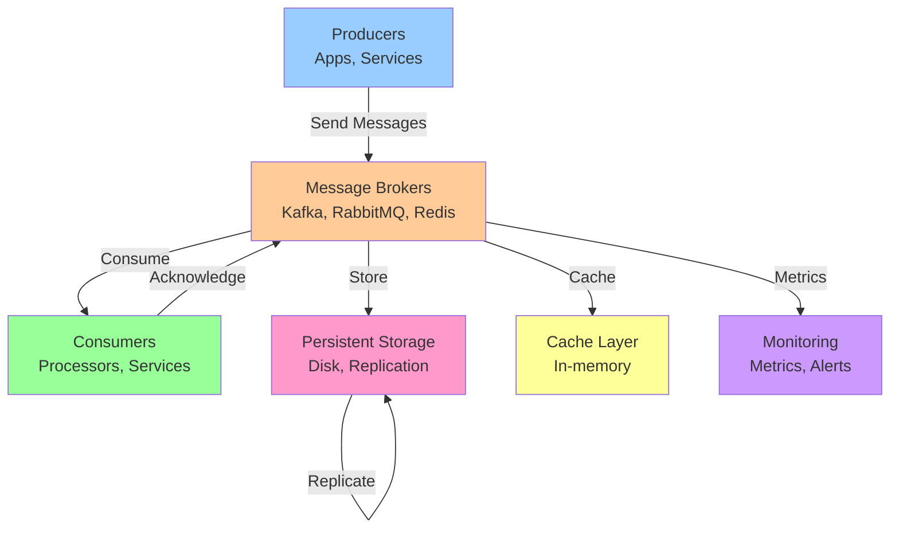

## System Overview

**Scale Metrics:**
- **Throughput:** 1M+ events/sec, sub-second processing latency
- **Key Components:** Topology, State stores, Windows, Interactive queries
- **Primary Use Case:** Stream processing, real-time transformations, aggregations

## Problem Statement

### Functional Requirements
- Process and transform real-time streams using stateless and stateful operations
- Maintain local state stores (RocksDB) co-located with stream partitions
- Support windowed aggregations with tumbling, hopping, and sliding windows
- Handle out-of-order events using event-time semantics and watermarks
- Provide exactly-once processing guarantees end-to-end

### Non-Functional Requirements
- **Latency:** P99 < 100ms (depends on system type)
- **Throughput:** 1M+ messages/sec (variable by system)
- **Availability:** 99.99% uptime
- **Consistency:** Exactly-once or at-least-once (configurable)
- **Scalability:** Handle 10x growth seamlessly

## Architecture

### High-Level Design



### Core Components

#### Message Broker
- **Function:** Store, manage, and distribute messages
- **Implementations:** Kafka, RabbitMQ, Redis, AWS SQS, GCP Pub/Sub
- **Key Features:** Persistence, replication, partitioning, consumer groups

#### Producers
- **Function:** Send messages to broker
- **Patterns:** Synchronous, asynchronous, batched
- **Concerns:** Acknowledgments, retries, compression

#### Consumers
- **Function:** Receive and process messages
- **Patterns:** Pull vs push, concurrent processing, batch consumption
- **Concerns:** Offset management, lag, ordering, error handling

#### State Management
- **Function:** Track consumer progress and processed messages
- **Approaches:** Offset storage, deduplication cache, exactly-once semantics
- **Storage:** External databases, broker-internal stores

## Data Flow Scenarios

### Scenario 1: Message Publishing
1. Producer sends message with optional key
2. Broker receives and writes to disk
3. Broker replicates to replica nodes
4. Broker acknowledges to producer
5. Message available to consumers

### Scenario 2: Message Consumption
1. Consumer requests messages (pull) or receives (push)
2. Broker delivers batch of messages
3. Consumer processes message
4. Consumer sends acknowledgment
5. Broker updates offset

### Scenario 3: Consumer Group Rebalancing
1. New consumer joins group
2. Broker triggers rebalancing
3. Partitions reassigned to consumers
4. Consumers reset offsets
5. Processing resumes with new distribution

## Scalability Strategies

### Broker Scaling

**Horizontal Scaling:**
- Add broker nodes to cluster
- Distribute partitions across nodes
- Automatic rebalancing
- Increases throughput and fault tolerance

**Vertical Scaling:**
- Increase CPU, memory, disk
- Better compression, faster processing
- Limited by single-node hardware

### Partition Strategy

**Key Selection:**
- Hash-based: Distribute evenly across partitions
- Range-based: Ordered partitions for range queries
- Custom: Domain-specific partitioning logic

**Rebalancing:**
- Add partitions when single partition becomes hot
- Split hot partitions across multiple nodes
- Monitor per-partition throughput

### Consumer Scaling

**Parallel Consumption:**
- One consumer per partition (max)
- Multiple threads per consumer
- Consumer groups distribute load

**Handling Slow Consumers:**
- Increase consumer instances
- Optimize processing logic
- Use faster hardware
- Implement timeout and skip

## High Availability & Reliability

### Replication Strategy

**In-Broker Replication:**
- Multiple copies per partition
- Leader handles writes
- Followers handle reads
- Automatic failover on leader failure

**Cross-Datacenter Replication:**
- Async replication to backup region
- RTO/RPO tradeoffs
- Active-active or active-passive

### Failure Scenarios

**Broker Failure:**
- Detection: Health checks, heartbeats
- Recovery: Replica promotion, partition rebalancing
- Time: 10-30 seconds

**Network Partition:**
- Split-brain scenarios
- Quorum-based decisions
- Consistency vs availability tradeoffs

**Message Loss Prevention:**
- Ack=all (all replicas)
- Min.insync.replicas = 2+
- Periodic backups
- Point-in-time recovery

## Data Consistency

### Delivery Semantics

**At-Most-Once:**
- No duplicates, possible message loss
- Fastest, least reliable
- Use: Non-critical events

**At-Least-Once:**
- No message loss, possible duplicates
- Requires idempotency
- Use: Most applications

**Exactly-Once:**
- No loss, no duplicates
- Slowest, most reliable
- Use: Financial, critical operations

### Ordering Guarantees

**Per-Partition:**
- Single partition = strict ordering
- Trade-off: Limited parallelism

**Per-Key:**
- Hash key to partition
- All messages for key go to same partition
- Enables parallel processing with ordering

**Global Ordering:**
- Single partition (no parallelism)
- Very expensive to maintain
- Usually not needed

## Performance Optimization

### Throughput Optimization

**Batching:**
- Linger time: Wait up to X ms for batch
- Batch size: Send when batch reaches N messages
- Compression: Reduce network bandwidth
- Impact: 10-100x throughput improvement

**Connection Pooling:**
- Reuse connections (don't create per request)
- Reduces overhead, improves latency
- Improves CPU efficiency

**Async Processing:**
- Non-blocking sends
- Pipelining: Multiple in-flight requests
- Callbacks for acknowledgments

### Latency Optimization

**Local Caching:**
- Cache hot messages in memory
- Reduces broker round trips
- Configurable TTL

**Network Optimization:**
- Co-locate producers/brokers
- Reduce network hops
- Multiple broker replicas per region

**Codec Selection:**
- No compression: Fastest
- Snappy: Good compression ratio, fast
- GZIP: Best compression, slower
- LZ4: Fast, moderate compression

## Security

### Authentication & Authorization

**SASL/SSL:**
- Username/password authentication
- Mutual TLS for transport security
- ACLs for topic access control

**OAuth2:**
- Token-based authentication
- Integration with identity providers
- Fine-grained authorization

### Encryption

**In Transit:**
- TLS 1.3 for all connections
- Certificate pinning for sensitive clients

**At Rest:**
- Disk encryption
- Key management (KMS)
- Per-message encryption

### Compliance

**GDPR:**
- Message retention policies
- Right to deletion
- Data residency requirements

**PCI-DSS:**
- Encryption for payment data
- Access controls
- Audit logging

## Monitoring & Observability

### Key Metrics

**Throughput:**
- Messages/sec
- Bytes/sec
- Partition lag

**Latency:**
- End-to-end latency
- Broker latency
- Consumer processing time

**Reliability:**
- Replication lag
- Broker availability
- Message loss events

### Alerting

- Alert on consumer lag > threshold
- Alert on broker latency > P99 target
- Alert on replication lag
- Alert on broker unavailability

### Tracing

- Distributed tracing per message
- Correlation IDs
- Performance bottleneck identification

## Technology Stack

| Component | Options | Recommendation |
|-----------|---------|-----------------|
| **Broker** | Kafka, RabbitMQ, Redis, Pulsar, NATS | Kafka for scalability, RabbitMQ for reliability |
| **Storage** | Disk, Cloud Object Storage | Local disk (fast), S3 for cold storage |
| **Serialization** | Avro, Protobuf, JSON | Avro/Protobuf (schema, compression) |
| **Client Library** | Producer, Consumer SDKs | Official language-specific SDKs |
| **Schema Registry** | Confluent, AWS Glue | Confluent (mature, widely adopted) |
| **Monitoring** | Prometheus, Grafana, DataDog | Prometheus + Grafana (open source) |
| **Orchestration** | Kubernetes, Docker Compose | Kubernetes (production scale) |

## Capacity Planning

### Resource Estimation

**Broker Resources (per 1M msg/sec):**
- CPU: 8+ cores
- Memory: 32GB+ (depends on cache)
- Disk: Depends on retention (100GB+ per day)
- Network: 1+ Gbps

**Consumer Resources (processing 1M msg/sec):**
- CPU: 4-8 cores
- Memory: 16GB+
- Throughput: Process 100K-1M msg/sec per instance

### Cost Calculation

**Broker Costs:**
- Infrastructure: $5K-20K/month for 1M msg/sec
- Storage: $0.10/GB/month (AWS S3 pricing)
- Network egress: $0.12/GB

**Total Monthly Cost:**
- Typical: $10K-50K for mid-scale system
- Large scale: $100K-1M+ per month

## Lessons Learned

1. **Consumer Groups are Powerful:** Use them for scalability and fault tolerance, not just load balancing

2. **Exactly-Once is Expensive:** Use at-least-once with idempotency for most use cases

3. **Consumer Lag is Critical:** Monitor it religiously—it's your early warning system

4. **Partitioning Strategy Matters:** Poor key selection creates hot partitions and limits scalability

5. **Monitoring is Non-Optional:** Without visibility, operational issues become crises

## Common Interview Questions

1. **Design a scalable message queue for 1M messages/sec**
   - Discuss partitioning, replication, consumer groups
   - Address failure scenarios and recovery
   - Explain consistency tradeoffs

2. **How would you handle exactly-once delivery?**
   - Idempotency keys, deduplication, transactions
   - Cost vs benefit analysis
   - Real-world examples (payment systems)

3. **What happens when a consumer fails?**
   - Rebalancing, offset management
   - Recovery procedures
   - Time to recovery

4. **How do you scale a slow consumer?**
   - Add more instances
   - Optimize processing logic
   - Consider batching or windowing
   - Monitor and alert on lag

5. **Design a system with per-message ordering**
   - Key selection, partition strategy
   - Tradeoffs with throughput
   - Alternative approaches

6. **How would you migrate from one broker to another?**
   - Dual writes, validation, cutover
   - Downtime minimization
   - Rollback strategy

## Related Systems

- **Kafka** → For high-throughput, scalable event streaming
- **RabbitMQ** → For reliable, complex message routing
- **Redis Streams** → For fast, simple event streaming
- **AWS Kinesis** → For managed, AWS-integrated streaming
- **GCP Pub/Sub** → For serverless, GCP-integrated messaging

---

**Difficulty:** Intermediate
**Time to Master:** 2-4 weeks
**Prerequisite Knowledge:** Distributed systems, message queues
**Common in Interviews:** Yes - Medium to Hard


## Code Implementation

### Python
```python
from kafka import KafkaProducer, KafkaConsumer
import json, time
from typing import Any

class EventProducer:
    """Kafka producer with serialization and retry."""
    def __init__(self, bootstrap_servers: str = "localhost:9092"):
        self.producer = KafkaProducer(
            bootstrap_servers=bootstrap_servers,
            value_serializer=lambda v: json.dumps(v).encode(),
            key_serializer=lambda k: k.encode() if k else None,
            acks="all",                  # wait for all replicas
            retries=3,
            batch_size=16384,            # 16KB batch
            linger_ms=5,                 # wait 5ms to batch
        )

    def send(self, topic: str, key: str, event: dict[str, Any]) -> None:
        future = self.producer.send(topic, key=key, value=event)
        record = future.get(timeout=10)  # block until acknowledged
        print(f"Sent to {record.topic}:{record.partition}@{record.offset}")

class EventConsumer:
    """Kafka consumer with manual offset commit for reliability."""
    def __init__(self, topics: list[str], group_id: str):
        self.consumer = KafkaConsumer(
            *topics,
            bootstrap_servers="localhost:9092",
            group_id=group_id,
            auto_offset_reset="earliest",
            enable_auto_commit=False,    # manual commit for at-least-once
            value_deserializer=lambda m: json.loads(m.decode()),
        )

    def run(self) -> None:
        for msg in self.consumer:
            try:
                self.process(msg.value)
                self.consumer.commit()   # commit only after successful processing
            except Exception as e:
                print(f"Failed: {e}")   # dead-letter queue in production

    def process(self, event: dict) -> None:
        print(f"Processing: {event}")
```

### Java
```java
import org.apache.kafka.clients.producer.*;
import org.apache.kafka.clients.consumer.*;
import java.util.*;

public class KafkaExample {

    // ── Producer ────────────────────────────────────────────────────────────
    public static KafkaProducer<String, String> createProducer() {
        Properties props = new Properties();
        props.put(ProducerConfig.BOOTSTRAP_SERVERS_CONFIG, "localhost:9092");
        props.put(ProducerConfig.KEY_SERIALIZER_CLASS_CONFIG,
                  "org.apache.kafka.common.serialization.StringSerializer");
        props.put(ProducerConfig.VALUE_SERIALIZER_CLASS_CONFIG,
                  "org.apache.kafka.common.serialization.StringSerializer");
        props.put(ProducerConfig.ACKS_CONFIG, "all");      // durability
        props.put(ProducerConfig.RETRIES_CONFIG, 3);
        return new KafkaProducer<>(props);
    }

    public static void sendEvent(KafkaProducer<String, String> producer,
                                  String topic, String key, String value) {
        ProducerRecord<String, String> record = new ProducerRecord<>(topic, key, value);
        producer.send(record, (metadata, ex) -> {
            if (ex != null) ex.printStackTrace();
            else System.out.printf("Sent %s:%d@%d%n",
                    metadata.topic(), metadata.partition(), metadata.offset());
        });
    }

    // ── Consumer ────────────────────────────────────────────────────────────
    public static KafkaConsumer<String, String> createConsumer(String groupId) {
        Properties props = new Properties();
        props.put(ConsumerConfig.BOOTSTRAP_SERVERS_CONFIG, "localhost:9092");
        props.put(ConsumerConfig.GROUP_ID_CONFIG, groupId);
        props.put(ConsumerConfig.AUTO_OFFSET_RESET_CONFIG, "earliest");
        props.put(ConsumerConfig.ENABLE_AUTO_COMMIT_CONFIG, false); // manual commit
        props.put(ConsumerConfig.KEY_DESERIALIZER_CLASS_CONFIG,
                  "org.apache.kafka.common.serialization.StringDeserializer");
        props.put(ConsumerConfig.VALUE_DESERIALIZER_CLASS_CONFIG,
                  "org.apache.kafka.common.serialization.StringDeserializer");
        return new KafkaConsumer<>(props);
    }
}
```

## Back-of-the-Envelope Calculations

**Throughput:**
- Kafka throughput per broker: 100MB/sec write
- 1KB messages → 100K msgs/sec per broker
- 10 brokers → 1M msgs/sec cluster throughput
- At 500B messages/day: 500B / 86400 = ~5.8M msgs/sec peak

**Storage:**
- 1M msgs/sec × 1KB = 1GB/sec raw
- 7-day retention: 7 × 86400 × 1GB = 604TB
- With 3x replication: 1.8PB total
- Compression (3:1): reduces to 600TB

**Latency:**
- Produce (acks=1): <5ms p99
- End-to-end (produce → consume): 10-20ms typical
## Follow-up Questions

1. **How would you handle this at 10x the scale described?**
   - What breaks first? (typically: single DB, single cache node, single region)
   - What architectural changes are required?

2. **What are the consistency vs. availability trade-offs in your design?**
   - Where did you accept eventual consistency?
   - Which operations require strong consistency and why?

3. **How would you debug a sudden latency spike in production?**
   - What metrics would you look at first?
   - What's your runbook for the top 3 likely causes?

4. **How does your design handle partial failures?**
   - What happens if one component is slow (not down)?
   - How do you prevent cascading failures?

5. **What would you change if you had to build this in one week vs. six months?**
   - What corners can safely be cut initially?
   - What must be right from day one?

6. **How would you migrate from the current design to a better one without downtime?**
   - What's the strangler-fig or blue-green strategy here?
   - How do you validate correctness during migration?