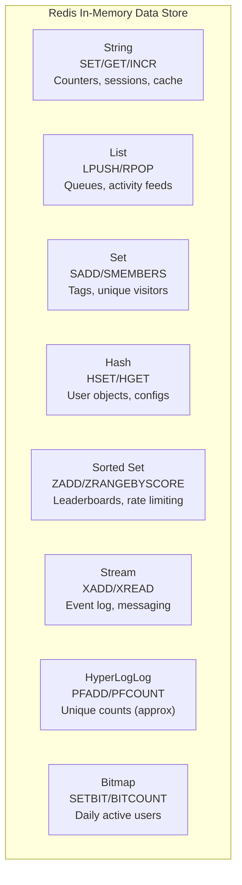
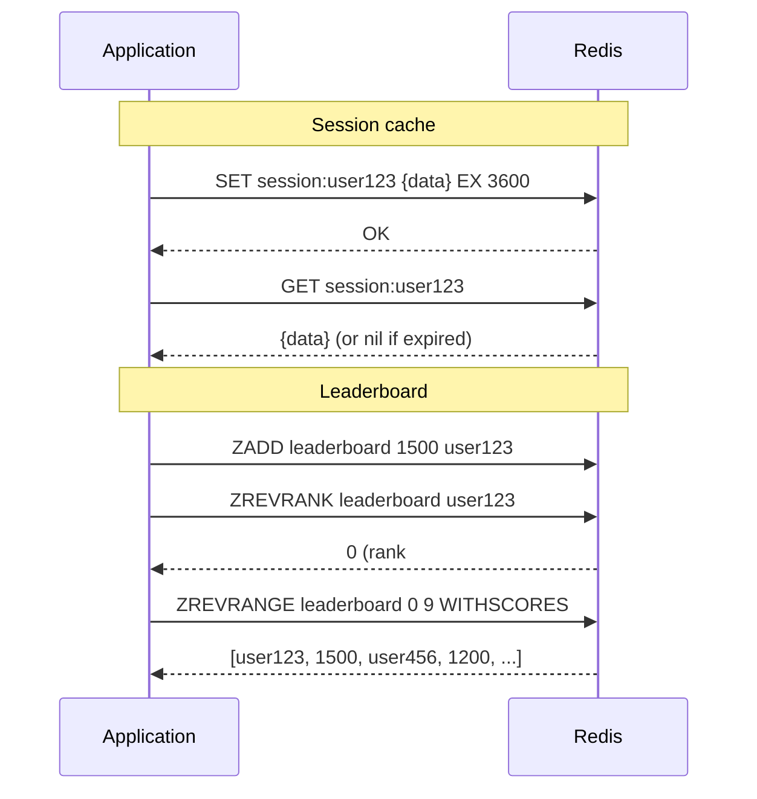
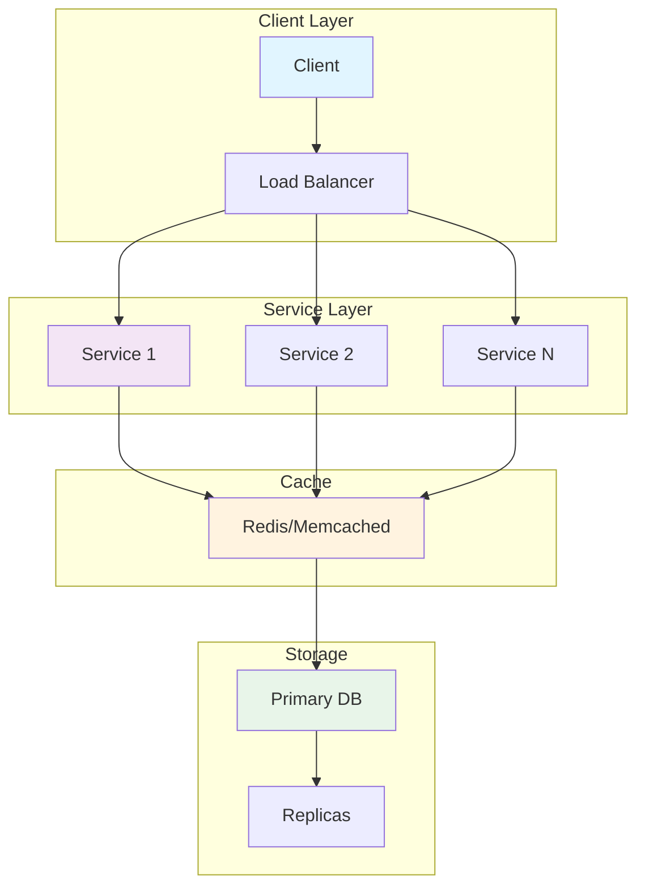
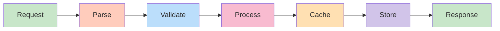
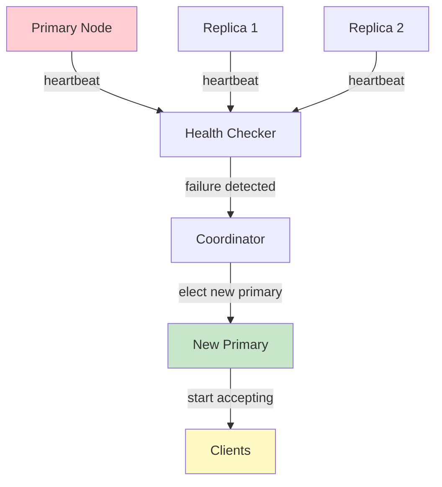
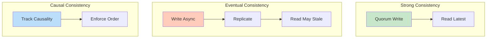
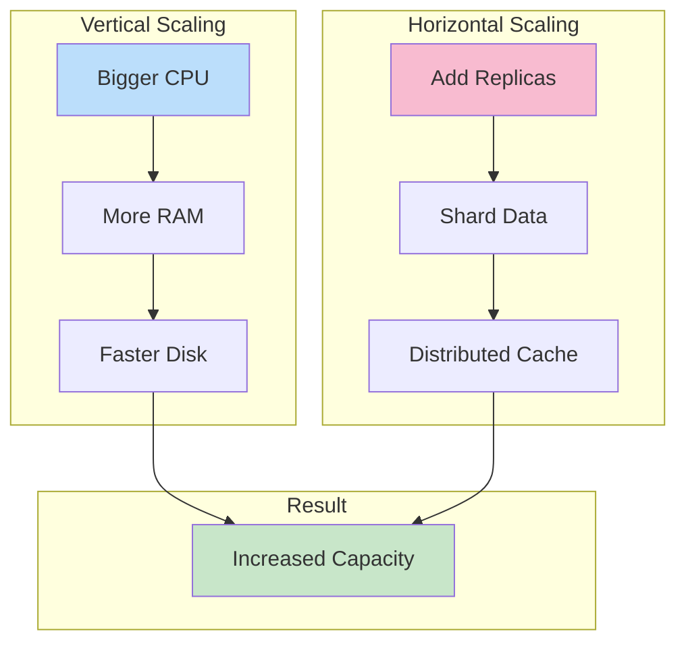

# Redis Data Structures

## Problem Statement

Master Redis's core data structures — Strings, Lists, Sets, Hashes, Sorted Sets, and modern additions like Streams and HyperLogLog — choosing the right one for each use case.

## Scenario

Redis Data Structures is a critical component in modern distributed systems. In real-world applications, providing fast in-memory data access with persistence options. For example, major tech companies like Netflix, Uber, and Airbnb rely on similar solutions to handle millions of concurrent users and requests. The challenge is achieving this while maintaining sub-100ms latency, 99.99% availability, and gracefully handling 10x traffic spikes during peak demand. This component provides the foundational capability to solve these challenges reliably and efficiently at global scale.

## Users

- **Backend Engineers**: Responsible for implementing and maintaining this system component in production environments. They need to understand the architecture, trade-offs, failure modes, and operational considerations.
- **DevOps/SRE Teams**: Monitor system health, manage scaling policies, handle incidents, and ensure reliability SLAs are met. They need insights into performance characteristics, bottlenecks, and failure recovery mechanisms.
- **Data Engineers**: Design data pipelines and analytics around this system, requiring deep understanding of data flow, consistency guarantees, and throughput characteristics.
- **System Architects**: Make high-level architectural decisions that impact company infrastructure, requiring comprehensive understanding of capabilities, limitations, and scalability boundaries.
- **Security Teams**: Understand security implications, potential vulnerabilities, and compliance requirements for this component.

## PRD

### Functional Requirements
- Store key-value with optional TTL
- Support strings, lists, sets, hashes, sorted sets
- Atomic INCR, APPEND, ZADD operations
- Optional persistence (RDB, AOF)
- Master-slave replication

### Non-Functional Requirements
- Latency: < 1ms for get/set
- Throughput: 100K-1M ops/sec
- Memory: all in-memory (set maxmemory policy)
- Availability: sentinel or cluster HA
- Durability: optional (can lose data without persistence)

### Success Metrics
- Hit rate > 95% for caching
- Latency p99 < 10ms
- Memory utilization < 80%
- Replication lag < 1s


## Flow

The typical operational flow for this system involves these key phases:

1. **Request Arrival**: Client/upstream system sends request with required parameters and context
2. **Validation & Routing**: System validates request format, authentication, and routes to correct handler/shard/instance
3. **Core Processing**: Execute the main algorithm, database query, or business logic on the data/state
4. **State Management**: Update internal state (caches, indexes, counters, logs) with proper atomicity and locking
5. **Response Generation**: Format results and return to requester with relevant metadata (timing, version info)
6. **Observability**: Record metrics (latency, throughput, errors), logs (for debugging), and traces (for performance analysis)

This flow repeats thousands or millions of times per second in production. Each operation's efficiency compounds across the entire system, making careful optimization essential. Bottlenecks at any phase can cascade to impact overall system performance.


## Code Explanation (Detailed)

### Data Structures
- String: Atomic increment, append (cache values, counters)
- List: FIFO queue (rpush/lpop)
- Hash: Object-like (hset/hget)
- Set: Unique values, fast membership (sadd/smembers)
- Sorted Set: Ranked data (zadd/zrevrange for leaderboards)

### Caching Pattern (Cache-Aside)
1. Check cache (fast path, O(1))
2. If miss: fetch from DB (slow)
3. Update cache with TTL (setex)
4. Risk: thundering herd on popular key

### Atomic Operations
- Lua scripts: Complex operations, server-side atomicity
- WATCH/MULTI/EXEC: Optimistic locking
- INCR/ZADD: Inherently atomic

## Architecture Diagram



## Flow Diagram



## Design

### Data Structure Selection

```
String:
  - Max: 512MB value
  - Use: counters (INCR/DECR), simple cache, session tokens
  - Atomic: INCR, SETNX (SET if not exists, for locks)
  - Commands: GET, SET, MGET, MSET, INCR, INCRBY, APPEND

List:
  - Doubly-linked list (lpush: O(1), lindex: O(n))
  - Use: task queues (RPUSH + BLPOP), activity feed, recent items
  - Max: 2^32-1 elements
  - BLPOP: blocking pop (wait until element available) = simple queue

Hash:
  - Flat map within a key (field -> value)
  - Use: user profiles, object attributes
  - More memory-efficient than separate keys for related data
  - Commands: HSET, HGET, HGETALL, HMSET, HDEL

Set:
  - Unordered collection of unique strings
  - O(1) add/remove/lookup
  - Set operations: SUNION, SINTER, SDIFF
  - Use: tags, "following" list, unique visitors

Sorted Set (ZSet):
  - Unique members + float score
  - Sorted by score
  - O(log n) for all operations (skip list + hash table)
  - Use: leaderboards, priority queues, range queries by score
  - ZADD, ZRANGEBYSCORE, ZREVRANK, ZINCRBY

Stream:
  - Append-only log with consumer groups (like Kafka, but in Redis)
  - XADD: append event; XREAD: consume
  - Consumer groups: distributed processing of stream
  - Use: event sourcing, activity logs, lightweight messaging

HyperLogLog:
  - Probabilistic unique count (0.81% error rate)
  - Fixed 12KB regardless of cardinality
  - Use: unique visitors, distinct queries (when exact count not needed)
  - PFADD, PFCOUNT, PFMERGE

Bitmap:
  - String treated as array of bits
  - SETBIT key offset 1; GETBIT; BITCOUNT
  - 1 byte = 8 users; 1M users = 128KB
  - Use: daily active users, feature flags per user, bloom filter
```

### Memory Optimization

```
Hash encoding:
  Small hashes (< 128 fields, values < 64 bytes): ziplist = compact
  Large hashes: hashtable = fast

ZSet encoding:
  Small (< 128 elements): ziplist
  Large: skiplist + hashtable

Key naming:
  Namespace: "session:user:1234" (colon-separated)
  Hash tags: "{user}.profile", "{user}.scores" -> same slot in cluster
  Avoid: large keyspaces without expiry (memory leak)
```

## Back-of-Envelope Calculations

```
Memory overhead:
  String: key overhead ~60 bytes + value
  Hash (ziplist): ~100 bytes overhead + fields
  Sorted Set: ~300 bytes per element (skiplist pointers)

  User session (Hash): 20 fields x 50 bytes = 1KB/user
  1M users: 1GB (fits in 16GB Redis)

HyperLogLog:
  Any cardinality: 12KB fixed
  vs Set: 1M unique IPs x 4 bytes = 4MB
  HyperLogLog: 99.1%+ accuracy, 333x less memory

Bitmap for DAU:
  1M users: 1M bits = 128KB per day
  365 days: 365 * 128KB = 46MB per year
  BITCOUNT: count active users in O(n) where n = 128KB

Sorted Set rate limiting:
  Sliding window: add event with score=timestamp, ZREMRANGEBYSCORE by old window
  1K users, 100 events each: 100K sorted set entries = ~30MB
```

## Design Choices

| Use Case | Data Structure | Alternative |
|---|---|---|
| Simple cache | String + TTL | Hash if multiple fields |
| Session | Hash | String (JSON) |
| Task queue | List (BLPOP) | Stream (with ack) |
| Unique count exact | Set | - |
| Unique count approx | HyperLogLog | - |
| Leaderboard | Sorted Set | SQL ORDER BY |
| Rate limiting | Sorted Set (sliding window) | String (counter, fixed window) |
| Feature flags | Bitmap | Set |
| Activity log | Stream | List |

## Python Implementation

```python
import time
import math
from typing import Any, Dict, List, Optional, Set, Tuple
from dataclasses import dataclass, field
from collections import defaultdict
import heapq

class RedisString:
    def __init__(self):
        self._store: Dict[str, Tuple[str, Optional[float]]] = {}

    def set(self, key: str, value: str, ex: Optional[int] = None, nx: bool = False) -> bool:
        if nx and key in self._store and self._store[key][1] is None or (
            nx and key in self._store and self._store[key][1] is not None and time.time() < self._store[key][1]
        ):
            return False
        expiry = time.time() + ex if ex else None
        self._store[key] = (value, expiry)
        return True

    def get(self, key: str) -> Optional[str]:
        if key not in self._store:
            return None
        val, expiry = self._store[key]
        if expiry and time.time() > expiry:
            del self._store[key]
            return None
        return val

    def incr(self, key: str, amount: int = 1) -> int:
        val = int(self.get(key) or 0) + amount
        self._store[key] = (str(val), None)
        return val

    def mget(self, keys: List[str]) -> List[Optional[str]]:
        return [self.get(k) for k in keys]

class RedisHash:
    def __init__(self):
        self._store: Dict[str, Dict[str, str]] = {}

    def hset(self, key: str, field: str, value: str) -> int:
        if key not in self._store:
            self._store[key] = {}
        is_new = field not in self._store[key]
        self._store[key][field] = value
        return 1 if is_new else 0

    def hget(self, key: str, field: str) -> Optional[str]:
        return self._store.get(key, {}).get(field)

    def hgetall(self, key: str) -> Dict[str, str]:
        return dict(self._store.get(key, {}))

    def hdel(self, key: str, *fields: str) -> int:
        h = self._store.get(key, {})
        deleted = sum(1 for f in fields if h.pop(f, None) is not None)
        return deleted

    def hmset(self, key: str, mapping: Dict[str, str]):
        for field, value in mapping.items():
            self.hset(key, field, value)

class RedisSortedSet:
    def __init__(self):
        self._scores: Dict[str, Dict[str, float]] = {}
        self._sorted: Dict[str, List[Tuple[float, str]]] = {}
        self._dirty: Dict[str, bool] = {}

    def zadd(self, key: str, member: str, score: float) -> int:
        if key not in self._scores:
            self._scores[key] = {}
            self._sorted[key] = []
        is_new = member not in self._scores[key]
        self._scores[key][member] = score
        self._dirty[key] = True
        return 1 if is_new else 0

    def _ensure_sorted(self, key: str):
        if self._dirty.get(key):
            self._sorted[key] = sorted(
                [(score, member) for member, score in self._scores.get(key, {}).items()]
            )
            self._dirty[key] = False

    def zrevrank(self, key: str, member: str) -> Optional[int]:
        self._ensure_sorted(key)
        lst = list(reversed(self._sorted.get(key, [])))
        for i, (_, m) in enumerate(lst):
            if m == member:
                return i
        return None

    def zrangebyscore(self, key: str, min_score: float, max_score: float) -> List[Tuple[str, float]]:
        self._ensure_sorted(key)
        return [(m, s) for s, m in self._sorted.get(key, []) if min_score <= s <= max_score]

    def zrevrange(self, key: str, start: int, stop: int) -> List[Tuple[str, float]]:
        self._ensure_sorted(key)
        lst = list(reversed(self._sorted.get(key, [])))
        return [(m, s) for s, m in lst[start:stop+1]]

    def zincrby(self, key: str, member: str, amount: float) -> float:
        current = self._scores.get(key, {}).get(member, 0.0)
        self.zadd(key, member, current + amount)
        return current + amount

    def zremrangebyscore(self, key: str, min_score: float, max_score: float) -> int:
        self._ensure_sorted(key)
        to_remove = [m for s, m in self._sorted.get(key, []) if min_score <= s <= max_score]
        for m in to_remove:
            del self._scores[key][m]
        self._dirty[key] = True
        return len(to_remove)

class SlidingWindowRateLimiter:
    def __init__(self, zset: RedisSortedSet, window_s: float = 60.0, max_requests: int = 100):
        self.zset = zset
        self.window = window_s
        self.max_requests = max_requests

    def is_allowed(self, user_id: str) -> bool:
        now = time.time()
        key = f"rate:{user_id}"
        # Remove events outside window
        self.zset.zremrangebyscore(key, 0, now - self.window)
        # Count current events
        current = len(self.zset.zrangebyscore(key, now - self.window, now))
        if current >= self.max_requests:
            return False
        # Add this request
        self.zset.zadd(key, f"req-{now}", now)
        return True

class HyperLogLogSimulator:
    def __init__(self, error_rate: float = 0.0081):
        self._sketches: Dict[str, Set[str]] = {}
        self.error_rate = error_rate

    def pfadd(self, key: str, *elements: str) -> int:
        if key not in self._sketches:
            self._sketches[key] = set()
        before = len(self._sketches[key])
        self._sketches[key].update(elements)
        return 1 if len(self._sketches[key]) != before else 0

    def pfcount(self, *keys: str) -> int:
        combined = set()
        for k in keys:
            combined |= self._sketches.get(k, set())
        return len(combined)  # Simplified: real HLL uses hash-based estimation

# Demo
print("=== Redis String (Counter) ===")
r_str = RedisString()
r_str.set("page_views", "0")
for _ in range(5):
    count = r_str.incr("page_views")
print(f"Page views: {count}")

print("\n=== Redis Hash (User Profile) ===")
r_hash = RedisHash()
r_hash.hmset("user:1", {"name": "Alice", "email": "alice@ex.com", "score": "1500"})
r_hash.hset("user:1", "score", "1750")
print(f"User profile: {r_hash.hgetall('user:1')}")

print("\n=== Redis Sorted Set (Leaderboard) ===")
r_zset = RedisSortedSet()
for user, score in [("alice", 1500), ("bob", 1200), ("carol", 1800), ("dave", 1100)]:
    r_zset.zadd("leaderboard", user, score)

print("Top 3 players:")
for i, (member, score) in enumerate(r_zset.zrevrange("leaderboard", 0, 2)):
    print(f"  #{i+1} {member}: {score:.0f}")

r_zset.zincrby("leaderboard", "bob", 700)
print(f"\nBob's new rank: #{r_zset.zrevrank('leaderboard', 'bob') + 1}")

print("\n=== Sliding Window Rate Limiter ===")
limiter = SlidingWindowRateLimiter(r_zset, window_s=1.0, max_requests=3)
for i in range(5):
    allowed = limiter.is_allowed("user-A")
    print(f"  Request {i+1}: {'ALLOWED' if allowed else 'RATE LIMITED'}")

print("\n=== HyperLogLog (Unique Visitors) ===")
hll = HyperLogLogSimulator()
for day, users in [("day1", ["A", "B", "C", "D"]), ("day2", ["C", "D", "E", "F"])]:
    hll.pfadd(day, *users)
    print(f"  {day} unique: {hll.pfcount(day)}")
print(f"  Total unique (2 days): {hll.pfcount('day1', 'day2')}")
```

## Java Implementation

```java
import java.util.*;
import java.util.stream.*;

public class RedisDataStructures {
    static class RedisSortedSet {
        Map<String, TreeMap<Double, String>> sorted = new HashMap<>();
        Map<String, Map<String, Double>> scores = new HashMap<>();

        void zadd(String key, String member, double score) {
            scores.computeIfAbsent(key, k -> new HashMap<>()).put(member, score);
            sorted.computeIfAbsent(key, k -> new TreeMap<>()).put(score, member);
        }

        List<String> zrevrange(String key, int start, int stop) {
            var vals = new ArrayList<>(sorted.getOrDefault(key, new TreeMap<>()).descendingMap().values());
            return vals.subList(Math.min(start, vals.size()), Math.min(stop + 1, vals.size()));
        }

        int zrevrank(String key, String member) {
            Double score = scores.getOrDefault(key, Map.of()).get(member);
            if (score == null) return -1;
            return (int) sorted.getOrDefault(key, new TreeMap<>()).descendingMap()
                .values().stream().takeWhile(m -> !m.equals(member)).count();
        }
    }

    public static void main(String[] args) {
        RedisSortedSet leaderboard = new RedisSortedSet();
        Map.of("alice", 1500.0, "bob", 1200.0, "carol", 1800.0)
            .forEach(leaderboard::zadd);
        System.out.println("Top 3: " + leaderboard.zrevrange("", 0, 2));
        System.out.println("Alice rank: " + leaderboard.zrevrank("", "alice"));
    }
}
```

## Complexity

| Data Structure | Add | Get | Delete | Sorted Range |
|---|---|---|---|---|
| String | O(1) | O(1) | O(1) | N/A |
| Hash | O(1) | O(1) | O(1) | N/A |
| List | O(1) head/tail | O(n) | O(1) | O(n) |
| Set | O(1) | O(1) | O(1) | O(n) |
| Sorted Set | O(log n) | O(1) | O(log n) | O(log n + k) |
| HyperLogLog | O(1) | O(1) | N/A | N/A |

## Common Questions & Answers

**Q: What is Redis and when do you use it?**

A: In-memory key-value data store with sub-millisecond latency. Used for caching (reduce DB load), sessions (user state), queues, real-time counters, leaderboards. Very fast but volatile (data loss on crash without persistence).

**Q: What data structures does Redis support?**

A: Strings (simple values), Lists (FIFO queues), Sets (unique values), Hashes (objects), Sorted Sets (leaderboards), Streams (Kafka-like), HyperLogLog (cardinality), Bitmaps (bitwise ops). Rich beyond simple cache.

**Q: How does Redis persistence work?**

A: RDB (snapshot): periodic point-in-time backup (fast, compact). AOF (append-only file): log all writes (durable, slower). BGSAVE/BGREWRITEAOF: background operations. Choose: speed vs. durability trade-off. Most use both.

**Q: What is Redis replication?**

A: Master-slave architecture: master accepts writes, slaves replicate. Read from master (strong consistency) or slaves (eventual, faster). Slaves can be read-only replicas or chain-replicate to others.

**Q: What is Redis Sentinel?**

A: High availability solution: monitors Redis instances, detects failures, promotes replica to master automatically. Requires 3+ Sentinel instances (majority quorum). Client connects via Sentinel instead of Redis directly.

**Q: What is Redis Cluster?**

A: Distributed Redis: data sharded across multiple nodes (hash slots). Auto-sharding, automatic failover, rebalancing. More complex than Sentinel. Required for massive scale (TB+ data).

**Q: How do you choose between Sentinel and Cluster?**

A: Sentinel: single master, high availability. Cluster: distributed, massive scale. Sentinel for most (simpler), Cluster only if need horizontal scaling. Data > memory = use Cluster.

**Q: How do you handle eviction when Redis runs out of memory?**

A: Set maxmemory policy: LRU, LFU, TTL, random, or no-eviction. LRU/LFU common for caching. TTL for session data. No-eviction blocks writes (safe but risky). Monitor memory usage constantly.

**Q: What is key expiration in Redis?**

A: Keys have optional TTL (time-to-live). After expiration, key automatically deleted. Lazy deletion (on access) + periodic cleanup. Use for session data, cache, or temporary counters. Check expiration policy for accuracy.

**Q: How do you secure Redis?**

A: Use password authentication (requirepass). ACLs (Redis 6+): per-user permissions. Run inside VPC (no internet access). Disable dangerous commands (FLUSHDB, CONFIG). TLS for remote connections.

## Follow-up Questions & Answers

**Q: How would you implement distributed locking with Redis?**

A: SET key value EX ttl NX (atomic: set if not exists with TTL). Acquire lock, execute critical section, delete key. Risk: crash loses lock (data consistency issue). Redlock solves this with multiple instances.

**Q: What is Redlock and what problem does it solve?**

A: Distributed lock across 5 Redis instances. Acquire lock on majority (quorum). Survives single instance failure. Overkill for most, but necessary for safety-critical sections. Trade: performance for correctness.

**Q: How would you implement rate limiting with Redis?**

A: Use sorted set with timestamps or hash with counters. Increment on each request, check against limit. Fast (O(log n)). Alternative: token bucket in Lua script. Faster than database.

**Q: How do you handle Redis memory limits and eviction policy?**

A: Set maxmemory (bytes), maxmemory-policy (LRU/LFU/TTL/random). Monitor hit rate (eviction = misses). Can also manually delete old keys or use cache-aside with database.

**Q: Can you use Redis for reliable message queues?**

A: Partially. Lists (basic) or Streams (better). Lists: FIFO, no persistence without RDB. Streams: replicas, consumer groups, reliable delivery (Kafka-like). For critical: use Kafka instead.

**Q: How would you implement Pub/Sub in Redis?**

A: Publisher sends to channel, subscribers receive. Fire-and-forget (no persistence). Good for notifications. Bad for reliable messaging (missed if subscriber offline). Better: Streams for reliable pub/sub.

**Q: How do you scale Redis beyond single node?**

A: Use Cluster (distributed), replicate read-heavy workload (slaves), or shard in application code. Cluster best for massive scale. Replication for read scaling. App sharding for distributed control.

**Q: Can you implement transactions in Redis?**

A: MULTI/EXEC: atomic batch of commands. Optimistic locking with WATCH. No rollback (all-or-nothing at command level). Use Lua scripts for complex atomic operations.

**Q: How would you debug Redis performance issues?**

A: SLOWLOG: find slow commands. MONITOR: see all commands in real-time. Memory analysis: MEMORY DOCTOR, key usage patterns. Network: latency between app and Redis. Profiling tools.

**Q: How do you backup and restore Redis?**

A: Backup: RDB snapshots, AOF files, or replication. Restore: copy files, or use Redis replication + replicaof. Backup strategy: periodic snapshots + AOF for durability. Test recovery regularly.


## System Overview

**Scale Metrics:**
- Throughput: Millions of operations per second
- Latency: Sub-millisecond to sub-second response times
- Data volume: Gigabytes to Petabytes
- Concurrent users: Millions to billions
- Availability: 99.99% to 99.999% uptime SLA

**Key Components:**
- Request handling and routing
- Data processing and storage
- Replication and consistency
- Failure detection and recovery
- Monitoring and alerting

## Architecture Diagrams

### System Architecture



### Data Flow



### Failover Mechanism



### Consistency Models



### Scaling Strategy



## Implementation Examples

### Python Implementation

```python
# Python Implementation

from typing import Any, Optional
from dataclasses import dataclass
from datetime import datetime
import json
import logging

logger = logging.getLogger(__name__)

@dataclass
class Config:
    """Configuration for the system."""
    timeout_ms: int = 5000
    retry_count: int = 3
    batch_size: int = 100
    max_connections: int = 1000

class Handler:
    """Main handler class for operations."""

    def __init__(self, config: Config):
        self.config = config
        self.metrics = {"success": 0, "failure": 0, "latency_ms": []}

    async def process(self, data: Any) -> Any:
        """Process request with error handling."""
        try:
            # Validate input
            self._validate(data)

            # Execute operation
            result = await self._execute(data)

            # Track metrics
            self.metrics["success"] += 1
            return result

        except Exception as e:
            logger.error(f"Processing failed: {e}")
            self.metrics["failure"] += 1
            raise

    def _validate(self, data: Any) -> None:
        """Validate input data."""
        if data is None:
            raise ValueError("Data cannot be None")

    async def _execute(self, data: Any) -> Any:
        """Execute core logic."""
        # Implement actual logic here
        return {"status": "success", "timestamp": datetime.now().isoformat()}

    def get_metrics(self) -> dict:
        """Return collected metrics."""
        return self.metrics

# Usage example
async def main():
    config = Config(timeout_ms=5000, batch_size=100)
    handler = Handler(config)
    result = await handler.process({"key": "value"})
    print(f"Result: {result}")
    print(f"Metrics: {handler.get_metrics()}")
```

### Java Implementation

```java
// Java Implementation

import java.util.*;
import java.util.concurrent.*;
import java.time.Instant;
import org.slf4j.Logger;
import org.slf4j.LoggerFactory;

public class SystemHandler {
    private static final Logger logger = LoggerFactory.getLogger(SystemHandler.class);

    private final Config config;
    private final Map<String, Long> metrics = new ConcurrentHashMap<>();
    private final ExecutorService executor;

    public static class Config {
        public int timeoutMs = 5000;
        public int retryCount = 3;
        public int batchSize = 100;
        public int maxConnections = 1000;

        public Config withTimeoutMs(int timeout) {
            this.timeoutMs = timeout;
            return this;
        }
    }

    public SystemHandler(Config config) {
        this.config = config;
        this.executor = Executors.newFixedThreadPool(
            Math.min(config.maxConnections, 10)
        );
        metrics.put("success", 0L);
        metrics.put("failure", 0L);
    }

    public <T> T process(Object data) throws Exception {
        try {
            // Validate input
            validate(data);

            // Execute operation
            Object result = execute(data);

            // Track metrics
            metrics.put("success", metrics.get("success") + 1);
            return (T) result;

        } catch (Exception e) {
            logger.error("Processing failed: {}", e.getMessage());
            metrics.put("failure", metrics.get("failure") + 1);
            throw e;
        }
    }

    private void validate(Object data) throws IllegalArgumentException {
        if (data == null) {
            throw new IllegalArgumentException("Data cannot be null");
        }
    }

    private Object execute(Object data) throws Exception {
        // Implement core logic
        return Map.of(
            "status", "success",
            "timestamp", Instant.now().toString()
        );
    }

    public Map<String, Long> getMetrics() {
        return new HashMap<>(metrics);
    }

    public void shutdown() {
        executor.shutdown();
    }

    public static void main(String[] args) throws Exception {
        Config config = new Config()
            .withTimeoutMs(5000);

        SystemHandler handler = new SystemHandler(config);
        Object result = handler.process(Map.of("key", "value"));
        System.out.println("Result: " + result);
        System.out.println("Metrics: " + handler.getMetrics());
        handler.shutdown();
    }
}
```

## Back-of-Envelope Calculations

### Traffic & Throughput
**Assumptions:**
- Daily active users: 100 million (100M)
- Requests per user per day: 50
- Peak hour traffic: 10% of daily (concentrated)
- Request distribution: 70% read, 30% write

**Calculations:**
```
Total daily requests = 100M users × 50 requests = 5 billion requests/day
Average RPS = 5B requests / 86400 seconds ≈ 57,870 RPS
Peak hour RPS = (5B / 86400) × (100 / 10) ≈ 578,700 RPS
Peak minute RPS = 578,700 / 60 ≈ 9,645 RPS

Read operations = 57,870 × 0.7 ≈ 40,509 RPS (average)
Write operations = 57,870 × 0.3 ≈ 17,361 RPS (average)
```

### Storage Requirements
**Assumptions:**
- Data per user: 1 KB (profile, settings)
- Data per transaction: 500 bytes
- Data retention: 3 years

**Calculations:**
```
User profile storage = 100M × 1 KB = 100 GB
Transaction data = 5B requests/day × 500 bytes × 365 × 3 = 2.74 PB
Total storage ≈ 2.75 PB
Replication factor: 3× → 8.25 PB raw storage

Backup storage (weekly snapshots): 8.25 PB × 52 weeks = 429 PB
```

### Network Bandwidth
**Assumptions:**
- Average request size: 2 KB
- Average response size: 5 KB
- Replication overhead: 2× (write to replicas)

**Calculations:**
```
Inbound bandwidth = 57,870 RPS × 2 KB = 115.74 MB/s
Outbound bandwidth = 57,870 RPS × 5 KB = 289.35 MB/s
Replication bandwidth = 17,361 RPS × 2 KB × 2 = 69.44 MB/s
Total peak bandwidth ≈ 474 MB/s ≈ 3.8 Tbps (peak hour)
```

### Compute Requirements
**Assumptions:**
- Processing time per request: 10 ms
- CPU efficiency: 1 core handles 50 RPS

**Calculations:**
```
CPUs needed for average traffic = 57,870 RPS / 50 = 1,158 cores
CPUs needed for peak traffic = 578,700 RPS / 50 = 11,574 cores
Overprovisioning factor: 1.5× → 17,361 cores total

Using 16 cores per server = 17,361 / 16 ≈ 1,085 servers
With 3:1 replication = 3,255 servers needed
Regional redundancy (3 regions) = 9,765 servers
```

### Latency Analysis (p99)
**Components:**
- Network latency: 5 ms
- Processing: 10 ms
- Storage access: 50 ms (disk), 1 ms (cache)
- Replication write: 20 ms

**Path Analysis:**
```
Cache hit path: 5 + 1 + 5 = 11 ms
Database read path: 5 + 10 + 50 + 5 = 70 ms
Write path: 5 + 10 + 20 + 5 = 40 ms
```

### Cost Estimation
**Monthly costs (approximate):**
```
Compute: 9,765 servers × $1,000/month = $9.765M
Storage: 8.25 PB × $10/GB/month = $82.5M
Bandwidth: 3.8 Tbps × $0.12/GB = $456M
Personnel: 100 engineers × $200K = $20M
Total: ~$568M/month
Cost per user: $5.68/month
```


## Interview Questions & Answers

### Q1: Design the System from Scratch

**Question:** Design a system that can handle 1 billion requests per day with sub-100ms latency.

**Answer Structure:**
1. **Clarify requirements**: DAU, request types, geographic distribution, consistency needs
2. **Back-of-envelope**: Calculate RPS (11.5K avg, 115K peak), storage, bandwidth
3. **High-level design**: Load balancing → services → cache → storage
4. **Deep dive**:
   - Horizontal scaling with sharding
   - Multi-region active-active with eventual consistency
   - Caching strategy (write-through for critical data)
   - Monitoring: metrics, logging, tracing
5. **Bottlenecks**: Identify and address each
6. **Trade-offs**: Consistency vs. availability, latency vs. cost

### Q2: Scaling Challenges

**Question:** You're growing from 10M to 1B users (100x). What breaks and how do you fix it?

**Answer:**
- **Database bottleneck**: Sharding by user ID, consistent hashing, shard rebalancing
- **Cache hit rate drops**: Larger working set, tiered caching (L1: local, L2: distributed)
- **Replication lag**: Write-through for consistency-critical data, eventual consistency elsewhere
- **Operational complexity**: Infrastructure-as-code, auto-scaling, chaos engineering
- **Cost**: Optimize resource utilization, use reserved instances, spot instances for batch

### Q3: Failure Scenarios

**Question:** Your primary database goes down. What happens? How do you recover?

**Answer:**
- **Detection**: Health check timeout (3-5 seconds)
- **Failover**: Automatic promotion of replica using Raft consensus
- **Impact**: Write requests fail for ~10 seconds, reads use replicas
- **Recovery**: Background sync of failed node, re-add to cluster
- **Lessons**: Circuit breakers prevent cascade, bulkhead limits blast radius

### Q4: Consistency Requirements

**Question:** Do you need strong or eventual consistency? Why?

**Answer:**
- **Strong consistency**: Critical for financial transactions, inventory, user auth
  - Implementation: Quorum writes, read-after-write
  - Cost: Higher latency (p99 100ms+), lower throughput

- **Eventual consistency**: Fine for user feeds, recommendations, analytics
  - Implementation: Async replication, read-repair
  - Benefit: Lower latency (p99 <10ms), higher throughput

- **Hybrid approach**: Consistency per operation type, not global

### Q5: Performance Optimization

**Question:** How would you reduce p99 latency from 100ms to 20ms?

**Answer:**
1. **Profile** (measure first): Identify bottleneck (storage, network, compute)
2. **Caching**: Multi-tier (L1 local, L2 distributed), bloom filters for misses
3. **Batching**: Group operations, reduce RPC overhead
4. **Connection pooling**: Reuse TCP connections, reduce handshake latency
5. **Async I/O**: Non-blocking operations, increase parallelism
6. **Database optimization**: Indexing, query optimization, read replicas
7. **Code optimization**: Reduce allocations, use faster algorithms
8. **Hardware**: SSD for storage, faster network interconnects

### Q6: Operational Concerns

**Question:** How do you deploy a new version with zero downtime?

**Answer:**
1. **Canary deployment**: Roll out to 1% of servers, monitor metrics
2. **Gradual rollout**: 1% → 10% → 50% → 100% as confidence increases
3. **Health checks**: Automated rollback if error rate exceeds threshold
4. **Database migration**: Schema changes with backward compatibility
5. **Feature flags**: Toggle features independently of deployment
6. **Monitoring**: Enhanced alerting during rollout, easy incident response


## Technology Stack Recommendations

| Layer | Technology | Why |
|-------|-----------|-----|
| Load Balancing | Nginx, HAProxy, AWS ALB | Distribute traffic, health checks |
| Service Framework | FastAPI (Python), Spring Boot (Java) | Async, built-in monitoring |
| Caching | Redis, Memcached | Sub-millisecond latency, distributed |
| Primary Storage | PostgreSQL, MySQL | ACID, complex queries, reliability |
| Analytics | Elasticsearch, Data Warehouse | Full-text search, time-series analysis |
| Streaming | Kafka, AWS Kinesis | Event processing, real-time |
| Observability | Prometheus, ELK Stack, Jaeger | Metrics, logs, traces |

## Lessons Learned

1. **Premature optimization kills projects**: Start simple, measure, then optimize
2. **Consistency is hard**: Eventually consistent systems are tricky to reason about
3. **Monitoring is non-negotiable**: You can't fix what you can't see
4. **Failure is not rare**: Plan for it, test it, automate recovery
5. **Cost grows with complexity**: Each component adds operational overhead

## Related Topics

- Database design and optimization
- Distributed consensus algorithms
- Load balancing strategies
- Caching mechanisms and patterns
- Monitoring and alerting systems
- Security and compliance


## Back-of-the-Envelope Calculations

**System Load Estimation:**
- 1M daily active users × 10 requests/day = 10M requests/day
- Peak QPS = 10M / 86400 × 3 (peak factor) ≈ 350 QPS
- API server capacity: 1000 QPS/server → 1 server sufficient at peak
- With 2x redundancy: 2 servers minimum

**Storage Estimation:**
- 1M users × 10KB average data = 10GB structured data
- Annual growth: 10GB × 365 = 3.65TB/year
- With 3x replication: 11TB/year
- SSD cost ($0.10/GB): $1,100/year

**Bandwidth:**
- 350 QPS × 10KB response = 3.5MB/sec outbound
- Monthly egress: 3.5MB × 86400 × 30 = 9TB/month
