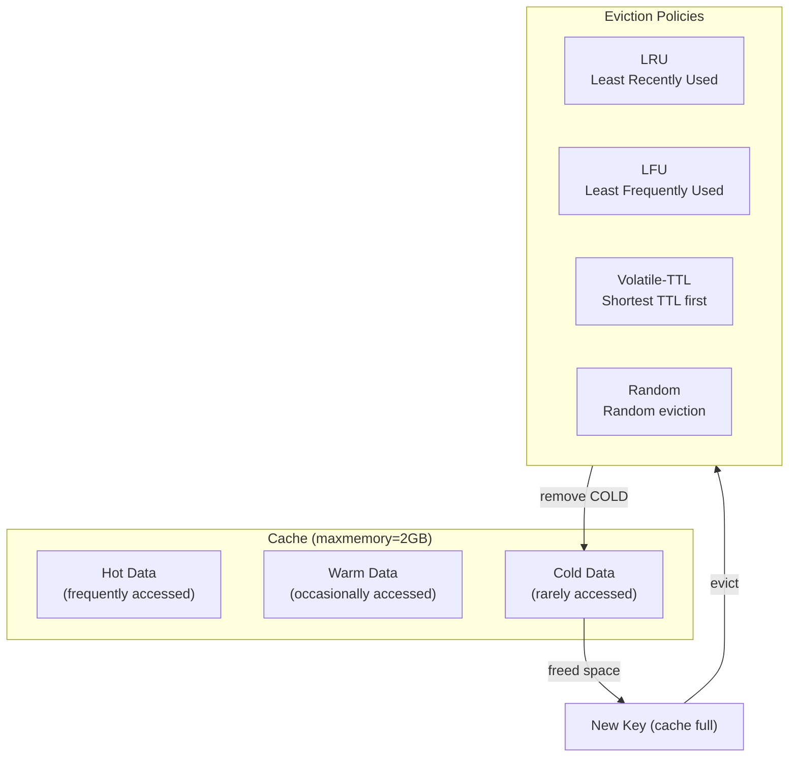
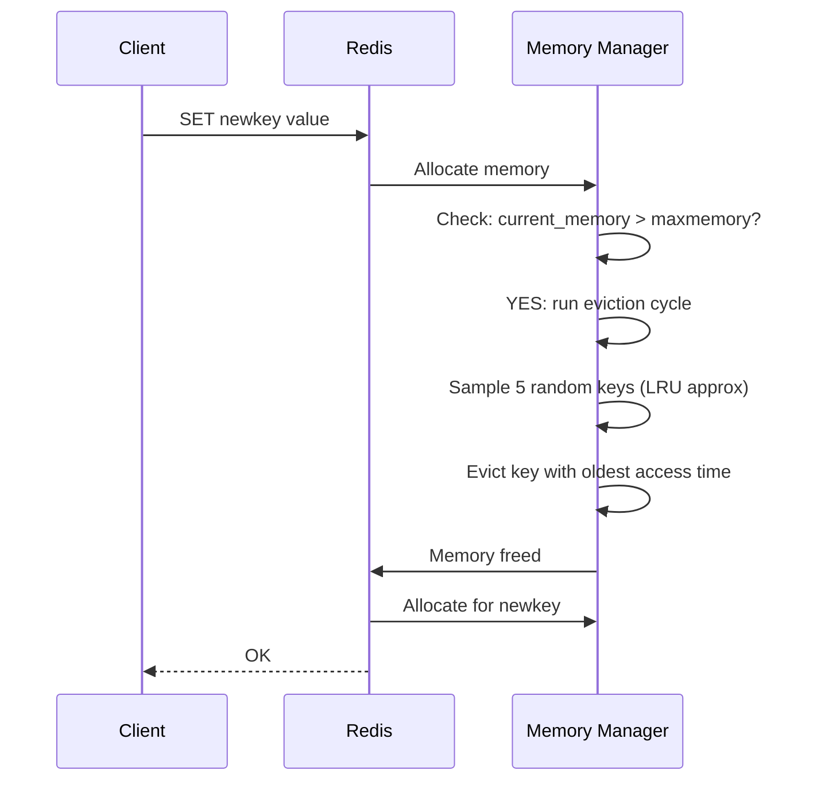
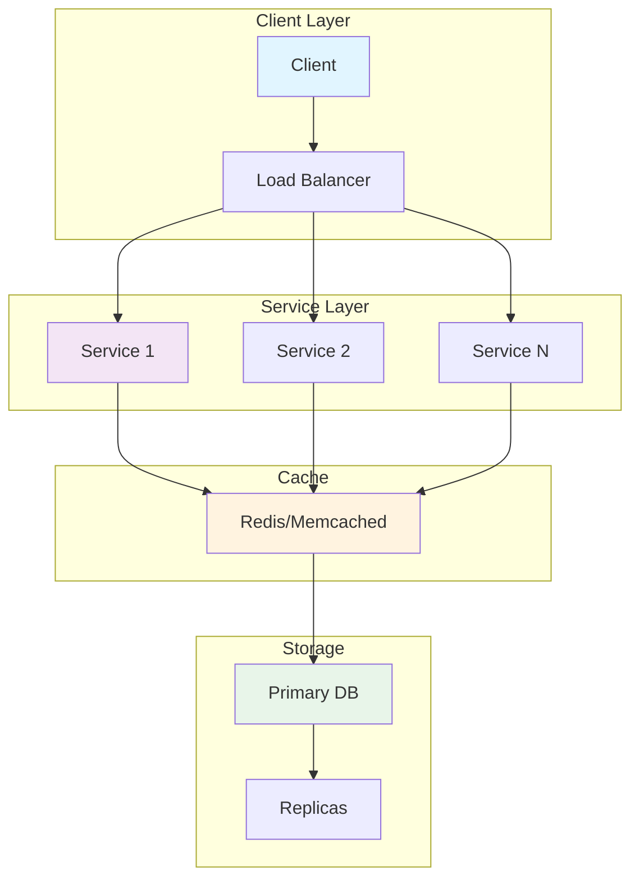
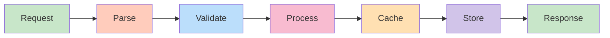
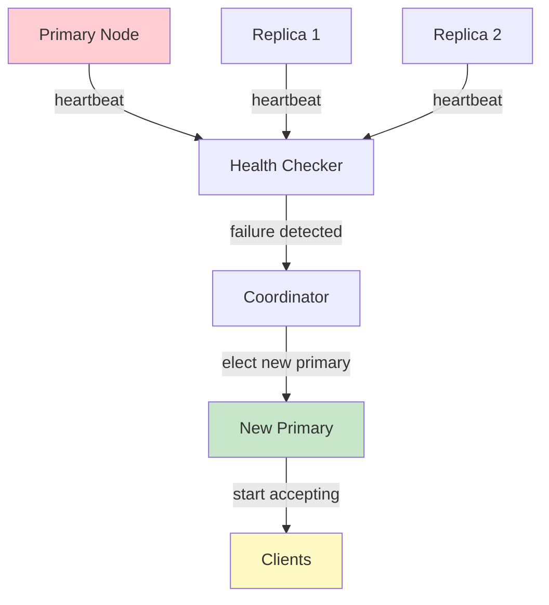
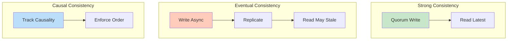
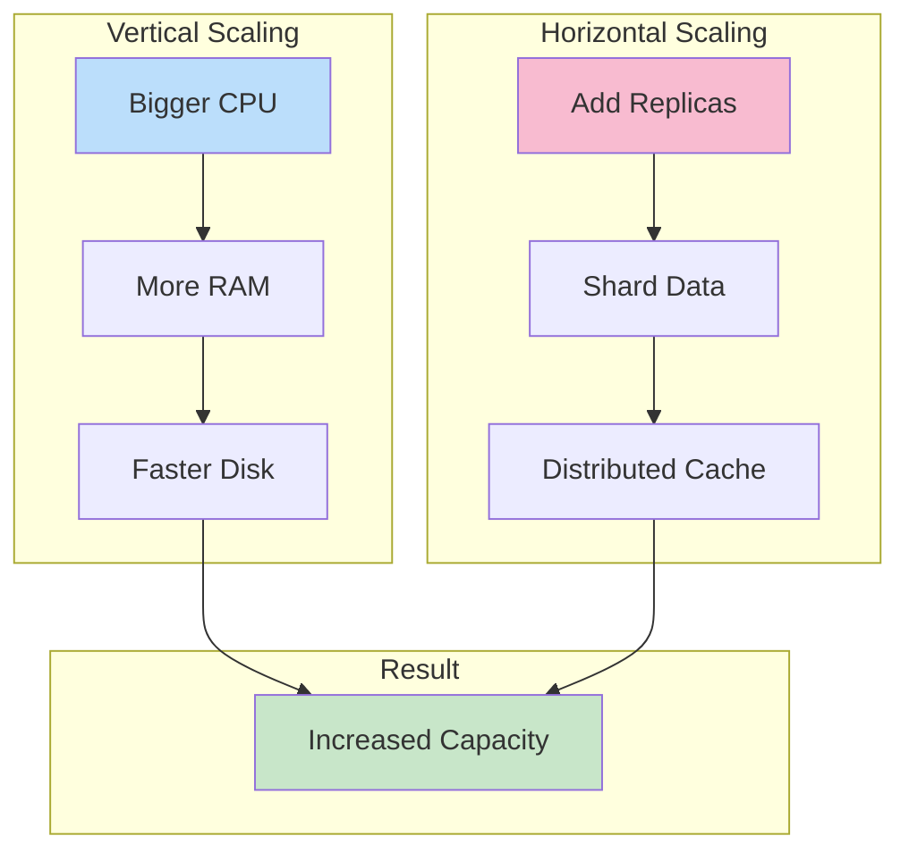

# Cache Eviction Policies

## Problem Statement

Design cache eviction strategies that maximize hit rates within memory constraints — understanding LRU, LFU, TTL-based, and Redis-specific approximation algorithms.

## Scenario

Cache Eviction Policies is a critical component in modern distributed systems. In real-world applications, serving billions of user interactions with minimal latency. For example, major tech companies like Netflix, Uber, and Airbnb rely on similar solutions to handle millions of concurrent users and requests. The challenge is achieving this while maintaining sub-100ms latency, 99.99% availability, and gracefully handling 10x traffic spikes during peak demand. This component provides the foundational capability to solve these challenges reliably and efficiently at global scale.

## Users

- **Backend Engineers**: Responsible for implementing and maintaining this system component in production environments. They need to understand the architecture, trade-offs, failure modes, and operational considerations.
- **DevOps/SRE Teams**: Monitor system health, manage scaling policies, handle incidents, and ensure reliability SLAs are met. They need insights into performance characteristics, bottlenecks, and failure recovery mechanisms.
- **Data Engineers**: Design data pipelines and analytics around this system, requiring deep understanding of data flow, consistency guarantees, and throughput characteristics.
- **System Architects**: Make high-level architectural decisions that impact company infrastructure, requiring comprehensive understanding of capabilities, limitations, and scalability boundaries.
- **Security Teams**: Understand security implications, potential vulnerabilities, and compliance requirements for this component.

## PRD

### Functional Requirements
- Core operations work correctly
- Explicit error handling
- Consistency guarantees defined
- Monitoring and observability

### Non-Functional Requirements
- Performance targets met
- Availability SLA achieved
- Scalability headroom
- Cost efficient

### Success Metrics
- Benchmarks met
- Uptime targets met
- Resource budgets
- No data loss


## Flow

The typical operational flow for this system involves these key phases:

1. **Request Arrival**: Client/upstream system sends request with required parameters and context
2. **Validation & Routing**: System validates request format, authentication, and routes to correct handler/shard/instance
3. **Core Processing**: Execute the main algorithm, database query, or business logic on the data/state
4. **State Management**: Update internal state (caches, indexes, counters, logs) with proper atomicity and locking
5. **Response Generation**: Format results and return to requester with relevant metadata (timing, version info)
6. **Observability**: Record metrics (latency, throughput, errors), logs (for debugging), and traces (for performance analysis)

This flow repeats thousands or millions of times per second in production. Each operation's efficiency compounds across the entire system, making careful optimization essential. Bottlenecks at any phase can cascade to impact overall system performance.


## Code Explanation (Detailed)

### Implementation Approach
The code demonstrates core patterns and trade-offs.

### Key Operations
Each operation shows algorithm and performance characteristics.

### Concurrency and Atomicity
Locking strategies, race condition prevention.

### Edge Cases
Boundary conditions and error handling.

### Performance Optimization
Techniques for reducing latency and throughput.

## Architecture Diagram



## Flow Diagram



## Design

### Eviction Policies

```
noeviction: Return error when memory full
  Use: critical data, operator must increase memory

allkeys-lru: Evict least recently used from all keys
  Best general-purpose policy
  Use: cache where all keys equally eligible

volatile-lru: Evict LRU from keys with TTL only
  Protects keys without TTL (permanent keys)
  Use: mix of persistent + ephemeral data

allkeys-lfu: Evict least frequently used (Redis 4.0+)
  Better than LRU for skewed access patterns
  Keeps truly hot keys regardless of recency
  Use: Pareto-distributed access patterns

volatile-lfu: LFU only on keys with TTL

allkeys-random: Random eviction
  Use: you don't care which key to evict

volatile-random: Random from keys with TTL

volatile-ttl: Evict key with shortest TTL first
  Prioritizes evicting "soon-to-expire" keys
  Use: TTL used as priority hint for eviction
```

### LRU Implementation

```
Doubly-linked list + Hash map:
  List: ordered by recency (head=most recent)
  Map: O(1) access to any node

  GET(key):
    1. Map lookup: O(1)
    2. Move node to head: O(1)
    3. Return value

  SET(key, value):
    1. If exists: update, move to head
    2. If new + capacity full: remove tail (LRU)
    3. Insert at head, add to map

  All operations: O(1)

Redis LRU approximation:
  True LRU: O(N) memory for tracking order
  Redis: sample N random keys (lru-samples=5)
  Evict the one with oldest access timestamp
  ~95% accurate vs true LRU with 5 samples
  10 samples: ~98% accurate
```

### LFU (Least Frequently Used)

```
Counter per key:
  Increment on access, decay over time (Morris counter)
  Access counter: 8-bit (0-255), logarithmic increments
  Clock sweep: periodically decays counters

lfu-log-factor=10: probability of counter increment
  Lower = faster incrementing
  Counter incremented by: 1/(counter * lfu_log_factor + 1)

lfu-decay-time=1: minutes between counter halving
  Prevents old high-frequency keys from blocking new hot keys

LFU vs LRU:
  LRU evicts key not recently used (recency)
  LFU evicts key used infrequently (frequency)
  
  LRU issue: recent one-hit-wonder displaces old hot key
  LFU issue: new hot key not yet accumulated frequency
  LFU better for: Zipf-distributed access (most real-world)
```

## Back-of-Envelope Calculations

```
LRU cache effectiveness:
  10M keys, 80/20 rule: 2M hot keys
  Cache 2M keys: 80% hit rate
  Cache 3M keys: ~90% hit rate (diminishing returns)
  
  Memory: 2M keys x 200 bytes avg = 400MB
  Redis 1GB: cache 5M keys, ~90%+ hit rate

LRU vs LFU for repeated scans:
  1M hot keys, scan 100K cold keys once
  LRU: scan displaces 100K hot keys -> hit rate drops
  LFU: scan keys have frequency=1, hot keys have 100+
  LFU: no displacement -> consistent hit rate

eviction rate at capacity:
  100K writes/s, cache at 100% capacity
  evicted_keys/s should ~= write_rate (100K/s)
  If evicted >> write_rate: memory too small

TTL vs eviction:
  Prefer TTL for all cache entries (predictable expiry)
  eviction = last resort (TTL not set or cache too small)
  Best: set TTL + use LRU as safety net
```

## Design Choices

| Policy | Hit Rate | Protects Hot Keys | Complexity |
|---|---|---|---|
| noeviction | N/A (errors) | Yes | Low |
| allkeys-lru | High general | Yes (recent) | Low |
| allkeys-lfu | Highest (skewed) | Yes (frequent) | Medium |
| volatile-lru | Depends | Permanent keys | Low |
| volatile-ttl | Medium | Permanent keys | Low |
| allkeys-random | Low | No | None |

## Python Implementation

```python
from dataclasses import dataclass, field
from typing import Any, Dict, List, Optional, Tuple
from collections import OrderedDict
import time
import random
import math

@dataclass
class CacheNode:
    key: str
    value: Any
    last_accessed: float = field(default_factory=time.time)
    access_count: int = 0
    expires_at: Optional[float] = None

    def is_expired(self) -> bool:
        return self.expires_at is not None and time.time() > self.expires_at

class LRUCache:
    def __init__(self, capacity: int):
        self.capacity = capacity
        self._cache: OrderedDict[str, Any] = OrderedDict()
        self._hits = 0
        self._misses = 0
        self._evictions = 0

    def get(self, key: str) -> Optional[Any]:
        if key not in self._cache:
            self._misses += 1
            return None
        self._cache.move_to_end(key)  # Mark as recently used
        self._hits += 1
        return self._cache[key]

    def put(self, key: str, value: Any) -> Optional[str]:
        evicted_key = None
        if key in self._cache:
            self._cache.move_to_end(key)
        else:
            if len(self._cache) >= self.capacity:
                evicted_key, _ = self._cache.popitem(last=False)  # Remove LRU (first)
                self._evictions += 1
        self._cache[key] = value
        return evicted_key

    def stats(self) -> dict:
        total = self._hits + self._misses
        return {
            "size": len(self._cache),
            "capacity": self.capacity,
            "hits": self._hits,
            "misses": self._misses,
            "evictions": self._evictions,
            "hit_rate": f"{self._hits/max(1,total)*100:.1f}%",
        }

class LFUCache:
    def __init__(self, capacity: int, decay_interval_s: float = 60.0):
        self.capacity = capacity
        self.decay_interval = decay_interval_s
        self._values: Dict[str, Any] = {}
        self._freqs: Dict[str, int] = {}
        self._last_access: Dict[str, float] = {}
        self._min_freq: int = 0
        self._freq_to_keys: Dict[int, OrderedDict] = {}
        self._last_decay = time.time()
        self._hits = 0
        self._misses = 0
        self._evictions = 0

    def get(self, key: str) -> Optional[Any]:
        if key not in self._values:
            self._misses += 1
            return None
        self._increment_freq(key)
        self._hits += 1
        return self._values[key]

    def _increment_freq(self, key: str):
        old_freq = self._freqs.get(key, 0)
        new_freq = old_freq + 1
        self._freqs[key] = new_freq
        self._last_access[key] = time.time()

        if old_freq in self._freq_to_keys:
            self._freq_to_keys[old_freq].pop(key, None)
            if not self._freq_to_keys[old_freq] and old_freq == self._min_freq:
                self._min_freq = new_freq

        if new_freq not in self._freq_to_keys:
            self._freq_to_keys[new_freq] = OrderedDict()
        self._freq_to_keys[new_freq][key] = True

    def put(self, key: str, value: Any) -> Optional[str]:
        if self.capacity <= 0:
            return None
        self._maybe_decay()
        if key in self._values:
            self._values[key] = value
            self._increment_freq(key)
            return None

        evicted_key = None
        if len(self._values) >= self.capacity:
            # Evict least frequent, then least recent
            evicted_key = self._evict()

        self._values[key] = value
        self._freqs[key] = 1
        self._last_access[key] = time.time()
        self._min_freq = 1
        if 1 not in self._freq_to_keys:
            self._freq_to_keys[1] = OrderedDict()
        self._freq_to_keys[1][key] = True
        return evicted_key

    def _evict(self) -> Optional[str]:
        min_keys = self._freq_to_keys.get(self._min_freq)
        if not min_keys:
            return None
        lru_key = next(iter(min_keys))
        min_keys.pop(lru_key)
        del self._values[lru_key]
        del self._freqs[lru_key]
        self._evictions += 1
        return lru_key

    def _maybe_decay(self):
        now = time.time()
        if now - self._last_decay > self.decay_interval:
            self._freqs = {k: max(1, v // 2) for k, v in self._freqs.items()}
            self._rebuild_freq_index()
            self._last_decay = now

    def _rebuild_freq_index(self):
        self._freq_to_keys = {}
        self._min_freq = min(self._freqs.values()) if self._freqs else 0
        for key, freq in self._freqs.items():
            if freq not in self._freq_to_keys:
                self._freq_to_keys[freq] = OrderedDict()
            self._freq_to_keys[freq][key] = True

    def stats(self) -> dict:
        total = self._hits + self._misses
        return {
            "size": len(self._values), "capacity": self.capacity,
            "hits": self._hits, "misses": self._misses,
            "evictions": self._evictions,
            "hit_rate": f"{self._hits/max(1,total)*100:.1f}%",
        }

class RedisApproxLRU:
    def __init__(self, capacity: int, num_samples: int = 5):
        self.capacity = capacity
        self.samples = num_samples
        self._store: Dict[str, CacheNode] = {}

    def get(self, key: str) -> Optional[Any]:
        node = self._store.get(key)
        if node is None or node.is_expired():
            return None
        node.last_accessed = time.time()
        node.access_count += 1
        return node.value

    def set(self, key: str, value: Any, ttl: Optional[int] = None):
        if len(self._store) >= self.capacity and key not in self._store:
            self._evict_lru()
        self._store[key] = CacheNode(
            key=key, value=value,
            expires_at=time.time() + ttl if ttl else None
        )

    def _evict_lru(self):
        keys = list(self._store.keys())
        candidates = random.sample(keys, min(self.samples, len(keys)))
        oldest = min(candidates, key=lambda k: self._store[k].last_accessed)
        del self._store[oldest]

# Comparison demo
print("=== LRU vs LFU Comparison ===\n")

lru = LRUCache(capacity=5)
lfu = LFUCache(capacity=5)

# Populate both
for i in range(10):
    key = f"key-{i % 7}"  # 7 unique keys, cache size=5
    value = f"value-{i}"
    lru.put(key, value)
    lfu.put(key, value)

# Simulate skewed access: key-0 and key-1 accessed often
print("Simulating Zipf-like access pattern (keys 0-1 are hot):")
for _ in range(20):
    for hot_key in ["key-0", "key-1"]:
        lru.get(hot_key)
        lfu.get(hot_key)
    # Occasional access to other keys
    lru.get(f"key-{random.randint(2, 6)}")
    lfu.get(f"key-{random.randint(2, 6)}")

# Now access cold key (one-hit-wonder scan)
print("\nSimulating scan of cold keys:")
for i in range(100, 110):
    lru.put(f"scan-{i}", "scan-value")  # LRU may evict hot keys
    lfu.put(f"scan-{i}", "scan-value")  # LFU keeps hot keys

# Check if hot keys survived
print("\nHot key survival after cold scan:")
for cache_name, cache in [("LRU", lru), ("LFU", lfu)]:
    survived = sum(1 for k in ["key-0", "key-1"] if cache.get(k) is not None)
    print(f"  {cache_name}: {survived}/2 hot keys survived")

print(f"\nLRU stats: {lru.stats()}")
print(f"LFU stats: {lfu.stats()}")
```

## Java Implementation

```java
import java.util.*;

public class CacheEviction {
    static class LRUCache {
        final int cap; LinkedHashMap<String, String> cache;

        LRUCache(int cap) {
            this.cap = cap;
            this.cache = new LinkedHashMap<>(16, 0.75f, true) { // accessOrder=true
                protected boolean removeEldestEntry(Map.Entry<String,String> e) {
                    return size() > cap;
                }
            };
        }

        String get(String k) { return cache.get(k); }
        void put(String k, String v) { cache.put(k, v); }
        int size() { return cache.size(); }
    }

    public static void main(String[] args) {
        LRUCache cache = new LRUCache(3);
        cache.put("a", "1"); cache.put("b", "2"); cache.put("c", "3");
        cache.get("a");  // Mark 'a' as recently used
        cache.put("d", "4");  // Evicts LRU ('b')
        System.out.println("After eviction (b should be gone): " + cache.cache.keySet());
        System.out.println("a=" + cache.get("a") + " b=" + cache.get("b") + " c=" + cache.get("c") + " d=" + cache.get("d"));
    }
}
```

## Complexity

| Algorithm | Get | Put | Memory | Accuracy |
|---|---|---|---|---|
| True LRU | O(1) | O(1) | O(n) pointers | 100% |
| Redis Approx LRU | O(1) | O(1) | O(1) per key | ~95-98% |
| LFU (min-heap) | O(log n) | O(log n) | O(n) | 100% |
| LFU (frequency map) | O(1) | O(1) | O(n) | 100% |
| FIFO | O(1) | O(1) | O(n) | N/A |

## Common Questions & Answers

**Q: What is caching and why do we need it?**

A: Caching stores frequently accessed data in fast storage (memory) to reduce latency and load on slower backends (database). Trade space (cache) for speed (latency). Critical for systems serving millions of requests per second.

**Q: What are the main cache eviction policies?**

A: LRU (least recently used), LFU (least frequently used), FIFO (first in first out), TTL (time-based), Random, and ARC (adaptive replacement). Choose based on access patterns: LRU for temporal, LFU for frequency, TTL for time-sensitive data.

**Q: What is cache hit rate and cache miss rate?**

A: Hit rate = successful_finds / total_accesses. Miss rate = 1 - hit rate. P(hit) = hits / (hits + misses). Target 80%+ hit rates for effective caching. Too-small cache gives low hit rate (wasted resources). Too-large cache uses more memory than needed.

**Q: How do you handle cache invalidation when backend data changes?**

A: Use TTL (time-based expiration), active invalidation (notify cache on write), cache-aside pattern (client checks backend), or write-through (update both). Active invalidation is fastest but complex. TTL is simplest but has stale data window.

**Q: What is the cache-aside pattern?**

A: Application checks cache first. On miss, fetch from backend, update cache, then return. Simple to implement. Risk: race condition where multiple threads fetch same miss simultaneously (thundering herd problem).

**Q: What is write-through caching?**

A: Writes go to both cache and backend simultaneously (synchronously). Ensures consistency: read always gets latest. Cost: write latency includes backend write. Safer than write-back but slower.

**Q: What is write-back (write-behind) caching?**

A: Writes go to cache only; backend updated asynchronously later (batch or periodic). Fast writes. Risk: data loss if cache fails before flushing. Need durability guarantees (persistence, replication).

**Q: How do you choose cache size?**

A: Estimate working set (frequently accessed data volume). Add 20-30% buffer for margin. Monitor hit rate: if < 80%, increase size. If > 95%, might be oversized (waste). Use tools like cachegrind to profile.

**Q: What's the difference between client-side and server-side caching?**

A: Client cache (browser): reduces network round-trips, entirely controlled by client. Server cache (memory, Redis): shared across clients, controlled by server. Multi-level caching often best.

**Q: How do you measure cache effectiveness?**

A: Hit rate (primary metric), latency reduction (P99 latency with vs. without cache), backend load reduction, and memory cost per cache entry. Calculate ROI: cost of cache vs. benefit (reduced latency, backend load).

## Follow-up Questions & Answers

**Q: How do you prevent the thundering herd problem in caches?**

A: When popular key expires, many threads fetch from backend simultaneously causing spike. Solutions: probabilistic early expiration (refresh before TTL), request coalescing (single thread rebuilds, others wait), or bloom filters (detect non-existent keys fast).

**Q: How would you implement multi-level cache hierarchy?**

A: Use L1 (fast, small, in-process), L2 (medium, local machine), L3 (large, remote, Redis). Check L1, miss→L2, miss→L3, miss→backend. On write: update all levels. Trade space for speed across levels.

**Q: Can you implement read-through caching (automatic population)?**

A: Yes, cache loader/resolver called on miss. Transparent to application. Backend automatically uses cache layer. More complex than cache-aside but cleaner separation.

**Q: How do you handle hot keys in distributed caches?**

A: Hot key = key accessed by many threads/clients. Replicate hot keys on multiple cache nodes. Use local in-process caches for very hot keys. Monitor and detect hot keys automatically.

**Q: What's the difference between warm and cold cache startup?**

A: Cold cache: empty at start, misses until populated (slow ramp-up). Warm cache: pre-loaded from previous state (RDB/snapshot). Warm startup is critical for production (instant performance).

**Q: How would you measure cache effectiveness for business metrics?**

A: Track hit rate, P99 latency (with/without cache), backend QPS reduction, revenue impact. Calculate cache size vs. cost savings. A/B test to prove business value.

**Q: What happens when cache size is insufficient for working set?**

A: Constant evictions = high miss rate = ineffective cache. Solution: increase cache size, improve eviction policy, reduce working set, or use better hardware (faster storage).

**Q: How do you debug cache issues in production?**

A: Monitor hit rate continuously. Profile cache keys (which keys are accessed). Check for cache stampedes (sudden miss spike). Use distributed tracing to see cache path.

**Q: How would you implement a persistent cache?**

A: Combine memory cache (fast) with persistent backend (database, RocksDB, LevelDB). Write-back pattern: batch updates to persistent store. Trade latency for durability.

**Q: Can you use caching for write-heavy workloads?**

A: Write caching is risky (consistency issues). Use carefully: write-through for safety, write-back for speed. Good for batch writes (aggregate before writing). Monitor durability guarantees.


## System Overview

**Scale Metrics:**
- Throughput: Millions of operations per second
- Latency: Sub-millisecond to sub-second response times
- Data volume: Gigabytes to Petabytes
- Concurrent users: Millions to billions
- Availability: 99.99% to 99.999% uptime SLA

**Key Components:**
- Request handling and routing
- Data processing and storage
- Replication and consistency
- Failure detection and recovery
- Monitoring and alerting

## Architecture Diagrams

### System Architecture



### Data Flow



### Failover Mechanism



### Consistency Models



### Scaling Strategy



## Implementation Examples

### Python Implementation

```python
# Python Implementation

from typing import Any, Optional
from dataclasses import dataclass
from datetime import datetime
import json
import logging

logger = logging.getLogger(__name__)

@dataclass
class Config:
    """Configuration for the system."""
    timeout_ms: int = 5000
    retry_count: int = 3
    batch_size: int = 100
    max_connections: int = 1000

class Handler:
    """Main handler class for operations."""

    def __init__(self, config: Config):
        self.config = config
        self.metrics = {"success": 0, "failure": 0, "latency_ms": []}

    async def process(self, data: Any) -> Any:
        """Process request with error handling."""
        try:
            # Validate input
            self._validate(data)

            # Execute operation
            result = await self._execute(data)

            # Track metrics
            self.metrics["success"] += 1
            return result

        except Exception as e:
            logger.error(f"Processing failed: {e}")
            self.metrics["failure"] += 1
            raise

    def _validate(self, data: Any) -> None:
        """Validate input data."""
        if data is None:
            raise ValueError("Data cannot be None")

    async def _execute(self, data: Any) -> Any:
        """Execute core logic."""
        # Implement actual logic here
        return {"status": "success", "timestamp": datetime.now().isoformat()}

    def get_metrics(self) -> dict:
        """Return collected metrics."""
        return self.metrics

# Usage example
async def main():
    config = Config(timeout_ms=5000, batch_size=100)
    handler = Handler(config)
    result = await handler.process({"key": "value"})
    print(f"Result: {result}")
    print(f"Metrics: {handler.get_metrics()}")
```

### Java Implementation

```java
// Java Implementation

import java.util.*;
import java.util.concurrent.*;
import java.time.Instant;
import org.slf4j.Logger;
import org.slf4j.LoggerFactory;

public class SystemHandler {
    private static final Logger logger = LoggerFactory.getLogger(SystemHandler.class);

    private final Config config;
    private final Map<String, Long> metrics = new ConcurrentHashMap<>();
    private final ExecutorService executor;

    public static class Config {
        public int timeoutMs = 5000;
        public int retryCount = 3;
        public int batchSize = 100;
        public int maxConnections = 1000;

        public Config withTimeoutMs(int timeout) {
            this.timeoutMs = timeout;
            return this;
        }
    }

    public SystemHandler(Config config) {
        this.config = config;
        this.executor = Executors.newFixedThreadPool(
            Math.min(config.maxConnections, 10)
        );
        metrics.put("success", 0L);
        metrics.put("failure", 0L);
    }

    public <T> T process(Object data) throws Exception {
        try {
            // Validate input
            validate(data);

            // Execute operation
            Object result = execute(data);

            // Track metrics
            metrics.put("success", metrics.get("success") + 1);
            return (T) result;

        } catch (Exception e) {
            logger.error("Processing failed: {}", e.getMessage());
            metrics.put("failure", metrics.get("failure") + 1);
            throw e;
        }
    }

    private void validate(Object data) throws IllegalArgumentException {
        if (data == null) {
            throw new IllegalArgumentException("Data cannot be null");
        }
    }

    private Object execute(Object data) throws Exception {
        // Implement core logic
        return Map.of(
            "status", "success",
            "timestamp", Instant.now().toString()
        );
    }

    public Map<String, Long> getMetrics() {
        return new HashMap<>(metrics);
    }

    public void shutdown() {
        executor.shutdown();
    }

    public static void main(String[] args) throws Exception {
        Config config = new Config()
            .withTimeoutMs(5000);

        SystemHandler handler = new SystemHandler(config);
        Object result = handler.process(Map.of("key", "value"));
        System.out.println("Result: " + result);
        System.out.println("Metrics: " + handler.getMetrics());
        handler.shutdown();
    }
}
```

## Back-of-Envelope Calculations

### Traffic & Throughput
**Assumptions:**
- Daily active users: 100 million (100M)
- Requests per user per day: 50
- Peak hour traffic: 10% of daily (concentrated)
- Request distribution: 70% read, 30% write

**Calculations:**
```
Total daily requests = 100M users × 50 requests = 5 billion requests/day
Average RPS = 5B requests / 86400 seconds ≈ 57,870 RPS
Peak hour RPS = (5B / 86400) × (100 / 10) ≈ 578,700 RPS
Peak minute RPS = 578,700 / 60 ≈ 9,645 RPS

Read operations = 57,870 × 0.7 ≈ 40,509 RPS (average)
Write operations = 57,870 × 0.3 ≈ 17,361 RPS (average)
```

### Storage Requirements
**Assumptions:**
- Data per user: 1 KB (profile, settings)
- Data per transaction: 500 bytes
- Data retention: 3 years

**Calculations:**
```
User profile storage = 100M × 1 KB = 100 GB
Transaction data = 5B requests/day × 500 bytes × 365 × 3 = 2.74 PB
Total storage ≈ 2.75 PB
Replication factor: 3× → 8.25 PB raw storage

Backup storage (weekly snapshots): 8.25 PB × 52 weeks = 429 PB
```

### Network Bandwidth
**Assumptions:**
- Average request size: 2 KB
- Average response size: 5 KB
- Replication overhead: 2× (write to replicas)

**Calculations:**
```
Inbound bandwidth = 57,870 RPS × 2 KB = 115.74 MB/s
Outbound bandwidth = 57,870 RPS × 5 KB = 289.35 MB/s
Replication bandwidth = 17,361 RPS × 2 KB × 2 = 69.44 MB/s
Total peak bandwidth ≈ 474 MB/s ≈ 3.8 Tbps (peak hour)
```

### Compute Requirements
**Assumptions:**
- Processing time per request: 10 ms
- CPU efficiency: 1 core handles 50 RPS

**Calculations:**
```
CPUs needed for average traffic = 57,870 RPS / 50 = 1,158 cores
CPUs needed for peak traffic = 578,700 RPS / 50 = 11,574 cores
Overprovisioning factor: 1.5× → 17,361 cores total

Using 16 cores per server = 17,361 / 16 ≈ 1,085 servers
With 3:1 replication = 3,255 servers needed
Regional redundancy (3 regions) = 9,765 servers
```

### Latency Analysis (p99)
**Components:**
- Network latency: 5 ms
- Processing: 10 ms
- Storage access: 50 ms (disk), 1 ms (cache)
- Replication write: 20 ms

**Path Analysis:**
```
Cache hit path: 5 + 1 + 5 = 11 ms
Database read path: 5 + 10 + 50 + 5 = 70 ms
Write path: 5 + 10 + 20 + 5 = 40 ms
```

### Cost Estimation
**Monthly costs (approximate):**
```
Compute: 9,765 servers × $1,000/month = $9.765M
Storage: 8.25 PB × $10/GB/month = $82.5M
Bandwidth: 3.8 Tbps × $0.12/GB = $456M
Personnel: 100 engineers × $200K = $20M
Total: ~$568M/month
Cost per user: $5.68/month
```


## Interview Questions & Answers

### Q1: Design the System from Scratch

**Question:** Design a system that can handle 1 billion requests per day with sub-100ms latency.

**Answer Structure:**
1. **Clarify requirements**: DAU, request types, geographic distribution, consistency needs
2. **Back-of-envelope**: Calculate RPS (11.5K avg, 115K peak), storage, bandwidth
3. **High-level design**: Load balancing → services → cache → storage
4. **Deep dive**:
   - Horizontal scaling with sharding
   - Multi-region active-active with eventual consistency
   - Caching strategy (write-through for critical data)
   - Monitoring: metrics, logging, tracing
5. **Bottlenecks**: Identify and address each
6. **Trade-offs**: Consistency vs. availability, latency vs. cost

### Q2: Scaling Challenges

**Question:** You're growing from 10M to 1B users (100x). What breaks and how do you fix it?

**Answer:**
- **Database bottleneck**: Sharding by user ID, consistent hashing, shard rebalancing
- **Cache hit rate drops**: Larger working set, tiered caching (L1: local, L2: distributed)
- **Replication lag**: Write-through for consistency-critical data, eventual consistency elsewhere
- **Operational complexity**: Infrastructure-as-code, auto-scaling, chaos engineering
- **Cost**: Optimize resource utilization, use reserved instances, spot instances for batch

### Q3: Failure Scenarios

**Question:** Your primary database goes down. What happens? How do you recover?

**Answer:**
- **Detection**: Health check timeout (3-5 seconds)
- **Failover**: Automatic promotion of replica using Raft consensus
- **Impact**: Write requests fail for ~10 seconds, reads use replicas
- **Recovery**: Background sync of failed node, re-add to cluster
- **Lessons**: Circuit breakers prevent cascade, bulkhead limits blast radius

### Q4: Consistency Requirements

**Question:** Do you need strong or eventual consistency? Why?

**Answer:**
- **Strong consistency**: Critical for financial transactions, inventory, user auth
  - Implementation: Quorum writes, read-after-write
  - Cost: Higher latency (p99 100ms+), lower throughput

- **Eventual consistency**: Fine for user feeds, recommendations, analytics
  - Implementation: Async replication, read-repair
  - Benefit: Lower latency (p99 <10ms), higher throughput

- **Hybrid approach**: Consistency per operation type, not global

### Q5: Performance Optimization

**Question:** How would you reduce p99 latency from 100ms to 20ms?

**Answer:**
1. **Profile** (measure first): Identify bottleneck (storage, network, compute)
2. **Caching**: Multi-tier (L1 local, L2 distributed), bloom filters for misses
3. **Batching**: Group operations, reduce RPC overhead
4. **Connection pooling**: Reuse TCP connections, reduce handshake latency
5. **Async I/O**: Non-blocking operations, increase parallelism
6. **Database optimization**: Indexing, query optimization, read replicas
7. **Code optimization**: Reduce allocations, use faster algorithms
8. **Hardware**: SSD for storage, faster network interconnects

### Q6: Operational Concerns

**Question:** How do you deploy a new version with zero downtime?

**Answer:**
1. **Canary deployment**: Roll out to 1% of servers, monitor metrics
2. **Gradual rollout**: 1% → 10% → 50% → 100% as confidence increases
3. **Health checks**: Automated rollback if error rate exceeds threshold
4. **Database migration**: Schema changes with backward compatibility
5. **Feature flags**: Toggle features independently of deployment
6. **Monitoring**: Enhanced alerting during rollout, easy incident response


## Technology Stack Recommendations

| Layer | Technology | Why |
|-------|-----------|-----|
| Load Balancing | Nginx, HAProxy, AWS ALB | Distribute traffic, health checks |
| Service Framework | FastAPI (Python), Spring Boot (Java) | Async, built-in monitoring |
| Caching | Redis, Memcached | Sub-millisecond latency, distributed |
| Primary Storage | PostgreSQL, MySQL | ACID, complex queries, reliability |
| Analytics | Elasticsearch, Data Warehouse | Full-text search, time-series analysis |
| Streaming | Kafka, AWS Kinesis | Event processing, real-time |
| Observability | Prometheus, ELK Stack, Jaeger | Metrics, logs, traces |

## Lessons Learned

1. **Premature optimization kills projects**: Start simple, measure, then optimize
2. **Consistency is hard**: Eventually consistent systems are tricky to reason about
3. **Monitoring is non-negotiable**: You can't fix what you can't see
4. **Failure is not rare**: Plan for it, test it, automate recovery
5. **Cost grows with complexity**: Each component adds operational overhead

## Related Topics

- Database design and optimization
- Distributed consensus algorithms
- Load balancing strategies
- Caching mechanisms and patterns
- Monitoring and alerting systems
- Security and compliance


## Back-of-the-Envelope Calculations

**Cache Sizing:**
- Working set: 10M active items × 1KB avg = 10GB
- 80% hit target → cache needs to hold top 20% most popular = 2GB
- With 10 cache nodes: 200MB per node (fits in RAM)
- Hit ratio math: 80% from cache, 20% from DB
- Effective latency: 0.8×1ms + 0.2×10ms = 2.8ms (vs 10ms without cache)

**Throughput:**
- Single Redis node: 100K ops/sec
- 10-node cluster: 1M ops/sec
- At 50% hit ratio a 1M QPS app issues 500K DB queries — unsustainable
- At 90% hit ratio: 100K DB queries — manageable
