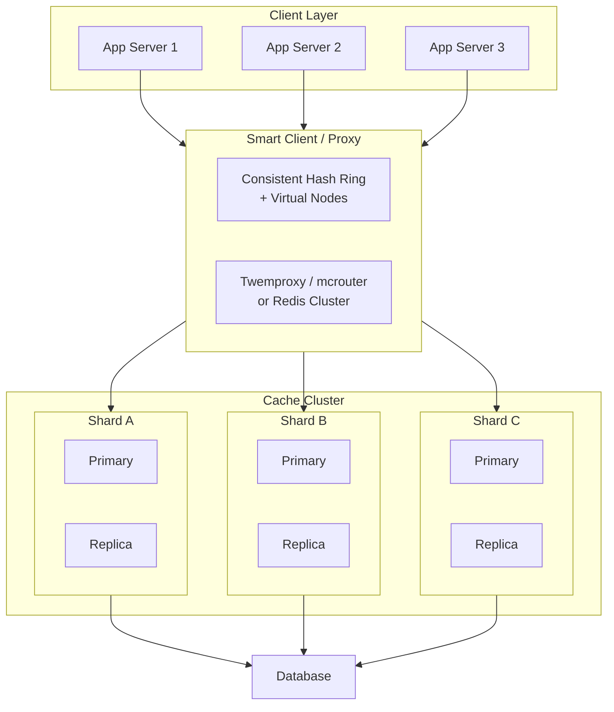
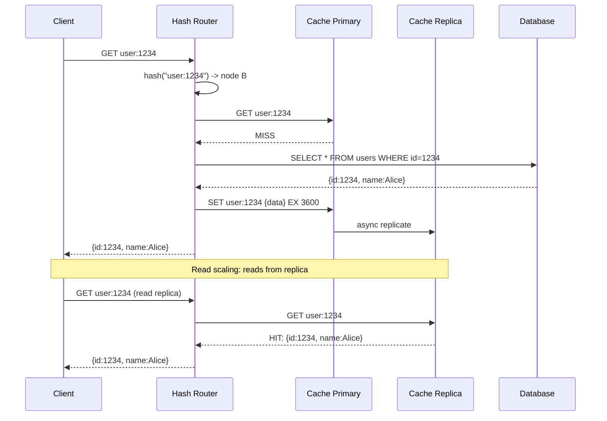
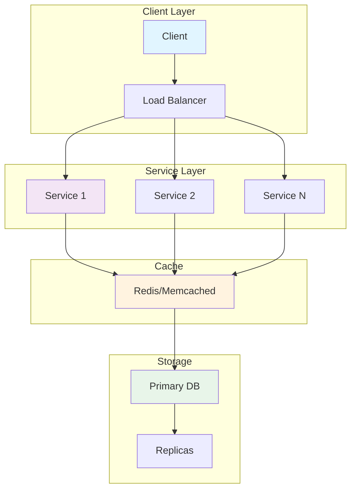
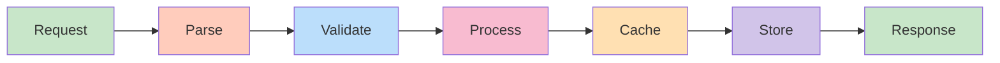
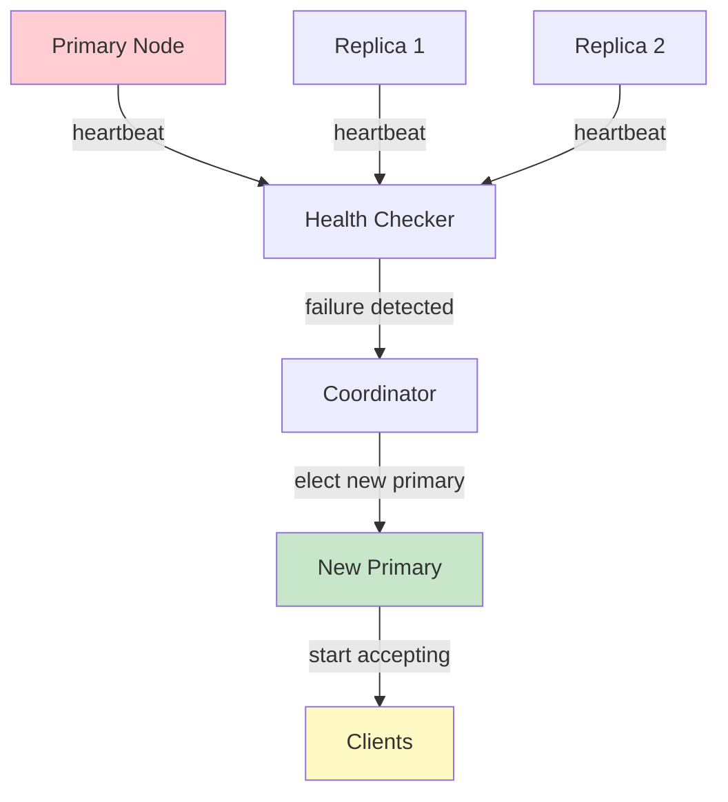
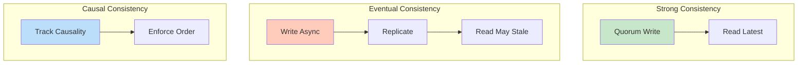
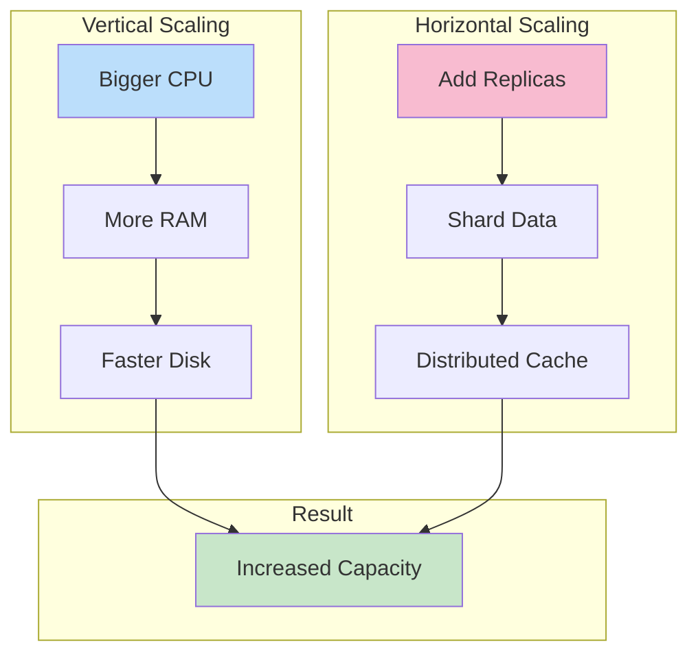

# Distributed Cache Design

## Problem Statement

Design a distributed cache that scales horizontally, handles node failures gracefully, minimizes hotspot issues, and maintains consistency across cache nodes — covering consistent hashing, replication strategies, and cache coherence.

## Scenario

Distributed Cache Design is a critical component in modern distributed systems. In real-world applications, serving billions of user interactions with minimal latency. For example, major tech companies like Netflix, Uber, and Airbnb rely on similar solutions to handle millions of concurrent users and requests. The challenge is achieving this while maintaining sub-100ms latency, 99.99% availability, and gracefully handling 10x traffic spikes during peak demand. This component provides the foundational capability to solve these challenges reliably and efficiently at global scale.

## Users

- **Backend Engineers**: Responsible for implementing and maintaining this system component in production environments. They need to understand the architecture, trade-offs, failure modes, and operational considerations.
- **DevOps/SRE Teams**: Monitor system health, manage scaling policies, handle incidents, and ensure reliability SLAs are met. They need insights into performance characteristics, bottlenecks, and failure recovery mechanisms.
- **Data Engineers**: Design data pipelines and analytics around this system, requiring deep understanding of data flow, consistency guarantees, and throughput characteristics.
- **System Architects**: Make high-level architectural decisions that impact company infrastructure, requiring comprehensive understanding of capabilities, limitations, and scalability boundaries.
- **Security Teams**: Understand security implications, potential vulnerabilities, and compliance requirements for this component.

## PRD

### Functional Requirements
- Core operations work correctly
- Explicit error handling
- Consistency guarantees defined
- Monitoring and observability

### Non-Functional Requirements
- Performance targets met
- Availability SLA achieved
- Scalability headroom
- Cost efficient

### Success Metrics
- Benchmarks met
- Uptime targets met
- Resource budgets
- No data loss


## Flow

The typical operational flow for this system involves these key phases:

1. **Request Arrival**: Client/upstream system sends request with required parameters and context
2. **Validation & Routing**: System validates request format, authentication, and routes to correct handler/shard/instance
3. **Core Processing**: Execute the main algorithm, database query, or business logic on the data/state
4. **State Management**: Update internal state (caches, indexes, counters, logs) with proper atomicity and locking
5. **Response Generation**: Format results and return to requester with relevant metadata (timing, version info)
6. **Observability**: Record metrics (latency, throughput, errors), logs (for debugging), and traces (for performance analysis)

This flow repeats thousands or millions of times per second in production. Each operation's efficiency compounds across the entire system, making careful optimization essential. Bottlenecks at any phase can cascade to impact overall system performance.


## Code Explanation (Detailed)

### Implementation Approach
The code demonstrates core patterns and trade-offs.

### Key Operations
Each operation shows algorithm and performance characteristics.

### Concurrency and Atomicity
Locking strategies, race condition prevention.

### Edge Cases
Boundary conditions and error handling.

### Performance Optimization
Techniques for reducing latency and throughput.

## Architecture Diagram



## Flow Diagram



## Design

### Consistent Hashing

```
Problem with simple modular hashing:
  node = hash(key) % N
  Add/remove node: ~100% keys remap -> cold cache

Consistent hashing:
  Ring: 0 to 2^32-1
  Nodes placed at hash(node_id) positions
  Key assigned to next clockwise node
  Add/remove: only keys between two adjacent nodes remap
  Average remapped: 1/N of total keys

Virtual nodes (vnodes):
  Physical node has 150-200 virtual positions
  Prevents hotspots when nodes have different capacities
  Smoother distribution even with few physical nodes

Hash ring with virtual nodes:
  Node A (32GB): 200 vnodes
  Node B (16GB): 100 vnodes (half the capacity)
  Node C (32GB): 200 vnodes
  Keys distributed proportionally
```

### Replication Strategies

```
1. Leader-Follower (Primary-Replica):
   Writes -> primary only
   Reads -> primary or replica (replica lag acceptable)
   Failover: replica promoted on primary failure
   
   Redis Sentinel / Redis Cluster approach

2. Leaderless (Dynamo-style):
   Writes -> any N nodes (quorum write)
   Reads -> any R nodes (quorum read)
   W + R > N: strong consistency
   W=1, R=1: maximum availability, possible stale reads
   
   W=2, R=2, N=3: one node can fail without data loss or stale reads

3. Write-through replication:
   Write succeeds only when all replicas ACK
   Strong consistency, higher write latency
   
4. Write-behind replication:
   Async propagation (fire-and-forget)
   Lower write latency, possible replication lag

Cache-specific strategy:
  Async replication usually sufficient (cache is not source of truth)
  Strong consistency only needed when cache + DB consistency critical
```

### Hotspot Prevention

```
Problem: "celebrity key" - one key gets 100K req/s
  e.g., viral post, game leaderboard, stock price
  
Solutions:

1. Local in-process cache (L1):
   Small LRU in each app server (1-5% of keys)
   Hot keys cached locally, never hit Redis
   TTL: very short (1-5s) for freshness
   
   app_cache = LRUCache(1000)  # 1000 hot keys

2. Key replication with suffix:
   popular_key -> N copies: key:0, key:1, ..., key:N-1
   Read: key:random(N) (round-robin read)
   Write: write all N copies (or async propagation)
   
   def get_hot_key(key, N=10):
       return cache.get(f"{key}:{random.randint(0, N-1)}")

3. Request coalescing (singleflight):
   Multiple requests for same missing key -> one DB query
   Others wait and share the result
   
4. Jitter on TTL:
   Instead of TTL=3600, use TTL=3600 + random(-60, 60)
   Prevents thundering herd at simultaneous expiry

5. Probabilistic early refresh:
   T = original TTL, t = remaining TTL
   Refresh with probability P(t) = e^(-beta * t)
   As key approaches expiry, refresh probability increases
   One request triggers refresh before expiry
```

### Cache Coherence

```
Invalidation patterns:

1. TTL-based (simplest):
   Data inconsistent for at most TTL duration
   No explicit invalidation needed
   Use when stale tolerance acceptable

2. Write-invalidate:
   On DB update: DEL cache key
   Next read: miss -> re-populate from DB
   Risk: thundering herd

3. Write-update:
   On DB update: SET cache key (with new value)
   No miss window, but race condition risk
   Two concurrent writes -> cache = older value

4. Event-driven invalidation:
   DB change event (CDC/Debezium) -> Kafka -> cache invalidator
   Subscribe to DB changes, invalidate affected keys
   Eventually consistent, no direct DB-cache coupling

5. Tagged invalidation:
   Group keys by tag: {tag:user:1234} -> [profile, sessions, orders]
   On user update: invalidate all tagged keys
   Redis: use Sets to track tags per key

Cache-aside vs write-through coherence:
  Cache-aside: invalidate after DB write (DEL key)
  Write-through: update cache atomically with DB write
  Both: eventual consistency possible in race conditions
```

## Back-of-Envelope Calculations

```
Cluster sizing:
  10M active users, 500B cache per user session
  Total data: 5GB
  With 3x replication: 15GB cache needed
  3 nodes x 8GB Redis = 24GB (with headroom)

Hit rate improvement with read replicas:
  100K req/s, 1 primary handles 80K (80% hits)
  Add 2 replicas: reads distributed 3-way
  Primary: ~27K req/s, each replica: ~27K req/s
  Primary write pressure reduced 3x

Consistent hashing remapping:
  100 nodes, 10M keys
  Remove 1 node: ~100K keys remapped (1%)
  Vs modular hashing: 10M keys remapped (100%)

Hotspot math:
  1 viral post: 500K req/s
  Single Redis node max: ~100K req/s -> saturated
  With 10 key replicas: each node handles 50K req/s (OK)
  With L1 local cache (100 app servers): 5K req/s each -> trivial

Replication lag impact:
  Async replication: <1ms intra-DC
  Acceptable for: session cache, product catalog
  Not acceptable for: payment status, inventory count
```

## Design Choices

| Strategy | Consistency | Availability | Complexity |
|---|---|---|---|
| Single node | Strong | Low (SPOF) | Minimal |
| Primary-replica | Eventual (reads) | High (replica serves) | Low |
| Quorum (W+R>N) | Strong | Medium | Medium |
| Leaderless | Tunable | High | High |
| L1+L2 (local+Redis) | Eventual | Very high | Medium |
| CDN + Redis | Eventual | Highest | High |

## Python Implementation

```python
import hashlib
import time
import random
import threading
from typing import Any, Dict, List, Optional, Tuple
from collections import OrderedDict

class CacheNode:
    def __init__(self, node_id: str, capacity: int = 1000):
        self.node_id = node_id
        self._store: Dict[str, Tuple[Any, float]] = {}
        self._capacity = capacity
        self._hits = 0
        self._misses = 0
        self.alive = True

    def get(self, key: str) -> Optional[Any]:
        entry = self._store.get(key)
        if entry is None:
            self._misses += 1
            return None
        value, expires_at = entry
        if expires_at and time.time() > expires_at:
            del self._store[key]
            self._misses += 1
            return None
        self._hits += 1
        return value

    def set(self, key: str, value: Any, ttl: int = 0) -> bool:
        if len(self._store) >= self._capacity and key not in self._store:
            return False
        expires_at = time.time() + ttl if ttl else 0
        self._store[key] = (value, expires_at)
        return True

    def delete(self, key: str) -> bool:
        return self._store.pop(key, None) is not None

    def stats(self) -> dict:
        total = self._hits + self._misses
        return {
            "node": self.node_id,
            "keys": len(self._store),
            "hits": self._hits,
            "misses": self._misses,
            "hit_rate": f"{self._hits / max(1, total) * 100:.1f}%",
        }

class ConsistentHashRing:
    def __init__(self, virtual_nodes: int = 150):
        self._ring: List[Tuple[int, str]] = []
        self._nodes: Dict[str, CacheNode] = {}
        self._vnodes = virtual_nodes

    def add_node(self, node: CacheNode):
        self._nodes[node.node_id] = node
        for i in range(self._vnodes):
            h = int(hashlib.md5(f"{node.node_id}:{i}".encode()).hexdigest(), 16)
            self._ring.append((h, node.node_id))
        self._ring.sort()

    def remove_node(self, node_id: str) -> List[str]:
        if node_id not in self._nodes:
            return []
        affected_keys = list(self._nodes[node_id]._store.keys())
        self._ring = [(h, n) for h, n in self._ring if n != node_id]
        del self._nodes[node_id]
        return affected_keys

    def get_node(self, key: str) -> Optional[CacheNode]:
        if not self._ring:
            return None
        h = int(hashlib.md5(key.encode()).hexdigest(), 16)
        for ring_hash, node_id in self._ring:
            if h <= ring_hash:
                node = self._nodes.get(node_id)
                if node and node.alive:
                    return node
        return self._nodes.get(self._ring[0][1])

    def get_n_nodes(self, key: str, n: int) -> List[CacheNode]:
        if not self._ring:
            return []
        h = int(hashlib.md5(key.encode()).hexdigest(), 16)
        seen = set()
        result = []
        start = next((i for i, (rh, _) in enumerate(self._ring) if rh >= h), 0)
        for offset in range(len(self._ring)):
            idx = (start + offset) % len(self._ring)
            _, node_id = self._ring[idx]
            if node_id not in seen and node_id in self._nodes and self._nodes[node_id].alive:
                seen.add(node_id)
                result.append(self._nodes[node_id])
                if len(result) == n:
                    break
        return result

class L1L2Cache:
    def __init__(self, ring: ConsistentHashRing, l1_size: int = 100,
                 l1_ttl: int = 5, hot_threshold: int = 10):
        self._ring = ring
        self._l1: OrderedDict = OrderedDict()
        self._l1_size = l1_size
        self._l1_ttl = l1_ttl
        self._l1_expires: Dict[str, float] = {}
        self._access_count: Dict[str, int] = {}
        self._hot_threshold = hot_threshold
        self._l1_hits = 0
        self._l2_hits = 0
        self._misses = 0

    def _l1_get(self, key: str) -> Optional[Any]:
        if key not in self._l1:
            return None
        if time.time() > self._l1_expires.get(key, 0):
            self._l1.pop(key, None)
            return None
        self._l1.move_to_end(key)
        return self._l1[key]

    def _l1_set(self, key: str, value: Any):
        if len(self._l1) >= self._l1_size:
            self._l1.popitem(last=False)
        self._l1[key] = value
        self._l1_expires[key] = time.time() + self._l1_ttl

    def get(self, key: str) -> Optional[Any]:
        # L1 check
        val = self._l1_get(key)
        if val is not None:
            self._l1_hits += 1
            return val
        # L2 check
        node = self._ring.get_node(key)
        if node:
            val = node.get(key)
            if val is not None:
                self._l2_hits += 1
                self._access_count[key] = self._access_count.get(key, 0) + 1
                if self._access_count[key] >= self._hot_threshold:
                    self._l1_set(key, val)
                return val
        self._misses += 1
        return None

    def set(self, key: str, value: Any, ttl: int = 3600) -> bool:
        nodes = self._ring.get_n_nodes(key, 2)
        success = any(n.set(key, value, ttl) for n in nodes)
        if key in self._l1:
            self._l1_set(key, value)
        return success

    def invalidate(self, key: str):
        self._l1.pop(key, None)
        node = self._ring.get_node(key)
        if node:
            node.delete(key)

    def stats(self) -> dict:
        total = self._l1_hits + self._l2_hits + self._misses
        return {
            "l1_hits": self._l1_hits, "l2_hits": self._l2_hits,
            "misses": self._misses,
            "l1_hit_rate": f"{self._l1_hits / max(1, total) * 100:.1f}%",
        }

# Demo
print("=== Distributed Cache Demo ===\n")

ring = ConsistentHashRing(virtual_nodes=50)
nodes = [CacheNode(f"node-{i}", capacity=500) for i in range(3)]
for n in nodes:
    ring.add_node(n)

# Show distribution
key_distribution: Dict[str, int] = {}
for i in range(300):
    key = f"key:{i}"
    node = ring.get_node(key)
    if node:
        key_distribution[node.node_id] = key_distribution.get(node.node_id, 0) + 1

print("Key distribution across nodes:")
for node_id, count in sorted(key_distribution.items()):
    print(f"  {node_id}: {count} keys ({count/300*100:.1f}%)")

# L1+L2 cache with hot key detection
cache = L1L2Cache(ring, l1_size=50, l1_ttl=5, hot_threshold=5)

# Populate
for i in range(50):
    cache.set(f"user:{i}", {"id": i, "name": f"User{i}"}, ttl=3600)

# Simulate hot key access
print("\nSimulating hot key access for 'user:1':")
for _ in range(10):
    cache.get("user:1")

print(f"  In L1 cache after 10 hits: {'user:1' in cache._l1}")
print(f"  Cache stats: {cache.stats()}")

# Node failure + rebalancing
print("\n=== Node Failure Simulation ===")
failed_node = "node-1"
nodes[1].alive = False
affected = ring.remove_node(failed_node)
print(f"Node {failed_node} removed. {len(affected)} keys need rebalancing")

# Keys still readable from L2 (other nodes) if replicated
for key in affected[:3]:
    val = cache.get(key)
    print(f"  {key}: {'recovered' if val is not None else 'lost'}")
```

## Java Implementation

```java
import java.util.*;
import java.security.MessageDigest;

public class DistributedCache {
    static class Node {
        String id;
        Map<String, Object> store = new HashMap<>();
        boolean alive = true;

        Node(String id) { this.id = id; }

        void set(String k, Object v) { store.put(k, v); }
        Object get(String k) { return store.get(k); }
        boolean del(String k) { return store.remove(k) != null; }
    }

    static class ConsistentHashRing {
        TreeMap<Long, Node> ring = new TreeMap<>();
        Map<String, Node> nodes = new HashMap<>();

        void addNode(Node n, int vnodes) {
            nodes.put(n.id, n);
            for (int i = 0; i < vnodes; i++) {
                long h = hash(n.id + ":" + i);
                ring.put(h, n);
            }
        }

        Node getNode(String key) {
            if (ring.isEmpty()) return null;
            long h = hash(key);
            Map.Entry<Long, Node> entry = ring.ceilingEntry(h);
            if (entry == null) entry = ring.firstEntry();
            Node n = entry.getValue();
            return n.alive ? n : ring.values().stream().filter(x -> x.alive).findFirst().orElse(null);
        }

        long hash(String s) {
            try {
                MessageDigest md = MessageDigest.getInstance("MD5");
                byte[] b = md.digest(s.getBytes());
                long h = 0;
                for (int i = 0; i < 8; i++) h = (h << 8) | (b[i] & 0xFF);
                return h & Long.MAX_VALUE;
            } catch (Exception e) { return s.hashCode() & Long.MAX_VALUE; }
        }

        void set(String key, Object value) {
            Node n = getNode(key);
            if (n != null) n.set(key, value);
        }

        Object get(String key) {
            Node n = getNode(key);
            return n != null ? n.get(key) : null;
        }
    }

    public static void main(String[] args) {
        ConsistentHashRing ring = new ConsistentHashRing();
        for (int i = 0; i < 3; i++) ring.addNode(new Node("node-" + i), 100);

        // Populate and show distribution
        Map<String, Integer> dist = new HashMap<>();
        for (int i = 0; i < 300; i++) {
            String key = "key:" + i;
            Node n = ring.getNode(key);
            if (n != null) dist.merge(n.id, 1, Integer::sum);
            ring.set(key, "value-" + i);
        }
        System.out.println("Distribution: " + dist);

        // Read-write
        ring.set("user:1", Map.of("name", "Alice"));
        System.out.println("user:1 = " + ring.get("user:1"));

        // Simulate node failure
        ring.nodes.get("node-1").alive = false;
        System.out.println("After node-1 failure, user:1 = " + ring.get("user:1"));
    }
}
```

## Complexity

| Operation | Consistent Hash | Modular Hash |
|---|---|---|
| Key lookup | O(log V) V=vnodes | O(1) |
| Add node remapping | O(K/N) keys | O(K) keys (all) |
| Remove node remapping | O(K/N) keys | O(K) keys (all) |
| Hotspot mitigation | Vnodes help | None |
| Quorum read (N replicas) | O(R) reads | O(R) reads |

## Common Questions & Answers

**Q: What is caching and why do we need it?**

A: Caching stores frequently accessed data in fast storage (memory) to reduce latency and load on slower backends (database). Trade space (cache) for speed (latency). Critical for systems serving millions of requests per second.

**Q: What are the main cache eviction policies?**

A: LRU (least recently used), LFU (least frequently used), FIFO (first in first out), TTL (time-based), Random, and ARC (adaptive replacement). Choose based on access patterns: LRU for temporal, LFU for frequency, TTL for time-sensitive data.

**Q: What is cache hit rate and cache miss rate?**

A: Hit rate = successful_finds / total_accesses. Miss rate = 1 - hit rate. P(hit) = hits / (hits + misses). Target 80%+ hit rates for effective caching. Too-small cache gives low hit rate (wasted resources). Too-large cache uses more memory than needed.

**Q: How do you handle cache invalidation when backend data changes?**

A: Use TTL (time-based expiration), active invalidation (notify cache on write), cache-aside pattern (client checks backend), or write-through (update both). Active invalidation is fastest but complex. TTL is simplest but has stale data window.

**Q: What is the cache-aside pattern?**

A: Application checks cache first. On miss, fetch from backend, update cache, then return. Simple to implement. Risk: race condition where multiple threads fetch same miss simultaneously (thundering herd problem).

**Q: What is write-through caching?**

A: Writes go to both cache and backend simultaneously (synchronously). Ensures consistency: read always gets latest. Cost: write latency includes backend write. Safer than write-back but slower.

**Q: What is write-back (write-behind) caching?**

A: Writes go to cache only; backend updated asynchronously later (batch or periodic). Fast writes. Risk: data loss if cache fails before flushing. Need durability guarantees (persistence, replication).

**Q: How do you choose cache size?**

A: Estimate working set (frequently accessed data volume). Add 20-30% buffer for margin. Monitor hit rate: if < 80%, increase size. If > 95%, might be oversized (waste). Use tools like cachegrind to profile.

**Q: What's the difference between client-side and server-side caching?**

A: Client cache (browser): reduces network round-trips, entirely controlled by client. Server cache (memory, Redis): shared across clients, controlled by server. Multi-level caching often best.

**Q: How do you measure cache effectiveness?**

A: Hit rate (primary metric), latency reduction (P99 latency with vs. without cache), backend load reduction, and memory cost per cache entry. Calculate ROI: cost of cache vs. benefit (reduced latency, backend load).

## Follow-up Questions & Answers

**Q: How do you prevent the thundering herd problem in caches?**

A: When popular key expires, many threads fetch from backend simultaneously causing spike. Solutions: probabilistic early expiration (refresh before TTL), request coalescing (single thread rebuilds, others wait), or bloom filters (detect non-existent keys fast).

**Q: How would you implement multi-level cache hierarchy?**

A: Use L1 (fast, small, in-process), L2 (medium, local machine), L3 (large, remote, Redis). Check L1, miss→L2, miss→L3, miss→backend. On write: update all levels. Trade space for speed across levels.

**Q: Can you implement read-through caching (automatic population)?**

A: Yes, cache loader/resolver called on miss. Transparent to application. Backend automatically uses cache layer. More complex than cache-aside but cleaner separation.

**Q: How do you handle hot keys in distributed caches?**

A: Hot key = key accessed by many threads/clients. Replicate hot keys on multiple cache nodes. Use local in-process caches for very hot keys. Monitor and detect hot keys automatically.

**Q: What's the difference between warm and cold cache startup?**

A: Cold cache: empty at start, misses until populated (slow ramp-up). Warm cache: pre-loaded from previous state (RDB/snapshot). Warm startup is critical for production (instant performance).

**Q: How would you measure cache effectiveness for business metrics?**

A: Track hit rate, P99 latency (with/without cache), backend QPS reduction, revenue impact. Calculate cache size vs. cost savings. A/B test to prove business value.

**Q: What happens when cache size is insufficient for working set?**

A: Constant evictions = high miss rate = ineffective cache. Solution: increase cache size, improve eviction policy, reduce working set, or use better hardware (faster storage).

**Q: How do you debug cache issues in production?**

A: Monitor hit rate continuously. Profile cache keys (which keys are accessed). Check for cache stampedes (sudden miss spike). Use distributed tracing to see cache path.

**Q: How would you implement a persistent cache?**

A: Combine memory cache (fast) with persistent backend (database, RocksDB, LevelDB). Write-back pattern: batch updates to persistent store. Trade latency for durability.

**Q: Can you use caching for write-heavy workloads?**

A: Write caching is risky (consistency issues). Use carefully: write-through for safety, write-back for speed. Good for batch writes (aggregate before writing). Monitor durability guarantees.


## System Overview

**Scale Metrics:**
- Throughput: Millions of operations per second
- Latency: Sub-millisecond to sub-second response times
- Data volume: Gigabytes to Petabytes
- Concurrent users: Millions to billions
- Availability: 99.99% to 99.999% uptime SLA

**Key Components:**
- Request handling and routing
- Data processing and storage
- Replication and consistency
- Failure detection and recovery
- Monitoring and alerting

## Architecture Diagrams

### System Architecture



### Data Flow



### Failover Mechanism



### Consistency Models



### Scaling Strategy



## Implementation Examples

### Python Implementation

```python
# Python Implementation

from typing import Any, Optional
from dataclasses import dataclass
from datetime import datetime
import json
import logging

logger = logging.getLogger(__name__)

@dataclass
class Config:
    """Configuration for the system."""
    timeout_ms: int = 5000
    retry_count: int = 3
    batch_size: int = 100
    max_connections: int = 1000

class Handler:
    """Main handler class for operations."""

    def __init__(self, config: Config):
        self.config = config
        self.metrics = {"success": 0, "failure": 0, "latency_ms": []}

    async def process(self, data: Any) -> Any:
        """Process request with error handling."""
        try:
            # Validate input
            self._validate(data)

            # Execute operation
            result = await self._execute(data)

            # Track metrics
            self.metrics["success"] += 1
            return result

        except Exception as e:
            logger.error(f"Processing failed: {e}")
            self.metrics["failure"] += 1
            raise

    def _validate(self, data: Any) -> None:
        """Validate input data."""
        if data is None:
            raise ValueError("Data cannot be None")

    async def _execute(self, data: Any) -> Any:
        """Execute core logic."""
        # Implement actual logic here
        return {"status": "success", "timestamp": datetime.now().isoformat()}

    def get_metrics(self) -> dict:
        """Return collected metrics."""
        return self.metrics

# Usage example
async def main():
    config = Config(timeout_ms=5000, batch_size=100)
    handler = Handler(config)
    result = await handler.process({"key": "value"})
    print(f"Result: {result}")
    print(f"Metrics: {handler.get_metrics()}")
```

### Java Implementation

```java
// Java Implementation

import java.util.*;
import java.util.concurrent.*;
import java.time.Instant;
import org.slf4j.Logger;
import org.slf4j.LoggerFactory;

public class SystemHandler {
    private static final Logger logger = LoggerFactory.getLogger(SystemHandler.class);

    private final Config config;
    private final Map<String, Long> metrics = new ConcurrentHashMap<>();
    private final ExecutorService executor;

    public static class Config {
        public int timeoutMs = 5000;
        public int retryCount = 3;
        public int batchSize = 100;
        public int maxConnections = 1000;

        public Config withTimeoutMs(int timeout) {
            this.timeoutMs = timeout;
            return this;
        }
    }

    public SystemHandler(Config config) {
        this.config = config;
        this.executor = Executors.newFixedThreadPool(
            Math.min(config.maxConnections, 10)
        );
        metrics.put("success", 0L);
        metrics.put("failure", 0L);
    }

    public <T> T process(Object data) throws Exception {
        try {
            // Validate input
            validate(data);

            // Execute operation
            Object result = execute(data);

            // Track metrics
            metrics.put("success", metrics.get("success") + 1);
            return (T) result;

        } catch (Exception e) {
            logger.error("Processing failed: {}", e.getMessage());
            metrics.put("failure", metrics.get("failure") + 1);
            throw e;
        }
    }

    private void validate(Object data) throws IllegalArgumentException {
        if (data == null) {
            throw new IllegalArgumentException("Data cannot be null");
        }
    }

    private Object execute(Object data) throws Exception {
        // Implement core logic
        return Map.of(
            "status", "success",
            "timestamp", Instant.now().toString()
        );
    }

    public Map<String, Long> getMetrics() {
        return new HashMap<>(metrics);
    }

    public void shutdown() {
        executor.shutdown();
    }

    public static void main(String[] args) throws Exception {
        Config config = new Config()
            .withTimeoutMs(5000);

        SystemHandler handler = new SystemHandler(config);
        Object result = handler.process(Map.of("key", "value"));
        System.out.println("Result: " + result);
        System.out.println("Metrics: " + handler.getMetrics());
        handler.shutdown();
    }
}
```

## Back-of-Envelope Calculations

### Traffic & Throughput
**Assumptions:**
- Daily active users: 100 million (100M)
- Requests per user per day: 50
- Peak hour traffic: 10% of daily (concentrated)
- Request distribution: 70% read, 30% write

**Calculations:**
```
Total daily requests = 100M users × 50 requests = 5 billion requests/day
Average RPS = 5B requests / 86400 seconds ≈ 57,870 RPS
Peak hour RPS = (5B / 86400) × (100 / 10) ≈ 578,700 RPS
Peak minute RPS = 578,700 / 60 ≈ 9,645 RPS

Read operations = 57,870 × 0.7 ≈ 40,509 RPS (average)
Write operations = 57,870 × 0.3 ≈ 17,361 RPS (average)
```

### Storage Requirements
**Assumptions:**
- Data per user: 1 KB (profile, settings)
- Data per transaction: 500 bytes
- Data retention: 3 years

**Calculations:**
```
User profile storage = 100M × 1 KB = 100 GB
Transaction data = 5B requests/day × 500 bytes × 365 × 3 = 2.74 PB
Total storage ≈ 2.75 PB
Replication factor: 3× → 8.25 PB raw storage

Backup storage (weekly snapshots): 8.25 PB × 52 weeks = 429 PB
```

### Network Bandwidth
**Assumptions:**
- Average request size: 2 KB
- Average response size: 5 KB
- Replication overhead: 2× (write to replicas)

**Calculations:**
```
Inbound bandwidth = 57,870 RPS × 2 KB = 115.74 MB/s
Outbound bandwidth = 57,870 RPS × 5 KB = 289.35 MB/s
Replication bandwidth = 17,361 RPS × 2 KB × 2 = 69.44 MB/s
Total peak bandwidth ≈ 474 MB/s ≈ 3.8 Tbps (peak hour)
```

### Compute Requirements
**Assumptions:**
- Processing time per request: 10 ms
- CPU efficiency: 1 core handles 50 RPS

**Calculations:**
```
CPUs needed for average traffic = 57,870 RPS / 50 = 1,158 cores
CPUs needed for peak traffic = 578,700 RPS / 50 = 11,574 cores
Overprovisioning factor: 1.5× → 17,361 cores total

Using 16 cores per server = 17,361 / 16 ≈ 1,085 servers
With 3:1 replication = 3,255 servers needed
Regional redundancy (3 regions) = 9,765 servers
```

### Latency Analysis (p99)
**Components:**
- Network latency: 5 ms
- Processing: 10 ms
- Storage access: 50 ms (disk), 1 ms (cache)
- Replication write: 20 ms

**Path Analysis:**
```
Cache hit path: 5 + 1 + 5 = 11 ms
Database read path: 5 + 10 + 50 + 5 = 70 ms
Write path: 5 + 10 + 20 + 5 = 40 ms
```

### Cost Estimation
**Monthly costs (approximate):**
```
Compute: 9,765 servers × $1,000/month = $9.765M
Storage: 8.25 PB × $10/GB/month = $82.5M
Bandwidth: 3.8 Tbps × $0.12/GB = $456M
Personnel: 100 engineers × $200K = $20M
Total: ~$568M/month
Cost per user: $5.68/month
```


## Interview Questions & Answers

### Q1: Design the System from Scratch

**Question:** Design a system that can handle 1 billion requests per day with sub-100ms latency.

**Answer Structure:**
1. **Clarify requirements**: DAU, request types, geographic distribution, consistency needs
2. **Back-of-envelope**: Calculate RPS (11.5K avg, 115K peak), storage, bandwidth
3. **High-level design**: Load balancing → services → cache → storage
4. **Deep dive**:
   - Horizontal scaling with sharding
   - Multi-region active-active with eventual consistency
   - Caching strategy (write-through for critical data)
   - Monitoring: metrics, logging, tracing
5. **Bottlenecks**: Identify and address each
6. **Trade-offs**: Consistency vs. availability, latency vs. cost

### Q2: Scaling Challenges

**Question:** You're growing from 10M to 1B users (100x). What breaks and how do you fix it?

**Answer:**
- **Database bottleneck**: Sharding by user ID, consistent hashing, shard rebalancing
- **Cache hit rate drops**: Larger working set, tiered caching (L1: local, L2: distributed)
- **Replication lag**: Write-through for consistency-critical data, eventual consistency elsewhere
- **Operational complexity**: Infrastructure-as-code, auto-scaling, chaos engineering
- **Cost**: Optimize resource utilization, use reserved instances, spot instances for batch

### Q3: Failure Scenarios

**Question:** Your primary database goes down. What happens? How do you recover?

**Answer:**
- **Detection**: Health check timeout (3-5 seconds)
- **Failover**: Automatic promotion of replica using Raft consensus
- **Impact**: Write requests fail for ~10 seconds, reads use replicas
- **Recovery**: Background sync of failed node, re-add to cluster
- **Lessons**: Circuit breakers prevent cascade, bulkhead limits blast radius

### Q4: Consistency Requirements

**Question:** Do you need strong or eventual consistency? Why?

**Answer:**
- **Strong consistency**: Critical for financial transactions, inventory, user auth
  - Implementation: Quorum writes, read-after-write
  - Cost: Higher latency (p99 100ms+), lower throughput

- **Eventual consistency**: Fine for user feeds, recommendations, analytics
  - Implementation: Async replication, read-repair
  - Benefit: Lower latency (p99 <10ms), higher throughput

- **Hybrid approach**: Consistency per operation type, not global

### Q5: Performance Optimization

**Question:** How would you reduce p99 latency from 100ms to 20ms?

**Answer:**
1. **Profile** (measure first): Identify bottleneck (storage, network, compute)
2. **Caching**: Multi-tier (L1 local, L2 distributed), bloom filters for misses
3. **Batching**: Group operations, reduce RPC overhead
4. **Connection pooling**: Reuse TCP connections, reduce handshake latency
5. **Async I/O**: Non-blocking operations, increase parallelism
6. **Database optimization**: Indexing, query optimization, read replicas
7. **Code optimization**: Reduce allocations, use faster algorithms
8. **Hardware**: SSD for storage, faster network interconnects

### Q6: Operational Concerns

**Question:** How do you deploy a new version with zero downtime?

**Answer:**
1. **Canary deployment**: Roll out to 1% of servers, monitor metrics
2. **Gradual rollout**: 1% → 10% → 50% → 100% as confidence increases
3. **Health checks**: Automated rollback if error rate exceeds threshold
4. **Database migration**: Schema changes with backward compatibility
5. **Feature flags**: Toggle features independently of deployment
6. **Monitoring**: Enhanced alerting during rollout, easy incident response


## Technology Stack Recommendations

| Layer | Technology | Why |
|-------|-----------|-----|
| Load Balancing | Nginx, HAProxy, AWS ALB | Distribute traffic, health checks |
| Service Framework | FastAPI (Python), Spring Boot (Java) | Async, built-in monitoring |
| Caching | Redis, Memcached | Sub-millisecond latency, distributed |
| Primary Storage | PostgreSQL, MySQL | ACID, complex queries, reliability |
| Analytics | Elasticsearch, Data Warehouse | Full-text search, time-series analysis |
| Streaming | Kafka, AWS Kinesis | Event processing, real-time |
| Observability | Prometheus, ELK Stack, Jaeger | Metrics, logs, traces |

## Lessons Learned

1. **Premature optimization kills projects**: Start simple, measure, then optimize
2. **Consistency is hard**: Eventually consistent systems are tricky to reason about
3. **Monitoring is non-negotiable**: You can't fix what you can't see
4. **Failure is not rare**: Plan for it, test it, automate recovery
5. **Cost grows with complexity**: Each component adds operational overhead

## Related Topics

- Database design and optimization
- Distributed consensus algorithms
- Load balancing strategies
- Caching mechanisms and patterns
- Monitoring and alerting systems
- Security and compliance


## Back-of-the-Envelope Calculations

**Cache Sizing:**
- Working set: 10M active items × 1KB avg = 10GB
- 80% hit target → cache needs to hold top 20% most popular = 2GB
- With 10 cache nodes: 200MB per node (fits in RAM)
- Hit ratio math: 80% from cache, 20% from DB
- Effective latency: 0.8×1ms + 0.2×10ms = 2.8ms (vs 10ms without cache)

**Throughput:**
- Single Redis node: 100K ops/sec
- 10-node cluster: 1M ops/sec
- At 50% hit ratio a 1M QPS app issues 500K DB queries — unsustainable
- At 90% hit ratio: 100K DB queries — manageable
