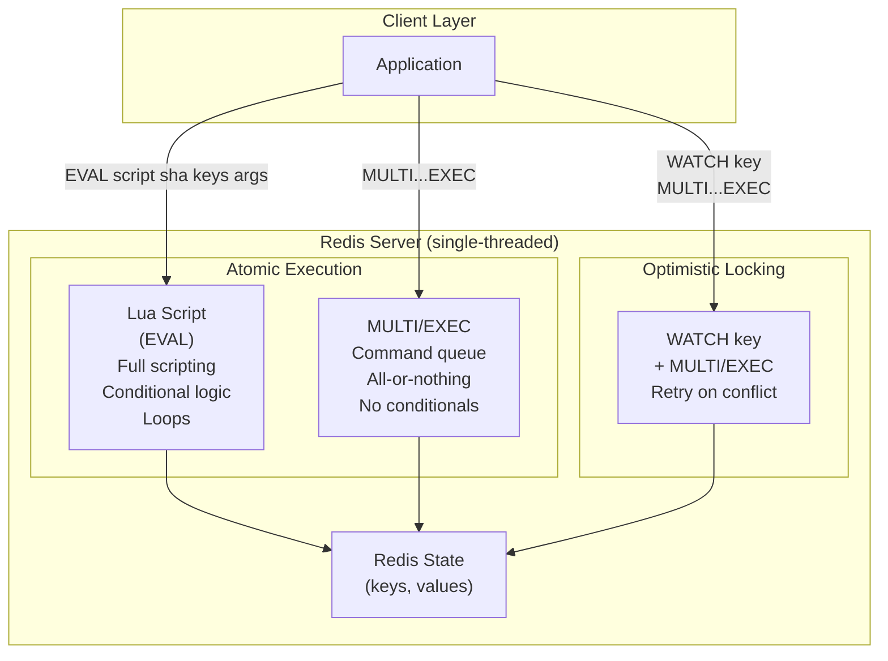
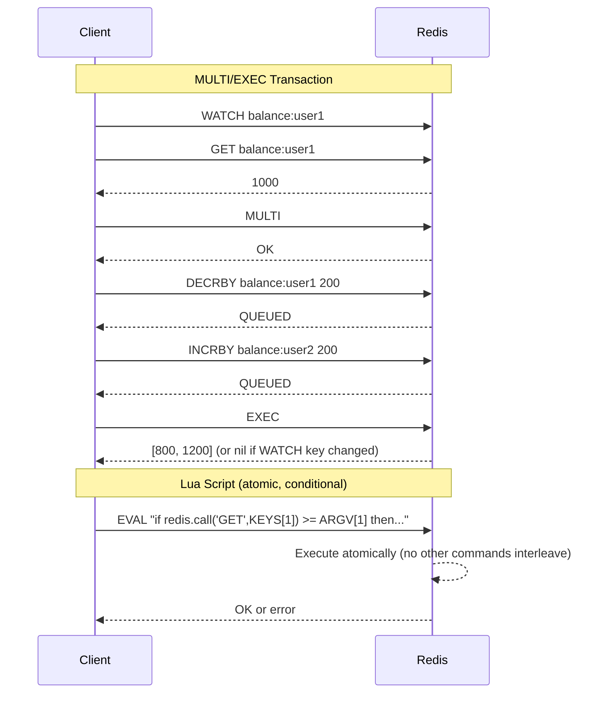
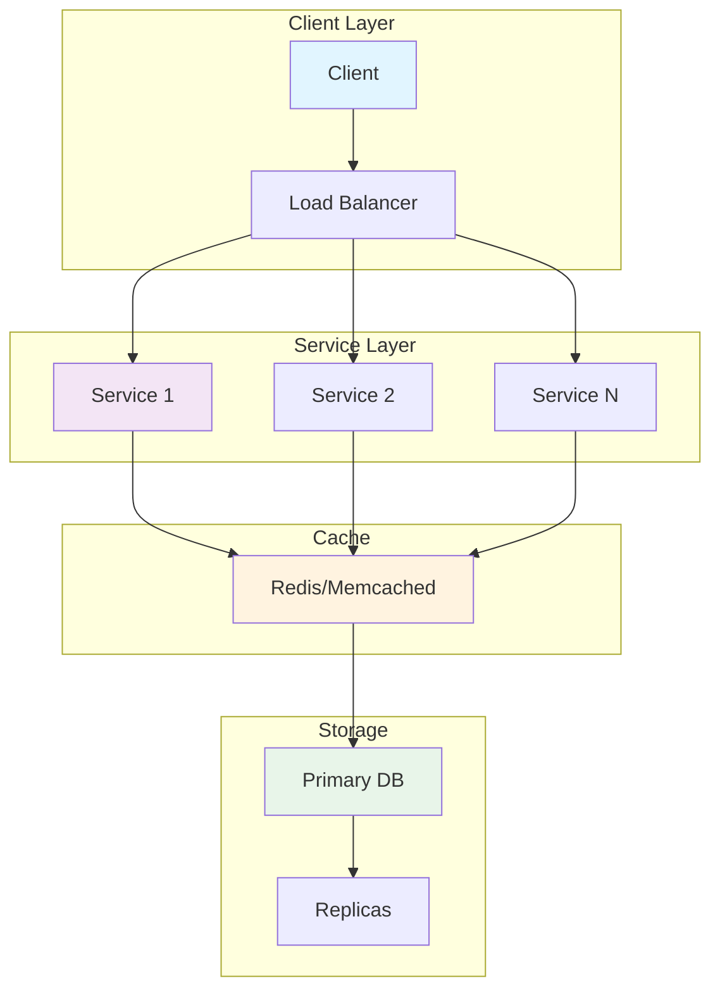
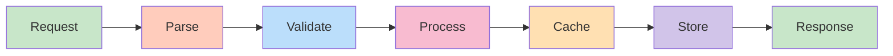
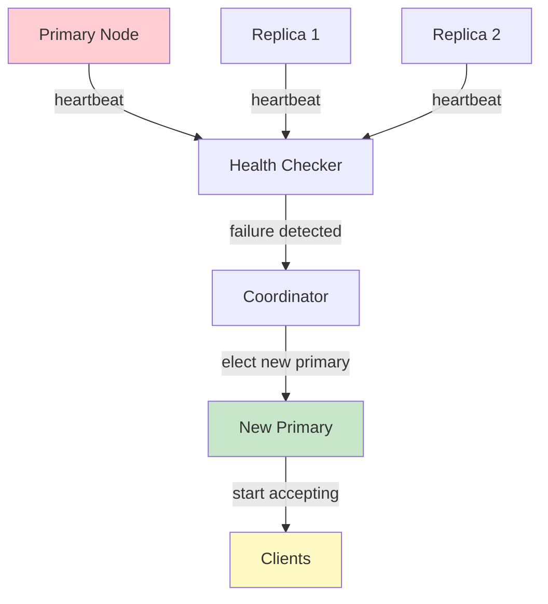
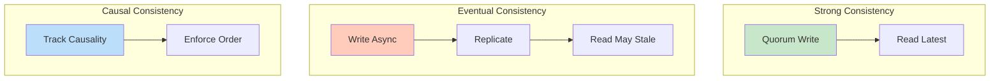
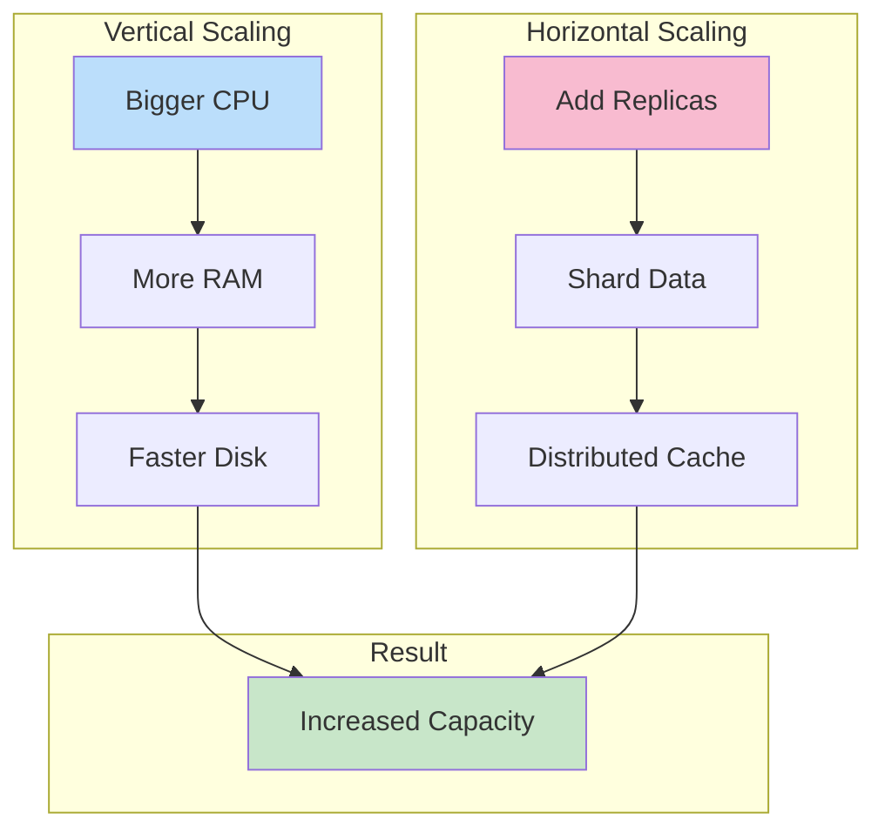

# Redis Lua Scripts and Transactions

## Problem Statement

Design atomic operations in Redis using Lua scripts and MULTI/EXEC transactions — enabling complex multi-key operations, check-and-set patterns, and rate limiters that execute atomically without race conditions.

## Scenario

Redis Lua Scripts and Transactions is a critical component in modern distributed systems. In real-world applications, ensuring data consistency across multiple systems. For example, major tech companies like Netflix, Uber, and Airbnb rely on similar solutions to handle millions of concurrent users and requests. The challenge is achieving this while maintaining sub-100ms latency, 99.99% availability, and gracefully handling 10x traffic spikes during peak demand. This component provides the foundational capability to solve these challenges reliably and efficiently at global scale.

## Users

- **Backend Engineers**: Responsible for implementing and maintaining this system component in production environments. They need to understand the architecture, trade-offs, failure modes, and operational considerations.
- **DevOps/SRE Teams**: Monitor system health, manage scaling policies, handle incidents, and ensure reliability SLAs are met. They need insights into performance characteristics, bottlenecks, and failure recovery mechanisms.
- **Data Engineers**: Design data pipelines and analytics around this system, requiring deep understanding of data flow, consistency guarantees, and throughput characteristics.
- **System Architects**: Make high-level architectural decisions that impact company infrastructure, requiring comprehensive understanding of capabilities, limitations, and scalability boundaries.
- **Security Teams**: Understand security implications, potential vulnerabilities, and compliance requirements for this component.

## PRD

### Functional Requirements
- Store key-value with optional TTL
- Support strings, lists, sets, hashes, sorted sets
- Atomic INCR, APPEND, ZADD operations
- Optional persistence (RDB, AOF)
- Master-slave replication

### Non-Functional Requirements
- Latency: < 1ms for get/set
- Throughput: 100K-1M ops/sec
- Memory: all in-memory (set maxmemory policy)
- Availability: sentinel or cluster HA
- Durability: optional (can lose data without persistence)

### Success Metrics
- Hit rate > 95% for caching
- Latency p99 < 10ms
- Memory utilization < 80%
- Replication lag < 1s


## Flow

The typical operational flow for this system involves these key phases:

1. **Request Arrival**: Client/upstream system sends request with required parameters and context
2. **Validation & Routing**: System validates request format, authentication, and routes to correct handler/shard/instance
3. **Core Processing**: Execute the main algorithm, database query, or business logic on the data/state
4. **State Management**: Update internal state (caches, indexes, counters, logs) with proper atomicity and locking
5. **Response Generation**: Format results and return to requester with relevant metadata (timing, version info)
6. **Observability**: Record metrics (latency, throughput, errors), logs (for debugging), and traces (for performance analysis)

This flow repeats thousands or millions of times per second in production. Each operation's efficiency compounds across the entire system, making careful optimization essential. Bottlenecks at any phase can cascade to impact overall system performance.


## Code Explanation (Detailed)

### Data Structures
- String: Atomic increment, append (cache values, counters)
- List: FIFO queue (rpush/lpop)
- Hash: Object-like (hset/hget)
- Set: Unique values, fast membership (sadd/smembers)
- Sorted Set: Ranked data (zadd/zrevrange for leaderboards)

### Caching Pattern (Cache-Aside)
1. Check cache (fast path, O(1))
2. If miss: fetch from DB (slow)
3. Update cache with TTL (setex)
4. Risk: thundering herd on popular key

### Atomic Operations
- Lua scripts: Complex operations, server-side atomicity
- WATCH/MULTI/EXEC: Optimistic locking
- INCR/ZADD: Inherently atomic

## Architecture Diagram



## Flow Diagram



## Design

### MULTI/EXEC Transactions

```
Commands:
  MULTI       - start transaction queue
  COMMAND     - queued (returns QUEUED, not executed)
  EXEC        - execute all queued commands atomically
  DISCARD     - abort queued commands
  WATCH key   - optimistic lock: abort EXEC if key changed

Properties:
  Atomic: all commands run without interruption
  Isolated: no other client commands interleave
  NOT ACID: errors in EXEC don't rollback others
    Syntax error at QUEUE time: entire EXEC fails
    Runtime error at EXEC time: other commands succeed

WATCH example (check-and-set):
  WATCH balance
  current = GET balance
  if current < amount: DISCARD; error
  MULTI
  DECRBY balance amount
  EXEC
  if exec returns nil: retry (WATCH detected change)

Limitations:
  No conditional logic inside MULTI/EXEC block
  All commands must be known at MULTI time
  If you need "if this then that": use Lua instead
```

### Lua Scripts

```
EVAL script numkeys key [key ...] arg [arg ...]
EVALSHA sha1 numkeys key [key ...]

Properties:
  Atomic: entire script runs without interruption
  No partial execution: script either completes or errors
  Deterministic: must not use random, time (use KEYS/ARGV)
  Persistent: SCRIPT LOAD caches by SHA1

redis.call() vs redis.pcall():
  redis.call(): propagates error (stops script)
  redis.pcall(): catches error, returns error object

Key rule: ALL keys must be passed via KEYS[] array
  Allows Redis Cluster to route correctly
  Never hardcode key names in script body

Common use cases:
  Rate limiting (atomic increment + expire check)
  Distributed lock (SET NX + GET owner)
  Counter with threshold (don't exceed limit)
  Leaderboard update + notification trigger
  Inventory decrement (check > 0 before decrement)
```

### Rate Limiter Patterns

```
Sliding Window Rate Limiter (Lua):
  KEYS[1] = rate:user:1234
  ARGV[1] = current_timestamp_ms
  ARGV[2] = window_ms (60000)
  ARGV[3] = limit (100)
  
  Script:
    1. ZREMRANGEBYSCORE key 0 (now - window)
    2. count = ZCARD key
    3. if count >= limit: return 0 (rate limited)
    4. ZADD key now now
    5. EXPIRE key window_s
    6. return 1 (allowed)

Token Bucket (Lua):
  KEYS[1] = bucket:user:1234
  ARGV[1] = now, ARGV[2] = max_tokens, ARGV[3] = refill_rate
  
  Script:
    1. last_refill, tokens = HMGET key last_refill tokens
    2. elapsed = now - last_refill
    3. new_tokens = min(max, tokens + elapsed * rate)
    4. if new_tokens < 1: return 0
    5. HMSET key last_refill now tokens (new_tokens - 1)
    6. return 1

Fixed Window (simple, less accurate):
  key = rate:user:1234:minute:202601121430
  INCR key -> count
  if count == 1: EXPIRE key 60
  if count > limit: reject
```

### Distributed Lock (Redlock)

```
Single node:
  SET lock:resource owner_id NX EX 30
  if result == OK: acquired
  
  Release (Lua, atomic check-and-delete):
  if redis.call("GET", KEYS[1]) == ARGV[1] then
    return redis.call("DEL", KEYS[1])
  else
    return 0
  end
  
  Critical: must use Lua for release
  Without Lua: GET then DEL has a race condition
  (another owner may have acquired between GET and DEL)

Redlock (multi-node):
  Acquire on N/2+1 of N independent Redis instances
  All must succeed within clock_drift + retry_time
  If not: release all acquired locks
  
  Properties:
    Fault-tolerant: survives N/2 - 1 node failures
    Controversy: not 100% safe in async networks (Kleppmann)
    Use ZooKeeper/etcd for stronger guarantees
```

## Back-of-Envelope Calculations

```
Lua script overhead:
  Startup per EVAL: ~1-2 microseconds
  EVALSHA (cached): <1 microsecond overhead vs EVAL
  Use SCRIPT LOAD + EVALSHA for production (no retransmit)

Rate limiter capacity:
  Sliding window with sorted set: O(log N) per request
  N = requests in window = 100 req/min window
  100K users x 100 requests/window = 10M entries
  Memory: 10M * 64 bytes = 640MB (1 sorted set per user)
  
  Optimization: use separate expiry keys (N keys, not sorted sets)
  Fixed window: 100K keys * 32 bytes = 3.2MB (much more efficient)

Distributed lock throughput:
  Lock acquisition = 1 SET NX EX: 100K locks/s per Redis
  Lock release = 1 EVALSHA: 100K releases/s
  Lock lifecycle = 2 ops: 50K lock cycles/s per Redis
  For 1M lock ops/s: ~20 Redis instances

WATCH retry overhead:
  High contention key: WATCH fails frequently
  10K concurrent clients watching same key: ~100% retry rate
  Use Lua instead (no retries needed): 10x throughput improvement
```

## Design Choices

| Pattern | Conditional Logic | Retry Needed | Complexity | Use Case |
|---|---|---|---|---|
| MULTI/EXEC | No | On WATCH conflict | Low | Simple multi-op |
| WATCH+MULTI/EXEC | Pre-check only | Yes (on conflict) | Medium | Optimistic CAS |
| Lua EVAL | Full scripting | No (atomic) | Medium | Complex logic |
| Lua EVALSHA | Full scripting | No (atomic) | Medium | Production (cached) |
| Redlock | N/A | On acquire fail | High | Distributed lock |

## Python Implementation

```python
import time
import random
import threading
import hashlib
from typing import Any, Callable, Dict, List, Optional, Tuple
from dataclasses import dataclass, field

class RedisSimulator:
    def __init__(self):
        self._store: Dict[str, Any] = {}
        self._expires: Dict[str, float] = {}
        self._zsets: Dict[str, Dict[str, float]] = {}
        self._hashes: Dict[str, Dict[str, str]] = {}
        self._lock = threading.Lock()  # Simulate single-threaded atomicity

    def _is_expired(self, key: str) -> bool:
        exp = self._expires.get(key, 0)
        return exp > 0 and time.time() > exp

    def get(self, key: str) -> Optional[str]:
        if self._is_expired(key):
            self._store.pop(key, None)
            return None
        return self._store.get(key)

    def set(self, key: str, value: str, ex: int = 0, nx: bool = False, xx: bool = False) -> bool:
        if nx and key in self._store and not self._is_expired(key):
            return False
        if xx and (key not in self._store or self._is_expired(key)):
            return False
        self._store[key] = value
        if ex:
            self._expires[key] = time.time() + ex
        return True

    def delete(self, *keys: str) -> int:
        count = 0
        for key in keys:
            if key in self._store:
                del self._store[key]
                count += 1
        return count

    def incr(self, key: str) -> int:
        val = int(self._store.get(key, 0)) + 1
        self._store[key] = str(val)
        return val

    def incrby(self, key: str, amount: int) -> int:
        val = int(self._store.get(key, 0)) + amount
        self._store[key] = str(val)
        return val

    def expire(self, key: str, seconds: int):
        self._expires[key] = time.time() + seconds

    def zadd(self, key: str, mapping: Dict[str, float]) -> int:
        if key not in self._zsets:
            self._zsets[key] = {}
        self._zsets[key].update(mapping)
        return len(mapping)

    def zcard(self, key: str) -> int:
        return len(self._zsets.get(key, {}))

    def zremrangebyscore(self, key: str, min_score: float, max_score: float) -> int:
        zset = self._zsets.get(key, {})
        to_remove = [m for m, s in zset.items() if min_score <= s <= max_score]
        for m in to_remove:
            del zset[m]
        return len(to_remove)

    def hmget(self, key: str, *fields: str) -> List[Optional[str]]:
        h = self._hashes.get(key, {})
        return [h.get(f) for f in fields]

    def hmset(self, key: str, mapping: Dict[str, str]):
        if key not in self._hashes:
            self._hashes[key] = {}
        self._hashes[key].update(mapping)

    def eval_script(self, script_name: str, keys: List[str], args: List[str]) -> Any:
        with self._lock:  # Atomic: no other operation can interleave
            return self._scripts[script_name](self, keys, args)

    _scripts: Dict[str, Callable] = {}

class LuaScriptLibrary:
    def __init__(self, redis: RedisSimulator):
        self._redis = redis
        self._register_scripts()

    def _register_scripts(self):
        self._redis._scripts = {
            "sliding_window_rate_limit": self._sliding_window_rate_limit,
            "token_bucket": self._token_bucket,
            "acquire_lock": self._acquire_lock,
            "release_lock": self._release_lock,
            "atomic_transfer": self._atomic_transfer,
        }

    @staticmethod
    def _sliding_window_rate_limit(redis: RedisSimulator, keys: List[str], args: List[str]) -> int:
        key = keys[0]
        now = float(args[0])
        window_ms = float(args[1])
        limit = int(args[2])
        window_start = now - window_ms

        redis.zremrangebyscore(key, 0, window_start)
        count = redis.zcard(key)
        if count >= limit:
            return 0
        redis.zadd(key, {str(now): now})
        redis.expire(key, int(window_ms / 1000) + 1)
        return 1

    @staticmethod
    def _token_bucket(redis: RedisSimulator, keys: List[str], args: List[str]) -> int:
        key = keys[0]
        now = float(args[0])
        max_tokens = float(args[1])
        refill_rate = float(args[2])  # tokens per second

        vals = redis.hmget(key, "last_refill", "tokens")
        last_refill = float(vals[0]) if vals[0] else now
        tokens = float(vals[1]) if vals[1] else max_tokens

        elapsed = now - last_refill
        new_tokens = min(max_tokens, tokens + elapsed * refill_rate)

        if new_tokens < 1:
            return 0
        redis.hmset(key, {"last_refill": str(now), "tokens": str(new_tokens - 1)})
        return 1

    @staticmethod
    def _acquire_lock(redis: RedisSimulator, keys: List[str], args: List[str]) -> int:
        lock_key = keys[0]
        owner = args[0]
        ttl = int(args[1])
        return 1 if redis.set(lock_key, owner, ex=ttl, nx=True) else 0

    @staticmethod
    def _release_lock(redis: RedisSimulator, keys: List[str], args: List[str]) -> int:
        lock_key = keys[0]
        owner = args[0]
        current = redis.get(lock_key)
        if current == owner:
            redis.delete(lock_key)
            return 1
        return 0

    @staticmethod
    def _atomic_transfer(redis: RedisSimulator, keys: List[str], args: List[str]) -> int:
        src_key, dst_key = keys[0], keys[1]
        amount = int(args[0])
        src_val = int(redis.get(src_key) or 0)
        if src_val < amount:
            return -1  # Insufficient balance
        redis._store[src_key] = str(src_val - amount)
        dst_val = int(redis.get(dst_key) or 0)
        redis._store[dst_key] = str(dst_val + amount)
        return 1

class RateLimiter:
    def __init__(self, redis: RedisSimulator, scripts: LuaScriptLibrary):
        self._redis = redis
        self._scripts = scripts

    def sliding_window(self, user_id: str, limit: int = 100, window_s: int = 60) -> bool:
        key = f"rl:sw:{user_id}"
        now_ms = time.time() * 1000
        result = self._redis.eval_script(
            "sliding_window_rate_limit",
            [key], [str(now_ms), str(window_s * 1000), str(limit)]
        )
        return result == 1

    def token_bucket(self, user_id: str, max_tokens: float = 10, refill_rate: float = 1.0) -> bool:
        key = f"rl:tb:{user_id}"
        result = self._redis.eval_script(
            "token_bucket",
            [key], [str(time.time()), str(max_tokens), str(refill_rate)]
        )
        return result == 1

class DistributedLock:
    def __init__(self, redis: RedisSimulator, scripts: LuaScriptLibrary):
        self._redis = redis
        self._scripts = scripts
        self._owner = f"owner-{random.randint(1000, 9999)}"

    def acquire(self, resource: str, ttl: int = 30) -> bool:
        result = self._redis.eval_script(
            "acquire_lock",
            [f"lock:{resource}"], [self._owner, str(ttl)]
        )
        return result == 1

    def release(self, resource: str) -> bool:
        result = self._redis.eval_script(
            "release_lock",
            [f"lock:{resource}"], [self._owner]
        )
        return result == 1

    def with_lock(self, resource: str, ttl: int = 30):
        class _Context:
            def __init__(self_, lock: "DistributedLock"):
                self_._lock = lock
            def __enter__(self_):
                acquired = self_._lock.acquire(resource, ttl)
                if not acquired:
                    raise RuntimeError(f"Could not acquire lock: {resource}")
                return self_
            def __exit__(self_, *args):
                self_._lock.release(resource)
        return _Context(self)

# Demo
redis = RedisSimulator()
scripts = LuaScriptLibrary(redis)
limiter = RateLimiter(redis, scripts)

print("=== Sliding Window Rate Limiter (100 req/min) ===")
allowed = sum(1 for _ in range(110) if limiter.sliding_window("user:1", limit=100, window_s=60))
print(f"Allowed: {allowed}/110 (expected ~100)")

print("\n=== Token Bucket (10 max tokens, 1 token/s refill) ===")
results = [limiter.token_bucket("user:2", max_tokens=10, refill_rate=1.0) for _ in range(15)]
print(f"Results: {results}")
print(f"Allowed: {sum(results)}/15 (first 10 pass, rest fail)")

print("\n=== Distributed Lock ===")
lock = DistributedLock(redis, scripts)

# Setup accounts
redis.set("balance:alice", "1000")
redis.set("balance:bob", "500")

# Atomic transfer
with lock.with_lock("transfer:alice:bob"):
    result = redis.eval_script("atomic_transfer", ["balance:alice", "balance:bob"], ["200"])
    print(f"Transfer 200 Alice->Bob: {'success' if result == 1 else 'failed'}")

print(f"Alice balance: {redis.get('balance:alice')}")
print(f"Bob balance: {redis.get('balance:bob')}")

# Lock contention
lock2 = DistributedLock(redis, scripts)
a1 = lock.acquire("resource:x", ttl=10)
a2 = lock2.acquire("resource:x", ttl=10)
print(f"\nLock contention: lock1={a1}, lock2={a2} (only one succeeds)")
lock.release("resource:x")
a3 = lock2.acquire("resource:x", ttl=10)
print(f"After release: lock2 retry={a3}")
```

## Java Implementation

```java
import java.util.*;
import java.util.concurrent.*;

public class RedisLuaTransactions {
    static class RedisNode {
        Map<String, String> store = new ConcurrentHashMap<>();
        Map<String, Long> expires = new ConcurrentHashMap<>();
        Map<String, Map<String, Double>> zsets = new ConcurrentHashMap<>();
        private final Object mutex = new Object();

        boolean set(String k, String v, long ttlMs, boolean nx) {
            synchronized (mutex) {
                if (nx && store.containsKey(k)) return false;
                store.put(k, v);
                if (ttlMs > 0) expires.put(k, System.currentTimeMillis() + ttlMs);
                return true;
            }
        }

        String get(String k) {
            Long exp = expires.get(k);
            if (exp != null && System.currentTimeMillis() > exp) { store.remove(k); expires.remove(k); return null; }
            return store.get(k);
        }

        // Sliding window rate limit (Lua-equivalent atomic execution)
        int slidingWindowRateLimit(String key, long nowMs, long windowMs, int limit) {
            synchronized (mutex) {
                Map<String, Double> zset = zsets.computeIfAbsent(key, k -> new LinkedHashMap<>());
                long windowStart = nowMs - windowMs;
                zset.entrySet().removeIf(e -> e.getValue() <= windowStart);
                if (zset.size() >= limit) return 0;
                zset.put(String.valueOf(nowMs), (double) nowMs);
                return 1;
            }
        }

        // Atomic check-and-delete (Lua release lock equivalent)
        int releaseLock(String lockKey, String owner) {
            synchronized (mutex) {
                if (owner.equals(get(lockKey))) { store.remove(lockKey); return 1; }
                return 0;
            }
        }

        // Atomic balance transfer
        int atomicTransfer(String src, String dst, int amount) {
            synchronized (mutex) {
                int srcBal = Integer.parseInt(store.getOrDefault(src, "0"));
                if (srcBal < amount) return -1;
                int dstBal = Integer.parseInt(store.getOrDefault(dst, "0"));
                store.put(src, String.valueOf(srcBal - amount));
                store.put(dst, String.valueOf(dstBal + amount));
                return 1;
            }
        }
    }

    public static void main(String[] args) {
        RedisNode redis = new RedisNode();

        // Rate limiter
        System.out.println("=== Rate Limiter (100 req/min) ===");
        int allowed = 0;
        for (int i = 0; i < 110; i++) {
            if (redis.slidingWindowRateLimit("rl:user1", System.currentTimeMillis(), 60000, 100) == 1) allowed++;
        }
        System.out.println("Allowed: " + allowed + "/110");

        // Distributed lock + atomic transfer
        redis.set("bal:alice", "1000", 0, false);
        redis.set("bal:bob", "500", 0, false);
        String owner = "thread-1";
        boolean acquired = redis.set("lock:transfer", owner, 30000, true);
        System.out.println("Lock acquired: " + acquired);
        int r = redis.atomicTransfer("bal:alice", "bal:bob", 200);
        System.out.println("Transfer: " + (r == 1 ? "success" : "failed"));
        int released = redis.releaseLock("lock:transfer", owner);
        System.out.println("Lock released: " + (released == 1));
        System.out.println("Alice: " + redis.get("bal:alice") + ", Bob: " + redis.get("bal:bob"));
    }
}
```

## Complexity

| Operation | Time | Atomicity | Conditional |
|---|---|---|---|
| MULTI/EXEC | O(commands) | Yes | No |
| WATCH + MULTI/EXEC | O(commands) | Yes (or abort) | Pre-check only |
| EVAL Lua | O(script) | Yes | Full |
| EVALSHA | O(script) | Yes | Full |
| Sliding window RL (Lua) | O(log N) | Yes | Yes |
| Token bucket (Lua) | O(1) | Yes | Yes |
| Distributed lock (Lua) | O(1) | Yes | Yes |

## Common Questions & Answers

**Q: What is Redis and when do you use it?**

A: In-memory key-value data store with sub-millisecond latency. Used for caching (reduce DB load), sessions (user state), queues, real-time counters, leaderboards. Very fast but volatile (data loss on crash without persistence).

**Q: What data structures does Redis support?**

A: Strings (simple values), Lists (FIFO queues), Sets (unique values), Hashes (objects), Sorted Sets (leaderboards), Streams (Kafka-like), HyperLogLog (cardinality), Bitmaps (bitwise ops). Rich beyond simple cache.

**Q: How does Redis persistence work?**

A: RDB (snapshot): periodic point-in-time backup (fast, compact). AOF (append-only file): log all writes (durable, slower). BGSAVE/BGREWRITEAOF: background operations. Choose: speed vs. durability trade-off. Most use both.

**Q: What is Redis replication?**

A: Master-slave architecture: master accepts writes, slaves replicate. Read from master (strong consistency) or slaves (eventual, faster). Slaves can be read-only replicas or chain-replicate to others.

**Q: What is Redis Sentinel?**

A: High availability solution: monitors Redis instances, detects failures, promotes replica to master automatically. Requires 3+ Sentinel instances (majority quorum). Client connects via Sentinel instead of Redis directly.

**Q: What is Redis Cluster?**

A: Distributed Redis: data sharded across multiple nodes (hash slots). Auto-sharding, automatic failover, rebalancing. More complex than Sentinel. Required for massive scale (TB+ data).

**Q: How do you choose between Sentinel and Cluster?**

A: Sentinel: single master, high availability. Cluster: distributed, massive scale. Sentinel for most (simpler), Cluster only if need horizontal scaling. Data > memory = use Cluster.

**Q: How do you handle eviction when Redis runs out of memory?**

A: Set maxmemory policy: LRU, LFU, TTL, random, or no-eviction. LRU/LFU common for caching. TTL for session data. No-eviction blocks writes (safe but risky). Monitor memory usage constantly.

**Q: What is key expiration in Redis?**

A: Keys have optional TTL (time-to-live). After expiration, key automatically deleted. Lazy deletion (on access) + periodic cleanup. Use for session data, cache, or temporary counters. Check expiration policy for accuracy.

**Q: How do you secure Redis?**

A: Use password authentication (requirepass). ACLs (Redis 6+): per-user permissions. Run inside VPC (no internet access). Disable dangerous commands (FLUSHDB, CONFIG). TLS for remote connections.

## Follow-up Questions & Answers

**Q: How would you implement distributed locking with Redis?**

A: SET key value EX ttl NX (atomic: set if not exists with TTL). Acquire lock, execute critical section, delete key. Risk: crash loses lock (data consistency issue). Redlock solves this with multiple instances.

**Q: What is Redlock and what problem does it solve?**

A: Distributed lock across 5 Redis instances. Acquire lock on majority (quorum). Survives single instance failure. Overkill for most, but necessary for safety-critical sections. Trade: performance for correctness.

**Q: How would you implement rate limiting with Redis?**

A: Use sorted set with timestamps or hash with counters. Increment on each request, check against limit. Fast (O(log n)). Alternative: token bucket in Lua script. Faster than database.

**Q: How do you handle Redis memory limits and eviction policy?**

A: Set maxmemory (bytes), maxmemory-policy (LRU/LFU/TTL/random). Monitor hit rate (eviction = misses). Can also manually delete old keys or use cache-aside with database.

**Q: Can you use Redis for reliable message queues?**

A: Partially. Lists (basic) or Streams (better). Lists: FIFO, no persistence without RDB. Streams: replicas, consumer groups, reliable delivery (Kafka-like). For critical: use Kafka instead.

**Q: How would you implement Pub/Sub in Redis?**

A: Publisher sends to channel, subscribers receive. Fire-and-forget (no persistence). Good for notifications. Bad for reliable messaging (missed if subscriber offline). Better: Streams for reliable pub/sub.

**Q: How do you scale Redis beyond single node?**

A: Use Cluster (distributed), replicate read-heavy workload (slaves), or shard in application code. Cluster best for massive scale. Replication for read scaling. App sharding for distributed control.

**Q: Can you implement transactions in Redis?**

A: MULTI/EXEC: atomic batch of commands. Optimistic locking with WATCH. No rollback (all-or-nothing at command level). Use Lua scripts for complex atomic operations.

**Q: How would you debug Redis performance issues?**

A: SLOWLOG: find slow commands. MONITOR: see all commands in real-time. Memory analysis: MEMORY DOCTOR, key usage patterns. Network: latency between app and Redis. Profiling tools.

**Q: How do you backup and restore Redis?**

A: Backup: RDB snapshots, AOF files, or replication. Restore: copy files, or use Redis replication + replicaof. Backup strategy: periodic snapshots + AOF for durability. Test recovery regularly.


## System Overview

**Scale Metrics:**
- Throughput: Millions of operations per second
- Latency: Sub-millisecond to sub-second response times
- Data volume: Gigabytes to Petabytes
- Concurrent users: Millions to billions
- Availability: 99.99% to 99.999% uptime SLA

**Key Components:**
- Request handling and routing
- Data processing and storage
- Replication and consistency
- Failure detection and recovery
- Monitoring and alerting

## Architecture Diagrams

### System Architecture



### Data Flow



### Failover Mechanism



### Consistency Models



### Scaling Strategy



## Implementation Examples

### Python Implementation

```python
# Python Implementation

from typing import Any, Optional
from dataclasses import dataclass
from datetime import datetime
import json
import logging

logger = logging.getLogger(__name__)

@dataclass
class Config:
    """Configuration for the system."""
    timeout_ms: int = 5000
    retry_count: int = 3
    batch_size: int = 100
    max_connections: int = 1000

class Handler:
    """Main handler class for operations."""

    def __init__(self, config: Config):
        self.config = config
        self.metrics = {"success": 0, "failure": 0, "latency_ms": []}

    async def process(self, data: Any) -> Any:
        """Process request with error handling."""
        try:
            # Validate input
            self._validate(data)

            # Execute operation
            result = await self._execute(data)

            # Track metrics
            self.metrics["success"] += 1
            return result

        except Exception as e:
            logger.error(f"Processing failed: {e}")
            self.metrics["failure"] += 1
            raise

    def _validate(self, data: Any) -> None:
        """Validate input data."""
        if data is None:
            raise ValueError("Data cannot be None")

    async def _execute(self, data: Any) -> Any:
        """Execute core logic."""
        # Implement actual logic here
        return {"status": "success", "timestamp": datetime.now().isoformat()}

    def get_metrics(self) -> dict:
        """Return collected metrics."""
        return self.metrics

# Usage example
async def main():
    config = Config(timeout_ms=5000, batch_size=100)
    handler = Handler(config)
    result = await handler.process({"key": "value"})
    print(f"Result: {result}")
    print(f"Metrics: {handler.get_metrics()}")
```

### Java Implementation

```java
// Java Implementation

import java.util.*;
import java.util.concurrent.*;
import java.time.Instant;
import org.slf4j.Logger;
import org.slf4j.LoggerFactory;

public class SystemHandler {
    private static final Logger logger = LoggerFactory.getLogger(SystemHandler.class);

    private final Config config;
    private final Map<String, Long> metrics = new ConcurrentHashMap<>();
    private final ExecutorService executor;

    public static class Config {
        public int timeoutMs = 5000;
        public int retryCount = 3;
        public int batchSize = 100;
        public int maxConnections = 1000;

        public Config withTimeoutMs(int timeout) {
            this.timeoutMs = timeout;
            return this;
        }
    }

    public SystemHandler(Config config) {
        this.config = config;
        this.executor = Executors.newFixedThreadPool(
            Math.min(config.maxConnections, 10)
        );
        metrics.put("success", 0L);
        metrics.put("failure", 0L);
    }

    public <T> T process(Object data) throws Exception {
        try {
            // Validate input
            validate(data);

            // Execute operation
            Object result = execute(data);

            // Track metrics
            metrics.put("success", metrics.get("success") + 1);
            return (T) result;

        } catch (Exception e) {
            logger.error("Processing failed: {}", e.getMessage());
            metrics.put("failure", metrics.get("failure") + 1);
            throw e;
        }
    }

    private void validate(Object data) throws IllegalArgumentException {
        if (data == null) {
            throw new IllegalArgumentException("Data cannot be null");
        }
    }

    private Object execute(Object data) throws Exception {
        // Implement core logic
        return Map.of(
            "status", "success",
            "timestamp", Instant.now().toString()
        );
    }

    public Map<String, Long> getMetrics() {
        return new HashMap<>(metrics);
    }

    public void shutdown() {
        executor.shutdown();
    }

    public static void main(String[] args) throws Exception {
        Config config = new Config()
            .withTimeoutMs(5000);

        SystemHandler handler = new SystemHandler(config);
        Object result = handler.process(Map.of("key", "value"));
        System.out.println("Result: " + result);
        System.out.println("Metrics: " + handler.getMetrics());
        handler.shutdown();
    }
}
```

## Back-of-Envelope Calculations

### Traffic & Throughput
**Assumptions:**
- Daily active users: 100 million (100M)
- Requests per user per day: 50
- Peak hour traffic: 10% of daily (concentrated)
- Request distribution: 70% read, 30% write

**Calculations:**
```
Total daily requests = 100M users × 50 requests = 5 billion requests/day
Average RPS = 5B requests / 86400 seconds ≈ 57,870 RPS
Peak hour RPS = (5B / 86400) × (100 / 10) ≈ 578,700 RPS
Peak minute RPS = 578,700 / 60 ≈ 9,645 RPS

Read operations = 57,870 × 0.7 ≈ 40,509 RPS (average)
Write operations = 57,870 × 0.3 ≈ 17,361 RPS (average)
```

### Storage Requirements
**Assumptions:**
- Data per user: 1 KB (profile, settings)
- Data per transaction: 500 bytes
- Data retention: 3 years

**Calculations:**
```
User profile storage = 100M × 1 KB = 100 GB
Transaction data = 5B requests/day × 500 bytes × 365 × 3 = 2.74 PB
Total storage ≈ 2.75 PB
Replication factor: 3× → 8.25 PB raw storage

Backup storage (weekly snapshots): 8.25 PB × 52 weeks = 429 PB
```

### Network Bandwidth
**Assumptions:**
- Average request size: 2 KB
- Average response size: 5 KB
- Replication overhead: 2× (write to replicas)

**Calculations:**
```
Inbound bandwidth = 57,870 RPS × 2 KB = 115.74 MB/s
Outbound bandwidth = 57,870 RPS × 5 KB = 289.35 MB/s
Replication bandwidth = 17,361 RPS × 2 KB × 2 = 69.44 MB/s
Total peak bandwidth ≈ 474 MB/s ≈ 3.8 Tbps (peak hour)
```

### Compute Requirements
**Assumptions:**
- Processing time per request: 10 ms
- CPU efficiency: 1 core handles 50 RPS

**Calculations:**
```
CPUs needed for average traffic = 57,870 RPS / 50 = 1,158 cores
CPUs needed for peak traffic = 578,700 RPS / 50 = 11,574 cores
Overprovisioning factor: 1.5× → 17,361 cores total

Using 16 cores per server = 17,361 / 16 ≈ 1,085 servers
With 3:1 replication = 3,255 servers needed
Regional redundancy (3 regions) = 9,765 servers
```

### Latency Analysis (p99)
**Components:**
- Network latency: 5 ms
- Processing: 10 ms
- Storage access: 50 ms (disk), 1 ms (cache)
- Replication write: 20 ms

**Path Analysis:**
```
Cache hit path: 5 + 1 + 5 = 11 ms
Database read path: 5 + 10 + 50 + 5 = 70 ms
Write path: 5 + 10 + 20 + 5 = 40 ms
```

### Cost Estimation
**Monthly costs (approximate):**
```
Compute: 9,765 servers × $1,000/month = $9.765M
Storage: 8.25 PB × $10/GB/month = $82.5M
Bandwidth: 3.8 Tbps × $0.12/GB = $456M
Personnel: 100 engineers × $200K = $20M
Total: ~$568M/month
Cost per user: $5.68/month
```


## Interview Questions & Answers

### Q1: Design the System from Scratch

**Question:** Design a system that can handle 1 billion requests per day with sub-100ms latency.

**Answer Structure:**
1. **Clarify requirements**: DAU, request types, geographic distribution, consistency needs
2. **Back-of-envelope**: Calculate RPS (11.5K avg, 115K peak), storage, bandwidth
3. **High-level design**: Load balancing → services → cache → storage
4. **Deep dive**:
   - Horizontal scaling with sharding
   - Multi-region active-active with eventual consistency
   - Caching strategy (write-through for critical data)
   - Monitoring: metrics, logging, tracing
5. **Bottlenecks**: Identify and address each
6. **Trade-offs**: Consistency vs. availability, latency vs. cost

### Q2: Scaling Challenges

**Question:** You're growing from 10M to 1B users (100x). What breaks and how do you fix it?

**Answer:**
- **Database bottleneck**: Sharding by user ID, consistent hashing, shard rebalancing
- **Cache hit rate drops**: Larger working set, tiered caching (L1: local, L2: distributed)
- **Replication lag**: Write-through for consistency-critical data, eventual consistency elsewhere
- **Operational complexity**: Infrastructure-as-code, auto-scaling, chaos engineering
- **Cost**: Optimize resource utilization, use reserved instances, spot instances for batch

### Q3: Failure Scenarios

**Question:** Your primary database goes down. What happens? How do you recover?

**Answer:**
- **Detection**: Health check timeout (3-5 seconds)
- **Failover**: Automatic promotion of replica using Raft consensus
- **Impact**: Write requests fail for ~10 seconds, reads use replicas
- **Recovery**: Background sync of failed node, re-add to cluster
- **Lessons**: Circuit breakers prevent cascade, bulkhead limits blast radius

### Q4: Consistency Requirements

**Question:** Do you need strong or eventual consistency? Why?

**Answer:**
- **Strong consistency**: Critical for financial transactions, inventory, user auth
  - Implementation: Quorum writes, read-after-write
  - Cost: Higher latency (p99 100ms+), lower throughput

- **Eventual consistency**: Fine for user feeds, recommendations, analytics
  - Implementation: Async replication, read-repair
  - Benefit: Lower latency (p99 <10ms), higher throughput

- **Hybrid approach**: Consistency per operation type, not global

### Q5: Performance Optimization

**Question:** How would you reduce p99 latency from 100ms to 20ms?

**Answer:**
1. **Profile** (measure first): Identify bottleneck (storage, network, compute)
2. **Caching**: Multi-tier (L1 local, L2 distributed), bloom filters for misses
3. **Batching**: Group operations, reduce RPC overhead
4. **Connection pooling**: Reuse TCP connections, reduce handshake latency
5. **Async I/O**: Non-blocking operations, increase parallelism
6. **Database optimization**: Indexing, query optimization, read replicas
7. **Code optimization**: Reduce allocations, use faster algorithms
8. **Hardware**: SSD for storage, faster network interconnects

### Q6: Operational Concerns

**Question:** How do you deploy a new version with zero downtime?

**Answer:**
1. **Canary deployment**: Roll out to 1% of servers, monitor metrics
2. **Gradual rollout**: 1% → 10% → 50% → 100% as confidence increases
3. **Health checks**: Automated rollback if error rate exceeds threshold
4. **Database migration**: Schema changes with backward compatibility
5. **Feature flags**: Toggle features independently of deployment
6. **Monitoring**: Enhanced alerting during rollout, easy incident response


## Technology Stack Recommendations

| Layer | Technology | Why |
|-------|-----------|-----|
| Load Balancing | Nginx, HAProxy, AWS ALB | Distribute traffic, health checks |
| Service Framework | FastAPI (Python), Spring Boot (Java) | Async, built-in monitoring |
| Caching | Redis, Memcached | Sub-millisecond latency, distributed |
| Primary Storage | PostgreSQL, MySQL | ACID, complex queries, reliability |
| Analytics | Elasticsearch, Data Warehouse | Full-text search, time-series analysis |
| Streaming | Kafka, AWS Kinesis | Event processing, real-time |
| Observability | Prometheus, ELK Stack, Jaeger | Metrics, logs, traces |

## Lessons Learned

1. **Premature optimization kills projects**: Start simple, measure, then optimize
2. **Consistency is hard**: Eventually consistent systems are tricky to reason about
3. **Monitoring is non-negotiable**: You can't fix what you can't see
4. **Failure is not rare**: Plan for it, test it, automate recovery
5. **Cost grows with complexity**: Each component adds operational overhead

## Related Topics

- Database design and optimization
- Distributed consensus algorithms
- Load balancing strategies
- Caching mechanisms and patterns
- Monitoring and alerting systems
- Security and compliance


## Back-of-the-Envelope Calculations

**System Load Estimation:**
- 1M daily active users × 10 requests/day = 10M requests/day
- Peak QPS = 10M / 86400 × 3 (peak factor) ≈ 350 QPS
- API server capacity: 1000 QPS/server → 1 server sufficient at peak
- With 2x redundancy: 2 servers minimum

**Storage Estimation:**
- 1M users × 10KB average data = 10GB structured data
- Annual growth: 10GB × 365 = 3.65TB/year
- With 3x replication: 11TB/year
- SSD cost ($0.10/GB): $1,100/year

**Bandwidth:**
- 350 QPS × 10KB response = 3.5MB/sec outbound
- Monthly egress: 3.5MB × 86400 × 30 = 9TB/month
