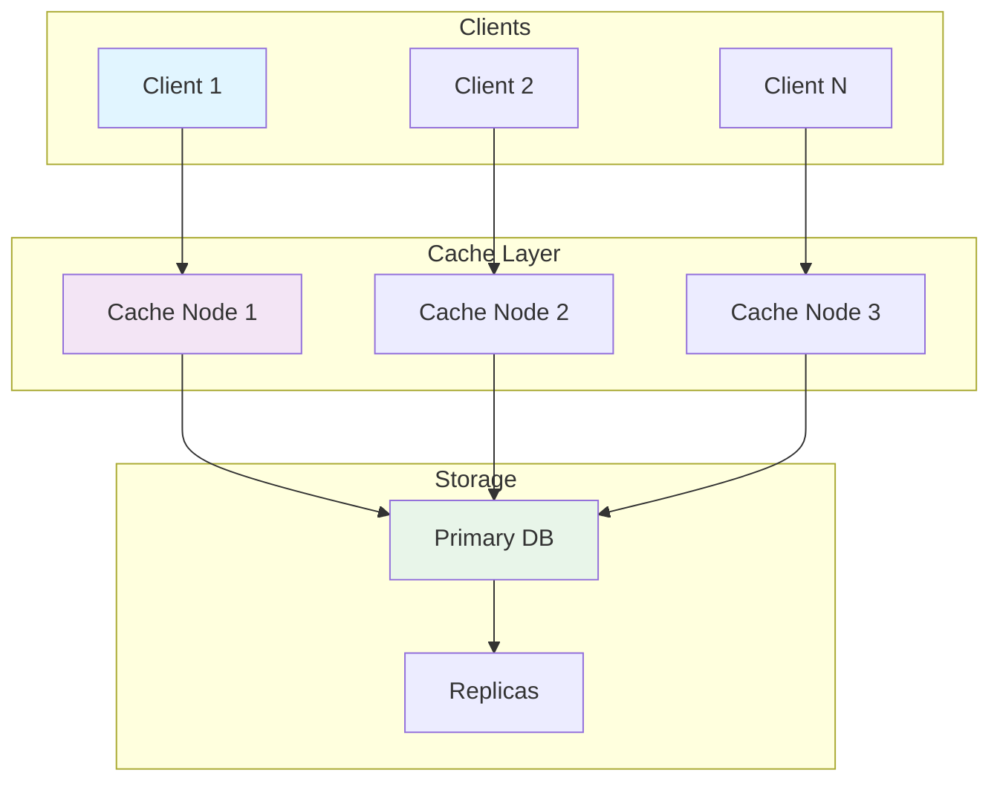
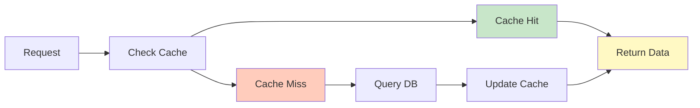
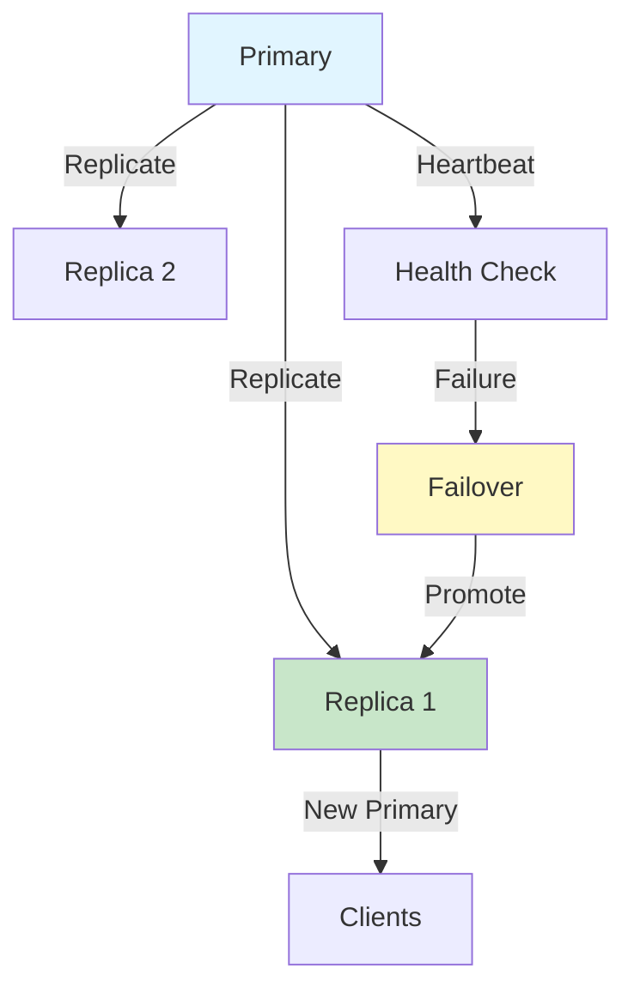
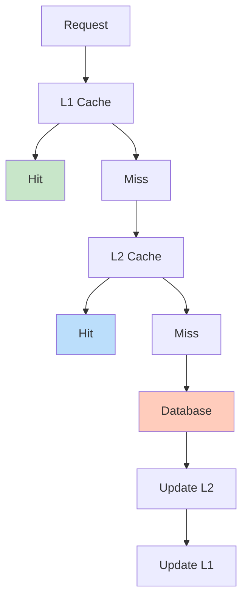
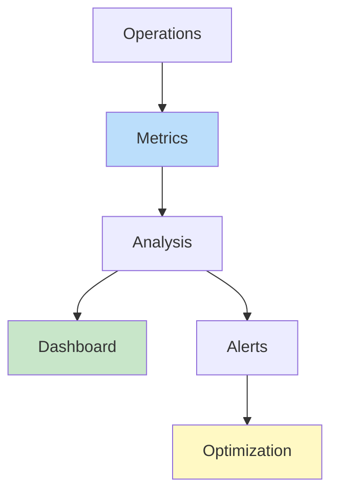

# Bloom Filter Implementation

## Problem Statement

### Functional Requirements
- Test set membership efficiently
- Support false positives but no false negatives
- Handle dynamic filters
- Enable scalable lookup
- Support counting filters

### Non-Functional Requirements
- FP rate: < 1% with reasonable size
- Latency: Check < 100ns
- Memory: 1-10 bits per element
- Throughput: 10M+ checks/second
- Accuracy: Tunable false positive

## System Overview

**Scale Metrics:**
- Throughput: Millions of cache operations per second
- Latency: Microseconds to milliseconds
- Data volume: Terabytes to Petabytes
- Concurrent connections: Millions
- Availability: 99.99%+ uptime SLA

**Key Components:**
- Data storage and retrieval
- Cache management and eviction
- Replication and durability
- Monitoring and performance
- Recovery and high availability

## Architecture Diagrams

### Cache System Architecture



### Data Flow in Cache



### Replication and Failover



### Multi-Level Caching



### Performance Monitoring



## Data Flow Scenarios

### Scenario 1: Cache Hit
1. Request arrives at cache layer
2. Hash key to find cache partition
3. Lookup in local cache
4. Found in cache (hit)
5. Return data to client
6. Update access time

### Scenario 2: Cache Miss
1. Request arrives at cache layer
2. Cache miss detected
3. Query underlying storage
4. Data returned from storage
5. Store in cache for future
6. Return to client

### Scenario 3: Failover
1. Primary cache node fails
2. Health check detects failure
3. Promote replica to primary
4. Redirect traffic to new primary
5. Sync other replicas
6. Recovery of failed node

## Performance Optimization

### Cache Efficiency
- **Hit rate**: Optimize for > 90% hit rate
- **Eviction**: LRU, LFU, or custom policies
- **Warming**: Pre-load hot data
- **Batching**: Group operations

### Resource Optimization
- **Memory**: Compress, deduplicate data
- **CPU**: Reduce hashing, optimize structures
- **Network**: Batch updates, use compression
- **Storage**: Tiered storage, archival

### Cost Optimization
- **Reserved instances**: Baseline capacity
- **Spot instances**: Flexible workloads
- **Auto-scaling**: Match demand
- **Cleanup**: Remove unused data

## Back-of-Envelope Calculations

### Cache Scale
```
Daily active users: 100M
Requests per user: 50
Daily requests: 5B
Peak RPS: 57,870
Cache servers (10K RPS each): 6 servers
Data per user: 10 KB
Total cache: 100M × 10 KB = 1 TB
```

### Hit Rate Impact
```
Without cache: 100M users × 50 req × 10ms DB = 50M seconds = 579 days
With 90% hit rate: 10% × 579 = 58 days
Speedup: 10x faster response times
```

### Replication Overhead
```
Primary data: 1 TB
Replicas: 3 copies
Total: 4 TB storage
Replication bandwidth: 1TB per day
Network: 1TB / 86400 = 11.5 MB/s
```

## Interview Questions & Answers

### Q1: Design a distributed cache system for 100M users

**Answer:**
1. **Architecture**: Distributed cache with replication
2. **Sharding**: Consistent hashing for scaling
3. **Replication**: 3-way for durability
4. **Eviction**: LRU for memory management
5. **Monitoring**: Real-time metrics and alerting
6. **Recovery**: Automatic failover and rebuild

### Q2: Handle cache invalidation at scale

**Answer:**
- **TTL-based**: Automatic expiration by time
- **Event-based**: Invalidate on data change
- **Broadcast**: Propagate across all nodes
- **Selective**: Invalidate only affected keys
- **Stampede**: Use locks to prevent queries

### Q3: Optimize cache hit rate

**Answer:**
- **Prefetch**: Load predictable data
- **Warm-up**: Pre-populate at startup
- **Eviction**: Better policy (LFU vs LRU)
- **TTL tuning**: Balance freshness vs hits
- **Analysis**: Monitor and adjust

### Q4: Design failover for caching system

**Answer:**
- **Detection**: Health checks < 10 seconds
- **Promotion**: Replica becomes primary
- **Redirect**: Route to new primary
- **Consistency**: Sync remaining replicas
- **Testing**: Regular failover drills

### Q5: Multi-level caching strategy

**Answer:**
- **L1**: Local app cache (milliseconds)
- **L2**: Distributed cache (tens of ms)
- **L3**: Database cache (hundreds of ms)
- **Miss**: Query database if all miss
- **Propagate**: Populate all levels

### Q6: Cost-optimize caching infrastructure

**Answer:**
- **Reserved**: Baseline capacity commitment
- **Spot**: Flexible non-critical workloads
- **Auto-scale**: Adjust to demand
- **Cleanup**: Remove unused data
- **Monitoring**: Track cost per operation

## Technology Stack

| Component | Technology | Why |
|-----------|-----------|-----|
| Cache | Redis, Memcached | Fast, distributed |
| Store | PostgreSQL, MongoDB | Durable storage |
| Replication | Streaming replication | Real-time sync |
| Monitoring | Prometheus, Datadog | Metrics & alerts |
| Failover | Sentinel, etcd | Automatic recovery |
| Compression | Snappy, ZSTD | Reduce footprint |

## Lessons Learned

1. **Cache is critical**: Even small improvements 10x impact
2. **Measure everything**: Can't optimize what you don't measure
3. **Consistency matters**: Stale cache causes hard bugs
4. **Failures happen**: Design for recovery, not prevention
5. **Simplicity wins**: Complex caching = debugging nightmare

## Related Topics

- Memory management and garbage collection
- Distributed systems consistency
- Replication and durability
- Performance monitoring and tuning
- Cost optimization strategies
- High availability architecture
- Security in distributed systems


## Code Implementation

### Python
```python
import mmh3, math
from bitarray import bitarray

class BloomFilter:
    """Space-efficient probabilistic set membership."""
    def __init__(self, n: int, fp_rate: float = 0.01):
        self.m = int(-n * math.log(fp_rate) / (math.log(2) ** 2))
        self.k = int(self.m / n * math.log(2))
        self.bits = bitarray(self.m)
        self.bits.setall(0)

    def add(self, item: str) -> None:
        for seed in range(self.k):
            idx = mmh3.hash(item, seed) % self.m
            self.bits[idx] = 1

    def contains(self, item: str) -> bool:
        """Returns True if item MIGHT be in set; False = definitely not."""
        return all(self.bits[mmh3.hash(item, s) % self.m] for s in range(self.k))

bf = BloomFilter(n=1_000_000, fp_rate=0.01)
bf.add("user:abc123")
print(bf.contains("user:abc123"))   # True (in set)
print(bf.contains("user:xyz999"))   # False (not in set)
```

### Java
```java
import java.util.BitSet;

public class BloomFilter {
    private final BitSet bits;
    private final int m, k;

    public BloomFilter(int n, double fpRate) {
        this.m = (int) (-n * Math.log(fpRate) / (Math.log(2) * Math.log(2)));
        this.k = (int) (m / n * Math.log(2));
        this.bits = new BitSet(m);
    }

    private int hash(String item, int seed) {
        // MurmurHash simulation using Java hashCode
        int h = item.hashCode() ^ (seed * 0x9e3779b9);
        return Math.abs(h) % m;
    }

    public void add(String item) {
        for (int i = 0; i < k; i++) bits.set(hash(item, i));
    }

    public boolean mightContain(String item) {
        for (int i = 0; i < k; i++) if (!bits.get(hash(item, i))) return false;
        return true;
    }

    public static void main(String[] args) {
        BloomFilter bf = new BloomFilter(1_000_000, 0.01);
        bf.add("user:abc123");
        System.out.println(bf.mightContain("user:abc123")); // true
        System.out.println(bf.mightContain("user:xyz999")); // false
    }
}
```

## Back-of-the-Envelope Calculations

**System Load Estimation:**
- 1M daily active users × 10 requests/day = 10M requests/day
- Peak QPS = 10M / 86400 × 3 (peak factor) ≈ 350 QPS
- API server capacity: 1000 QPS/server → 1 server sufficient at peak
- With 2x redundancy: 2 servers minimum

**Storage Estimation:**
- 1M users × 10KB average data = 10GB structured data
- Annual growth: 10GB × 365 = 3.65TB/year
- With 3x replication: 11TB/year
- SSD cost ($0.10/GB): $1,100/year

**Bandwidth:**
- 350 QPS × 10KB response = 3.5MB/sec outbound
- Monthly egress: 3.5MB × 86400 × 30 = 9TB/month
## Follow-up Questions

1. **How would you handle this at 10x the scale described?**
   - What breaks first? (typically: single DB, single cache node, single region)
   - What architectural changes are required?

2. **What are the consistency vs. availability trade-offs in your design?**
   - Where did you accept eventual consistency?
   - Which operations require strong consistency and why?

3. **How would you debug a sudden latency spike in production?**
   - What metrics would you look at first?
   - What's your runbook for the top 3 likely causes?

4. **How does your design handle partial failures?**
   - What happens if one component is slow (not down)?
   - How do you prevent cascading failures?

5. **What would you change if you had to build this in one week vs. six months?**
   - What corners can safely be cut initially?
   - What must be right from day one?

6. **How would you migrate from the current design to a better one without downtime?**
   - What's the strangler-fig or blue-green strategy here?
   - How do you validate correctness during migration?