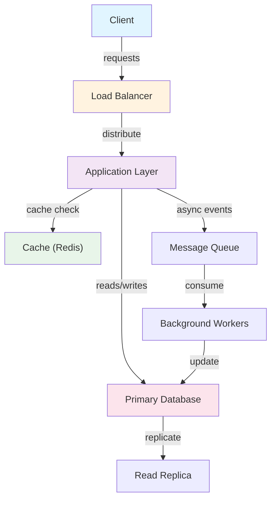
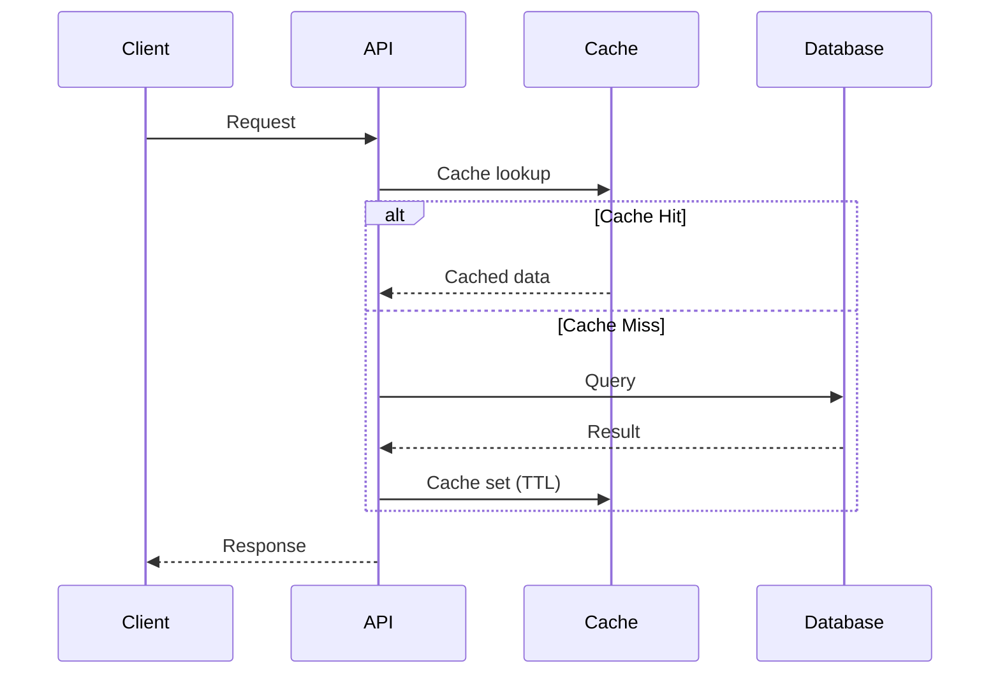
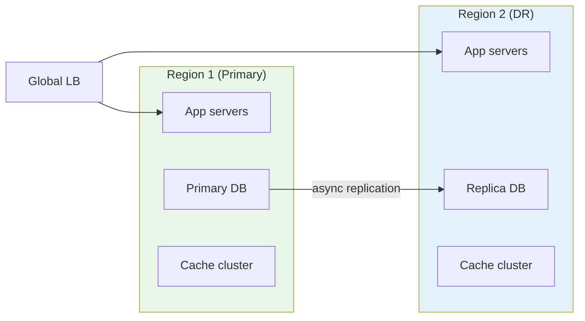

# System Design Documentation

Comprehensive system design guides covering 39 different systems, patterns, and architectures. Each document includes architecture diagrams, Q&A, calculations, design choices, follow-ups, and code implementations.

## 📚 Organization

System design problems are organized into 9 categories with increasing complexity:

### 01. [Caching Systems](01-caching/) (2 problems)
- **LRU Cache**: Eviction policy with O(1) get/put
- **LFU Cache**: Frequency-based eviction with tie-breaking

**Learn**: Caching strategies, eviction policies, data structure optimization

---

### 02. [Core Algorithms](02-core-algorithms/) (3 problems)
- **Rate Limiter**: Token bucket and sliding window algorithms
- **URL Shortener**: Distributed ID generation with Snowflake
- **Parking Lot**: Object modeling and state management

**Learn**: Algorithm design, distributed systems basics, real-time constraints

---

### 03. [Design Patterns](03-design-patterns/) (5 problems)
- **Observer**: Event-driven architecture and loose coupling
- **Strategy**: Algorithm encapsulation and runtime switching
- **Factory**: Object creation and abstraction
- **Decorator**: Dynamic behavior composition
- **Adapter**: Interface compatibility and integration

**Learn**: OOP principles (SOLID), extensibility, design trade-offs

---

### 04. [Distributed Systems](04-distributed-systems/) (3 problems)
- **Pub-Sub System**: Async messaging and event propagation
- **Thread Pool**: Task execution and resource management
- **Load Balancer**: Request distribution and failover

**Learn**: Concurrency, async patterns, fault tolerance, load distribution

---

### 05. [Real-world Applications](05-real-world-apps/) (5 problems)
- **News Feed**: Caching layers and ranking algorithms
- **E-commerce**: Inventory management and payment processing
- **Ride-sharing**: Location tracking and dynamic pricing
- **Chat System**: WebSocket management and message ordering
- **Video Streaming**: Adaptive bitrate and CDN optimization

**Learn**: System integration, user experience, scale challenges

---

### 06. [Data Systems](06-data-systems/) (7 problems)
- **Database Sharding**: Data partitioning and consistency
- **Message Queue**: Durability and ordering guarantees
- **Search Engine**: Indexing and relevance ranking
- **Recommendation Engine**: ML-based personalization
- **Leaderboard**: Real-time ranking with updates
- **Payment System**: Transaction processing and PCI DSS
- **Wallet System**: Balance management and disputes

**Learn**: Databases, distributed data, consistency models, transactions

---

### 07. [Social Features](07-social-features/) (4 problems)
- **Followers System**: Graph traversal and relationship management
- **Notifications**: Delivery optimization and preferences
- **API Gateway**: Request routing and rate limiting
- **WebSocket Server**: Long-lived connections and broadcasting

**Learn**: Graph databases, real-time communication, API design

---

### 08. [Infrastructure Patterns](08-infrastructure/) (3 problems)
- **Distributed Transactions**: 2PC and Saga patterns
- **Circuit Breaker**: Fault isolation and resilience
- **Saga Pattern**: Compensating transactions for consistency

**Learn**: Failure handling, consensus, distributed consistency

---

### 09. [Storage & Analytics](09-storage-analytics/) (7 problems)
- **Photo Sharing**: Image storage and CDN distribution
- **Time Series Database**: Compression and retention policies
- **Log Aggregation**: Collection and search at scale
- **Like/Comment System**: Engagement tracking and counters
- **Auction System**: Bidding mechanics and conflict prevention
- **Transaction Ledger**: Immutable audit trails
- **Consensus Algorithm**: Raft and leader election

**Learn**: File storage, time-series data, analytics, immutability

---

## 🎯 How to Use This Guide

### For Interview Preparation
1. **Start with fundamentals**: Caching → Algorithms → Patterns
2. **Deep dive**: Choose a category and master all problems
3. **Practice**: Implement code, discuss trade-offs, explain at scale

### For System Design Practice
1. **Read architecture**: Understand the problem and design
2. **Study Q&A**: Learn common pitfalls and considerations
3. **Do calculations**: Practice capacity planning
4. **Implement code**: Build working prototypes
5. **Discuss trade-offs**: Compare approaches

### For Building Real Systems
- Use as reference architecture for your own systems
- Adapt patterns to your specific constraints
- Refer to complexity analysis for bottleneck identification

---

## 📊 Coverage Summary

| Category | Count | Focus |
|----------|-------|-------|
| Caching | 2 | Data structure optimization, eviction |
| Core Algorithms | 3 | Algorithm design, real-time constraints |
| Design Patterns | 5 | OOP principles, extensibility |
| Distributed Systems | 3 | Concurrency, async, fault tolerance |
| Real-world Apps | 5 | Integration, scale, UX |
| Data Systems | 7 | Databases, consistency, transactions |
| Social Features | 4 | Graphs, real-time, APIs |
| Infrastructure | 3 | Failures, consensus, patterns |
| Storage & Analytics | 7 | Files, time-series, analytics |
| **Total** | **39** | **Comprehensive coverage** |

---

## 🔍 Key Concepts Across Domains

### Scalability Patterns
- Caching (multi-layer, eviction)
- Sharding (horizontal partitioning)
- Replication (data duplication)
- Load balancing (distribution)
- Async processing (decoupling)

### Consistency Models
- Strong (locks, 2PC)
- Eventual (replication lag)
- Causal (happens-before)
- Weak (relaxed constraints)

### Failure Handling
- Circuit breakers (prevent cascade)
- Retries (exponential backoff)
- Timeouts (fail fast)
- Fallbacks (degradation)
- Saga (compensating transactions)

### Performance Optimization
- Caching (reduce latency)
- Compression (reduce bandwidth)
- Indexing (faster queries)
- Batching (throughput)
- Partitioning (parallelism)

---

## 📝 Each Document Includes

1. **Problem Statement**: What problem are we solving?
2. **Architecture Diagram**: Visual system design
3. **Q&A**: 4-5 common questions with detailed answers
4. **Calculations**: Storage, throughput, latency analysis
5. **Design Choices**: Comparison table with trade-offs
6. **Follow-up Questions**: Advanced interview questions
7. **Example Walkthrough**: Step-by-step execution
8. **Code Implementation**: Python + Java with discussion

---

## 🚀 Advanced Topics

### Scaling to 10x
Most documents address scaling challenges:
- Database: sharding, replication
- Cache: multi-layer, distributed
- API: rate limiting, circuit breaking
- Storage: compression, tiering

### Production Considerations
- Thread safety and concurrency
- Error handling and recovery
- Monitoring and observability
- Cost optimization
- Compliance (PCI DSS, GDPR)

### Common Mistakes
- Assuming homogeneous servers
- Ignoring network latency
- Single point of failure
- Insufficient capacity planning
- Premature optimization

---

## 📚 Recommended Learning Path

**Beginner (Week 1-2)**
1. Caching (01-caching)
2. Core Algorithms (02-core-algorithms)

**Intermediate (Week 3-4)**
3. Design Patterns (03-design-patterns)
4. Distributed Systems (04-distributed-systems)

**Advanced (Week 5-6)**
5. Real-world Apps (05-real-world-apps)
6. Data Systems (06-data-systems)

**Expert (Week 7-8)**
7. Social Features (07-social-features)
8. Infrastructure (08-infrastructure)
9. Storage & Analytics (09-storage-analytics)

---

## 💡 Interview Tips

1. **Clarify Requirements**: Ask about scale, latency, consistency needs
2. **Start Simple**: Build minimum viable solution first
3. **Identify Bottlenecks**: Use back-of-envelope calculations
4. **Discuss Trade-offs**: Every design has pros and cons
5. **Plan for Scale**: How to handle 10x, 100x growth?
6. **Handle Failures**: What happens when components fail?
7. **Monitor & Debug**: How to observe the system?

---

## 🔗 Related Resources

- Caching: Redis, Memcached, Hazelcast
- Databases: PostgreSQL, MySQL, MongoDB, Cassandra
- Messaging: Kafka, RabbitMQ, AWS SQS
- Search: Elasticsearch, Lucene, Solr
- Monitoring: Prometheus, Grafana, ELK Stack

---

## 📌 Quick Reference

**Complexity Cheat Sheet**

| Operation | Complexity | Example |
|-----------|-----------|---------|
| Cache hit | O(1) | HashMap lookup |
| Cache miss | O(log n) - O(1) | DB query or Disk |
| Sort | O(n log n) | Ranking algorithm |
| Search | O(log n) | Binary search, B-tree |
| Hash table | O(1) avg | HashMap operations |
| Heap | O(log n) | Priority queue |

**Calculation Reference**

- 1 billion = 10^9 (1 sec of 1 hour data)
- 1 MB = 1M characters or 250K integers
- 1 GB = 1000 MB (1 sec of video might be 1-5MB)
- 1 TB = 1000 GB (1 year of logs at scale)

---

**Last Updated**: May 2026

For questions or contributions, refer to the main repository documentation.

## Architecture Diagrams

### System Overview


### Data Flow


### Scaling Architecture

## Code Implementation

### Python
```python
import asyncio
import aiohttp
from dataclasses import dataclass
from typing import Optional, List
import time, logging

logger = logging.getLogger(__name__)

@dataclass
class ServiceConfig:
    host: str = "localhost"
    port: int = 8080
    timeout_seconds: float = 5.0
    max_retries: int = 3

class ServiceClient:
    """Generic service client with retry and circuit breaker."""
    def __init__(self, config: ServiceConfig):
        self.config = config
        self.base_url = f"http://{config.host}:{config.port}"
        self._failures = 0
        self._circuit_open = False
        self._last_failure: Optional[float] = None

    def _is_circuit_open(self) -> bool:
        if not self._circuit_open:
            return False
        # Half-open after 60s — allow one request through
        if time.time() - self._last_failure > 60:
            self._circuit_open = False
            return False
        return True

    async def call(self, endpoint: str, payload: dict) -> Optional[dict]:
        if self._is_circuit_open():
            logger.warning("Circuit open — fast fail")
            return None

        timeout = aiohttp.ClientTimeout(total=self.config.timeout_seconds)
        async with aiohttp.ClientSession(timeout=timeout) as session:
            for attempt in range(self.config.max_retries):
                try:
                    async with session.post(
                        f"{self.base_url}{endpoint}", json=payload
                    ) as resp:
                        resp.raise_for_status()
                        self._failures = 0              # reset on success
                        return await resp.json()
                except Exception as e:
                    logger.warning(f"Attempt {attempt+1} failed: {e}")
                    if attempt < self.config.max_retries - 1:
                        await asyncio.sleep(2 ** attempt)  # exponential backoff
            # All retries exhausted
            self._failures += 1
            if self._failures >= 5:                     # open circuit
                self._circuit_open = True
                self._last_failure = time.time()
            return None
```

### Java
```java
import java.net.http.*;
import java.net.URI;
import java.time.Duration;
import java.util.concurrent.atomic.*;
import java.util.concurrent.CompletableFuture;

/** Generic resilient service client with circuit breaker + retry. */
public class ServiceClient {
    private final String baseUrl;
    private final HttpClient http;
    private final AtomicInteger failures = new AtomicInteger(0);
    private final AtomicBoolean circuitOpen = new AtomicBoolean(false);
    private volatile long lastFailureTime;

    public ServiceClient(String host, int port) {
        this.baseUrl = "http://" + host + ":" + port;
        this.http = HttpClient.newBuilder()
            .connectTimeout(Duration.ofSeconds(5))
            .build();
    }

    private boolean isCircuitOpen() {
        if (!circuitOpen.get()) return false;
        // Half-open after 60s
        if (System.currentTimeMillis() - lastFailureTime > 60_000) {
            circuitOpen.set(false);
            return false;
        }
        return true;
    }

    public CompletableFuture<String> call(String path, String jsonBody) {
        if (isCircuitOpen())
            return CompletableFuture.failedFuture(
                new RuntimeException("Circuit open"));

        HttpRequest request = HttpRequest.newBuilder()
            .uri(URI.create(baseUrl + path))
            .header("Content-Type", "application/json")
            .POST(HttpRequest.BodyPublishers.ofString(jsonBody))
            .timeout(Duration.ofSeconds(5))
            .build();

        return http.sendAsync(request, HttpResponse.BodyHandlers.ofString())
            .thenApply(resp -> {
                if (resp.statusCode() >= 500) throw new RuntimeException("Server error");
                failures.set(0);  // reset on success
                return resp.body();
            })
            .exceptionally(ex -> {
                if (failures.incrementAndGet() >= 5) {
                    circuitOpen.set(true);
                    lastFailureTime = System.currentTimeMillis();
                }
                return null;
            });
    }
}
```

## Back-of-the-Envelope Calculations

**System Load Estimation:**
- 1M daily active users × 10 requests/day = 10M requests/day
- Peak QPS = 10M / 86400 × 3 (peak factor) ≈ 350 QPS
- API server capacity: 1000 QPS/server → 1 server sufficient at peak
- With 2x redundancy: 2 servers minimum

**Storage Estimation:**
- 1M users × 10KB average data = 10GB structured data
- Annual growth: 10GB × 365 = 3.65TB/year
- With 3x replication: 11TB/year
- SSD cost ($0.10/GB): $1,100/year

**Bandwidth:**
- 350 QPS × 10KB response = 3.5MB/sec outbound
- Monthly egress: 3.5MB × 86400 × 30 = 9TB/month
