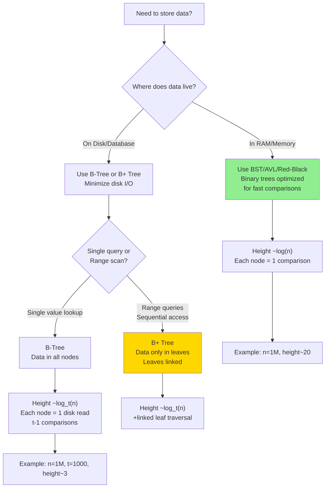
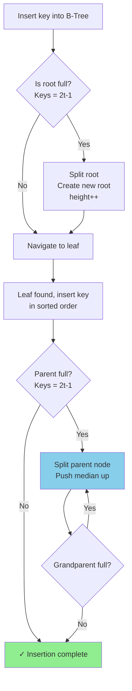
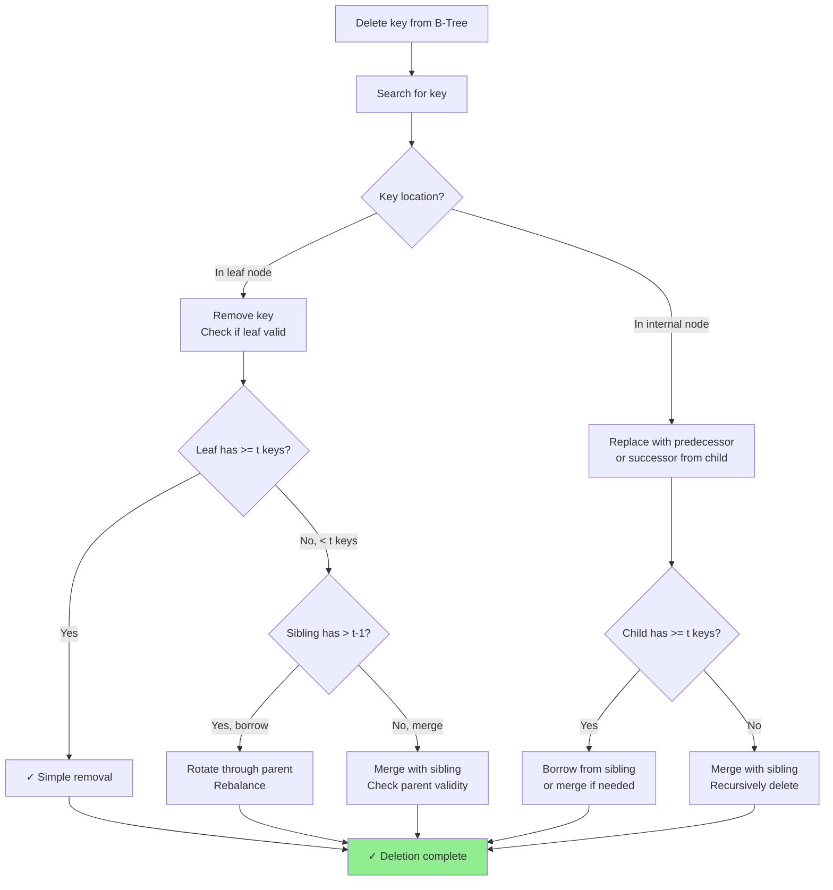

# B-Tree

## Overview

A **B-Tree** of order t (minimum degree) is a self-balancing search tree where every node can have between t-1 and 2t-1 keys, and all leaves are at the same depth. B-Trees are designed for disk-based storage — they minimize the number of I/O operations by keeping many keys per node, reducing tree height.

**When to use:**
- Database indexes (MySQL InnoDB, PostgreSQL use B+ Trees)
- File system directory structures (NTFS, HFS+, ext4 extents)
- Any system where data lives on disk and you want to minimize page reads
- Scenarios requiring sorted data with fast range queries

---

## Flowcharts

### When to Use B-Tree vs AVL



### B-Tree Insertion & Node Split Decision



### B-Tree Deletion Decision Tree



---

## Visualization

### B-Tree Structure (order t=2, max 3 keys per node)

```
Each internal node holds 1 to 3 keys and 2 to 4 children.
Each key k separates children: left child < k ≤ right child.

                    [13 | 24]
                   /    |    \
                  /     |     \
         [8 | 11]    [16 | 19]    [28 | 35]
        /   |   \    /   |   \    /   |   \
      [2]  [9] [12] [15][17][22] [26][30][38]
       4,5  10  -    -   18  20   -   -   -

Leaf level (all at same depth):
  - Node [2]: contains keys {2, 4, 5}
  - Node [9]: contains keys {9, 10}
  - etc.
```

### Simpler Example: B-Tree of order t=2, keys 1–15 inserted

```
                      [7]
                    /       \
              [3 | 5]       [11 | 13]
              /  |  \       /   |   \
           [1,2][4] [6]  [8,9,10][12][14,15]

Properties:
  - Root has at least 1 key
  - All leaves at same level (height = 2)
  - Every non-root node has at least t-1 = 1 key
  - Every node has at most 2t-1 = 3 keys
```

### Insertion with Node Split

```
Insert 8 into a full node [5 | 7 | 9] (t=2, already 3 keys = full):

Before:              Full node:
    [5 | 7 | 9]

Step 1: Split at median (7):
    Push median (7) up to parent
    Left child: [5]
    Right child: [9]

         [7]          ← median pushed up
        /    \
      [5]    [9]      ← split result

Step 2: Now insert 8 into right child [9]:
    8 < 9, so [8 | 9]

Final:
         [7]
        /    \
      [5]   [8 | 9]
```

### B-Tree Insertion (Proactive Split)

```
Insert sequence: 1, 2, 3, 4, 5 into t=2 B-Tree

Step 1: [1]           Step 2: [1|2]        Step 3: [1|2|3] (full!)

Step 4: Split before overflow:
  Median = 2, push up to new root:
         [2]
        /    \
      [1]    [3]

Step 5: Insert 4 → goes to right child [3]:
         [2]
        /    \
      [1]    [3|4]

Step 6: Insert 5 → right child [3|4|5] full, split:
  Median = 4, push to parent:
         [2 | 4]
        /   |   \
      [1]  [3]  [5]
```

### B+ Tree vs B-Tree (Important Distinction)

```
B-Tree:                          B+ Tree (used in databases):
  - Data stored in ALL nodes       - Data stored ONLY in leaf nodes
  - Internal nodes have data       - Internal nodes are just routing keys
                                   - Leaves linked in a doubly linked list
                                     for efficient range scans

B+ Tree leaf linkage:
  [2|4] ────────────────────
 /  |  \                   |
[1,2] [3,4] [5,6]          | ← leaves linked for range scans
  ↔     ↔     ↔            |
  doubly-linked list ───────┘
```

---

## Operations & Complexity

| Operation  | Time (B-Tree)     | I/O Cost       | Space       |
|------------|:-----------------:|:--------------:|:-----------:|
| Search     | O(log_t n)        | O(log_t n)     | O(1)        |
| Insert     | O(t · log_t n)    | O(log_t n)     | O(1)        |
| Delete     | O(t · log_t n)    | O(log_t n)     | O(1)        |
| Space      | —                 | —              | O(n)        |

> Height h ≤ log_t((n+1)/2). With t=1000 (typical for disk), a tree with 1 billion keys has height ≤ 3.
> Each node access = one disk page read — minimizing height = minimizing I/O.

---

## Key Properties / Invariants

1. **All leaves at the same depth**: Guarantees balanced height.
2. **Key count bounds**: Every non-root node has t-1 to 2t-1 keys. Root has 1 to 2t-1 keys.
3. **Children count**: A node with k keys has exactly k+1 children (if internal).
4. **Sorted keys**: Within each node, keys are sorted; children interleave between keys.
5. **Minimum degree t**: Controls the fan-out. Larger t → shorter, fatter tree → fewer I/O operations.
6. **Proactive splitting**: Split full nodes on the way down during insertion to avoid a second pass.

---

## Common Interview Patterns

### Pattern 1: Understand B-Tree vs BST Trade-offs
B-Tree is preferred when data doesn't fit in RAM. BST/AVL/Red-Black are for in-memory use.

```
BST height: O(log n) but each node = one comparison
B-Tree height: O(log_t n) and each node read = one disk page with t-1 keys
→ For n = 1M, t = 1000: B-Tree height ≈ 2, BST height ≈ 20
→ B-Tree does 2 disk reads vs BST's 20
```

### Pattern 2: B+ Tree Range Queries
Leaf nodes form a linked list — range [a, b] is a single seek + sequential scan.

```
"Find all employees with salary between 50k and 80k"
  1. Search for 50k in B+ Tree → O(log n)
  2. Follow leaf links until 80k → O(k) where k = result count
```

### Pattern 3: Node Split Algorithm
Key insight: split happens proactively (top-down) in modern B-Trees.

```
split_child(parent, i, full_child):
  # full_child has 2t-1 keys, median at index t-1
  new_node = new BTreeNode()
  median = full_child.keys[t-1]
  
  # Move upper half to new node
  new_node.keys = full_child.keys[t:]
  full_child.keys = full_child.keys[:t-1]
  
  if not full_child.is_leaf:
      new_node.children = full_child.children[t:]
      full_child.children = full_child.children[:t]
  
  # Insert median into parent
  parent.keys.insert(i, median)
  parent.children.insert(i+1, new_node)
```

### Pattern 4: Why Databases Use B+ Trees (not B-Trees)
- Leaf-only data means internal nodes fit more routing keys → higher fan-out → shorter tree.
- Linked leaves enable efficient full-table scans and range queries.

---

## Interview Tips

- **B-Tree is rarely implemented from scratch** in coding interviews — understanding the concept and trade-offs is what's tested.
- **Know the node size = page size**: In real DBs, each B-Tree node is one disk page (4KB–16KB). The value of t is chosen to maximize keys per page.
- **B-Tree vs B+ Tree**: B+ Tree is what databases actually use. Know the difference.
- **Vs Hash Index**: B-Tree supports range queries and ORDER BY; hash indexes don't.
- **Deletion is complex**: Three cases — key in leaf (simple), key in internal node (replace with predecessor/successor), borrow from sibling or merge.
- **Order of a B-Tree**: Some sources define "order" as max children (= 2t), others as minimum degree (= t). Clarify in conversation.

---

## Example Problems

| Problem / Concept                              | Pattern                           |
|------------------------------------------------|-----------------------------------|
| Design a Database Index (system design)        | B+ Tree structure and trade-offs  |
| Why is MySQL InnoDB faster for range queries?  | B+ Tree leaf linking              |
| Implement an in-memory sorted map              | Red-Black Tree (B-Tree variant)   |
| Design file system metadata store              | B-Tree fan-out and height         |
| Range query optimization in databases          | B+ Tree vs hash index             |

---

## Python Quick Reference

```python
# B-Tree implementation (minimum degree t)
# Note: Full implementation is long; this covers the key structure and search.

class BTreeNode:
    def __init__(self, t, leaf=False):
        self.t = t           # minimum degree
        self.keys = []
        self.children = []
        self.leaf = leaf

class BTree:
    def __init__(self, t):
        self.t = t
        self.root = BTreeNode(t, leaf=True)

    # ── Search ────────────────────────────────────────────────────────────────
    def search(self, k, node=None):
        node = node or self.root
        i = 0
        while i < len(node.keys) and k > node.keys[i]:
            i += 1
        if i < len(node.keys) and k == node.keys[i]:
            return (node, i)
        if node.leaf:
            return None
        return self.search(k, node.children[i])

    # ── Insert (proactive split) ───────────────────────────────────────────────
    def insert(self, k):
        root = self.root
        if len(root.keys) == 2 * self.t - 1:  # root is full, split it
            new_root = BTreeNode(self.t, leaf=False)
            new_root.children.append(self.root)
            self._split_child(new_root, 0)
            self.root = new_root
        self._insert_non_full(self.root, k)

    def _split_child(self, parent, i):
        t = self.t
        full = parent.children[i]
        new_node = BTreeNode(t, leaf=full.leaf)
        parent.keys.insert(i, full.keys[t - 1])
        parent.children.insert(i + 1, new_node)
        new_node.keys = full.keys[t:]
        full.keys    = full.keys[:t - 1]
        if not full.leaf:
            new_node.children = full.children[t:]
            full.children     = full.children[:t]

    def _insert_non_full(self, node, k):
        i = len(node.keys) - 1
        if node.leaf:
            node.keys.append(None)
            while i >= 0 and k < node.keys[i]:
                node.keys[i + 1] = node.keys[i]
                i -= 1
            node.keys[i + 1] = k
        else:
            while i >= 0 and k < node.keys[i]:
                i -= 1
            i += 1
            if len(node.children[i].keys) == 2 * self.t - 1:
                self._split_child(node, i)
                if k > node.keys[i]:
                    i += 1
            self._insert_non_full(node.children[i], k)

    # ── Print tree ────────────────────────────────────────────────────────────
    def print_tree(self, node=None, level=0):
        node = node or self.root
        print("  " * level + str(node.keys))
        if not node.leaf:
            for child in node.children:
                self.print_tree(child, level + 1)

# Usage:
t = BTree(2)  # minimum degree 2 → max 3 keys per node
for key in [10, 20, 5, 6, 12, 30, 7, 17]:
    t.insert(key)
t.print_tree()
```

---

## Java Quick Reference

```java
// Simplified B-Tree node and search — full implementation is extensive
class BTreeNode {
    int t;           // minimum degree
    int[] keys;
    BTreeNode[] children;
    int n;           // current number of keys
    boolean leaf;

    BTreeNode(int t, boolean leaf) {
        this.t = t;
        this.leaf = leaf;
        this.keys = new int[2 * t - 1];
        this.children = new BTreeNode[2 * t];
        this.n = 0;
    }

    // Search for key k in subtree rooted at this node
    int[] search(int k) {
        int i = 0;
        while (i < n && k > keys[i]) i++;
        if (i < n && keys[i] == k) return new int[]{/* found */};
        if (leaf) return null;
        return children[i].search(k);
    }
}

class BTree {
    BTreeNode root;
    int t;

    BTree(int t) {
        this.t = t;
        root = new BTreeNode(t, true);
    }

    boolean search(int k) {
        return search(root, k);
    }

    private boolean search(BTreeNode node, int k) {
        int i = 0;
        while (i < node.n && k > node.keys[i]) i++;
        if (i < node.n && node.keys[i] == k) return true;
        if (node.leaf) return false;
        return search(node.children[i], k);
    }

    // Insert is complex (50+ lines); refer to CLRS Chapter 18 for full implementation.
    // Key insight: split full nodes (2t-1 keys) on the way down during insertion.
}
```
