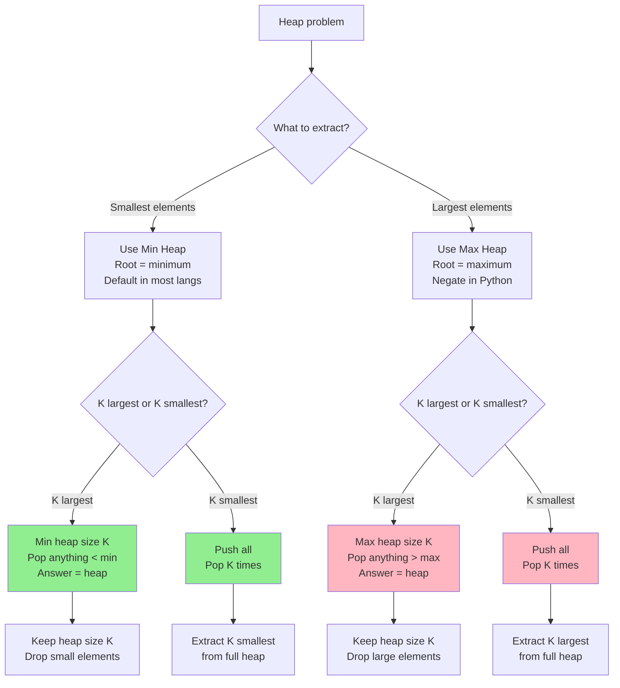
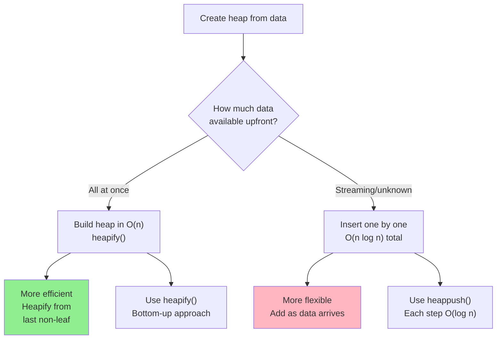
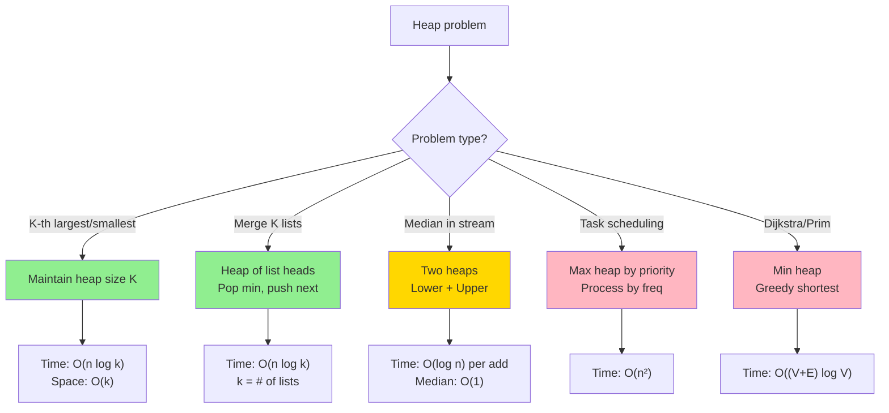

# Heap (Min Heap & Max Heap)

## Overview

A **Heap** is a complete binary tree stored as an array satisfying the heap property. In a **min heap** every parent is smaller than its children (root = minimum). In a **max heap** every parent is larger (root = maximum). Heaps are the canonical implementation of a priority queue.

**When to use:**
- Need to repeatedly extract the min or max element efficiently
- K-th largest/smallest problems
- Merge K sorted lists/arrays
- Scheduling tasks by priority
- Dijkstra's / Prim's graph algorithms
- Median of a data stream (two heaps)

---

## Flowcharts

### When to Use Min Heap vs Max Heap



### Heap Build vs Insert Decision



### Problem Pattern: Heap Application



---

## Visualization

### Array ↔ Tree Mapping

```
Array: [1, 3, 2, 7, 4, 8, 9]
Index:  0  1  2  3  4  5  6

For node at index i:
  Parent      = (i - 1) // 2
  Left child  = 2*i + 1
  Right child = 2*i + 2

Min Heap Tree:
              1  (idx 0)
            /         \
        3 (idx 1)    2 (idx 2)
        /    \       /    \
    7 (idx 3) 4(4) 8(5)  9(6)

Every parent ≤ its children → min heap property ✓
```

### Max Heap

```
Array: [9, 7, 8, 3, 4, 1, 2]
Index:  0  1  2  3  4  5  6

Max Heap Tree:
              9  (idx 0)
            /         \
        7 (idx 1)    8 (idx 2)
        /    \       /    \
    3 (idx 3) 4(4) 1(5)  2(6)

Every parent ≥ its children → max heap property ✓
```

### Insertion (Min Heap): Insert 0

```
Step 1: Append to end          Step 2: Bubble up (sift up)

              1                              1
            /   \                          /   \
           3     2            →           3     0   ← swapped 0 and 2
          / \   / \                      / \   / \
         7   4 8   9                    7   4 8   2
                    \
                     0 ← appended here

Step 3: Continue bubbling up   Final state

              1                              0
            /   \                          /   \
           3     0            →           3     1
          / \   / \                      / \   / \
         7   4 8   2                    7   4 8   2
                    \
                     9... wait, let's redo cleanly:

Insert 0 into [1, 3, 2, 7, 4, 8, 9]:
  Append:  [1, 3, 2, 7, 4, 8, 9, 0]  → 0 at index 7, parent = (7-1)//2 = 3 → value 7
  Swap 0 and 7: [1, 3, 2, 0, 4, 8, 9, 7]  → 0 at index 3, parent = 1 → value 3
  Swap 0 and 3: [1, 0, 2, 3, 4, 8, 9, 7]  → 0 at index 1, parent = 0 → value 1
  Swap 0 and 1: [0, 1, 2, 3, 4, 8, 9, 7]  ✓ done

Final tree:
              0
            /   \
           1     2
          / \   / \
         3   4 8   9
          \
           7
```

### Extract Min (Heapify Down)

```
Step 1: Remove root (1)        Step 2: Move last element to root
                                       Sift down (heapify down)

              1                              9              →
            /   \                          /   \
           3     2            →           3     2
          / \   / \                      / \   /
         7   4 8   9                    7   4 8
                                  (9 moved to root, original last removed)

Step 3: Sift down 9:           Step 4: Continue
  9's children: 3, 2            3's children: 7, 4
  min child = 2 → swap          min child = 4 → swap

              2                              2
            /   \                          /   \
           3     9            →           3     8
          / \   /                        / \   /
         7   4 8                        7   4 9

Final: [2, 3, 8, 7, 4, 9]
```

### Build Heap (Heapify) from Array

```
Input array (unsorted): [4, 10, 3, 5, 1]
Start heapify from last non-leaf: index = n//2 - 1 = 1

Initial tree:
              4
            /   \
          10     3
          / \
         5   1

Heapify index 1 (value 10):    Heapify index 0 (value 4):
  children: 5, 1                children: 1, 3
  min = 1 → swap                min = 1 → swap

              4                              1
            /   \                          /   \
           1     3            →           4     3
          / \                            / \
         5  10                          5  10

  Continue heapify at 4:
  children: 5, 10 → min = 5 → swap

Final:        1
            /   \
           4     3
          / \
         5  10

Array: [1, 4, 3, 5, 10]   ← min heap in O(n) time!
```

---

## Operations & Complexity

| Operation         | Time      | Space  | Notes                              |
|-------------------|:---------:|:------:|----------------------------------  |
| Insert            | O(log n)  | O(1)   | Sift up                            |
| Extract Min/Max   | O(log n)  | O(1)   | Sift down                          |
| Peek Min/Max      | O(1)      | O(1)   | Root element                       |
| Delete arbitrary  | O(log n)  | O(1)   | Find O(n) unless position known    |
| Build Heap        | O(n)      | O(1)   | Floyd's algorithm, NOT O(n log n)  |
| Heap Sort         | O(n log n)| O(1)   | In-place, not stable               |
| Decrease Key      | O(log n)  | O(1)   | Used in Dijkstra                   |
| Space             | —         | O(n)   | Array-backed                       |

> Build Heap is O(n) because lower-level nodes do minimal work. The sum of all sift-down costs converges to O(n).

---

## Key Properties / Invariants

1. **Complete binary tree**: All levels filled left-to-right; enables array representation without gaps.
2. **Heap property**: Min heap: parent ≤ children. Max heap: parent ≥ children.
3. **Root is always min/max**: O(1) peek guaranteed.
4. **Array indexing**: Parent at `(i-1)//2`, left child at `2i+1`, right child at `2i+2` (0-indexed).
5. **Not fully sorted**: Heap only guarantees root is min/max; siblings have no ordering relative to each other.

---

## Common Interview Patterns

### Pattern 1: K Largest / K Smallest Elements
Use a min heap of size K for "K largest" — evict anything smaller than current min.

```
K largest: maintain min heap of size K
  → if heap.size < K: push
  → else if val > heap[0]: pop then push
  → answer = list(heap)

K smallest: just push all and do K pops, OR use max heap of size K
```

### Pattern 2: Merge K Sorted Lists
Push (value, list_index, element_index) into min heap. Pop min, push next from same list.

```
heap: [(lists[i][0], i, 0) for i in range(len(lists)) if lists[i]]
while heap:
    val, i, j = heappop(heap)
    result.append(val)
    if j + 1 < len(lists[i]):
        heappush(heap, (lists[i][j+1], i, j+1))
```

### Pattern 3: Median of Data Stream (Two Heaps)
Use max heap for lower half and min heap for upper half. Keep sizes balanced.

```
lower = max heap (negate values for Python)  ← stores smaller half
upper = min heap                              ← stores larger half

Invariant: len(lower) == len(upper) OR len(lower) == len(upper) + 1
Median: lower[0] if odd total, else (lower[0] + upper[0]) / 2
```

### Pattern 4: Task Scheduling / Frequency Sort
Use a max heap on frequency counts. Pop most frequent, schedule, reinsert.

### Pattern 5: Dijkstra's Algorithm
Min heap drives greedy shortest path exploration.

```
heap = [(0, source)]  # (distance, node)
while heap:
    dist, node = heappop(heap)
    for neighbor, weight in graph[node]:
        new_dist = dist + weight
        if new_dist < distances[neighbor]:
            distances[neighbor] = new_dist
            heappush(heap, (new_dist, neighbor))
```

---

## Interview Tips

- **Python's `heapq` is a min heap only** — negate values to simulate a max heap.
- **Heap is NOT sorted**: Don't treat a heap array as a sorted array.
- **Build heap is O(n), not O(n log n)**: Interviewers love this distinction.
- **Lazy deletion**: When you can't efficiently find an element to delete, use a "tombstone" set and skip stale elements on pop.
- **Heap vs sorted array**: Heap gives O(log n) insert/delete but only O(1) min peek; sorted array gives O(n) insert but O(1) any-index access.
- **Two-heap pattern** for median is a classic — know the rebalancing logic cold.

---

## Example Problems

| Problem                                          | Pattern                    |
|--------------------------------------------------|----------------------------|
| Kth Largest Element in an Array (LC 215)         | Min heap of size K         |
| Find Median from Data Stream (LC 295)            | Two heaps                  |
| Merge K Sorted Lists (LC 23)                     | Min heap with K pointers   |
| Task Scheduler (LC 621)                          | Max heap + cooldown        |
| Reorganize String (LC 767)                       | Max heap by frequency      |

---

## Python Quick Reference

```python
import heapq

# ── Min Heap ──────────────────────────────────────────────────────────────────
heap = []
heapq.heappush(heap, 5)          # insert
heapq.heappush(heap, 1)
heapq.heappush(heap, 3)
min_val = heapq.heappop(heap)    # extract min → 1
peek = heap[0]                   # peek min without removing

# Build heap from list in O(n)
arr = [4, 10, 3, 5, 1]
heapq.heapify(arr)               # in-place, arr is now a valid min heap

# ── Max Heap (negate values) ──────────────────────────────────────────────────
max_heap = []
heapq.heappush(max_heap, -5)
heapq.heappush(max_heap, -1)
heapq.heappush(max_heap, -3)
max_val = -heapq.heappop(max_heap)   # → 5

# ── K Largest Elements ────────────────────────────────────────────────────────
def k_largest(nums, k):
    heap = []
    for num in nums:
        heapq.heappush(heap, num)
        if len(heap) > k:
            heapq.heappop(heap)   # remove smallest to keep k largest
    return list(heap)

# ── Merge K Sorted Lists ──────────────────────────────────────────────────────
def merge_k_sorted(lists):
    heap = []
    for i, lst in enumerate(lists):
        if lst:
            heapq.heappush(heap, (lst[0], i, 0))
    result = []
    while heap:
        val, i, j = heapq.heappop(heap)
        result.append(val)
        if j + 1 < len(lists[i]):
            heapq.heappush(heap, (lists[i][j + 1], i, j + 1))
    return result

# ── Median of Data Stream ─────────────────────────────────────────────────────
class MedianFinder:
    def __init__(self):
        self.lower = []   # max heap (negated)
        self.upper = []   # min heap

    def add_num(self, num):
        heapq.heappush(self.lower, -num)
        # Balance: ensure lower top <= upper top
        if self.upper and -self.lower[0] > self.upper[0]:
            heapq.heappush(self.upper, -heapq.heappop(self.lower))
        # Rebalance sizes
        if len(self.lower) > len(self.upper) + 1:
            heapq.heappush(self.upper, -heapq.heappop(self.lower))
        elif len(self.upper) > len(self.lower):
            heapq.heappush(self.lower, -heapq.heappop(self.upper))

    def find_median(self):
        if len(self.lower) > len(self.upper):
            return -self.lower[0]
        return (-self.lower[0] + self.upper[0]) / 2.0

# ── nlargest / nsmallest ──────────────────────────────────────────────────────
top3 = heapq.nlargest(3, [1, 8, 2, 3, 7, 6, 4])   # [8, 7, 6]
bot3 = heapq.nsmallest(3, [1, 8, 2, 3, 7, 6, 4])  # [1, 2, 3]
```

---

## Java Quick Reference

```java
import java.util.PriorityQueue;
import java.util.Collections;

// ── Min Heap (default) ────────────────────────────────────────────────────────
PriorityQueue<Integer> minHeap = new PriorityQueue<>();
minHeap.offer(5);
minHeap.offer(1);
minHeap.offer(3);
int minVal = minHeap.poll();   // extract min → 1
int peek   = minHeap.peek();   // peek without removing → 3

// ── Max Heap ──────────────────────────────────────────────────────────────────
PriorityQueue<Integer> maxHeap = new PriorityQueue<>(Collections.reverseOrder());
// OR: new PriorityQueue<>((a, b) -> b - a);
maxHeap.offer(5);
maxHeap.offer(1);
maxHeap.offer(3);
int maxVal = maxHeap.poll();   // → 5

// ── K Largest Elements ────────────────────────────────────────────────────────
int[] kLargest(int[] nums, int k) {
    PriorityQueue<Integer> heap = new PriorityQueue<>();
    for (int num : nums) {
        heap.offer(num);
        if (heap.size() > k) heap.poll();
    }
    return heap.stream().mapToInt(i -> i).toArray();
}

// ── Merge K Sorted Lists (using int[] {value, listIdx, elemIdx}) ───────────────
ListNode mergeKLists(ListNode[] lists) {
    PriorityQueue<ListNode> heap = new PriorityQueue<>((a, b) -> a.val - b.val);
    for (ListNode node : lists)
        if (node != null) heap.offer(node);

    ListNode dummy = new ListNode(0), curr = dummy;
    while (!heap.isEmpty()) {
        curr.next = heap.poll();
        curr = curr.next;
        if (curr.next != null) heap.offer(curr.next);
    }
    return dummy.next;
}

// ── Median of Data Stream ─────────────────────────────────────────────────────
class MedianFinder {
    PriorityQueue<Integer> lower = new PriorityQueue<>(Collections.reverseOrder()); // max heap
    PriorityQueue<Integer> upper = new PriorityQueue<>();                            // min heap

    public void addNum(int num) {
        lower.offer(num);
        if (!upper.isEmpty() && lower.peek() > upper.peek())
            upper.offer(lower.poll());
        if (lower.size() > upper.size() + 1)
            upper.offer(lower.poll());
        else if (upper.size() > lower.size())
            lower.offer(upper.poll());
    }

    public double findMedian() {
        if (lower.size() > upper.size()) return lower.peek();
        return (lower.peek() + upper.peek()) / 2.0;
    }
}
```
