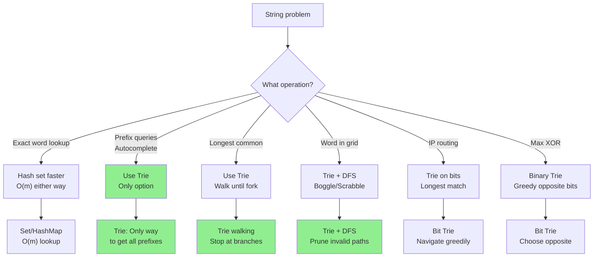
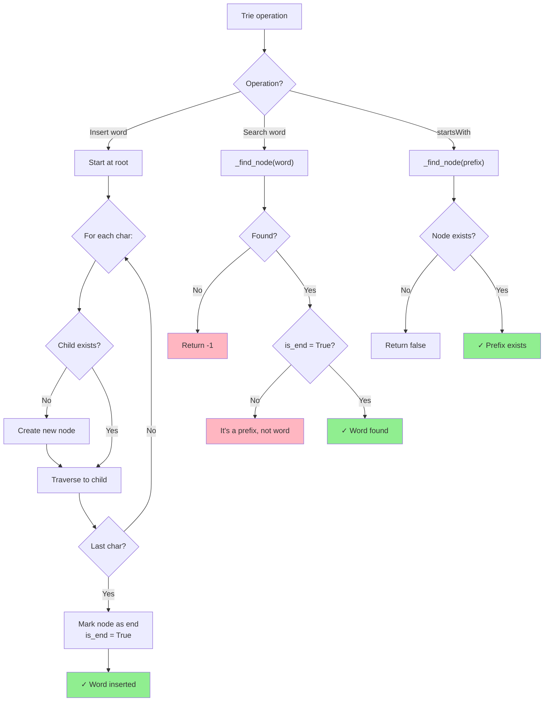
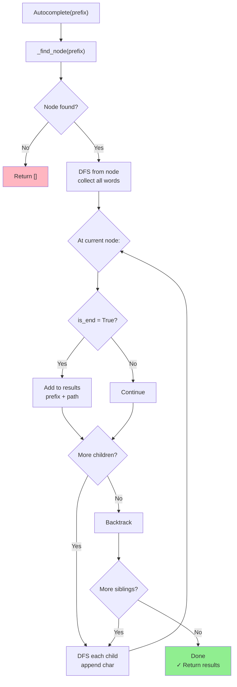
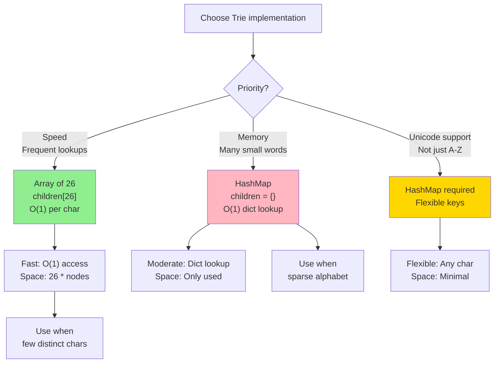

# Trie (Prefix Tree)

## Overview

A **Trie** (retrieval tree, also called a prefix tree or digital tree) is an n-ary tree where each path from root to a marked node spells a word. Characters are stored on edges (or in child nodes), and all descendants of a node share the same prefix.

**When to use:**
- Autocomplete / search suggestions
- Spell checking
- IP routing (longest prefix match)
- Word search in grids
- Dictionary implementation with prefix queries
- Phone book / contact lookup

---

## Flowcharts

### When to Use Trie



### Trie Insert/Search/Prefix Operations



### Trie Autocomplete Pattern



### Trie Memory vs Speed Trade-off



---

## Visualization

### Structure After Inserting: "apple", "app", "apt", "bat", "ball"

```
                root
               /    \
              a      b
              |      |
              p      a
             / \     / \
            p   t   t   l
            |   |   |   |
            l   [*] [*] l
            |           |
            e           [*]
            |
           [*]

[*] = marks end of a word

Expanded with explicit nodes:
                     root
                    /    \
                  (a)    (b)
                   |      |
                  (p)    (a)
                 /   \   /  \
               (p)  (t)(t)  (l)
                |    |  |    |
               (l) [end][end](l)
                |            |
               (e)          [end]
                |
              [end]

Words encoded:
  root→a→p→p→l→e[end] = "apple"
  root→a→p→p[end]     = "app"  (shares prefix "ap" with "apple")
  root→a→p→t[end]     = "apt"
  root→b→a→t[end]     = "bat"
  root→b→a→l→l[end]   = "ball"
```

### Search: "app" exists?

```
                root
                 |
                (a) ← step 1: follow 'a'
                 |
                (p) ← step 2: follow 'p'
                 |
                (p) ← step 3: follow 'p', check is_end → True ✓

"app" found!

Search: "ap" exists?
  root → a → p → check is_end → False (p is NOT marked as end)
  "ap" is a prefix but NOT a word → return False

startsWith("ap")?
  root → a → p → node exists → return True ✓
```

### Insert: "ape"

```
Before:                         After inserting "ape":
       root                              root
        |                                |
       (a)                              (a)
        |                                |
       (p)                              (p)
      /   \                           / | \
    (p)   (t)          →           (p) (e) (t)
     |     |                        |   |   |
    (l)  [end]                     (l) [end][end]
     |                              |
    (e)                            (e)
     |                              |
   [end]                          [end]

New 'e' child added under (p) for "ape"
```

### Delete: "app" (be careful not to delete "apple" prefix)

```
       root
        |
       (a)
        |
       (p)
        |
       (p) ← unmark is_end (don't delete node, "apple" still uses it)
        |
       (l)
        |
       (e)
        |
      [end]

Rule: Only delete a node if it has no children AND is not part of another word.
      Here (p) has child (l), so we just unmark is_end.
```

---

## Operations & Complexity

| Operation              | Time   | Space  | Notes                                    |
|------------------------|:------:|:------:|------------------------------------------|
| Insert word            | O(m)   | O(m)   | m = word length                          |
| Search word            | O(m)   | O(1)   |                                          |
| Starts with (prefix)   | O(m)   | O(1)   |                                          |
| Delete word            | O(m)   | O(1)   | May need to prune nodes                  |
| Space (total)          | —      | O(n·m) | n = number of words, m = avg length      |
| Autocomplete (all with prefix) | O(m + k) | O(k) | k = number of matching words   |

> Tries beat hash maps for prefix queries. Hash map search is O(m) per word but can't answer "all words with prefix P" without scanning all keys.

---

## Key Properties / Invariants

1. **Root is empty**: The root node does not store a character.
2. **Each edge = one character**: A path from root spells a string.
3. **is_end marker**: Nodes can be both internal (part of a prefix) and terminal (end of a word).
4. **Shared prefixes = shared nodes**: "apple" and "app" share the path root→a→p→p.
5. **Max branching factor = alphabet size**: For lowercase English, each node has up to 26 children (often stored as a dict or 26-element array).
6. **No collisions**: Unlike hash maps, tries never have key collisions.

---

## Common Interview Patterns

### Pattern 1: Autocomplete / Return All Words with Prefix

```
def words_with_prefix(root, prefix):
    node = root
    for ch in prefix:
        if ch not in node.children:
            return []
        node = node.children[ch]
    # DFS from this node to collect all words
    results = []
    def dfs(node, path):
        if node.is_end:
            results.append(prefix[:-len(path)] + path)  # reconstruct word
        for ch, child in node.children.items():
            dfs(child, path + ch)
    dfs(node, "")
    return results
```

### Pattern 2: Word Search / Boggle (Trie + DFS on Grid)
Insert all dictionary words into trie. DFS on grid, prune branches not in trie.

### Pattern 3: Longest Common Prefix
Insert all strings. Walk trie while each node has exactly one child and is not end-of-word.

```
def longest_common_prefix(words):
    # insert all words, then walk from root
    # stop when: node has >1 child, OR node is end-of-word
```

### Pattern 4: Replace Words with Root (Shortest Prefix)
Insert all roots. For each word in sentence, find shortest prefix in trie.

### Pattern 5: Maximum XOR of Two Numbers
Use a binary trie (bits 0/1). For each number, greedily choose the opposite bit for max XOR.

```
Binary trie for XOR:
  Insert numbers bit by bit (MSB to LSB)
  Query: for each bit of query number, try to go to opposite bit
         → maximizes XOR contribution at each bit position
```

---

## Interview Tips

- **Array vs dict for children**: `children = [None] * 26` (faster, O(1) lookup) vs `children = {}` (flexible, handles Unicode, lower memory for sparse tries).
- **is_end vs word count**: For problems with duplicate words (e.g., stream of words), store a count instead of a boolean.
- **Memory concern**: A trie can use more memory than a hash set for few long strings. Compressed tries (Patricia/Radix) solve this.
- **Deletion edge case**: When deleting, only remove nodes that have no other children. A wrong deletion can corrupt other words sharing the prefix.
- **TrieNode vs dict-based**: Using `defaultdict(TrieNode)` or nested dicts can simplify implementation but obscures the structure.
- **Word boundary**: Many bugs come from forgetting to check `is_end` when searching for a word (vs prefix).

---

## Example Problems

| Problem                                            | Pattern                           |
|----------------------------------------------------|-----------------------------------|
| Implement Trie (LC 208)                            | Core insert/search/startsWith     |
| Search Suggestions System (LC 1268)                | Autocomplete with sorted results  |
| Word Search II (LC 212)                            | Trie + DFS on grid (Boggle)       |
| Replace Words (LC 648)                             | Shortest prefix replacement       |
| Maximum XOR of Two Numbers in an Array (LC 421)    | Binary trie for XOR               |

---

## Python Quick Reference

```python
# ── TrieNode with dict ────────────────────────────────────────────────────────
class TrieNode:
    def __init__(self):
        self.children = {}
        self.is_end = False

class Trie:
    def __init__(self):
        self.root = TrieNode()

    # ── Insert ────────────────────────────────────────────────────────────────
    def insert(self, word: str) -> None:
        node = self.root
        for ch in word:
            if ch not in node.children:
                node.children[ch] = TrieNode()
            node = node.children[ch]
        node.is_end = True

    # ── Search exact word ─────────────────────────────────────────────────────
    def search(self, word: str) -> bool:
        node = self._find_node(word)
        return node is not None and node.is_end

    # ── Check prefix ──────────────────────────────────────────────────────────
    def starts_with(self, prefix: str) -> bool:
        return self._find_node(prefix) is not None

    def _find_node(self, prefix: str):
        node = self.root
        for ch in prefix:
            if ch not in node.children:
                return None
            node = node.children[ch]
        return node

    # ── Autocomplete ──────────────────────────────────────────────────────────
    def autocomplete(self, prefix: str):
        node = self._find_node(prefix)
        if not node:
            return []
        results = []
        def dfs(n, path):
            if n.is_end:
                results.append(prefix + path)
            for ch, child in n.children.items():
                dfs(child, path + ch)
        dfs(node, "")
        return results

    # ── Delete ────────────────────────────────────────────────────────────────
    def delete(self, word: str) -> bool:
        def _delete(node, word, depth):
            if depth == len(word):
                if not node.is_end:
                    return False   # word not in trie
                node.is_end = False
                return len(node.children) == 0  # can delete if leaf
            ch = word[depth]
            if ch not in node.children:
                return False
            should_delete = _delete(node.children[ch], word, depth + 1)
            if should_delete:
                del node.children[ch]
                return not node.is_end and len(node.children) == 0
            return False
        return _delete(self.root, word, 0)

# ── Compact dict-based Trie ───────────────────────────────────────────────────
# Uses nested dicts, "#" marks end of word
def make_trie(*words):
    root = {}
    for word in words:
        node = root
        for ch in word:
            node = node.setdefault(ch, {})
        node['#'] = True
    return root

# ── Binary Trie for Max XOR ───────────────────────────────────────────────────
class BinaryTrie:
    def __init__(self):
        self.root = {}

    def insert(self, num):
        node = self.root
        for i in range(31, -1, -1):
            bit = (num >> i) & 1
            if bit not in node:
                node[bit] = {}
            node = node[bit]

    def max_xor(self, num):
        node, xor = self.root, 0
        for i in range(31, -1, -1):
            bit = (num >> i) & 1
            want = 1 - bit   # want opposite for max XOR
            if want in node:
                xor |= (1 << i)
                node = node[want]
            else:
                node = node[bit]
        return xor
```

---

## Java Quick Reference

```java
// ── TrieNode ──────────────────────────────────────────────────────────────────
class TrieNode {
    TrieNode[] children = new TrieNode[26];
    boolean isEnd = false;
}

class Trie {
    private TrieNode root = new TrieNode();

    // ── Insert ────────────────────────────────────────────────────────────────
    public void insert(String word) {
        TrieNode node = root;
        for (char c : word.toCharArray()) {
            int idx = c - 'a';
            if (node.children[idx] == null)
                node.children[idx] = new TrieNode();
            node = node.children[idx];
        }
        node.isEnd = true;
    }

    // ── Search exact word ─────────────────────────────────────────────────────
    public boolean search(String word) {
        TrieNode node = findNode(word);
        return node != null && node.isEnd;
    }

    // ── Check prefix ──────────────────────────────────────────────────────────
    public boolean startsWith(String prefix) {
        return findNode(prefix) != null;
    }

    private TrieNode findNode(String s) {
        TrieNode node = root;
        for (char c : s.toCharArray()) {
            int idx = c - 'a';
            if (node.children[idx] == null) return null;
            node = node.children[idx];
        }
        return node;
    }

    // ── Autocomplete ──────────────────────────────────────────────────────────
    public List<String> autocomplete(String prefix) {
        List<String> results = new ArrayList<>();
        TrieNode node = findNode(prefix);
        if (node != null) dfs(node, new StringBuilder(prefix), results);
        return results;
    }

    private void dfs(TrieNode node, StringBuilder sb, List<String> results) {
        if (node.isEnd) results.add(sb.toString());
        for (int i = 0; i < 26; i++) {
            if (node.children[i] != null) {
                sb.append((char)('a' + i));
                dfs(node.children[i], sb, results);
                sb.deleteCharAt(sb.length() - 1);
            }
        }
    }
}
```
