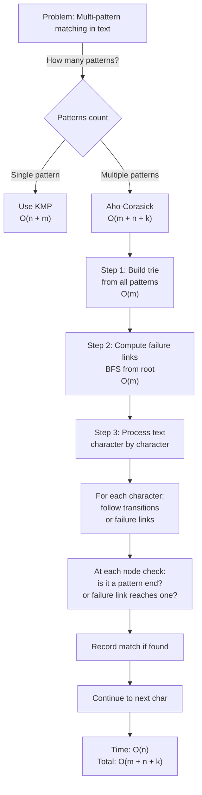

# Aho-Corasick Automaton

## Overview

The **Aho-Corasick Automaton** is a finite automaton that efficiently searches for multiple patterns in a text simultaneously. Built from a trie of patterns with failure links (similar to KMP's failure function), it processes the text in a single O(n + m + k) pass where n is text length, m is total pattern length, and k is the number of matches.

Invented by Aho and Corasick (1975), it revolutionized multi-pattern matching and is used in antivirus software (scanning for malware signatures), plagiarism detection, DNA sequence analysis, and network intrusion detection systems (NIDS).

Unlike checking patterns one-by-one (which would be O(n·p) for p patterns), Aho-Corasick processes all patterns simultaneously in a single pass, achieving linear time complexity in the text size.

## When to Use

- **Multiple pattern matching**: Simultaneously find occurrences of many patterns in text
- **Antivirus/malware scanning**: Check text against thousands of signatures in one pass
- **DNA sequence analysis**: Find multiple motifs in a genome
- **Plagiarism detection**: Compare text against database of known excerpts
- **Network intrusion detection**: Pattern match multiple attack signatures
- **Not ideal for**: Single pattern (use KMP), very short text (overhead not justified), patterns similar in structure (suffix tree may be better)

## ASCII Visualization

```
Patterns: {"he", "she", "his", "hers"}

AC Automaton Trie:
           root
          / | \
        h   s  (other)
       /|    \
      e i     h
      |       |
      r    (match "she")
     /
    s (match "hers")
   /
 (match "he")

Trie structure is standard; now add failure links:

       root (failure → root)
      / | \
    h   s
   /|    \
  e i     h
  |  |     |
  r  s    (match "she")
 / |
s  (match "hers")

Failure links (shown in dashed):
- from "he" → "e" (suffix match)
- from "hers" → "rs" (not in trie, continue to "s", which fails, continue to root)
- from "his" → "is" (not in trie, continue to "s", which fails, continue to root)
- etc.

Example: Processing text "ushers"
u       → root (no match)
us      → root (no match, failure link from "s")
ush     → root (no match, failure link)
ushe    → "he" (partial match on edge)
usher   → "r" (failure to root-h-e-r)
ushers  → detects "she" and "hers" (both present)
```

## Operations & Complexity

| Operation          | Time Complexity | Space Complexity | Notes |
|-------------------|:---------------:|:----------------:|-------|
| Build automaton    | O(m + σ)        | O(m·σ)           | m = total pattern length, σ = alphabet size |
| Build failure links| O(m)            | O(m)             | BFS from root |
| Search text        | O(n + k)        | O(1)             | n = text length, k = matches |
| Total             | O(m + n + k)    | O(m·σ)           | Multi-pattern matching in linear time |

> Much better than naive O(p·n·m) where p is number of patterns, n is text length, m is pattern length.

## Key Invariants

1. **Trie property**: Root has σ (alphabet size) transitions; internal nodes may have fewer.
2. **Failure link**: Each node has a failure link to the node representing the longest proper suffix.
3. **Match detection**: When reaching a node, check if it's a pattern end or if failure link reaches a pattern end (indicates match).
4. **Dictionary suffix**: Failure link follows a suffix chain; eventually reaches root.
5. **No wrong matches**: The automaton structure ensures all matches are found and no false positives occur.

## Solution Approach Flowchart



## Common Patterns

1. **Finding All Pattern Occurrences**: Build AC automaton. Process text character-by-character, following transitions and failure links. When a node is reached that represents a pattern end, record the match position. Time: O(m + n + k).

2. **Counting Pattern Occurrences**: Similar to above, but maintain a counter for each pattern. Increment when that pattern's node is reached. Time: O(m + n + k).

3. **Detecting Any Pattern Match**: Early exit when first match is found (e.g., antivirus: "virus detected"). Time: O(m + min(n, position of first match)).

4. **Pattern Matching with Wildcards**: Extend AC automaton with ε-transitions or special handling for wildcard characters. More complex implementation.

## Interview Questions

1. **How does Aho-Corasick differ from checking patterns one-by-one with KMP?** One-by-one: O(p·(n+mᵢ)) where p is pattern count. AC: O(n + Σmᵢ + k) single pass. AC is much faster for many patterns.

2. **What is the failure link, and how is it computed?** Failure link at node u points to the node representing the longest proper suffix of the string represented by u. Computed via BFS: for each node at depth d+1, its failure link is found by following the parent's failure link, then following a transition. Root's failure link points to itself.

3. **Why do you need to check failure links when matching?** When a transition doesn't exist from current node, follow failure link and retry. This ensures all overlapping patterns are found. For example, "she" and "he" in "shers": at "sher", the "he" is found via a failure link from "sher" to "her" to "er" (fail) to "r" (fail) to root-h-e.

4. **Can you handle pattern updates in Aho-Corasick?** Hard. You'd need to rebuild the automaton. AC is designed for static pattern sets. For dynamic patterns, use suffix tree or other structures.

5. **How does AC handle overlapping pattern matches?** When a node is reached, check both if it's a pattern end and if any failure link ancestor is a pattern end. This catches overlaps. For example, "ab" and "abc" overlapping: when "abc" is matched, "ab" is also recorded via failure link from "c".

6. **What's the space complexity, and how can you optimize it?** O(m·σ) for full transition table (m nodes, σ transitions per node). Optimize with: (1) hash map instead of array (sparse transitions), (2) trie compression, (3) suffix tree instead of AC. Most competitive programming solutions use full table.

7. **How does Aho-Corasick relate to regular expressions?** AC handles literal patterns efficiently. For regex, use different automata (e.g., NFA with ε-transitions). Some regex engines use AC as a sub-component for literal pattern matching parts.

## Implementation Notes

- **Trie Construction**: Use arrays (trie[node][char]) or maps. For small alphabets (26 letters), arrays are faster. For large alphabets (unicode), hash maps save space.
- **Failure Link Computation**: BFS-based approach is standard. Use a queue. For each node at depth d+1, traverse parent's failure link chain until you find a node with a transition for the current character.
- **Match Detection**: Maintain an "is_pattern_end" boolean at each node. When processing text, check if current node is a pattern end. Also follow failure links to check if any suffix is a pattern end.
- **Multiple Matches Same Position**: If patterns overlap at the same position, all are found. For example, "aa" and "aaa" both match at position 2 in "aaa".
- **Testing**: Test overlapping patterns, patterns that are prefixes of others, patterns with common suffixes. Verify all k matches are found.

## References

1. Aho, A. V., & Corasick, M. J. (1975). "Efficient string matching: An aid to bibliographic search." *Communications of the ACM*, 18(6), 333-340.
2. Gusfield, D. (1997). *Algorithms on Strings, Trees, and Sequences*. Cambridge University Press.
3. Cormen, T. H., Leiserson, C. E., Rivest, R. L., & Stein, C. (2009). *Introduction to Algorithms* (3rd ed.). MIT Press.
