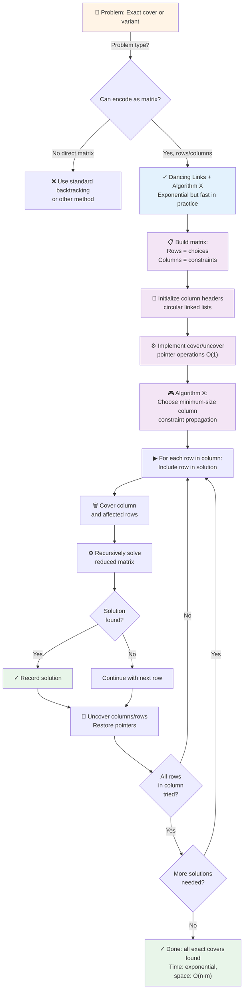
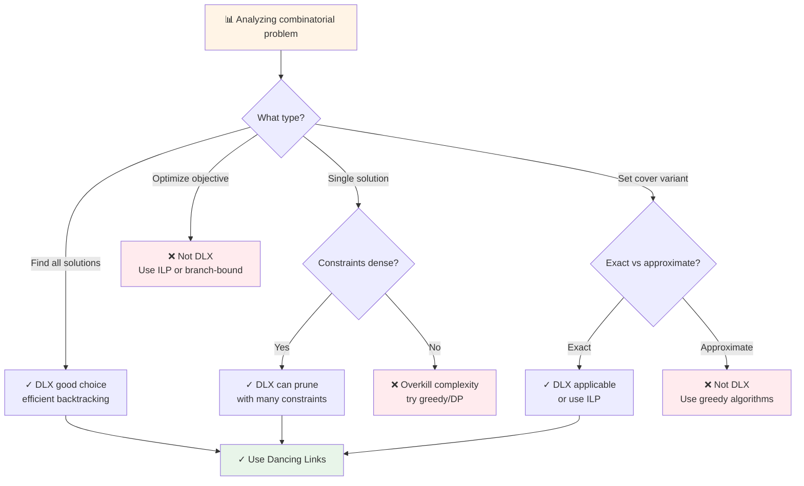
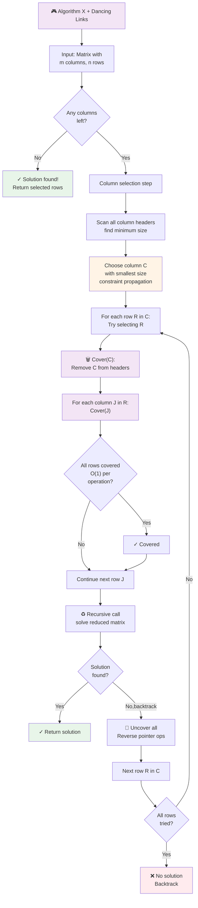
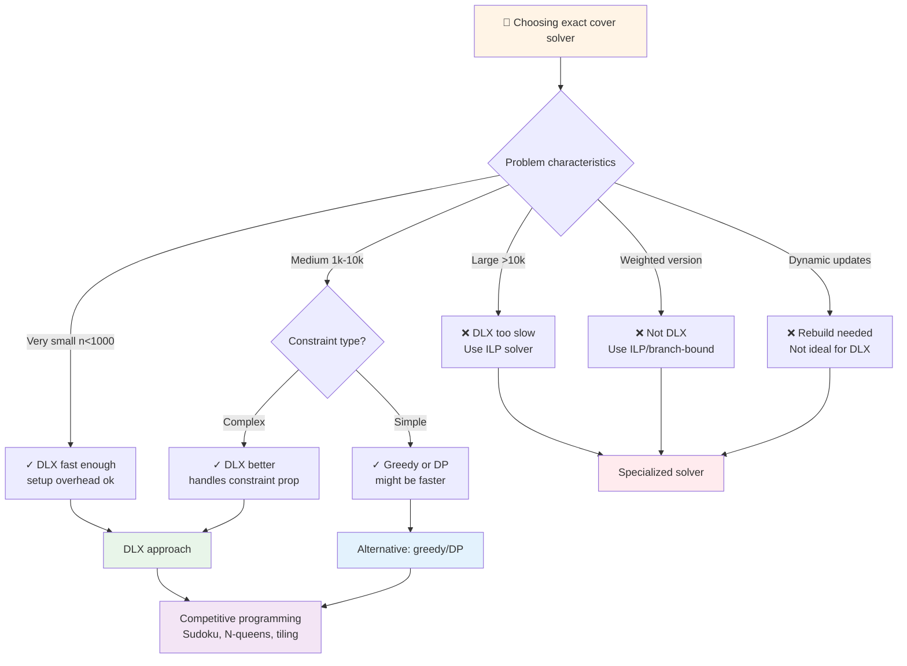

# Dancing Links (DLX)

## Overview

**Dancing Links** (DLX) is a technique using doubly-linked lists to efficiently solve the Exact Cover problem and its generalizations (set cover variants, Sudoku, n-queens, tiling problems). Invented by Knuth (2000), it pairs dancing links with Algorithm X, a backtracking algorithm that selects columns and rows dynamically.

The "dancing" metaphor refers to how links are removed and restored during backtracking — they appear to dance in and out of the data structure. DLX is elegant and typically faster in practice than standard backtracking due to constraint propagation and efficient memoization via link manipulation.

Used extensively in competitive programming (solving Sudoku and combinatorial puzzles), DLX is less common in production systems but appears in exact-computation frameworks and constraint solvers.

## When to Use

- **Exact cover problems**: Find a set of rows that cover all columns exactly once
- **Sudoku solving**: Reduce to exact cover (cells, rows, columns, boxes)
- **N-queens and permutation problems**: Encode constraints as column cover requirements
- **Tiling and packing problems**: Set cover variant
- **Not ideal for**: Single solutions (overkill complexity), approximate solutions (DLX finds exact), time-critical systems (setup is expensive)

## ASCII Visualization

```
Matrix for Exact Cover Problem:
    C1  C2  C3  C4  C5
R1  1   0   0   1   0
R2  0   0   1   1   0
R3  0   1   0   0   1
R4  1   1   0   0   0
R5  0   0   1   0   1

Problem: Select rows such that each column has exactly one 1.

Dancing Links Data Structure:

Each column is a circular doubly-linked list of cells containing 1s.
Each cell also maintains left/right pointers for its row.

Column headers (size, name):
C1(2) ← → C2(2) ← → C3(2) ← → C4(2) ← → C5(2) ← → [root]

Cells below C1:
C1[R1] ↕
C1[R4] ↕
...

Cells below C2:
C2[R3] ↕
C2[R4] ↕
...

Removing column C1 and its rows (if R1 selected):
- Remove C1 column header from list
- For each row in C1 (R1, R4):
  - Remove that row from all its columns

This "dances" the links: they're out during search, restored on backtrack.
```

### Algorithm X Steps

```
Given matrix with columns and rows:

1. Choose column C with minimum size (constraint propagation)
2. For each row R in column C:
   a. Include R in partial solution
   b. Remove C from columns
   c. Remove all rows that have 1s in any column in C's columns
   d. Recursively solve reduced matrix
   e. Restore all removed columns and rows (dance back)
3. If no columns left, solution found
4. If column becomes empty (contradiction), backtrack
```

## Operations & Complexity

| Operation          | Time Complexity | Space Complexity | Notes |
|-------------------|:---------------:|:----------------:|-------|
| Cover (remove)     | O(1)            | O(1)             | Adjust pointers, no list restructuring |
| Uncover (restore)  | O(1)            | O(1)             | Reverse of cover operation |
| Solve (exact cover)| O(2^n · m)      | O(n·m)           | n=rows, m=cols. Exponential but typically faster in practice. |
| Space             | —               | O(n·m)           | Store all matrix cells in linked lists |

> Dancing links are O(1) per operation. The exponential complexity is in the backtracking search, not the link manipulation.

## Key Invariants

1. **Doubly-linked lists**: Each column is circular; each row is a segment with left/right pointers.
2. **Column headers**: Store size and name; used for heuristic selection and tracking.
3. **Cover operation**: Removes column and all rows intersecting it; only adjusts pointers (no deletion).
4. **Uncover operation**: Inverse of cover; restores all pointers to previous state.
5. **No explicit backtracking state**: The matrix structure itself encodes the state; undo = restore links.

## Solution Approach Flowchart



## Problem Recognition: When to Use DLX



## Algorithm X & DLX Operations Flowchart



## DLX vs Alternatives Flowchart



## Common Patterns

1. **Exact Cover Solver**: Build matrix where rows are choices, columns are constraints. Use Algorithm X with column-size heuristic (always pick smallest column to prune search tree early). Dancing links enable O(1) cover/uncover. Time: exponential but typically much faster than naive backtracking.

2. **Sudoku Solver**: Encode as exact cover. Rows = (cell, digit) pairs. Columns = constraints: (cell occupancy), (row constraints), (column constraints), (box constraints). Solve with DLX. Time: typically <1ms for valid Sudoku, <100ms for hard Sudoku.

3. **N-Queens Problem**: Encode as exact cover. Rows = (row, column) placements. Columns = row occupancy, column occupancy, diagonal occupancy. Solve with DLX. Time: O(n!) in worst case, but constraint propagation prunes most branches.

4. **Polyomino Tiling**: Encode as exact cover. Rows = placements of polyominoes. Columns = board cells. Solve with DLX to find tilings.

## Interview Questions

1. **What is the exact cover problem, and how does it generalize?** Exact cover: given rows and columns, select rows such that each column has exactly one selected row. Generalization: weighted cover, set cover, etc. Many problems reduce to exact cover.

2. **Why is the column-size heuristic (always choose smallest column) effective?** Smaller column = fewer choices = smaller branching factor = fewer nodes in search tree. Pruning happens earlier with constrained choices. This is a greedy heuristic that's usually optimal or near-optimal.

3. **How do dancing links enable backtracking?** Pointers are adjusted to "hide" removed columns/rows, but the underlying data structure is unchanged. Reversing the pointer operations restores the previous state. No need to copy the matrix or maintain explicit undo logs.

4. **Can you use dancing links for problems other than exact cover?** Yes, generalize to set cover, hitting set, and other combinatorial optimization problems. The core algorithm X and dancing links adapt to these variants.

5. **What is the time complexity of solving exact cover with DLX?** O(2^n · m) in worst case, where n is the number of columns and m is a factor related to matrix density. However, with good heuristics and constraint propagation, typical instances solve much faster (exponential in the hardness of the specific instance, not worst case).

6. **Why would you use DLX instead of integer linear programming (ILP)?** DLX is simpler to implement and faster for exact cover problems specifically. ILP is more general but requires specialized solvers. For Sudoku and combinatorial puzzles, DLX is often the best choice.

7. **How do you handle dynamic constraints or online problems with DLX?** DLX is designed for static problems. For dynamic versions, you'd need to rebuild the matrix, which is expensive. Not ideal for online/streaming scenarios.

## Implementation Notes

- **Circular Linked Lists**: Use a sentinel root node for each column. This eliminates special cases for head/tail. Pointers form a circle: root ← → first cell ← → second cell ← → ... ← → last cell ← → root.
- **Cell Structure**: Each cell stores row and column indices, and has left/right pointers (within row) and up/down pointers (within column).
- **Column Headers**: Store size (number of uncovered cells in column), name/id, and pointers. Used for heuristic selection.
- **Cover/Uncover**: Cover(column c): for each row r in c, cover all columns in r. This is a two-level loop, but O(1) amortized due to link adjustments.
- **Heuristic Selection**: Choose column with minimum size. This prunes the search tree aggressively.
- **Testing**: Test on known exact cover instances, Sudoku puzzles, N-queens for small n. Verify all solutions are found and no invalid solutions.

## References

1. Knuth, D. E. (2000). "Dancing links." arXiv preprint cs/0011047.
2. Knuth, D. E. (1975). "Estimating the efficiency of backtrack programs." *Mathematics of Computation*, 29(129), 121-136.
3. Sudoku and constraint programming resources (e.g., Dancing Links applications).
