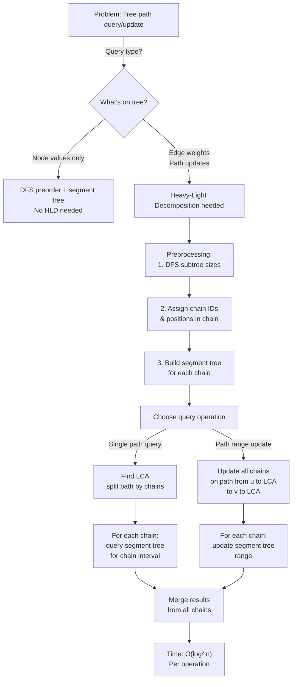

# Heavy-Light Decomposition

## Overview

**Heavy-Light Decomposition (HLD)** is a tree decomposition technique that partitions a tree into heavy and light paths, enabling efficient queries and updates on tree paths. By decomposing an arbitrary tree into O(log n) disjoint paths and maintaining a segment tree or other structure for each path, HLD converts tree path queries to O(log² n) range queries.

Introduced by Sleator and Tarjan (1983) in their work on link-cut trees, HLD is fundamental for competitive programming and advanced tree algorithms. It's used in game engines (scene graph hierarchies), network routing (path analysis), and database query optimization.

Unlike LCA (Lowest Common Ancestor) preprocessing which answers point queries, HLD handles path updates and range queries on trees efficiently — for example, adding a value to all edges on a path from u to v, then querying the maximum value on that path.

## When to Use

- **Path queries on trees**: Sum/max/min of values on a path from u to v
- **Path updates on trees**: Add a value to all nodes/edges on a path u→v, then query
- **Subtree queries with changes**: Update a subtree and answer range queries
- **Tree edge weights change**: Dynamic trees with weighted queries
- **Not suitable if queries are mostly**: Point lookups (use LCA), subtree aggregation only (use DFS ordering + segment tree)

## ASCII Visualization

```
Example tree (edges labeled with weights):

           1(5)
          / \
        2(3) 3(1)
        / \     \
      4(2) 5(4)  6(2)
      /     |
     7(1)   8(3)

Heavy-Light Decomposition by child subtree sizes:

                1
              /   \
        [2-4-7]    [3]
           |
        [5-8]    6

Paths (heavy edges in black, light edges in red):
- Path 1: [1, 2, 4, 7] (following heavy edges: 1→2 heavy, 2→4 heavy, 4→7 heavy)
- Path 2: [2, 5, 8] (starting from left-out node 5, following heavy)
- Path 3: [1, 3, 6] (starting from right child of 1)

Each path maintains its own segment tree or array structure.

To query path 7→1:
- 7 is in path [7,4,2,1]
- Follow heavy chain upward to node 1
- If query crosses chains, use LCA to split
```

### Path Structure

```
Tree nodes organized by chain:
Chain 0: [1, 2, 4, 7]  - segment tree for edge weights
Chain 1: [5, 8]        - segment tree for edge weights  
Chain 2: [3, 6]        - segment tree for edge weights

Query path(u, v):
1. Find LCA(u, v)
2. While u != LCA: query current chain segment tree, jump up to parent chain
3. While v != LCA: query current chain segment tree, jump up to parent chain
4. Combine all query results
```

## Operations & Complexity

| Operation          | Time Complexity | Space Complexity | Notes |
|-------------------|:---------------:|:----------------:|-------|
| Preprocessing      | O(n)            | O(n)             | DFS to compute subtree sizes, assign positions |
| Path query         | O(log² n)       | O(1)             | At most O(log n) chains, O(log n) per segment tree query |
| Path update        | O(log² n)       | O(1)             | Same as path query, propagate updates up chains |
| Point query/update | O(log² n)       | O(1)             | Special case of path query |
| Space             | —               | O(n)             | One segment tree per chain, total O(n) nodes |

> HLD reduces tree to O(log n) chains. With segment trees: O(log² n) per operation. With link-cut trees: can achieve O(log n).

## Key Invariants

1. **Heavy-light property**: For each non-leaf node, the child with the largest subtree is the "heavy" child. Other children are "light".
2. **Chain partition**: Each path from a light edge to a leaf is a separate chain. Total O(log n) chains on any root-to-leaf path.
3. **Chain ordering**: All nodes in a chain are ordered by DFS preorder along that chain.
4. **Depth of chain tree**: O(log n); going up chains from any node to root passes through O(log n) chains.
5. **Subtree size invariant**: subtree_size[u] > subtree_size[v] if u is parent and on the same heavy path.

## Solution Approach Flowchart



## Common Patterns

1. **Path Sum Query**: Build HLD with segment tree storing edge weights. To query sum on path u→v: (1) find LCA(u,v), (2) walk chains from u to LCA querying segment trees, (3) walk chains from v to LCA, (4) sum all results. Time: O(log² n).

2. **Path Range Update**: Same structure. To add a value to all edges on path u→v: (1) walk chains updating segment trees with lazy propagation, (2) propagate updates to children. Lazy propagation reduces it to O(log² n) without full tree traversal.

3. **Subtree Heaviness Analysis**: Use HLD to identify heavy subtrees. Process nodes in chain order to analyze locality; cache-friendly for applications like scene graphs.

4. **Link-Cut Tree Variant**: Use HLD as foundation for link-cut trees, enabling dynamic tree operations (reroot, change weights) in O(log n) amortized per operation.

## Interview Questions

1. **Why is heavy-light decomposition O(log n) chains deep?** Because each heavy edge goes to the child with >50% of subtree size. Going up the tree, each light edge reduces subtree size by ≥50%. Total: at most log₂(n) light edges before reaching root.

2. **How do you compute LCA efficiently in HLD?** Preprocess with binary lifting or another O(log n) LCA method (e.g., Tarjan's offline algorithm). HLD itself doesn't compute LCA; you use HLD for path queries given LCA as input.

3. **Can you handle edge updates with HLD?** Yes. Store edge weights in segment trees indexed by chain position. Updating edge (u, v) updates the segment tree entry for the deeper node.

4. **What's the difference between HLD and centroid decomposition?** HLD is for path operations; centroid decomposition is for subtree operations. HLD gives O(log n) chains; centroid decomposition gives O(log n) depth. Choose based on problem structure.

5. **How would you modify HLD for weighted edges?** Store weights in segment trees instead of node values. Edge (u, v) with weight w: store w at the deeper endpoint's position in the segment tree.

6. **Is HLD better than Link-Cut Trees?** HLD: simpler, O(log² n). Link-Cut Trees: more complex, O(log n). Both have their place. Link-Cut Trees are more flexible for arbitrary tree operations.

7. **How many chains can a path from node u to root pass through?** At most O(log n). Proof: Each time you jump to a different chain via a light edge, subtree size roughly halves.

## Implementation Notes

- **Subtree Size Calculation**: DFS to compute subtree_size[u] = 1 + sum(subtree_size[children]). Easy to forget that only direct children count.
- **Heavy Child Selection**: For each node, the child with maximum subtree_size is heavy. Ties can go either way; consistent selection matters for correctness.
- **Chain Assignment**: Use DFS to assign nodes to chains in order. Keep track of chain ID and position within chain for segment tree indexing.
- **LCA Preprocessing**: HLD assumes LCA is preprocessed separately (binary lifting, sparse table, etc.). Getting LCA wrong breaks path queries.
- **Segment Tree per Chain**: Each chain needs its own segment tree indexed 0..chain_length. Query intervals must map correctly to chain positions.
- **Testing**: Verify chain assignment is contiguous along edges. Verify O(log n) chains on any path. Test simple cases: line graph (1 chain), star graph (n-1 chains).

## References

1. Sleator, D. D., & Tarjan, R. E. (1983). "A data structure for dynamic trees." *Journal of Computer and System Sciences*, 26(3), 362-391.
2. Gusfield, D. (1997). *Algorithms on Strings, Trees, and Sequences*. Cambridge University Press.
3. Competitive Programming community documentation on HLD (Codeforces, TopCoder).
