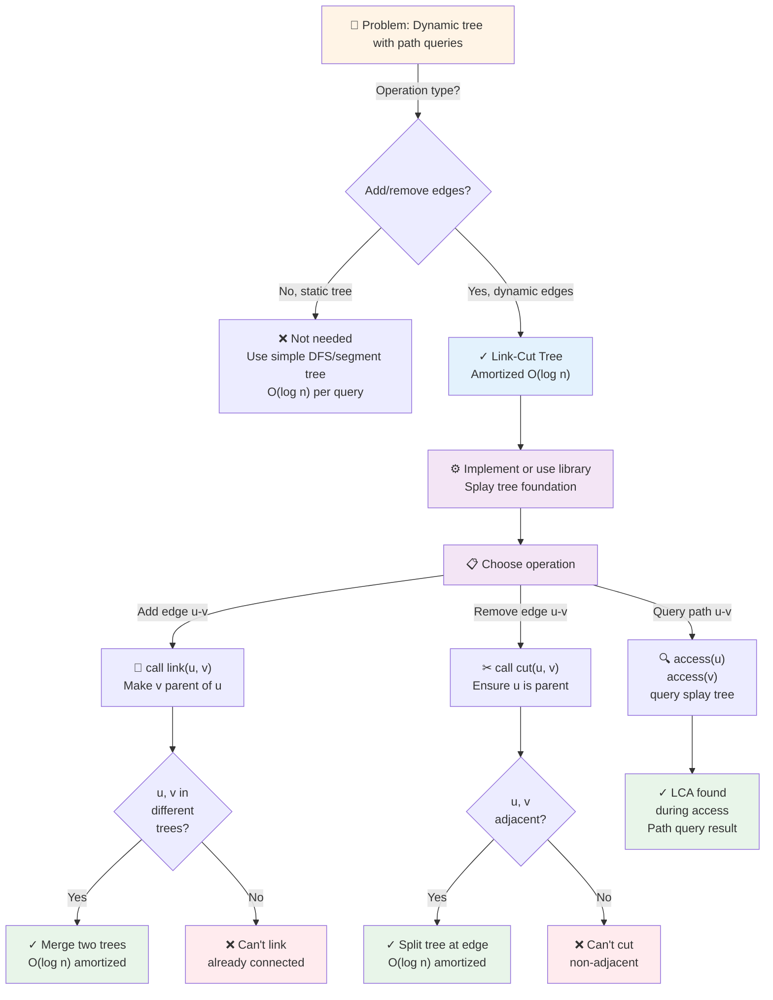
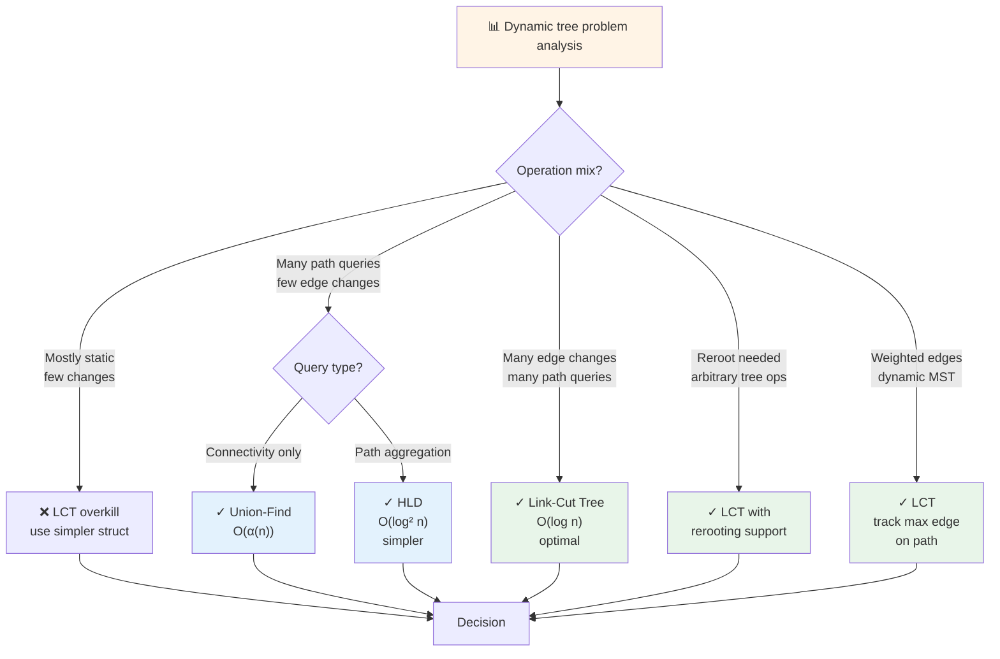
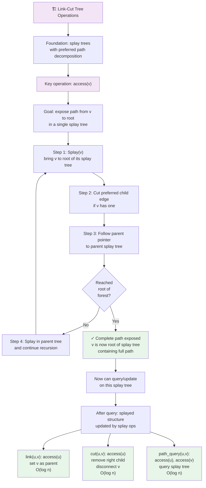

# Link-Cut Tree

## Overview

A **Link-Cut Tree (LCT)** is a data structure for dynamic forest management, enabling efficient handling of tree modifications like adding/removing edges and querying paths. It supports link (add an edge), cut (remove an edge), and path queries in O(log n) amortized time.

Invented by Sleator and Tarjan (1983), link-cut trees are among the most sophisticated tree data structures. They use **splay trees** as the underlying mechanism, with auxiliary trees representing vertical and horizontal relations. Link-cut trees are used in network design (finding minimum cost spanning trees dynamically), image processing (union-find on large pixel graphs), and advanced algorithmic competitions.

Unlike static trees or simple union-find, LCTs support arbitrary path queries and modifications with logarithmic amortized time, making them ideal when the tree structure changes frequently.

## When to Use

- **Dynamic forests**: Tree structure changes (add/remove edges) frequently
- **Path queries on changing trees**: Sum/max/min on a path u→v with changing edges
- **Connectivity queries**: Find if u and v are connected, and query the unique path
- **Minimum spanning tree (dynamic version)**: Add/remove edges, maintain MST property
- **Not suitable for**: Static trees (simpler methods suffice), subtree-only queries (use other decompositions)

## ASCII Visualization

```
Physical Tree (with edges):
           1
          / \
        2   3
       /     \
      4       5

As Link-Cut Tree with Splay Trees:

Each node represents a small splay tree (auxiliary tree).
Horizontal edges (in same splay tree): represent edges on the original path
Vertical edges: represent tree structure (parent pointers between splay trees)

Node 1:
  - Splay tree contains: 1
  - Child splay trees (via parent pointer): 2, 3

Node 2:
  - Splay tree contains: 2, 4
  - Parent pointer to node 1

Node 3:
  - Splay tree contains: 3, 5
  - Parent pointer to node 1

Actual representation in memory:
        [1, 2, 4]       [3, 5]
        splay tree      splay tree
             |               |
             └─── parent ────┘
                  to 1

When we splay and access paths: the splay tree rotates to bring the accessed
nodes to the root, restructuring the chain.
```

### Link-Cut Path Structure

```
LCT for path 4→1→3→5:

Step 1: splay(4) to expose the path from 4 upward
Step 2: access(5) to bring 5 to root and construct the active path
Step 3: Query on the splay tree path from 4 to 5 through LCA(4,5) = 1

Splay trees are restructured by access() to expose the path efficiently.
```

## Operations & Complexity

| Operation          | Time Complexity | Amortized | Notes |
|-------------------|:---------------:|:--------:|-------|
| link(u, v)        | O(log n)        | O(log n) | Add edge u-v; u and v in different trees |
| cut(u, v)         | O(log n)        | O(log n) | Remove edge u-v; assumes u is parent of v |
| access(v)         | O(log n)        | O(log n) | Expose path from v to root |
| findRoot(v)       | O(log n)        | O(log n) | Find root of tree containing v |
| path_query(u, v)  | O(log n)        | O(log n) | Query on path u→v using access and LCA |
| Space             | —               | —        | O(n) |

> All times are amortized due to splay tree rotations. Link-cut trees achieve O(log n) without relaxing to "amortized" only on special operations.

## Key Invariants

1. **Tree structure preserved**: Each link-cut tree represents a forest; each subtree is a valid tree.
2. **Splay tree invariant**: Each auxiliary tree is a valid splay tree; most recently accessed nodes are near root.
3. **Preferred child**: Each node has at most one preferred child (the child through which it was most recently accessed).
4. **Path composition**: A path from v to root is composed of a chain of auxiliary trees; each transition is a single edge.
5. **Unique path property**: Any two nodes in the same tree have a unique path between them.

## Solution Approach Flowchart



## Dynamic Tree Operation Selection Flowchart



## Link-Cut Tree Core Operations Flowchart



## LCT vs HLD vs Union-Find Flowchart

```mermaid
flowchart TD
    A["🤔 Choosing dynamic structure"] --> B{Problem type?}
    B -->|Connectivity only<br/>no path queries| C["✓ Union-Find<br/>O(α(n))<br/>very simple"]
    B -->|Static tree<br/>path queries| D["✓ LCA preprocessing<br/>O(log n)<br/>simple"]
    B -->|Dynamic edges<br/>path queries| E{Time critical?}
    E -->|Need O(log n)| F["✓ Link-Cut Tree<br/>complex code<br/>O(log n) amortized"]
    E -->|O(log² n) ok| G["✓ Heavy-Light HLD<br/>easier to code<br/>O(log² n)"]
    B -->|Reroot operations<br/>arbitrary modifications| H["✓ LCT<br/>or virtual tree<br/>more flexible"]
    B -->|Subtree operations<br/>not path queries| I["❌ Not right family<br/>use Centroid decomposition<br/>or DFS ordering"]
    C --> J["Trade-offs"]
    D --> J
    F --> J
    G --> J
    H --> J
    J --> K["LCT pros: fastest<br/>LCT cons: hardest to code<br/>HLD: middle ground<br/>Union-Find: simplest"]
    
    style A fill:#fff4e6
    style C fill:#e8f5e9
    style F fill:#e8f5e9
    style G fill:#e8f5e9
    style H fill:#e8f5e9
    style K fill:#f3e5f5
```

## Common Patterns

1. **Dynamic Tree Path Sum**: Build LCT with values at nodes. To sum path u→v: (1) access(u), (2) access(v), (3) query the splay tree for sum. Updates similar. Time: O(log n) per operation.

2. **Connectivity with Path Queries**: Maintain LCT of a dynamic graph. Query "is u connected to v?" = "findRoot(u) == findRoot(v)". Query path values while u and v are connected. Time: O(log n).

3. **Dynamic Minimum Spanning Tree**: Add edges one by one. If both endpoints are already connected, check if the new edge has lower weight than the max weight on the path. If yes, remove max-weight edge and add new edge. Maintain MST dynamically.

4. **Global Rerooting**: If you need a different root, use re-root(v) operation (if supported by your LCT implementation) or maintain virtual edges. Some LCT libraries support this; others require careful handling.

## Interview Questions

1. **Why use link-cut trees instead of heavy-light decomposition?** HLD is O(log² n) per operation; LCT is O(log n) amortized. HLD is simpler to implement. For competitive programming, LCT if time is tight; HLD if clarity needed.

2. **How do splay trees enable efficient link-cut operations?** Splay trees have the property that accessing a node brings it close to root, reducing future access times. This "self-optimizing" property reduces amortized path lengths to O(log n).

3. **What is the "preferred child" in a link-cut tree?** Each node has at most one preferred child — the child most recently accessed via the edge to that node. Other edges to children are "non-preferred". This distinction allows efficient path compression.

4. **How does access(v) work?** Splay v to root of its splay tree. Then follow the preferred path upward: if v has a preferred child leading up, follow it. Splay at each level to expose the next segment. Time: O(log n) amortized due to splay tree properties.

5. **Can you use link-cut trees for weighted edges?** Yes, store weights on edges, not nodes. More complex than node weights. Query operations must aggregate edge weights instead of node values.

6. **What happens if you try to link two nodes in the same tree?** This creates a cycle, violating the tree structure. LCT library checks for this; you must use cut() to remove an edge first, or use a different operation (like `reroot` and relinking).

7. **How would you implement LCT from scratch?** Very difficult. Better to study the theory, understand splay trees deeply, and use a well-tested library or competitive programming reference. Bugs in LCT are subtle (preferred-child not properly maintained, etc.).

## Implementation Notes

- **Splay Tree Core**: LCT is built on splay trees. Implementing splay correctly is critical; off-by-one errors in rotations break everything.
- **Preferred Path Decomposition**: Distinguish between preferred edges (to preferred child) and non-preferred edges. Operations traverse preferred edges first.
- **Path Exposure**: The `access(v)` operation builds a full path from v to the root by exposing the preferred path, then extending with non-preferred edges one level at a time.
- **Link Precondition**: Before calling `link(u, v)`, ensure u and v are in different trees. Some implementations check this; others require caller to verify.
- **Cut Precondition**: Before calling `cut(u, v)`, ensure u is the parent of v (or vice versa, depending on implementation). Cutting non-adjacent nodes is undefined.
- **Testing**: Verify forest structure is maintained. Test simple cases: single node, two nodes linked, path queries, edge removals. Use visualizations to debug.

## References

1. Sleator, D. D., & Tarjan, R. E. (1983). "A data structure for dynamic trees." *Journal of Computer and System Sciences*, 26(3), 362-391.
2. Tarjan, R. E. (1997). "Data structures and network algorithms." *SIAM*.
3. Competitive Programming community (Codeforces blogs, TopCoder editorials) for practical implementations.
