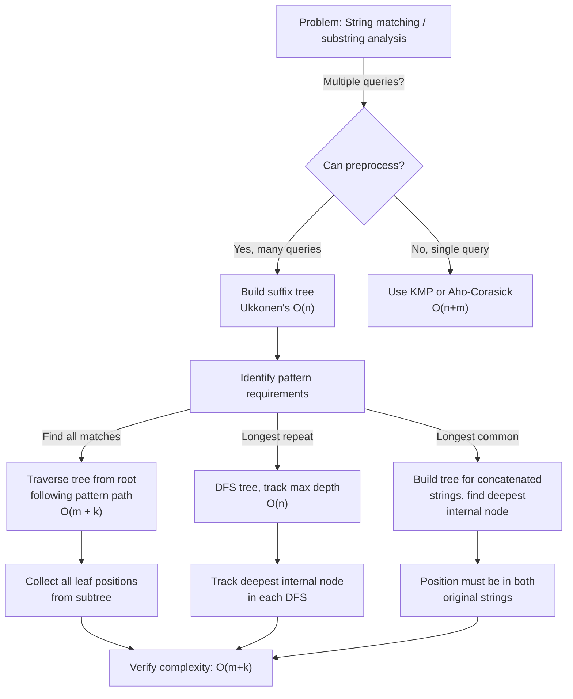

# Suffix Tree

## Overview

A **Suffix Tree** is a compressed trie containing all suffixes of a string. It enables fast pattern matching and string analysis by storing all n suffixes of a string of length n in O(n) space and time, unlike a naive trie which would require O(n²).

Originally invented by Weiner (1973) and optimized by McCreight (1976), suffix trees are used in bioinformatics (DNA sequencing), full-text indexing, and plagiarism detection. Modern implementations like Ukkonen's (1995) build suffix trees in linear time online.

Suffix trees excel when you need multiple pattern queries on the same text — after O(n) preprocessing, each query is O(m + k) where m is the pattern length and k is the number of matches. For one-off searches, suffix arrays with binary search often suffice.

## When to Use

- **Multiple pattern searches on fixed text**: Build once, query many times
- **Longest common substring / longest repeated substring**: Walk the tree structure
- **Finding all occurrences of a pattern in O(m + k) time**: k is number of matches
- **Bioinformatics**: DNA pattern matching, motif discovery
- **Data compression**: Identify repeated substrings
- Space is not a hard constraint (suffix trees use more memory than suffix arrays)

## ASCII Visualization

```
Text: "banana$"  ($ = terminator)

Suffix Tree structure (compressed):
                    root
                   /    \
                  a      b
                 / \      \
                n   $6     a
               / \          \
              a   $2         n
             /              / \
            n              a   $4
           / \              \
          a   $1             $3
         /
        $0

$ markers show suffix start positions: $0 = pos 0 (banana$), $1 = pos 1 (anana$), etc.

Edges are labeled with substrings, not single characters:
- "ba" edge from root to node for "ba..."
- "nan" edge from "a" node (represents going through "nan" in suffix)

Full uncompressed trie would have 7*6/2 = 21 nodes for 7 suffixes.
Suffix tree compresses this to ~7-8 nodes by merging single-child paths.
```

### Search Process for Pattern "ana"

```
Find "ana" in "banana$":

1. Start at root
2. Find edge starting with 'a' → follow to node
3. From that node, find edge starting with 'n' → follow
4. From that node, find edge starting with 'a' → follow to a leaf or internal node
5. All leaves/positions in this subtree are match positions
   Matches: positions 1 (anana$) and 3 (ana$)
```

## Operations & Complexity

| Operation          | Time Complexity | Space Complexity | Notes |
|-------------------|:---------------:|:----------------:|-------|
| Build (Ukkonen)   | O(n)            | O(n)             | Linear time, linear space |
| Build (Naive)     | O(n²)           | O(n²)            | Quadratic naive approach |
| Pattern search    | O(m + k)        | O(1)             | m = pattern length, k = matches |
| Longest common substring | O(n+m) | O(n+m) | Build tree for concatenated strings |
| Longest repeat    | O(n)            | O(1)             | Walk tree, track max depth |
| Space             | —               | O(n)             | Can be 10-30x input size |

> Ukkonen's algorithm processes one character at a time, maintaining active point to enable O(n) construction.

## Key Invariants

1. **All n suffixes** of string[0..n-1] are represented as root-to-leaf paths.
2. **Compressed edges**: Each edge is labeled with a substring, not a single character.
3. **No node can have >26 outgoing edges** (for 26-letter alphabet) due to compression.
4. **Path-to-leaf uniqueness**: No two suffixes share the same path from root.
5. **Suffix link**: Each internal node (except root) has a link to the node representing the suffix with first character removed.
6. **End-marker ($)** ensures no suffix is a prefix of another.

## Solution Approach Flowchart



## Common Patterns

1. **Pattern Matching**: Build suffix tree for text T, then for each query pattern P, walk from root following P's characters. All leaves in the subtree are match positions. Time: O(m + k).

2. **Longest Repeated Substring**: Build suffix tree, run DFS tracking maximum depth of any internal node. The path from root to that node is the longest repeated substring (appears in at least 2 leaf positions).

3. **Longest Common Substring (LCS)**: Build suffix tree for concatenated string S1#S2$. Find the deepest internal node whose subtree contains leaves from both S1 and S2. The path is the LCS.

4. **Compressed String Matching**: Mark suffixes from different parts of text. For "banana" with marked positions, use the suffix tree to identify which marked positions share a suffix of length k.

## Interview Questions

1. **What is the difference between a suffix tree and a suffix array?** Tree: O(n) space, O(m) search. Array: O(n log n) to build, but less space; requires binary search for patterns.

2. **How does Ukkonen's algorithm achieve O(n) time?** By maintaining an "active point" (node, edge, length) and using suffix links to avoid redundant work when extending suffixes.

3. **Can you find the longest palindromic substring using a suffix tree?** Build tree for S + reverse(S) + concatenation marker. The deepest internal node with leaves from both strings (and correct positions) gives the answer.

4. **Why is the $ terminator necessary?** Without it, a suffix might be a prefix of another (e.g., "abc" is prefix of "abcd"). The $ ensures no suffix is a prefix of another, maintaining the tree property.

5. **How would you count occurrences of a pattern in O(m + log n) time?** Use an augmented suffix tree where each internal node stores the count of leaves in its subtree. Answer is count at the node where pattern walk ends.

6. **What is the space complexity in practice?** O(n) theoretically, but constants are high: typically 10-30 bytes per character due to edge pointers and node overhead. Suffix arrays with LCP arrays are more space-efficient in practice.

7. **How do you handle multiple patterns (Aho-Corasick vs. suffix tree)?** Suffix tree handles all patterns in O(n + m₁ + m₂ + ... + total_matches). Aho-Corasick handles multiple patterns in O(n + Σmᵢ + matches).

## Implementation Notes

- **Suffix Link Maintenance**: Ukkonen's algorithm is efficient because suffix links enable skipping redundant comparisons. Incorrect suffix links will cause O(n²) behavior.
- **Edge Compression**: Store edges as (start_index, end_index) into original string, not actual substrings. This saves space and allows O(1) comparison.
- **Active Point Tracking**: The triple (active_node, active_edge, active_length) is crucial for O(n) construction. Easy to get wrong.
- **Leaf Extension**: In Ukkonen's method, use a global variable for leaf end position to enable O(1) extension of all leaves in one operation.
- **Testing**: Verify that all n suffixes are present, no suffix is a prefix of another, and tree size is linear in input size.

## References

1. Weiner, P. (1973). "Linear pattern matching algorithms." *Proceedings of the 14th Annual Symposium on Switching and Automata Theory*.
2. Ukkonen, E. (1995). "On-line construction of suffix trees." *Algorithmica*, 14(3), 249-260.
3. Gusfield, D. (1997). *Algorithms on Strings, Trees, and Sequences: Computer Science and Computational Biology*. Cambridge University Press.
