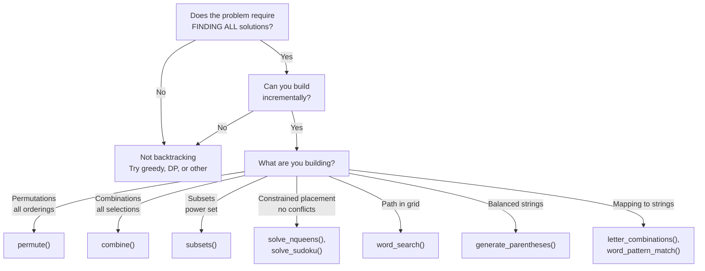

# Backtracking Algorithms: Decision Flowchart & Patterns

## When to Use Backtracking

Backtracking is a systematic exploration technique where you:
1. **Build** solutions incrementally
2. **Check** constraints at each step
3. **Backtrack** when constraints are violated
4. **Find all** valid solutions

## Decision Flowchart



## Algorithm Summary Table

| Algorithm | Problem | Time | Space | Key Insight |
|-----------|---------|------|-------|-------------|
| N-Queens | Place n queens, no conflicts | O(N!) | O(N²) | Prune early if position invalid |
| Sudoku | Fill 9x9 grid, row/col/box unique | O(9^(n²)) | O(1) | Constraint checking is key |
| Word Search | Find path in grid for word | O(N·M·4^L) | O(L) | Track visited cells per path |
| Permutations | All orderings of list | O(N! · N) | O(N!) | Use indices or marked set |
| Combinations | All k-selections from n | O(C(n,k)·k) | O(k) | Use start index to avoid duplicates |
| Subsets | Power set | O(N · 2^N) | O(2^N) | Include all decisions |
| Letter Combos | Keypad combinations | O(4^N · N) | O(4^N) | Multiply possible outputs |
| Parentheses | Valid n-pair brackets | O(Cat_N) | O(N) | Track open vs closed count |

## Template Pattern

```python
def backtrack_problem(input_data):
    result = []
    
    def is_valid(path, candidate):
        # Check constraints for current decision
        return True/False
    
    def backtrack(path, remaining_choices):
        # Base case: solution complete
        if is_complete(path):
            result.append(path[:])  # Copy to result
            return
        
        # Pruning: skip invalid branches early
        if not is_promising(path):
            return
        
        # Explore all choices
        for choice in get_next_choices(remaining_choices):
            # Build
            path.append(choice)
            
            # Recurse
            backtrack(path, remaining_choices - {choice})
            
            # Backtrack (undo)
            path.pop()
    
    backtrack([], input_data)
    return result
```

## Common Mistakes

1. **Forgetting to copy** when adding to result - use `path[:]` not `path`
2. **Not backtracking** after recursion - must undo changes
3. **No pruning** - check constraints early to reduce search space
4. **Using indices wrong** - start index vs element indices matter

## When NOT to Backtrack

- ✗ Only need one solution → use greedy or DP
- ✗ Only need count → use combinatorics (math formula)
- ✗ All solutions fit pattern → use iteration (letters)

## Interview Tips

**Permutations vs Combinations:**
- Permutations: Use index tracking or "seen" set, remove each element
- Combinations: Use start index to avoid duplicates automatically

**Grid Problems:**
- Mark visited BEFORE recursing
- Unmark visited AFTER recursing (to explore other branches)
- Use visited set per path, not global

**Constraint Satisfaction:**
- Check constraints as early as possible
- Return false immediately when constraint violated
- Prune branches before exploring

**Complexity Analysis:**
- Time is often O(k^n) where k=choices per level, n=depth
- Space is recursion depth + output size
- Focus on pruning effectiveness, not absolute numbers
