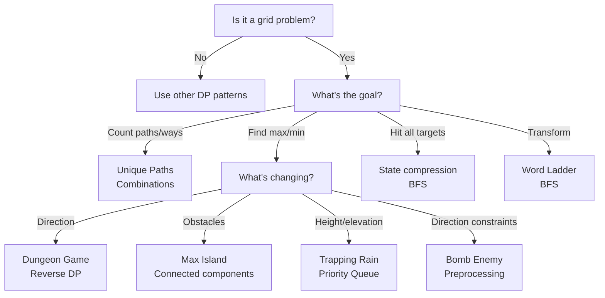

# Grid & 2D DP: Pattern Recognition & Decision Flowchart

## Grid Problem Patterns



## Grid DP Template

```python
def grid_dp(grid):
    m, n = len(grid), len(grid[0])
    dp = [[0] * n for _ in range(m)]
    
    # Initialize first cell
    dp[0][0] = initial_value(grid[0][0])
    
    # Fill first row (if applicable)
    for j in range(1, n):
        dp[0][j] = compute_from_left(dp[0][j-1], grid[0][j])
    
    # Fill first column (if applicable)
    for i in range(1, m):
        dp[i][0] = compute_from_top(dp[i-1][0], grid[i][0])
    
    # Fill rest of table
    for i in range(1, m):
        for j in range(1, n):
            dp[i][j] = combine(
                dp[i-1][j],      # from top
                dp[i][j-1],      # from left
                grid[i][j]       # current cell
            )
    
    return dp[m-1][n-1]
```

## Direction Handling Variations

**Down/Right only**: Simple left/top dependencies
**All 4 directions**: Need BFS or special handling
**Reverse (min health)**: Process bottom-right to top-left
**2D ranges (water)**: Use priority queue

## Problem Categories

| Category | Algorithm | Pattern | Example |
|----------|-----------|---------|---------|
| Path Counting | unique_paths | DP[i][j] = DP[i-1][j] + DP[i][j-1] | m×n grid, right/down only |
| Constraint Optimization | bomb_enemy | Precompute per direction | Range queries per row/col |
| Connected Components | max_island_area | DFS/BFS all connected cells | Island maximum area |
| Reverse Constraint | dungeon_game | Process bottom-right to top-left | Minimum health requirement |
| Elevation/Boundaries | trapping_rain_water_2d | Priority queue + visited | Water level between boundaries |
| Path Finding | word_ladder | BFS on implicit graph | Shortest transformation path |
| Pattern Matching | word_pattern_match | Bijective backtracking | String-to-pattern assignment |

## Complexity Summary

| Algorithm | Time | Space | Type |
|-----------|------|-------|------|
| Unique Paths | O(m·n) | O(m·n) | Path counting |
| Bomb Enemy | O(m·n·(m+n)) | O(m·n) | Preprocessing |
| Max Island | O(m·n) | O(m·n) | Connected components |
| Dungeon Game | O(m·n) | O(m·n) | Reverse DP |
| Trapping Rain 2D | O(m·n·log(m·n)) | O(m·n) | Priority queue |
| Word Ladder | O(n·L²) | O(n·L) | Implicit graph BFS |
| Word Pattern | O(n·2^m) | O(m+n) | Bijective backtrack |

## Interview Tips

**Initialization:**
- First cell depends on problem (usually base case)
- First row and column often have special rules
- Consider boundary conditions

**Direction Handling:**
- Forward direction: process top-left to bottom-right
- Reverse direction: process bottom-right to top-left
- All directions: often requires BFS with explicit queue

**Space Optimization:**
- Simple 2D DP: keep full table
- Space-optimized: keep only previous row or two rows
- Challenge: Can you do it in O(1) space?

**Connected Components:**
- Use DFS/BFS for each unvisited cell
- Mark visited to avoid revisits
- Count increments per component found

**Constraint Propagation:**
- Multiple constraints (row, col, box): check all
- Early termination: return false immediately on failure
- Precomputation: compute auxiliary tables once
