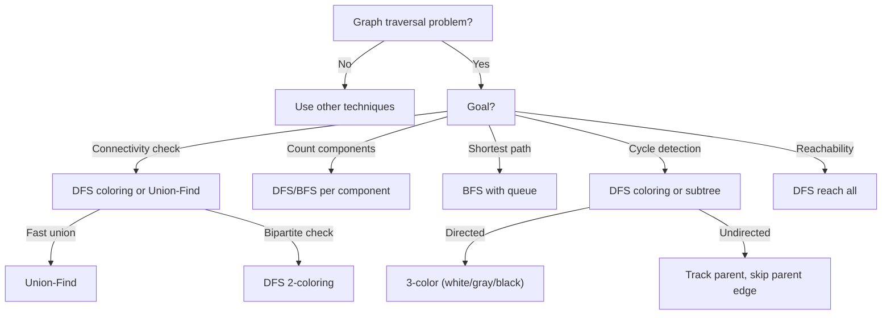

# Graph Traversals: DFS vs BFS vs Union-Find Patterns

## Traversal Decision Flowchart



## Traversal Template Patterns

### DFS (Stack-based or Recursive)
```python
def dfs(graph, start):
    visited = set()
    stack = [start]
    
    while stack:
        node = stack.pop()
        if node in visited:
            continue
        visited.add(node)
        
        for neighbor in graph[node]:
            stack.append(neighbor)
    
    return visited
```

### BFS (Queue-based for Shortest Path)
```python
from collections import deque

def bfs(graph, start):
    visited = {start}
    queue = deque([(start, 0)])  # (node, distance)
    
    while queue:
        node, dist = queue.popleft()
        for neighbor in graph[node]:
            if neighbor not in visited:
                visited.add(neighbor)
                queue.append((neighbor, dist + 1))
    
    return visited
```

### DFS Coloring (Cycle Detection in Directed)
```python
def detect_cycle_dfs(graph):
    color = [0] * len(graph)  # 0=white, 1=gray, 2=black
    
    def dfs(node):
        if color[node] == 1:
            return True  # Back edge
        if color[node] == 2:
            return False  # Processed
        
        color[node] = 1
        for neighbor in graph[node]:
            if dfs(neighbor):
                return True
        color[node] = 2
        return False
    
    for i in range(len(graph)):
        if color[i] == 0 and dfs(i):
            return True
    return False
```

## Problem Categories

| Category | Algorithm | Approach | Time |
|----------|-----------|----------|------|
| Connected Components | count_islands | DFS/BFS per island | O(m·n) |
| Bipartite Check | is_bipartite | DFS 2-coloring | O(v+e) |
| Cycle Detection (Directed) | has_cycle_directed | DFS 3-coloring | O(v+e) |
| Cycle Detection (Undirected) | has_cycle_undirected | DFS parent tracking | O(v+e) |
| 2-Coloring | Bipartite test | DFS/BFS coloring | O(v+e) |
| Path Finding | BFS | Queue-based | O(v+e) |

## DFS vs BFS Comparison

| Aspect | DFS | BFS |
|--------|-----|-----|
| **Data Structure** | Stack (implicit or explicit) | Queue |
| **Path Type** | Any path | Shortest path |
| **Space** | O(h) - recursion depth | O(w) - max width |
| **Complexity** | O(V+E) | O(V+E) |
| **Shortest Path** | ✗ | ✓ |
| **Connected Components** | ✓ | ✓ |
| **Cycle Detection** | ✓ | ✓ |
| **Topological Sort** | ✓ | ✗ (use Kahn) |

## Special Cases

### Grid Traversal (2D)
```python
def grid_dfs(grid, i, j, visited):
    if i < 0 or i >= len(grid) or j < 0 or j >= len(grid[0]):
        return
    if (i, j) in visited or grid[i][j] == '0':
        return
    
    visited.add((i, j))
    
    # 4 directions: up, down, left, right
    for di, dj in [(0, 1), (1, 0), (0, -1), (-1, 0)]:
        grid_dfs(grid, i + di, j + dj, visited)
```

### Undirected Cycle Detection
```python
def has_cycle(graph, n):
    visited = set()
    
    def dfs(node, parent):
        visited.add(node)
        for neighbor in graph[node]:
            if neighbor == parent:
                continue  # Skip parent edge
            if neighbor in visited:
                return True  # Found cycle
            if dfs(neighbor, node):
                return True
        return False
    
    for i in range(n):
        if i not in visited:
            if dfs(i, -1):
                return True
    return False
```

## Interview Tips

**Choosing Algorithm:**
- Shortest path? → BFS
- Just need connectivity? → DFS or Union-Find
- Cycle detection? → DFS with coloring
- All paths? → DFS with backtracking

**Optimization Opportunities:**
- Early termination when goal found
- Memoization to avoid recomputation
- Union-Find for connectivity (better than DFS for many queries)

**Common Mistakes:**
1. **Undirected vs Directed:** Undirected needs parent tracking to avoid immediate revisit
2. **DFS coloring:** Need 3 colors (white/gray/black) for directed graphs
3. **Cycle detection:** Different for directed vs undirected
4. **Stack overflow:** Recursive DFS can stack overflow on large/deep graphs

**Tradeoffs:**
- Recursive DFS: Clean code, O(h) space, risk of stack overflow
- Iterative DFS: O(V) space, no stack overflow risk
- BFS: Guarantees shortest path, more space for wide graphs
- Union-Find: Best for offline connectivity, poor for dynamic changes
