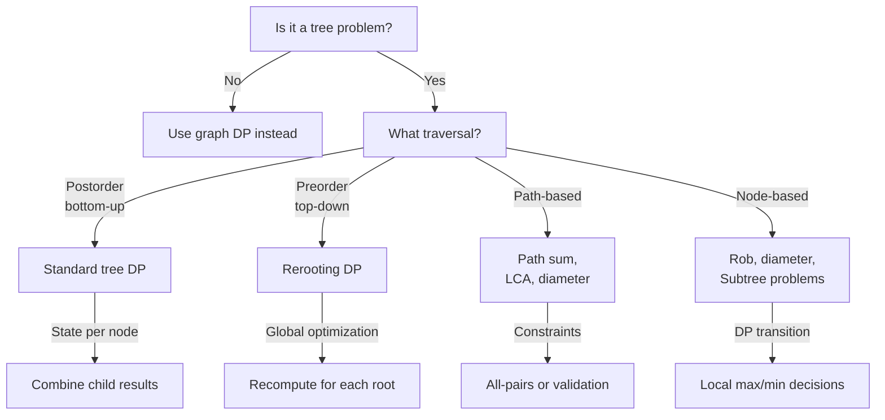

# Tree DP: Pattern Recognition & Implementation Guide

## Tree DP Pattern Flowchart



## Standard Tree DP Template

```python
def tree_dp(root):
    def dfs(node):
        if not node:
            return base_case
        
        # Process children first (postorder)
        left_result = dfs(node.left)
        right_result = dfs(node.right)
        
        # Combine at current node
        current_result = combine(node.val, left_result, right_result)
        
        return current_result
    
    return dfs(root)
```

## Tree DP Algorithm Library

| Algorithm | Pattern | Time | Space | Key |
|-----------|---------|------|-------|-----|
| LCA | Recursive search | O(n) or O(log n) | O(h) | Both found → root |
| Path Sum | Postorder search | O(n) | O(h) | Subtract val, check leaf |
| All Paths | Postorder collection | O(n·h) | O(h) | Copy path at each leaf |
| Diameter | Postorder with global | O(n) | O(h) | Track max locally |
| Rob Tree | Postorder states | O(n) | O(h) | Return (rob, skip) pairs |
| Rerooting | Two-pass DP | O(n) | O(n) | First pass, then reroot |
| Serialize | Preorder traversal | O(n) | O(n) | null markers important |
| Build Tree | Divide & conquer | O(n) | O(h) | Preorder root, inorder split |

## Tree Traversal Patterns

### Postorder (Bottom-Up) DP

```python
def postorder_dp(node):
    if not node:
        return base_case
    
    left = postorder_dp(node.left)
    right = postorder_dp(node.right)
    
    # Combine results from children
    result = merge(left, right, node.val)
    return result
```

**Use when:** Problem depends on subtree results (diameter, rob, LCA, max path)

### Preorder (Top-Down) DP

```python
def preorder_dp(node, parent_info):
    if not node:
        return
    
    # Process using parent information
    current_result = compute(node.val, parent_info)
    
    # Pass to children
    preorder_dp(node.left, current_result)
    preorder_dp(node.right, current_result)
```

**Use when:** Problem depends on parent/path information (rerooting, path queries)

## Key Patterns

### 1. State per Node

Return tuple instead of single value:
```python
def dfs(node):
    if not node:
        return (base1, base2)
    
    left = dfs(node.left)
    right = dfs(node.right)
    
    # Combine both states
    return (merge1(left, right), merge2(left, right))
```

### 2. Global Tracking

Track maximum/minimum found anywhere in tree:
```python
result = [base_value]  # Mutable to track global

def dfs(node):
    if not node:
        return 0
    
    left = dfs(node.left)
    right = dfs(node.right)
    
    result[0] = max(result[0], some_computation)
    return height
```

### 3. Path Reconstruction

Collect all paths or nodes matching criteria:
```python
def dfs(node, path, result):
    if not node:
        return
    
    path.append(node.val)
    
    if matches_criteria(path):
        result.append(path[:])
    
    dfs(node.left, path, result)
    dfs(node.right, path, result)
    
    path.pop()
```

## Interview Tips

**Complexity Analysis:**
- Single traversal: O(n)
- Multiple passes or rerooting: O(n) per pass
- With serialization: O(n) encoding + O(n) decoding

**Common Mistakes:**
1. Forgetting to handle None/null nodes
2. Not copying paths when collecting results
3. Wrong base cases for leaf nodes
4. Mixing postorder and preorder logic

**Optimization Opportunities:**
- Can you solve in single pass instead of two?
- Does state need to be a tuple or can single value work?
- Can early termination reduce traversal?

**Tradeoffs:**
- Recursion (clean, O(h) space) vs iteration (avoid stack)
- Tuple returns (more info, cleaner) vs global tracking (saves copying)
