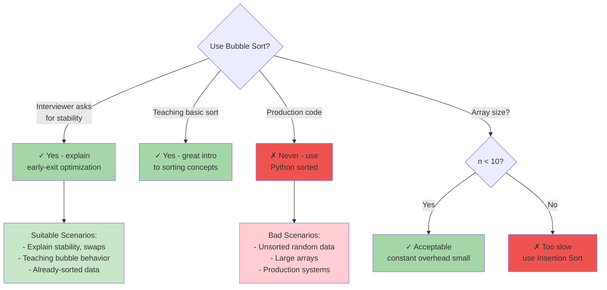
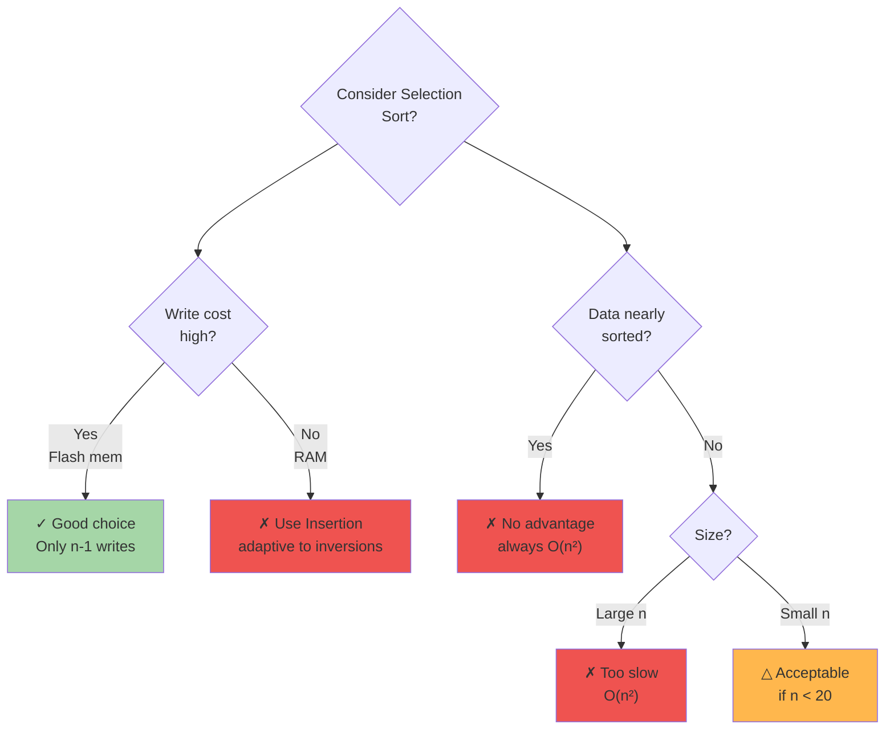
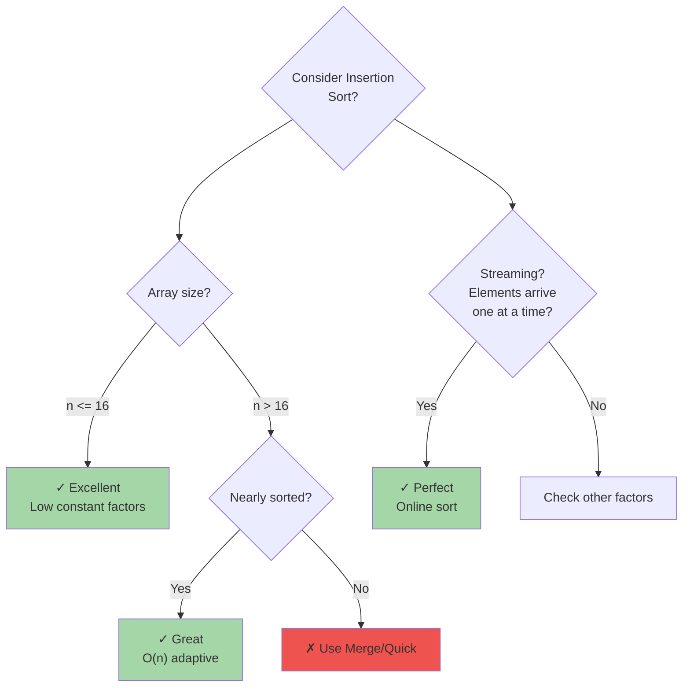
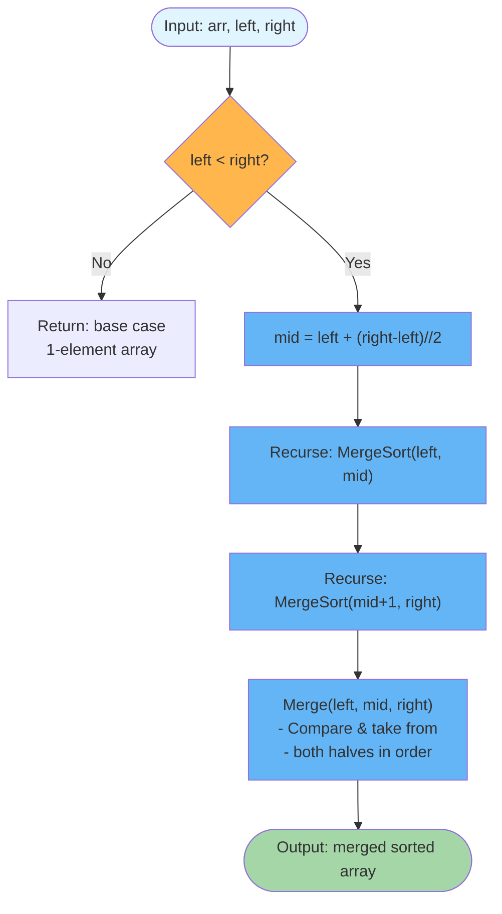
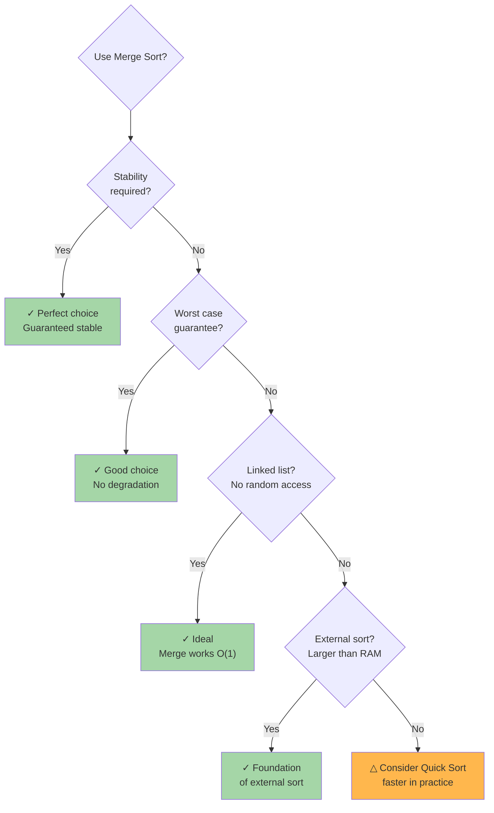
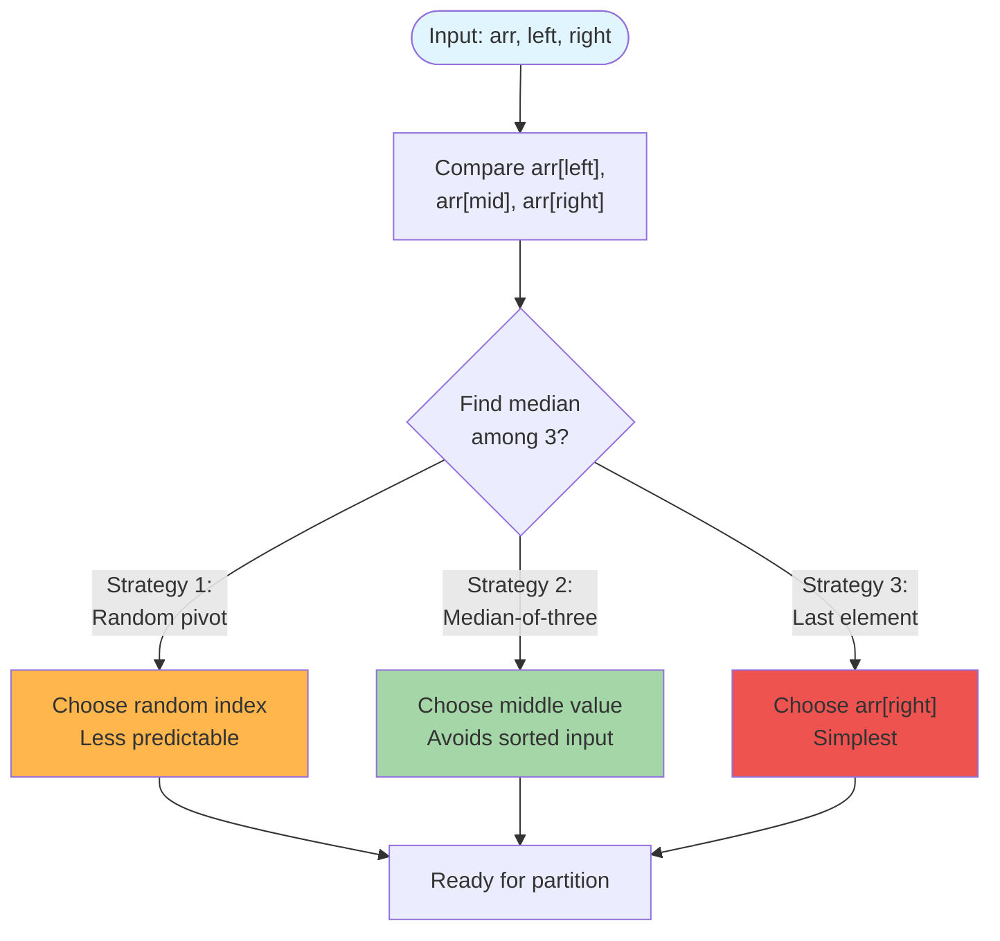
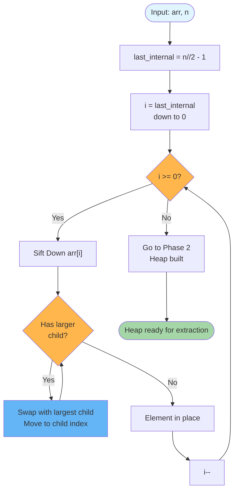
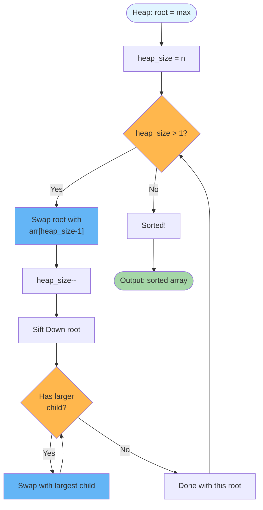
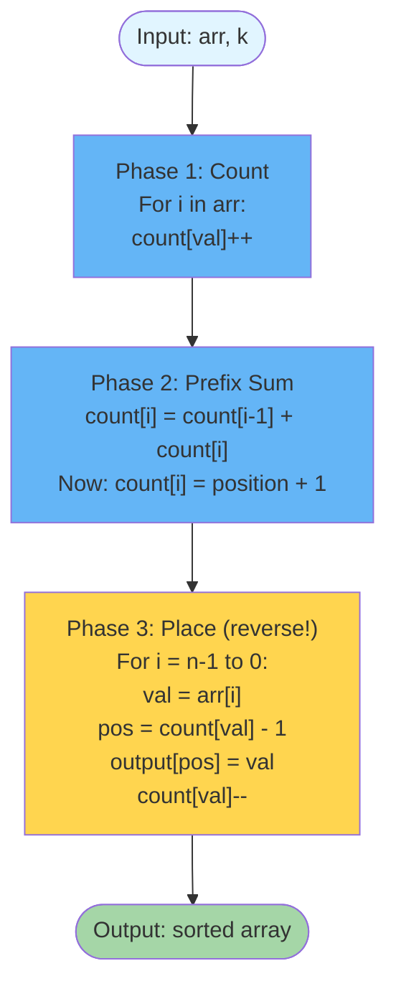
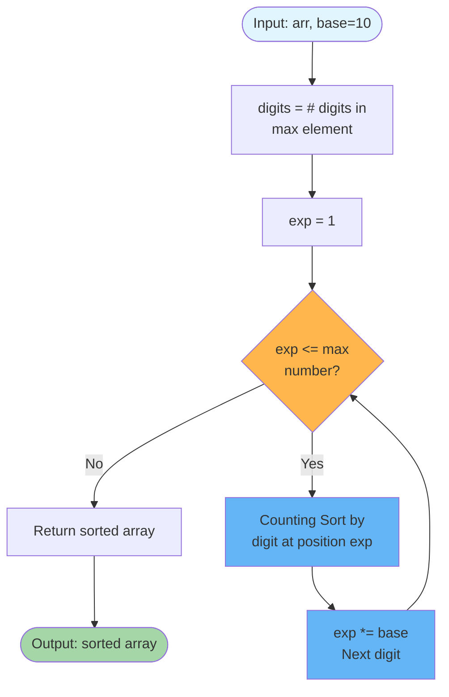

# Sorting Algorithms

A catalog of ten classical sorting algorithms from O(n) linear sorts to O(n log n) comparison-based sorts, covering stability, in-place vs auxiliary memory, and the trade-offs that determine which to choose in an interview or production setting.

---

## Master Algorithm Selection Flowchart

```mermaid
flowchart TD
    Start([Choose Sorting Algorithm]) --> Q1{Stability<br/>required?}
    
    Q1 -->|Yes| Q2{Memory<br/>constraint?}
    Q1 -->|No| Q3{Memory<br/>constraint?}
    
    Q2 -->|O(1) only| Q4{Integer<br/>values?}
    Q2 -->|O(n) OK| Q5{Input type?}
    
    Q4 -->|Yes| CountSort["Counting Sort<br/>O(n+k)"]
    Q4 -->|No| MergeSort1["Merge Sort<br/>O(n log n)"]
    
    Q5 -->|Fixed-length<br/>integers| RadixSort["Radix Sort<br/>O(d(n+k))"]
    Q5 -->|Floats/<br/>general| Q6{Nearly sorted?}
    
    Q6 -->|Yes| InsertSort1["Insertion Sort<br/>O(n) best"]
    Q6 -->|No| MergeSort2["Merge Sort<br/>O(n log n)"]
    
    Q3 -->|O(1) only| Q7{Input type?}
    Q3 -->|O(log n) OK| QuickSort1["Quick Sort<br/>O(n log n) avg"]
    
    Q7 -->|Nearly sorted| InsertSort2["Insertion Sort<br/>O(n) best"]
    Q7 -->|Random| Q8{Worst case<br/>guarantee?}
    
    Q8 -->|Yes| HeapSort["Heap Sort<br/>O(n log n)"]
    Q8 -->|No| QuickSort2["Quick Sort<br/>O(n log n) avg"]
    
    style Start fill:#e1f5ff
    style CountSort fill:#a5d6a7
    style RadixSort fill:#a5d6a7
    style MergeSort1 fill:#a5d6a7
    style MergeSort2 fill:#a5d6a7
    style QuickSort1 fill:#64b5f6
    style QuickSort2 fill:#64b5f6
    style InsertSort1 fill:#64b5f6
    style InsertSort2 fill:#64b5f6
    style HeapSort fill:#ffd54f
```

---

## Algorithms Covered

| Algorithm       | Best       | Average      | Worst        | Space      | Stable |
|-----------------|:----------:|:------------:|:------------:|:----------:|:------:|
| Bubble Sort     | O(n)       | O(n²)        | O(n²)        | O(1)       | Yes    |
| Selection Sort  | O(n²)      | O(n²)        | O(n²)        | O(1)       | No     |
| Insertion Sort  | O(n)       | O(n²)        | O(n²)        | O(1)       | Yes    |
| Merge Sort      | O(n log n) | O(n log n)   | O(n log n)   | O(n)       | Yes    |
| Quick Sort      | O(n log n) | O(n log n)   | O(n²)        | O(log n)   | No     |
| Heap Sort       | O(n log n) | O(n log n)   | O(n log n)   | O(1)       | No     |
| Counting Sort   | O(n + k)   | O(n + k)     | O(n + k)     | O(n + k)   | Yes    |
| Radix Sort      | O(d(n+k))  | O(d(n+k))    | O(d(n+k))    | O(n + k)   | Yes    |
| Bucket Sort     | O(n + k)   | O(n + k)     | O(n²)        | O(n + k)   | Yes    |
| Tim Sort        | O(n)       | O(n log n)   | O(n log n)   | O(n)       | Yes    |

> k = range of values (counting/radix/bucket), d = number of digits (radix)

---

## Bubble Sort

Repeatedly scan the unsorted portion comparing adjacent pairs and swapping them when out of order. After each full pass the largest unsorted element has "bubbled" to its final position at the end. An early-exit flag stops the algorithm immediately when a pass completes with zero swaps, giving O(n) on already-sorted input.

```
Input: [5, 3, 8, 1, 4]

Pass 1 (i=0): compare pairs across full array
  [5,3] → swap → [3,5,8,1,4]
  [5,8] → ok   → [3,5,8,1,4]
  [8,1] → swap → [3,5,1,8,4]
  [8,4] → swap → [3,5,1,4,8]   ← 8 is settled at end

Pass 2 (i=1): last element already sorted, work up to index 3
  [3,5] → ok   → [3,5,1,4,8]
  [5,1] → swap → [3,1,5,4,8]
  [5,4] → swap → [3,1,4,5,8]   ← 5 settled

Pass 3 (i=2):
  [3,1] → swap → [1,3,4,5,8]
  [3,4] → ok   → [1,3,4,5,8]   ← 4 settled

Pass 4 (i=3): no swaps → early exit
Result: [1,3,4,5,8]
```

### Algorithm Flowchart

```mermaid
flowchart TD
    Start([Input: arr, n]) --> Init["swapped = true<br/>i = 0"]
    Init --> OuterLoop{swapped?}
    OuterLoop -->|No| Return1["Return sorted array"]
    OuterLoop -->|Yes| SetSwap["swapped = false<br/>j = 0"]
    SetSwap --> InnerLoop{j < n-1-i?}
    InnerLoop -->|No| i_inc["i++"]
    i_inc --> OuterLoop
    InnerLoop -->|Yes| Compare{arr[j] ><br/>arr[j+1]?}
    Compare -->|j > j+1| Swap["Swap arr[j], arr[j+1]<br/>swapped = true"]
    Compare -->|j ≤ j+1| NoSwap["No swap"]
    Swap --> j_inc["j++"]
    NoSwap --> j_inc
    j_inc --> InnerLoop
    
    Return1 --> End([Output: sorted array])
    
    style Start fill:#e1f5ff
    style End fill:#a5d6a7
    style OuterLoop fill:#ffb74d
    style InnerLoop fill:#ffb74d
    style Compare fill:#ffb74d
    style Swap fill:#64b5f6
    style NoSwap fill:#64b5f6
```

### When to Use



**Key insight:** The inner loop shrinks by one each pass (the tail is already sorted), so total comparisons = n(n-1)/2. The swapped flag is the critical optimization — without it there is no best-case improvement.

**When to use:** Almost never in production. Useful in interviews to explain stability, adaptive behavior, and the early-exit optimization. Acceptable for n < 10.

---

## Selection Sort

Divide the array into a sorted prefix (initially empty) and an unsorted suffix. On each pass, scan the entire unsorted suffix to find its minimum, then swap that minimum into the next position of the sorted prefix. Exactly n-1 swaps are performed regardless of input order.

```
Input: [5, 3, 8, 1, 4]
        ↑ sorted boundary starts here

Pass 1: min of [5,3,8,1,4] = 1 at idx 3 → swap idx 0 and 3
  [1 | 3, 8, 5, 4]

Pass 2: min of [3,8,5,4] = 3 at idx 1 → already in place
  [1, 3 | 8, 5, 4]

Pass 3: min of [8,5,4] = 4 at idx 4 → swap idx 2 and 4
  [1, 3, 4 | 5, 8]

Pass 4: min of [5,8] = 5 at idx 3 → already in place
  [1, 3, 4, 5 | 8]

Result: [1, 3, 4, 5, 8]
```

### Algorithm Flowchart

```mermaid
flowchart TD
    Start([Input: arr, n]) --> InitI["i = 0"]
    InitI --> OuterLoop{i < n-1?}
    OuterLoop -->|No| ReturnA["Return sorted array"]
    OuterLoop -->|Yes| MinIdx["min_idx = i<br/>j = i+1"]
    MinIdx --> InnerLoop{j < n?}
    InnerLoop -->|No| FindMin{arr[j] <<br/>arr[min_idx]?}
    InnerLoop -->|Yes| FindMin
    FindMin -->|Yes| UpdateMin["min_idx = j"]
    FindMin -->|No| NoUpdate["Keep min_idx"]
    UpdateMin --> JInc["j++"]
    NoUpdate --> JInc
    JInc --> InnerLoop
    FindMin -->|After loop| CheckSwap{min_idx ≠<br/>i?}
    CheckSwap -->|Yes| SwapMin["Swap arr[i], arr[min_idx]"]
    CheckSwap -->|No| NoSwapMin["Already in place"]
    SwapMin --> IInc["i++"]
    NoSwapMin --> IInc
    IInc --> OuterLoop
    
    ReturnA --> End([Output: sorted array])
    
    style Start fill:#e1f5ff
    style End fill:#a5d6a7
    style OuterLoop fill:#ffb74d
    style InnerLoop fill:#ffb74d
    style FindMin fill:#ffb74d
    style CheckSwap fill:#ffb74d
    style SwapMin fill:#64b5f6
```

### When to Use - Write Cost Analysis



**Key insight:** Selection sort makes the fewest writes of any simple O(n²) sort — at most n-1 swaps. This is valuable when write cost dominates (e.g., flash memory). The trade-off is that it is non-adaptive: it always does exactly n(n-1)/2 comparisons.

**When to use:** When writes are expensive and n is small. Not adaptive, so never use on nearly-sorted data. Instructive for explaining the stability vs. swap-count trade-off.

---

## Insertion Sort

Build the sorted result one element at a time by taking each new element and shifting it left through the sorted prefix until it reaches its correct position. Works like sorting playing cards in hand.

```
Input: [5, 3, 8, 1, 4]
Sorted prefix: [5]  Remaining: [3, 8, 1, 4]

Step 1: key=3, shift 5 right → insert 3
  [3, 5 | 8, 1, 4]

Step 2: key=8, 5 < 8 → no shift needed
  [3, 5, 8 | 1, 4]

Step 3: key=1, shift 8,5,3 right → insert 1 at front
  [1, 3, 5, 8 | 4]

Step 4: key=4, shift 8,5 right → insert 4
  [1, 3, 4, 5, 8]

Result: [1, 3, 4, 5, 8]
```

### Algorithm Flowchart

```mermaid
flowchart TD
    Start([Input: arr, n]) --> InitI["i = 1<br/>Process elements 1..n-1"]
    InitI --> LoopI{i < n?}
    LoopI -->|No| Return2["Return sorted array"]
    LoopI -->|Yes| GetKey["key = arr[i]<br/>j = i-1"]
    GetKey --> FindPos{j >= 0 AND<br/>arr[j] > key?}
    FindPos -->|Yes| ShiftRight["arr[j+1] = arr[j]<br/>j--"]
    ShiftRight --> FindPos
    FindPos -->|No| InsertKey["arr[j+1] = key"]
    InsertKey --> NextI["i++"]
    NextI --> LoopI
    
    Return2 --> End([Output: sorted array])
    
    style Start fill:#e1f5ff
    style End fill:#a5d6a7
    style LoopI fill:#ffb74d
    style FindPos fill:#ffb74d
    style ShiftRight fill:#64b5f6
    style InsertKey fill:#64b5f6
```

### Adaptive Performance - Inversions Analysis

```mermaid
flowchart TD
    Q1["Insertion Sort<br/>Complexity = O(n + I)<br/>where I = # inversions"] --> Q2{Input type?}
    Q2 -->|Already sorted<br/>I=0| Case1["O(n) best case<br/>✓ Excellent"]
    Q2 -->|Nearly sorted<br/>I=O(n)| Case2["O(n) adaptive<br/>✓ Great for small variations"]
    Q2 -->|Reverse sorted<br/>I=n(n-1)/2| Case3["O(n²) worst case<br/>✗ Many shifts needed"]
    Q2 -->|Random<br/>I=n(n-1)/4 avg| Case4["O(n²) average<br/>△ Expected performance"]
    
    style Case1 fill:#a5d6a7
    style Case2 fill:#c8e6c9
    style Case3 fill:#ef5350
    style Case4 fill:#ffb74d
```

### When to Use - Small Array Specialist



**Key insight:** The number of shifts equals the number of inversions in the input. A nearly-sorted array has very few inversions, giving O(n + inversions) ≈ O(n) performance. This makes it the algorithm of choice for small or nearly-sorted arrays — and is exactly why Tim Sort uses it for runs shorter than minrun.

**When to use:** Arrays of n ≤ 16, nearly-sorted data, online sorting (stream elements arriving one at a time). Used internally by Tim Sort and introsort for small sub-arrays.

---

## Merge Sort

Classic divide-and-conquer: recursively split the array in half, sort each half independently, then merge the two sorted halves in O(n) time. Splitting continues until sub-arrays of size 1 are reached (trivially sorted), then merging builds back up.

```
Input: [5, 3, 8, 1, 4, 2]

Divide:
  [5, 3, 8]          [1, 4, 2]
  [5,3]   [8]        [1,4]   [2]
  [5] [3] [8]        [1] [4] [2]

Merge (bottom-up):
  [5]+[3] → [3,5]    [1]+[4] → [1,4]
  [3,5]+[8] → [3,5,8]    [1,4]+[2] → [1,2,4]

Final merge:
  [3,5,8] + [1,2,4]
   ↑           ↑
   compare: 1<3 → take 1
            2<3 → take 2
            3<4 → take 3
            4<5 → take 4
               5 → take 5
               8 → take 8

Result: [1, 2, 3, 4, 5, 8]
```

### Algorithm Flowchart - Divide & Conquer



### Merge Step Flowchart - Stability Key

```mermaid
flowchart TD
    MStart([Merge: left[], right[],<br/>out[]]) --> I["i=0, j=0, k=0"]
    I --> MainLoop{i<len_left AND<br/>j<len_right?}
    MainLoop -->|No| CopyLeft["Copy remaining<br/>from left[]"]
    MainLoop -->|Yes| Compare2{"left[i] <=<br/>right[j]?"}
    Compare2 -->|Yes, take left| TakeL["out[k++] = left[i++]<br/>Uses <= for STABILITY"]
    Compare2 -->|No, take right| TakeR["out[k++] = right[j++]"]
    TakeL --> MainLoop
    TakeR --> MainLoop
    CopyLeft --> CopyRight["Copy remaining<br/>from right[]"]
    CopyRight --> MEnd([Output: merged array])
    
    style MStart fill:#e1f5ff
    style MEnd fill:#a5d6a7
    style MainLoop fill:#ffb74d
    style Compare2 fill:#ffb74d
    style TakeL fill:#64b5f6
    style TakeR fill:#64b5f6
```

### When to Use - Guaranteed O(n log n)



**Key insight:** The merge step uses `left[i] <= right[j]` (not `<`) to preserve the relative order of equal elements from the left and right halves, which is what makes the algorithm stable. The recurrence T(n) = 2T(n/2) + O(n) solves to O(n log n) by the Master Theorem.

**When to use:** When stability is required and O(n) extra memory is acceptable. Preferred for linked lists (no random access needed). The basis of external sorting (data larger than RAM). Never degrades: guaranteed O(n log n) worst case.

---

## Quick Sort

Partition the array around a pivot element such that all elements smaller than the pivot are to its left and all larger elements are to its right, then recursively sort the two partitions. This implementation uses median-of-three pivot selection and a 3-way (Dutch National Flag) partition to handle duplicates efficiently.

```
Input: [5, 3, 8, 1, 4, 2, 7]

Pivot selection (median-of-three on first=5, mid=1, last=7):
  sorted: 1 ≤ 5 ≤ 7 → pivot = 5

3-way partition (lt=0, gt=6, i=0):
  arr[i]=5 == pivot → i++
  arr[i]=3 < pivot  → swap(lt,i), lt++, i++
  arr[i]=8 > pivot  → swap(gt,i), gt--
  arr[i]=2 < pivot  → swap(lt,i), lt++, i++
  arr[i]=1 < pivot  → swap(lt,i), lt++, i++
  arr[i]=5 == pivot → i++    (i > gt, done)

After partition:
  [3, 2, 1 | 5, 5 | 8, 7]
   < pivot    =pivot  > pivot
   lt=3        gt=4

Recurse on [3,2,1] and [8,7]
  [3,2,1] → pivot=2 → [1|2|3]
  [8,7]   → pivot=7 → [7|8]

Result: [1, 2, 3, 4, 5, 7, 8]
```

### Pivot Selection Flowchart



### 3-Way Partition Flowchart

```mermaid
flowchart TD
    PartStart([3-Way Partition<br/>lt, gt, i]) --> Init["i = left+1<br/>lt = left<br/>gt = right"]
    Init --> Loop{i <= gt?}
    Loop -->|No| Return4["Return (lt, gt)<br/>Regions set"]
    Loop -->|Yes| Cmp{arr[i]<br/>pivot?}
    Cmp -->|<| SwapLT["Swap(i, lt)<br/>lt++, i++"]
    Cmp -->|=| EqOnly["i++<br/>Stay in middle"]
    Cmp -->|>| SwapGT["Swap(i, gt)<br/>gt--"]
    SwapLT --> Loop
    EqOnly --> Loop
    SwapGT --> Loop
    
    Return4 --> End2([Three regions:<br/>left < pivot,<br/>middle = pivot,<br/>right > pivot])
    
    style PartStart fill:#e1f5ff
    style End2 fill:#a5d6a7
    style Loop fill:#ffb74d
    style Cmp fill:#ffb74d
    style SwapLT fill:#64b5f6
    style EqOnly fill:#64b5f6
    style SwapGT fill:#64b5f6
```

### When to Use - Speed & Memory Trade-off

```mermaid
flowchart TD
    Q{Use Quick Sort?} --> Q1{Memory<br/>critical?}
    Q1 -->|Yes<br/>O(log n) stack| Yes1["✓ Perfect<br/>In-place"]
    Q1 -->|No| Q2{Stability<br/>required?}
    Q2 -->|Yes| No1["✗ Use Merge Sort"]
    Q2 -->|No| Q3{Average case<br/>fast enough?}
    Q3 -->|Yes| Yes2["✓ Excellent<br/>Fastest in practice"]
    Q3 -->|No| No2["△ Add introspection<br/>fallback to Heap Sort"]
    
    style Yes1 fill:#a5d6a7
    style Yes2 fill:#a5d6a7
    style No1 fill:#ef5350
    style No2 fill:#ffb74d
```

**Key insight:** 3-way partitioning creates a "fat pivot" region `arr[lt..gt]` where all elements equal the pivot are permanently placed. This makes the algorithm O(n) when all elements are equal (instead of O(n²) with a 2-way partition). Median-of-three pivot selection prevents O(n²) on sorted/reverse-sorted inputs.

**When to use:** General-purpose sorting when memory is constrained (O(log n) stack vs. O(n) for merge sort) and stability is not required. Fastest in practice due to cache locality. Use merge sort instead when stability matters.

---

## Heap Sort

Phase 1: build a max-heap from the array in O(n) time by sifting down from the last internal node to the root. Phase 2: repeatedly swap the heap root (maximum) with the last unsorted element and sift the new root down, shrinking the heap by one each time.

```
Input: [4, 10, 3, 5, 1]

Phase 1 — Build max-heap (heapify):
  Start at last non-leaf = index 1
  Sift down index 1 (val=10): children are 5,1 → 10 > both → no swap
  Sift down index 0 (val=4):  children are 10,3 → swap 4 and 10
    [10, 4, 3, 5, 1]
  Sift down 4 (now at index 1): children 5,1 → swap 4 and 5
    [10, 5, 3, 4, 1]

Max-heap: [10, 5, 3, 4, 1]
           10
          /  \
         5    3
        / \
       4   1

Phase 2 — Extract:
  Swap root (10) with last (1): [1, 5, 3, 4 | 10]
    Sift down 1: children 5,3 → swap 1,5 → [5,1,3,4|10]
                              → swap 1,4 → [5,4,3,1|10]
  Swap root (5) with last (4): [1, 4, 3 | 5, 10]
    Sift down 1: children 4,3 → swap 1,4 → [4,1,3|5,10]
  Swap root (4) with last (3): [3, 1 | 4, 5, 10]
    Sift down 3: child 1 → no swap
  Swap root (3) with last (1): [1 | 3, 4, 5, 10]

Result: [1, 3, 4, 5, 10]
```

### Build Heap Phase - O(n) Heapify



### Extract Phase - O(n log n) Sorting



### When to Use - Space & Guarantee Tradeoff

```mermaid
flowchart TD
    Q{Use Heap Sort?} --> Q1{O(1) space<br/>required?}
    Q1 -->|Yes| Q2{Worst-case<br/>guarantee?}
    Q1 -->|No| No1["△ Quick Sort faster<br/>better cache locality"]
    Q2 -->|Yes| Yes1["✓ Good choice<br/>Guaranteed O(n log n)"]
    Q2 -->|No| No2["△ Quick Sort faster<br/>in average case"]
    
    Yes1 --> GoodUse["Good for:<br/>- Hard time guarantees<br/>- Introsort fallback<br/>- Limited memory"]
    
    style Yes1 fill:#a5d6a7
    style No1 fill:#ffb74d
    style No2 fill:#ffb74d
    style GoodUse fill:#c8e6c9
```

**Key insight:** Building the heap bottom-up takes O(n) — not O(n log n) — because most nodes are near the leaves where sift-down costs are small (the sum of heights across all nodes is O(n)). The O(1) extra space is the defining advantage over merge sort, but poor cache behavior (heap accesses jump around) makes it slower than quick sort in practice.

**When to use:** When guaranteed O(n log n) worst case AND O(1) extra space are both required. Used as the fallback in C++ introsort when quick sort recursion depth exceeds 2 log n. Not suitable when stability is needed.

---

## Counting Sort

Count the occurrences of each distinct value in the input, compute prefix sums to determine where each value's output positions begin, then place each element into its correct position in the output array by iterating the input in reverse (to preserve stability).

```
Input: [4, 2, 2, 8, 3, 3, 1]   k = 8

Step 1 — Count occurrences:
  index:  0  1  2  3  4  5  6  7  8
  count: [0, 1, 2, 2, 1, 0, 0, 0, 1]

Step 2 — Prefix sums (count[i] = # elements <= i):
  index:  0  1  2  3  4  5  6  7  8
  count: [0, 1, 3, 5, 6, 6, 6, 6, 7]

Step 3 — Place in reverse (for stability):
  val=1: count[1]=1 → output[0]=1,  count[1]=0
  val=3: count[3]=5 → output[4]=3,  count[3]=4
  val=3: count[3]=4 → output[3]=3,  count[3]=3
  val=8: count[8]=7 → output[6]=8,  count[8]=6
  val=2: count[2]=3 → output[2]=2,  count[2]=2
  val=2: count[2]=2 → output[1]=2,  count[2]=1
  val=4: count[4]=6 → output[5]=4,  count[4]=5

Output: [1, 2, 2, 3, 3, 4, 8]
```

### Algorithm Flowchart - Three Phases



### Applicability Decision Tree

```mermaid
flowchart TD
    Q{Use Counting Sort?} --> Q1{Value range k?}
    Q1 -->|k = O(n)<br/>small range| Q2{All non-negative<br/>integers?}
    Q1 -->|k >> n<br/>huge range| No1["✗ Memory wasteful<br/>count array too large"]
    Q2 -->|Yes| Q3{Stability<br/>needed?}
    Q2 -->|No<br/>Floats, objects| No2["✗ Needs integer domain"]
    Q3 -->|Yes| Yes1["✓ Perfect<br/>Stable & linear"]
    Q3 -->|No| Yes2["✓ Good<br/>Can simplify loop"]
    
    Yes1 --> Examples1["Examples:<br/>- Exam scores 0-100<br/>- Character sorting<br/>- Radix sort step"]
    No1 --> BadCases["Bad cases:<br/>- 100 items, values to 10^9<br/>- Sparse domain"]
    
    style Yes1 fill:#a5d6a7
    style Yes2 fill:#a5d6a7
    style No1 fill:#ef5350
    style No2 fill:#ef5350
    style Examples1 fill:#c8e6c9
    style BadCases fill:#ffcdd2
```

**Key insight:** Counting sort sidesteps the Omega(n log n) comparison-based lower bound by exploiting the integer domain of the values. It is only practical when k (the maximum value) is O(n); if k >> n, the count array becomes wastefully large. The reverse-iteration trick in the placement step is what makes it stable.

**When to use:** Sorting non-negative integers when the value range k is small relative to n (e.g., sorting exam scores 0–100, or sorting characters). Used as the stable sub-routine inside Radix Sort.

---

## Radix Sort

Sort integers by processing one digit at a time from the least-significant digit (LSD) to the most-significant digit (MSD), applying a stable counting sort at each digit position. Because counting sort is stable, the sorted order from earlier (less significant) passes is preserved in later passes.

```
Input: [170, 45, 75, 90, 802, 24, 2, 66]

Pass 1 — sort by 1s digit:
  170→0  90→0  802→2  2→2  24→4  45→5  75→5  66→6
  Result: [170, 90, 802, 2, 24, 45, 75, 66]

Pass 2 — sort by 10s digit:
  802→0  2→0  24→2  45→4  66→6  170→7  75→7  90→9
  Result: [802, 2, 24, 45, 66, 170, 75, 90]

Pass 3 — sort by 100s digit:
  2→0  24→0  45→0  66→0  75→0  90→0  170→1  802→8
  Result: [2, 24, 45, 66, 75, 90, 170, 802]
```

### Algorithm Flowchart - Digit-by-Digit



### Why LSD (Least Sig. Digit) Works

```mermaid
flowchart TD
    Explain["Radix Sort: Why LSD→MSD?<br/>Stability is KEY"] --> Stability["Counting Sort is STABLE<br/>Equal elements preserve<br/>their relative order"]
    Stability --> Ex1["Example: 2-digit numbers<br/>[34, 35, 24, 25]"]
    Ex1 --> Step1["Pass 1 (1s digit):<br/>By ones: 4,5,4,5<br/>Result: [34, 24, 35, 25]<br/>✓ Order: 3x before 2x"]
    Step1 --> Step2["Pass 2 (10s digit):<br/>By tens: 3,3,2,2<br/>Result: [24, 25, 34, 35]<br/>✓ Uses 1s ordering<br/>from Pass 1"]
    Step2 --> Wrong["If NOT stable:<br/>Pass 1 gets [24,34,25,35]<br/>Pass 2 destroys prior order<br/>✗ Result wrong"]
    
    Stability --> Good["✓ Correct choice<br/>Uses stability of<br/>each digit sort"]
    Wrong --> Bad["✗ Wrong approach<br/>Stability broken"]
    
    style Good fill:#a5d6a7
    style Bad fill:#ef5350
```

### When to Use - Fixed-Length Integers

```mermaid
flowchart TD
    Q{Use Radix Sort?} --> Q1{Fixed-length<br/>integers or strings?}
    Q1 -->|Yes, e.g., phone<br/>numbers, IPs| Q2{"d << log(n)?<br/>Few digits"}
    Q1 -->|No| No1["✗ Use Quick/Merge"]
    Q2 -->|Yes| Yes1["✓ Great choice<br/>O(d(n+k)) linear"]
    Q2 -->|No<br/>Many digits| Maybe["△ Constant times d<br/>may exceed log n"]
    
    Yes1 --> Examples["Examples:<br/>- Phone: 10 digits<br/>- IPv4: 32 bits<br/>- ZIP codes"]
    
    style Yes1 fill:#a5d6a7
    style No1 fill:#ef5350
    style Maybe fill:#ffb74d
    style Examples fill:#c8e6c9
```

**Key insight:** Stability at each digit pass is essential — without it, a correctly placed digit from pass k would be disrupted in pass k+1. Because each pass is O(n + k) with k=10 (decimal base), and d passes are made, total time is O(d(n+10)) = O(dn). For 32-bit integers d ≤ 10, making this effectively linear.

**When to use:** Fixed-length integers (phone numbers, ZIP codes, IP addresses) or fixed-length strings where d << log(n). Not comparison-based so not bounded by Omega(n log n). Impractical when d is large (e.g., arbitrary-precision numbers).

---

## Bucket Sort

Distribute elements into n equally-spaced buckets based on their value, sort each bucket independently (using insertion sort, since buckets are small), then concatenate in order. Designed for floating-point values uniformly distributed in [0, 1).

```
Input: [0.78, 0.17, 0.39, 0.26, 0.72, 0.94, 0.21]
       n = 7 buckets, each covers range [k/7, (k+1)/7)

Distribute (idx = floor(val * n)):
  0.78 → bucket 5
  0.17 → bucket 1
  0.39 → bucket 2
  0.26 → bucket 1
  0.72 → bucket 5
  0.94 → bucket 6
  0.21 → bucket 1

Buckets:
  0: []
  1: [0.17, 0.26, 0.21]
  2: [0.39]
  3: []
  4: []
  5: [0.78, 0.72]
  6: [0.94]

Sort each bucket (insertion sort):
  1: [0.17, 0.21, 0.26]
  5: [0.72, 0.78]

Concatenate:
  [0.17, 0.21, 0.26, 0.39, 0.72, 0.78, 0.94]
```

**Key insight:** With n buckets for n uniformly distributed elements, the expected number of elements per bucket is 1, making each bucket's insertion sort O(1). The total expected time is therefore O(n). The worst case O(n²) occurs when all elements land in the same bucket (degenerate distribution).

**When to use:** Floating-point values with known uniform distribution (e.g., normalized sensor readings, random floats). Generalize to other ranges by normalizing: `idx = int((val - min_val) / (max_val - min_val) * n)`.

---

## Tim Sort

Python's built-in sort (used by `list.sort()` and `sorted()`). A hybrid of Insertion Sort and Merge Sort that exploits natural runs (already-sorted sub-sequences) present in real-world data. Invented by Tim Peters in 2002; later adopted by Java (object arrays), Android, and V8.

```
Input: [5, 3, 4, | 1, 2, | 8, 7, 6]
        natural   natural   natural
        run(asc)  run(asc)  run(desc→rev)

Step 1 — Detect and normalize runs (minrun = 32 for large n;
         for this illustration minrun = 3):

  Run A: [5,3,4] — shorter than minrun, extend with insertion sort
         [3,4,5]

  Run B: [1,2] — extend with insertion sort to minrun length
         [1,2,8] (added next element 8)

  Run C: [7,6] — descending, reverse → [6,7]
         extend: [6,7]  (already = minrun)

Stack after pushing runs: [A(len=3), B(len=3), C(len=2)]

Step 2 — Maintain stack invariant and merge:
  |B| = 3 > |C| = 2 but |A|+|B|=6 > |C|? No — merge B and C
  B+C → merge [1,2,8] and [6,7] → [1,2,6,7,8]

  Stack: [A(3), BC(5)]
  |A| = 3 < |BC| = 5 → merge A and BC
  A+BC → merge [3,4,5] and [1,2,6,7,8] → [1,2,3,4,5,6,7,8]

Result: [1, 2, 3, 4, 5, 6, 7, 8]
```

**Key insight:** The stack-based merge invariant (each run longer than the sum of the two above it, Fibonacci-like) ensures the merge tree is balanced, guaranteeing O(n log n) total comparisons. On already-sorted data, a single run of length n is detected and zero merges occur — O(n) best case. Galloping mode (exponential search during merge) accelerates runs where one side dominates.

**When to use:** This is Python's `sorted()` — always your default choice. When implementing your own sort, use it as the mental model: hybrid insertion sort for small pieces, merge sort for combining.

---

## Choosing the Right Algorithm

| Situation                                             | Pick                  |
|-------------------------------------------------------|-----------------------|
| General purpose, no constraints                       | Tim Sort (`sorted()`) |
| Stable sort, no memory budget                         | Merge Sort            |
| Memory constrained, stability not needed              | Heap Sort             |
| Fastest in practice, not stable                       | Quick Sort            |
| Small array (n ≤ 16) or nearly sorted                 | Insertion Sort        |
| Non-negative integers, small value range k            | Counting Sort         |
| Fixed-length integers or strings                      | Radix Sort            |
| Uniformly distributed floats in [0, 1)                | Bucket Sort           |
| Minimize writes (flash memory, write-heavy media)     | Selection Sort        |
| Teaching / interview explanation of basic sort        | Bubble Sort           |

**Stability matters when:** sorting objects by multiple keys (first by name, then by age), preserving input order for equal elements.

**O(1) space required:** Heap Sort or Quick Sort (stack space only).

**Guaranteed O(n log n) in all cases:** Merge Sort or Heap Sort (Quick Sort has O(n²) worst case without randomization).

---

## Common Interview Questions

- **Why is Quick Sort faster than Merge Sort in practice despite identical Big-O?** Quick Sort's in-place partition gives better cache locality; Merge Sort allocates auxiliary arrays, causing cache misses and allocation overhead.
- **What makes a sorting algorithm stable, and which of these are stable?** Stable means equal elements preserve their original relative order. Bubble, Insertion, Merge, Counting, Radix, Bucket, Tim Sort are stable. Selection, Quick, and Heap are not.
- **How do you sort a linked list efficiently?** Merge Sort — it requires no random access and the merge step is efficient on linked lists. Quick Sort is poor for linked lists due to random pivot access.
- **What is the lower bound for comparison-based sorting, and how do linear sorts bypass it?** The comparison-based lower bound is Omega(n log n) (information-theoretic argument: n! possible orderings need log₂(n!) ≥ n log n bits to distinguish). Counting, Radix, and Bucket Sort bypass this by using value structure (integers, digits) rather than comparisons.
- **Explain Tim Sort's minrun and why it is between 32 and 64.** minrun is chosen so that n / minrun is a power of 2 (or close to it), making the merge passes balanced and the total number of merges minimized. Values outside [32, 64] either produce too many runs (merge overhead) or runs too large for insertion sort.
- **When does Quick Sort degrade to O(n²), and how does this implementation prevent it?** On sorted or reverse-sorted input with a naive "first element" pivot, every partition is maximally unbalanced (one side empty). Median-of-three pivot selection makes this essentially impossible for real input; 3-way partitioning additionally handles all-equal inputs in O(n).
- **Counting Sort requires O(k) space. When is this impractical?** When k (max value) is much larger than n — e.g., sorting 100 timestamps with values up to 10^9 would require a 10^9-element count array. Use Radix Sort or comparison-based sort instead.
- **What does "in-place" mean, and which algorithms here are truly in-place?** In-place means O(1) auxiliary space (not counting the input). Bubble, Selection, Insertion, Heap Sort are truly in-place. Quick Sort uses O(log n) stack space. Merge Sort uses O(n). Counting/Radix/Bucket use O(n + k).
