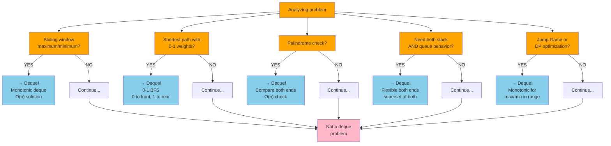
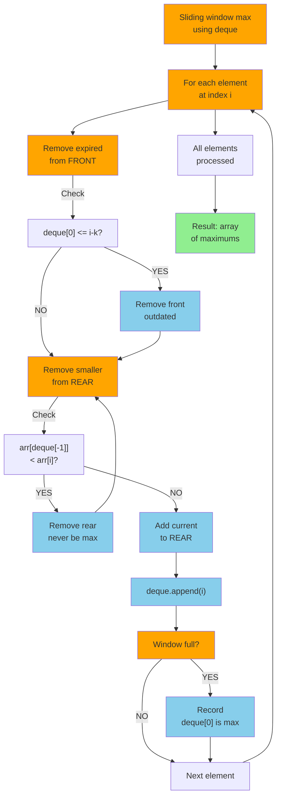
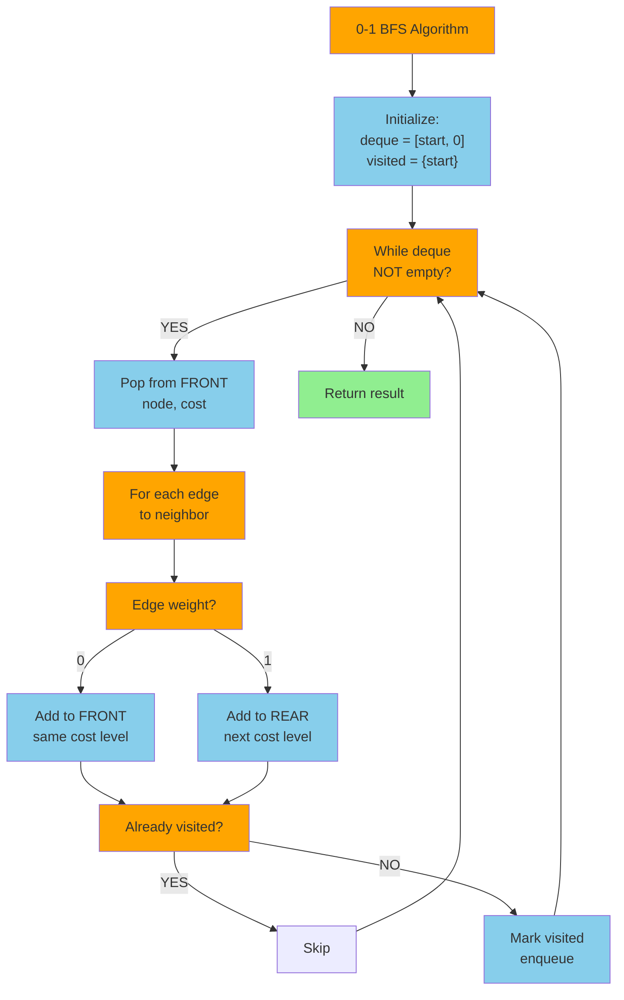
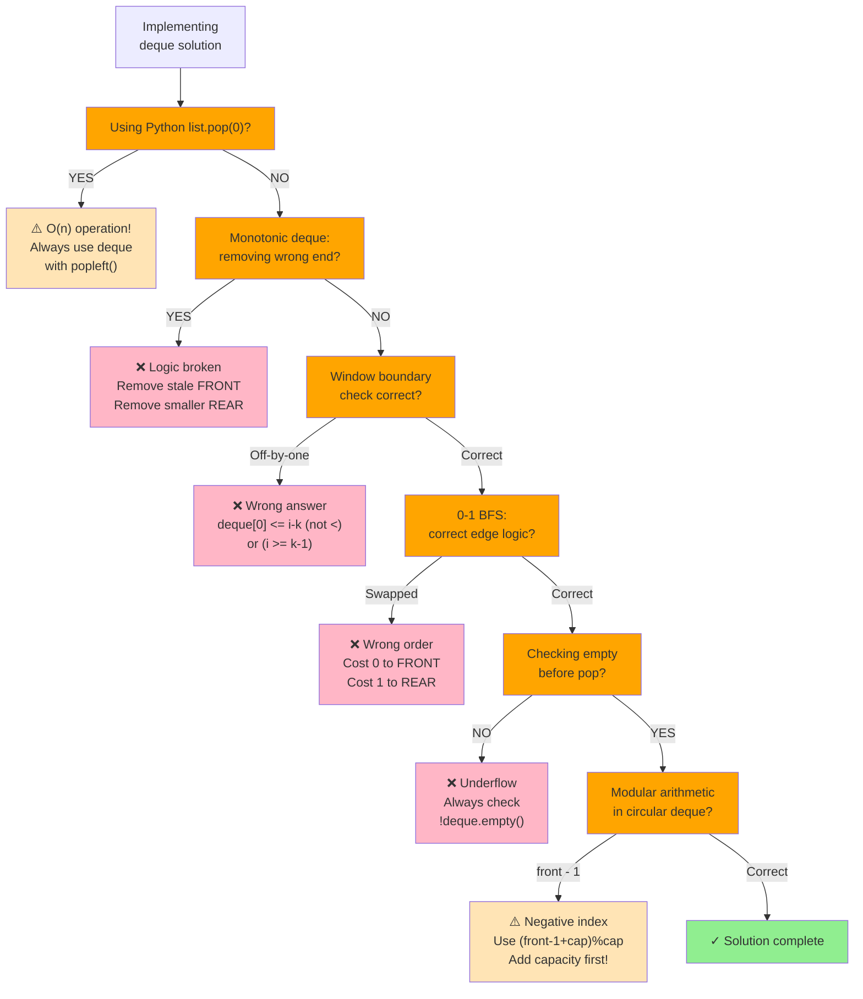

# Deque (Double-Ended Queue)

## Overview

A **Deque** (pronounced "deck", short for **Double-Ended Queue**) is a generalization of both stacks and queues that allows insertion and deletion at **both ends** (front and rear) in O(1) time. It is one of the most versatile linear data structures.

**When to use it:**
- Sliding window maximum/minimum problems (monotonic deque)
- BFS with variable priority (0-1 BFS for 0/1-weight graphs)
- Implementing both stack and queue behavior in a single structure
- Palindrome checking (compare from both ends)
- Undo/Redo where items can be added/removed from both history ends
- Scheduling algorithms that work from both ends of a task list

**Deque as a Superset:**
```
Stack  ⊆  Deque  (restrict to one end)
Queue  ⊆  Deque  (add to rear, remove from front)
Deque  =   full two-ended access
```

---

## When to Use: Deque Problem Recognition



---

## Visualization

### Basic Deque Structure

```
addFront ──▶                               ◀── addRear
             ┌──────────────────────────┐
             │  5 │  3 │  8 │  1 │  9  │
             └──────────────────────────┘
◀── removeFront                          removeRear ──▶

        front ↑                    ↑ rear
```

### Add / Remove from Both Ends

```
Start:  [ 3 | 8 | 1 ]
         ↑           ↑
       front        rear

addFront(5):  [ 5 | 3 | 8 | 1 ]   (prepend)
addRear(9):   [ 5 | 3 | 8 | 1 | 9 ]   (append)
removeFront():  returns 5 → [ 3 | 8 | 1 | 9 ]
removeRear():   returns 9 → [ 3 | 8 | 1 ]
peekFront():    returns 3  (no change)
peekRear():     returns 1  (no change)
```

### Array-Based Deque (Circular Buffer)

```
Capacity = 8, front=4, rear=1, size=6

Physical layout:
  Index: [0] [1] [2] [3] [4] [5] [6] [7]
  Data:  [ E][ F][  ][  ][ A][ B][ C][ D]
               ↑               ↑
             rear=1          front=4

Logical order (front → rear, wrapping around):
  A → B → C → D → E → F
  (indices 4,5,6,7,0,1)

addFront(Z):  front = (front - 1 + cap) % cap = 3
  [0] [1] [2] [3] [4] [5] [6] [7]
  [ E][ F][  ][ Z][ A][ B][ C][ D]
               ↑    ↑
             rear  new front=3

addRear(W):   rear = (rear + 1) % cap = 2
  [0] [1] [2] [3] [4] [5] [6] [7]
  [ E][ F][ W][ Z][ A][ B][ C][ D]
          ↑    ↑
        new rear  front
```

### Linked List-Based Deque

```
          ┌─────────────────────────────────────────────────┐
          │                                                 │
 addFront │  null←[null|A|●]⟷[●|B|●]⟷[●|C|●]⟷[●|D|null]→null │ addRear
          │         ↑                               ↑       │
          └─────────┘front                        rear└─────┘
removeFront ──▶                                          ◀── removeRear

Each node: [prev_ptr | val | next_ptr]
```

### Monotonic Deque: Sliding Window Maximum

```
Array: [1, 3, -1, -3, 5, 3, 6, 7], window k=3

Step-by-step (deque stores INDICES, values decrease front→rear):

  i=0, val=1:  deque=[0]         window=[1]       max=—
  i=1, val=3:  3>arr[0]=1 → pop 0; deque=[1]     window=[1,3]     max=—
  i=2, val=-1: -1<arr[1]=3 → push; deque=[1,2]   window=[1,3,-1]  max=arr[1]=3
  i=3, val=-3: -3<arr[2]=-1 → push; deque=[1,2,3] window=[3,-1,-3] max=arr[1]=3
  i=4, val=5:  pop 3(-3),pop 2(-1),pop 1(3); deque=[4]            max=arr[4]=5
  i=5, val=3:  3<arr[4]=5 → push; deque=[4,5]    window=[5,3,...]  max=arr[4]=5
  i=6, val=6:  pop 5(3),pop 4(5); deque=[6]       max=arr[6]=6
  i=7, val=7:  pop 6(6); deque=[7]                max=arr[7]=7

Result: [3, 3, 5, 5, 6, 7]

Invariant: deque front always holds the index of the window's maximum.
           Deque values are DECREASING from front to rear.
           Front index is expired if: index <= i - k  → removeFront
```

### Monotonic Deque Operation Flowchart



### 0-1 BFS with Deque



### Deque as Stack vs Queue

```
Use as STACK (LIFO):        Use as QUEUE (FIFO):
  push: addRear(x)            enqueue: addRear(x)
  pop:  removeRear()          dequeue: removeFront()
  peek: peekRear()            peek:    peekFront()

  ──push──▶ [3|8|1|5] ──pop──▶       ──enqueue──▶ [3|8|1|5] ──dequeue──▶
             rear                                              front
```

### Palindrome Check with Deque

```
Word: "racecar"

Load into deque: front[r|a|c|e|c|a|r]rear

Compare both ends:
  removeFront()=r, removeRear()=r  → match ✓
  removeFront()=a, removeRear()=a  → match ✓
  removeFront()=c, removeRear()=c  → match ✓
  Single remaining: 'e'            → match (odd-length middle)

Result: PALINDROME ✓
```

---

## Operations & Complexity

### Array-based (Circular Buffer)

| Operation       | Time   | Space  | Notes                                  |
|-----------------|:------:|:------:|----------------------------------------|
| addFront(x)     | O(1)   | O(1)   | front = (front-1+cap) % cap            |
| addRear(x)      | O(1)   | O(1)   | rear = (rear+1) % cap                  |
| removeFront()   | O(1)   | O(1)   | front = (front+1) % cap                |
| removeRear()    | O(1)   | O(1)   | rear = (rear-1+cap) % cap              |
| peekFront()     | O(1)   | O(1)   | arr[front]                             |
| peekRear()      | O(1)   | O(1)   | arr[rear]                              |
| isEmpty()       | O(1)   | O(1)   | size == 0                              |
| isFull()        | O(1)   | O(1)   | size == cap                            |
| Access by index | O(1)   | O(1)   | (front + i) % cap                      |
| Space (total)   | —      | O(n)   | Fixed allocation                       |

### Doubly Linked List-based (Dynamic)

| Operation       | Time   | Space  | Notes                                  |
|-----------------|:------:|:------:|----------------------------------------|
| addFront(x)     | O(1)   | O(1)   | Insert before head                     |
| addRear(x)      | O(1)   | O(1)   | Insert after tail                      |
| removeFront()   | O(1)   | O(1)   | Remove head                            |
| removeRear()    | O(1)   | O(1)   | Remove tail                            |
| peekFront()     | O(1)   | O(1)   |                                        |
| peekRear()      | O(1)   | O(1)   |                                        |
| Access by index | O(n)   | O(1)   | Must traverse                          |
| Space (total)   | —      | O(n)   | Node overhead (2 pointers per node)    |

---

## Key Properties

1. **Generalized structure**: Deque = Stack + Queue. All stack and queue operations are supported with O(1) time.
2. **No FIFO or LIFO restriction**: You choose which end to use based on the problem.
3. **Circular buffer efficiency**: Array-based deque reuses memory without shifting elements.
4. **Monotonic deque invariant**: When used as a sliding window structure, maintain elements in monotonic order; stale (out-of-window) indices are removed from the front.
5. **Python's `collections.deque`**: Implemented as a doubly linked list of fixed-size blocks; O(1) append/popleft, O(n) random access.
6. **Java's `ArrayDeque`**: Resizable circular array; the preferred implementation for both stacks and queues in Java.
7. **Index arithmetic**: For array-based circular deque, all index updates must use modular arithmetic: `(index ± 1 + capacity) % capacity`.

---

## Common Interview Patterns

### 1. Sliding Window Maximum / Minimum
Use a monotonic deque to find the max/min in each window of size k in O(n) total.
- **Use case**: Sliding Window Maximum, Maximum of All Subarrays, Jump Game VI

```
Maintain decreasing deque (for max):
  1. Remove expired indices from front (index <= i - k)
  2. Remove smaller elements from rear (arr[rear] <= arr[i])
  3. Push current index to rear
  4. Deque front is the window max
```

### 2. 0-1 BFS (Shortest Path with 0 and 1 Weights)
Use a deque instead of a priority queue. 0-cost edges go to the front; 1-cost edges go to the rear.
- **Use case**: Minimum cost path where edge weights are 0 or 1

```
Process node:
  if edge weight == 0: addFront (like visiting same level)
  if edge weight == 1: addRear  (like visiting next level)
This gives O(V + E) vs O((V+E) log V) for Dijkstra.
```

### 3. Palindrome Verification
Load a string into a deque and compare both ends simultaneously.
- **Use case**: Valid palindrome, palindrome linked list

```
deque = deque(s)
while len(deque) > 1:
    if deque.popleft() != deque.pop():
        return False
return True
```

### 4. Deque as Both Stack and Queue (Design Problems)
Implement more complex data structures using a deque as the underlying container.
- **Use case**: Design a data structure that supports push_front, push_back, pop_front, pop_back, get_middle

### 5. Constrained Subsequence / DP Optimization
Use a monotonic deque to optimize DP transitions where you need the max/min over a sliding range of previous states.
- **Use case**: Constrained Subsequence Sum, Maximum Sum of Subsequence with constraints

```
dp[i] = nums[i] + max(dp[j]) for j in [i-k, i-1]
Use monotonic deque to get max(dp[j]) in O(1) instead of O(k)
```

---

## Common Deque Mistakes



---

## Interview Tips

**What interviewers look for:**
- Recognizing when a sliding window problem needs O(n) solution via monotonic deque vs. O(n*k) brute force
- Correct monotonic deque logic: which end to add to, which end to pop from
- Knowing that `collections.deque` in Python (and `ArrayDeque` in Java) is the standard
- Handling the "remove front if out of window" check BEFORE checking the front for the answer
- Correctly choosing increasing vs. decreasing monotone stack for min vs. max

**Common mistakes to avoid:**
- Using a list and `pop(0)` in Python — that's O(n). Always use `collections.deque` with `popleft()`.
- In monotonic deque: removing from the wrong end (should remove stale from front, smaller/larger from rear)
- Forgetting to check if the deque is empty before calling peek/pop
- In circular array implementation, using `(front - 1) % cap` without adding `cap` first — can give negative index in some languages: use `(front - 1 + cap) % cap`
- Confusing window boundary: `deque[0] < i - k + 1` → should be `<= i - k` to properly expire out-of-window indices

---

## Example Problems

| Problem | Pattern | Approach Hint |
|---------|---------|---------------|
| **Sliding Window Maximum** | Monotonic Deque | Decreasing deque of indices; front is always window max |
| **Design Circular Deque** | Circular Buffer | Array + front/rear pointers with modular arithmetic |
| **Shortest Subarray with Sum >= K** | Monotonic Deque + Prefix Sum | Prefix sum array + deque for O(n) solution |
| **Jump Game VI** | Monotonic Deque + DP | dp[i] = nums[i] + max dp[j] in window; deque tracks max dp |
| **Maximum Sliding Window (Generalized)** | Monotonic Deque | Template for all sliding window max/min problems |

---

## Python Quick Reference

```python
from collections import deque

# Create
dq = deque()
dq = deque([1, 2, 3, 4, 5])
dq = deque([1, 2, 3], maxlen=5)  # bounded deque (auto-removes old elements)

# Add to both ends
dq.appendleft(0)     # O(1) - add to front
dq.append(6)         # O(1) - add to rear

# Remove from both ends
front = dq.popleft() # O(1) - remove from front
rear  = dq.pop()     # O(1) - remove from rear

# Peek both ends
front = dq[0]        # O(1)
rear  = dq[-1]       # O(1)

# Check empty
if not dq:
    print("empty")

# Size
n = len(dq)

# Rotate (move k elements from right to front)
dq.rotate(k)         # positive: right rotation; negative: left rotation


# --- Sliding Window Maximum ---
def max_sliding_window(nums, k):
    dq = deque()    # stores indices; values are decreasing
    result = []

    for i, val in enumerate(nums):
        # 1. Remove expired index from front
        while dq and dq[0] <= i - k:
            dq.popleft()

        # 2. Remove smaller elements from rear (they'll never be max)
        while dq and nums[dq[-1]] < val:
            dq.pop()

        # 3. Add current index
        dq.append(i)

        # 4. Record max (window is full when i >= k-1)
        if i >= k - 1:
            result.append(nums[dq[0]])

    return result


# --- Deque as Stack ---
stack = deque()
stack.append(x)     # push
stack.pop()         # pop
stack[-1]           # peek

# --- Deque as Queue ---
queue = deque()
queue.append(x)     # enqueue
queue.popleft()     # dequeue
queue[0]            # peek front


# --- Design Circular Deque ---
class MyCircularDeque:
    def __init__(self, k):
        self.cap = k
        self.data = [0] * k
        self.front = 0
        self.rear = k - 1      # rear points to last inserted
        self.size = 0

    def insertFront(self, val):
        if self.isFull(): return False
        self.front = (self.front - 1 + self.cap) % self.cap
        self.data[self.front] = val
        self.size += 1
        return True

    def insertLast(self, val):
        if self.isFull(): return False
        self.rear = (self.rear + 1) % self.cap
        self.data[self.rear] = val
        self.size += 1
        return True

    def deleteFront(self):
        if self.isEmpty(): return False
        self.front = (self.front + 1) % self.cap
        self.size -= 1
        return True

    def deleteLast(self):
        if self.isEmpty(): return False
        self.rear = (self.rear - 1 + self.cap) % self.cap
        self.size -= 1
        return True

    def getFront(self):  return -1 if self.isEmpty() else self.data[self.front]
    def getRear(self):   return -1 if self.isEmpty() else self.data[self.rear]
    def isEmpty(self):   return self.size == 0
    def isFull(self):    return self.size == self.cap
```

---

## Java Quick Reference

```java
import java.util.ArrayDeque;
import java.util.Deque;

// Create (ArrayDeque is the preferred implementation)
Deque<Integer> dq = new ArrayDeque<>();

// Add to both ends
dq.addFirst(0);      // O(1) - add to front (throws if full)
dq.addLast(6);       // O(1) - add to rear  (throws if full)
dq.offerFirst(0);    // O(1) - add to front (returns false if full)
dq.offerLast(6);     // O(1) - add to rear  (returns false if full)

// Remove from both ends
int front = dq.removeFirst();  // O(1) - throws if empty
int rear  = dq.removeLast();   // O(1) - throws if empty
int front2 = dq.pollFirst();   // O(1) - returns null if empty
int rear2  = dq.pollLast();    // O(1) - returns null if empty

// Peek both ends
int peekF = dq.peekFirst();    // O(1) - returns null if empty
int peekR = dq.peekLast();     // O(1) - returns null if empty

// Check empty / size
boolean empty = dq.isEmpty();
int size = dq.size();


// --- Sliding Window Maximum ---
public int[] maxSlidingWindow(int[] nums, int k) {
    int n = nums.length;
    int[] result = new int[n - k + 1];
    Deque<Integer> dq = new ArrayDeque<>();  // stores indices

    for (int i = 0; i < n; i++) {
        // 1. Remove expired index from front
        while (!dq.isEmpty() && dq.peekFirst() <= i - k)
            dq.pollFirst();

        // 2. Remove smaller elements from rear
        while (!dq.isEmpty() && nums[dq.peekLast()] < nums[i])
            dq.pollLast();

        // 3. Add current index
        dq.offerLast(i);

        // 4. Record max
        if (i >= k - 1)
            result[i - k + 1] = nums[dq.peekFirst()];
    }
    return result;
}

// --- Deque as Stack ---
Deque<Integer> stack = new ArrayDeque<>();
stack.push(x);            // addFirst - O(1)
int top = stack.pop();    // removeFirst - O(1)
int peek = stack.peek();  // peekFirst - O(1)

// --- Deque as Queue ---
Deque<Integer> queue = new ArrayDeque<>();
queue.offerLast(x);           // enqueue - O(1)
int front = queue.pollFirst(); // dequeue - O(1)
int peeked = queue.peekFirst();// peek front - O(1)

// --- Design Circular Deque ---
class MyCircularDeque {
    private int[] data;
    private int front, rear, size, cap;

    public MyCircularDeque(int k) {
        cap = k; data = new int[k];
        front = 0; rear = k - 1; size = 0;
    }

    public boolean insertFront(int val) {
        if (isFull()) return false;
        front = (front - 1 + cap) % cap;
        data[front] = val; size++; return true;
    }

    public boolean insertLast(int val) {
        if (isFull()) return false;
        rear = (rear + 1) % cap;
        data[rear] = val; size++; return true;
    }

    public boolean deleteFront() {
        if (isEmpty()) return false;
        front = (front + 1) % cap; size--; return true;
    }

    public boolean deleteLast() {
        if (isEmpty()) return false;
        rear = (rear - 1 + cap) % cap; size--; return true;
    }

    public int getFront()  { return isEmpty() ? -1 : data[front]; }
    public int getRear()   { return isEmpty() ? -1 : data[rear]; }
    public boolean isEmpty() { return size == 0; }
    public boolean isFull()  { return size == cap; }
}
```
