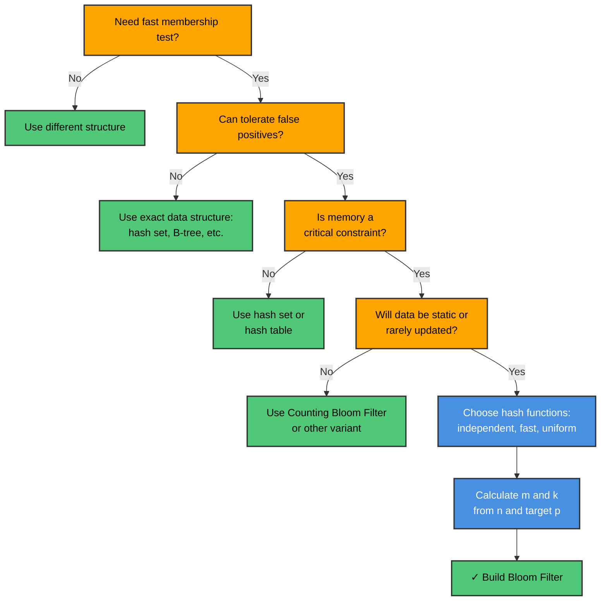
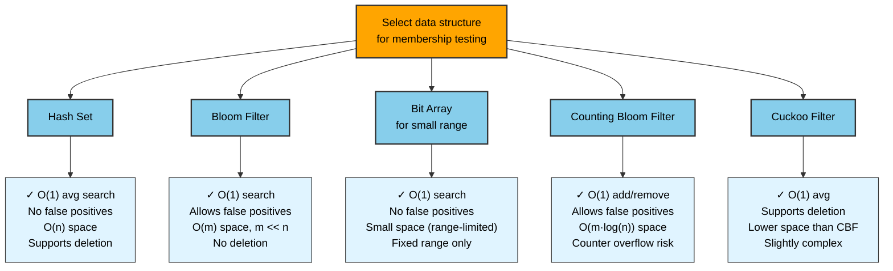
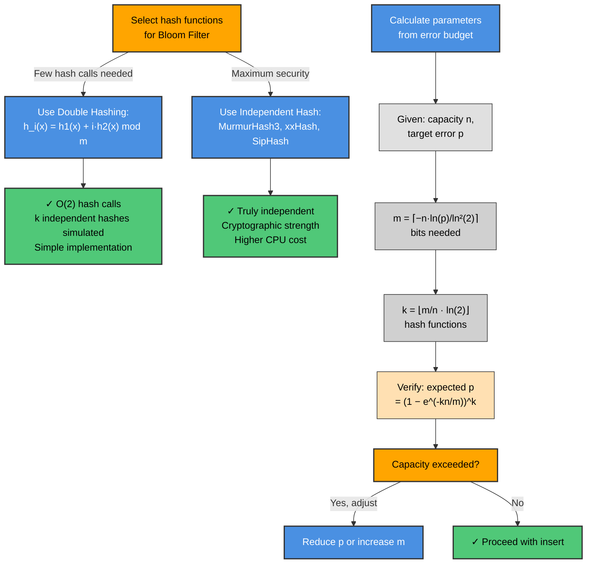
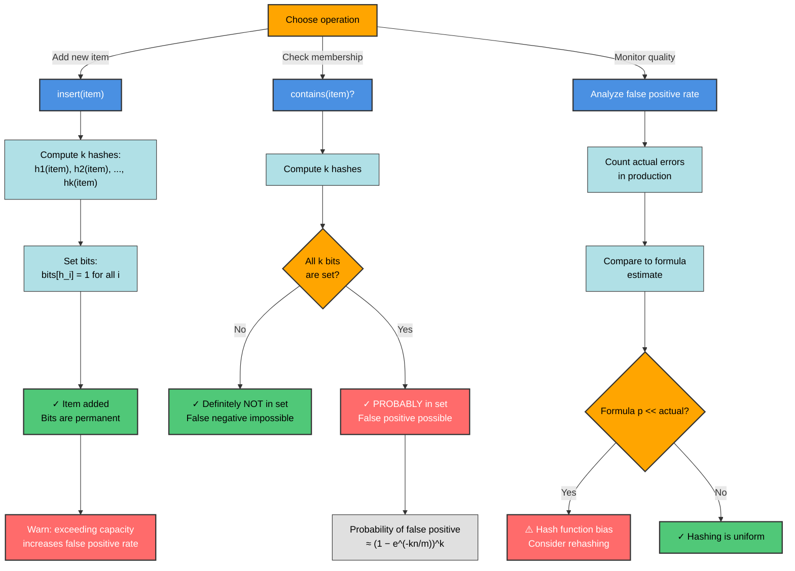
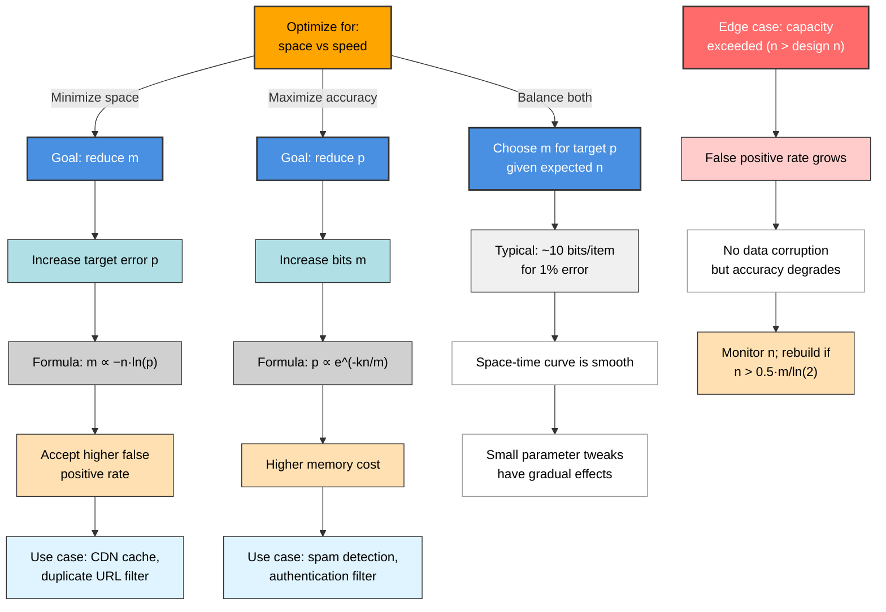
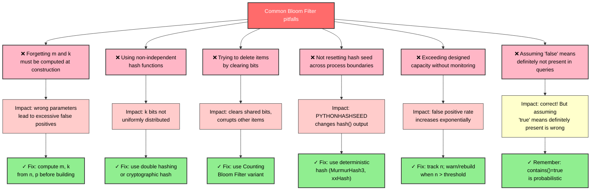

# Bloom Filter

A space-efficient probabilistic data structure that tests set membership with guaranteed no false negatives but a tunable false-positive probability.

---

## Overview

A Bloom Filter uses a bit array of m bits and k independent hash functions to represent a set. Adding an item sets k bit positions; querying checks whether all k positions are 1. If any bit is 0 the item was definitely never inserted. If all k bits are 1 the item was probably inserted — but a false positive is possible because those bits may have been set by other items.

The false-positive probability is governed by `p ≈ (1 − e^{−kn/m})^k`, where n is the number of inserted items. Given a target error rate p and expected capacity n, the optimal bit array size is `m = ⌈−n·ln(p) / (ln 2)²⌉` and the optimal number of hash functions is `k = (m/n)·ln 2`. For p ≈ 1%, this works out to roughly 9.6 bits per item — orders of magnitude less than storing the items themselves.

Real-world uses include: Google Bigtable and Apache Cassandra (avoid disk lookups for missing keys), web browsers (Chrome Safe Browsing — check URLs against a blocklist locally), spell checkers, CDN cache admission, and duplicate-URL filtering in crawlers.

---

## Flowcharts

### Problem Recognition: When to Use a Bloom Filter



### Bloom Filter vs Alternatives Decision Tree



### Hash Function Selection & False Positive Rate Analysis



### Bloom Filter Operations: Insert vs Query vs Monitoring



### Complexity & Optimization Tradeoff Analysis



### Common Mistakes & Avoidance Strategies



---

## ASCII Visualization

```
Bloom Filter: m=18 bits, k=3 hash functions

Bit array (index 0..17):
  index:  0  1  2  3  4  5  6  7  8  9 10 11 12 13 14 15 16 17
  bits:   0  0  0  0  0  0  0  0  0  0  0  0  0  0  0  0  0  0

add("cat"):  h1("cat")=1, h2("cat")=5, h3("cat")=13
  bits:   0  1  0  0  0  1  0  0  0  0  0  0  0  1  0  0  0  0
                                                    ^
add("dog"):  h1("dog")=3, h2("dog")=5, h3("dog")=11
  bits:   0  1  0  1  0  1  0  0  0  0  0  1  0  1  0  0  0  0
                     ^  shared with "cat"

contains("cat")?  check bits 1,5,13 -> 1,1,1  -> PROBABLY YES  (correct)
contains("dog")?  check bits 3,5,11 -> 1,1,1  -> PROBABLY YES  (correct)
contains("fox")?  h1=1, h2=3, h3=11 -> 1,1,1  -> PROBABLY YES  (FALSE POSITIVE!)
contains("elk")?  h1=0, h2=7, h3=16 -> 0,0,0  -> DEFINITELY NO (correct)

No deletions are possible — clearing a shared bit would corrupt other items.
```

---

## Operations & Complexity

| Operation            | Average | Worst | Notes                                      |
|----------------------|---------|-------|--------------------------------------------|
| `add(item)`          | O(k)    | O(k)  | k hash computations + k bit sets           |
| `contains(item)`     | O(k)    | O(k)  | k hash computations + k bit reads          |
| `false_positive_rate`| O(1)    | O(1)  | Computed analytically from n, m, k         |
| Space                | O(m)    | O(m)  | m bits regardless of item size             |

- k is a small constant (typically 7–10 for p = 1%).
- All operations are effectively O(1) in practice.
- Deletion is not supported; use a Counting Bloom Filter variant for that.

---

## Key Invariants

- A bit, once set to 1, is **never cleared** — the filter is append-only.
- `contains` returning `False` is **definitive**: the item was never added.
- `contains` returning `True` is **probabilistic**: false positives occur with probability p.
- The false-positive rate only increases as more items are added beyond the design capacity.
- k hash functions must be **independent** (or nearly so via double hashing) to achieve the theoretical p.
- Double hashing `h_i(x) = (h1(x) + i·h2(x)) mod m` simulates k independent hash functions with only two underlying hash calls.

---

## Common Interview Questions

- **Why can't a Bloom Filter produce false negatives?** Once bits are set they stay set; if all k bits for an item are 1, either the item was added or other items happened to set those exact bits — but an item that was added always has its bits set.
- **How do you choose m and k given n and a target false-positive rate p?** Use `m = ⌈−n·ln(p)/(ln 2)²⌉` and `k = (m/n)·ln 2`. Be ready to derive or recall these formulas.
- **What happens when you exceed the design capacity?** The actual false-positive rate rises above the target; the filter degrades gracefully but never breaks.
- **How would you support deletions?** Use a Counting Bloom Filter: replace each bit with a small counter; decrement on delete. Risk: counter overflow can create false negatives.
- **Compare Bloom Filter vs hash set.** Bloom Filter uses O(m) bits vs O(n·item_size) for a hash set; Bloom Filter allows false positives and no deletions, but is far more memory-efficient for large n.
- **Where is a Bloom Filter used in a database engine?** As a pre-filter before a disk read: check the filter first; only perform the expensive I/O if the filter says "maybe present."

---

## Implementation Notes

- **Optimal m and k must be computed at construction time** from capacity and error_rate; changing them later requires rebuilding the filter from scratch.
- **Double hashing** `(h1 + i*h2) % m` requires h2 ≠ 0 and, when m is a power of 2, h2 must be odd to visit all positions (the implementation enforces `h2 = 1` if h2 would be 0).
- **Python's `hash()` is not deterministic across processes** (PYTHONHASHSEED); production implementations use deterministic hash families like MurmurHash3 or xxHash.
- The **bit array is backed by a `bytearray`** for memory efficiency; index arithmetic is `byte_idx, bit_idx = divmod(index, 8)`.
- **`count_set()` using `bin(byte).count('1')`** is a clean Pythonic popcount; for performance-critical code use `bin(byte).count('1')` on each byte or use a lookup table.
- The empirical `false_positive_rate()` formula `(1 − e^{−kn/m})^k` gives a slightly optimistic estimate because it assumes perfectly uniform hashing; actual rates may be slightly higher.

---

## References

- [Bloom, B. H. (1970). Space/time trade-offs in hash coding with allowable errors. CACM 13(7).](https://dl.acm.org/doi/10.1145/362686.362692)
- [Wikipedia — Bloom filter](https://en.wikipedia.org/wiki/Bloom_filter)
- [Broder, A. & Mitzenmacher, M. (2004). Network applications of Bloom filters: A survey. Internet Mathematics 1(4).](https://www.eecs.harvard.edu/~michaelm/postscripts/im2005b.pdf)
