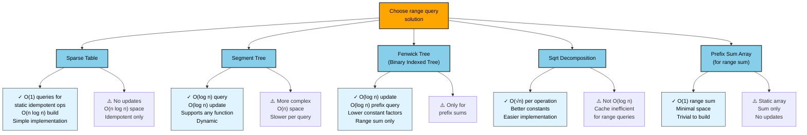
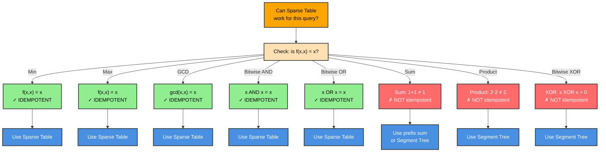
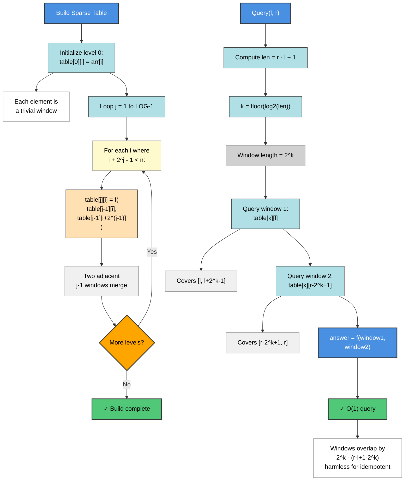
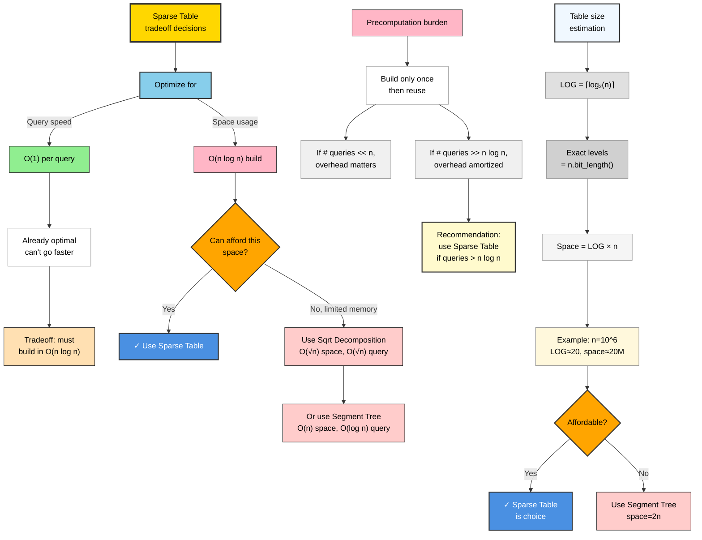
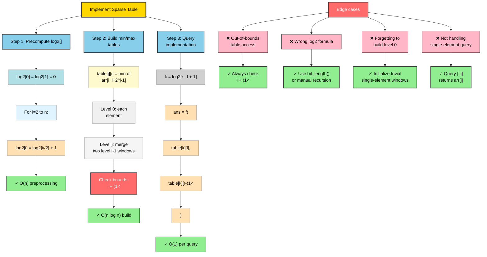
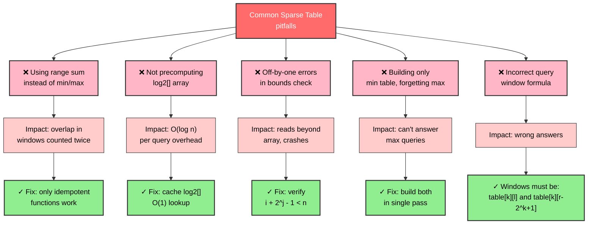

# Sparse Table

A static data structure that answers idempotent range queries — such as range minimum and range maximum — in O(1) time after O(n log n) preprocessing.

---

## Overview

A Sparse Table precomputes answers for all intervals whose length is a power of two. For each starting index i and each exponent j, `table[j][i]` stores the result of applying the query function to the subarray `arr[i .. i + 2^j − 1]`. Building the table takes O(n log n) time and space via the recurrence `table[j][i] = f(table[j-1][i], table[j-1][i + 2^(j-1)])`.

The key insight that enables O(1) queries is **idempotency**: for functions where `f(x, x) = x` (such as min, max, GCD), two overlapping windows can cover a range without double-counting errors. Given a query `[l, r]`, compute `k = floor(log2(r − l + 1))`, then `answer = f(table[k][l], table[k][r − 2^k + 1])`. The two windows of length `2^k` together cover `[l, r]` completely; their overlap is harmless because the function is idempotent.

Sparse Tables are used in competitive programming for Range Minimum Query (RMQ) as a preprocessing step in suffix array LCP queries (with the Farach-Colton & Bender algorithm), in lowest common ancestor (LCA) algorithms via Euler tour reduction to RMQ, and anywhere a static array needs repeated range queries with no updates.

---

## Flowcharts

### Problem Recognition: When to Use Sparse Table

```mermaid
graph TD
    A["Need range queries<br/>on static data?"]:::decision -->|No| B["Use segment tree<br/>or other dynamic DS"]:::output
    A -->|Yes| C["Array will be<br/>updated after build?"]:::decision
    C -->|Yes, updates needed| D["Use Segment Tree<br/>or Fenwick Tree"]:::output
    C -->|No, static| E["What type of<br/>query?"]:::decision
    E -->|Sum, product| F["Use prefix sum<br/>or Fenwick Tree"]:::output
    E -->|Min, max, GCD| G["Idempotent<br/>function?"]:::decision
    G -->|No| H["Custom decomposition<br/>or Segment Tree"]:::output
    G -->|Yes, f(x,x)=x| I["✓ Sparse Table<br/>is ideal"]:::success
    I --> J["O(n log n) preprocessing<br/>O(1) per query"]:::benefit
    
    classDef decision fill:#FFA500,stroke:#333,stroke-width:2px,color:#000
    classDef output fill:#50C878,stroke:#333,stroke-width:2px,color:#000
    classDef success fill:#50C878,stroke:#333,stroke-width:2px,color:#000
    classDef benefit fill:#E0F4FF,stroke:#999,stroke-width:1px,color:#000
```

### Sparse Table vs Range Query Alternatives



### Idempotency Check & Function Selection



### Sparse Table Build & Query Process



### Optimization Tradeoff Analysis



### Implementation Approach & Edge Cases



### Common Mistakes & Debugging Guide



---

## ASCII Visualization

```
Array:  [2, 4, 3, 1, 6, 7, 8, 9, 1, 7]
Index:   0  1  2  3  4  5  6  7  8  9

Min Table (table[j][i] = min of arr[i .. i + 2^j - 1]):

Level j=0  (window len=1, trivially arr[i]):
  i:    0  1  2  3  4  5  6  7  8  9
  val:  2  4  3  1  6  7  8  9  1  7

Level j=1  (window len=2, combine two adjacent j=0 windows):
  i:    0  1  2  3  4  5  6  7  8
  val:  2  3  1  1  6  7  8  1  1
  e.g. table[1][2] = min(table[0][2], table[0][3]) = min(3,1) = 1

Level j=2  (window len=4, combine two adjacent j=1 windows):
  i:    0  1  2  3  4  5  6
  val:  1  1  1  1  6  1  1
  e.g. table[2][0] = min(table[1][0], table[1][2]) = min(2,1) = 1

Level j=3  (window len=8, combine two adjacent j=2 windows):
  i:    0  1  2
  val:  1  1  1

Query: min(arr[2..7]) = ?
  length = 7-2+1 = 6,  k = floor(log2(6)) = 2,  2^k = 4
  Window 1: table[2][2] = min(arr[2..5]) = 1
  Window 2: table[2][4] = min(arr[4..7]) = 6

       arr: 2  4 [3  1  6  7  8  9] 1  7
                  ^----- W1 ----^
                        ^----- W2 ----^
                  overlap: indices 4,5 appear in both (harmless for min)

  answer = min(1, 6) = 1  (correct: min of [3,1,6,7,8,9] = 1)
```

---

## Operations & Complexity

| Operation        | Average     | Worst       | Notes                                           |
|------------------|-------------|-------------|--------------------------------------------------|
| `build(arr)`     | O(n log n)  | O(n log n)  | Fills LOG levels, each with up to n entries     |
| `query_min(l,r)` | O(1)        | O(1)        | Two table lookups + one integer log2 lookup     |
| `query_max(l,r)` | O(1)        | O(1)        | Same two-window trick for maximum               |
| Space            | O(n log n)  | O(n log n)  | LOG ≈ log2(n)+1 levels, each length n           |

- Queries require no branching: one precomputed `log2[]` array lookup, two table reads, one comparison.
- Sparse Table cannot handle updates; for dynamic arrays use a Segment Tree (O(log n) update + O(log n) query).
- Range sum is NOT idempotent; use a prefix sum array for O(1) range sum queries on static arrays instead.

---

## Key Invariants

- `table[j][i]` is only valid for indices `i` such that `i + 2^j − 1 < n` (the window must fit within the array).
- Level 0 is the identity level: `table[0][i] = arr[i]` for all i.
- Each level j is built entirely from level j−1; building must proceed in order j = 1, 2, …, LOG−1.
- The `log2[]` precomputed array satisfies `log2[1] = 0` and `log2[i] = log2[i//2] + 1` for i ≥ 2; it is used to avoid calling `math.floor(math.log2(length))` in the hot query path.
- The array is treated as **immutable** after `build()`; any modification invalidates the precomputed table.
- Two query windows together must always cover the entire `[l, r]` range: window 1 starts at l, window 2 ends at r, both have length `2^k` where `2^k ≤ length < 2^(k+1)`.

---

## Common Interview Questions

- **Why is the query O(1) instead of O(log n)?** Because min/max are idempotent: overlapping the two power-of-two windows is safe, so a single pair of precomputed values suffices without recursion.
- **What types of range queries work with Sparse Table?** Only idempotent functions where `f(x, x) = x`: min, max, GCD, bitwise AND, bitwise OR. Range sum and range product are not idempotent and cannot use this technique.
- **How do you precompute floor(log2(i)) in O(n) for all i up to n?** Use the recurrence `log2[i] = log2[i//2] + 1` with `log2[0] = log2[1] = 0`, iterated from i=2 to n.
- **When would you use Sparse Table over Segment Tree?** When the array is static (no updates) and you need maximum query throughput — Sparse Table has better constant factors and simpler cache behavior. For updates, Segment Tree is necessary.
- **How is Sparse Table used in LCA algorithms?** Reduce LCA on a tree to RMQ by performing an Euler tour of the tree, recording depths, then building a Sparse Table on depths — LCA(u, v) corresponds to a range minimum query.
- **What is the space complexity and can it be reduced?** O(n log n); the Fischer-Heun structure reduces this to O(n) preprocessing and O(1) query using block decomposition, but it is complex to implement.

---

## Implementation Notes

- **LOG levels**: `LOG = n.bit_length()` equals `floor(log2(n)) + 1` for n ≥ 1; this is exactly the number of table levels needed.
- **Table bounds**: when filling level j, only fill indices `i` where `i + (1 << j) - 1 < n`, i.e., `i < n - (1 << j) + 1`. Accessing out-of-bounds indices silently returns `None` in Python but causes index errors in Java/C++.
- **Integer log2 trick**: `k = (r - l + 1).bit_length() - 1` is equivalent to `floor(log2(r - l + 1))` and avoids floating-point; alternatively, maintain a precomputed `log2[]` array to avoid the bit_length call in the query hot path.
- **Separate min and max tables**: since building is O(n log n) either way, the implementation builds both `_min_table` and `_max_table` in a single pass over each level, doubling memory but halving build iterations.
- **Not suitable for online updates**: if even one element changes, the entire table must be rebuilt. For mixed update/query workloads, a Segment Tree with lazy propagation is the correct choice.
- **Practical query speed**: the two-lookup O(1) query is extremely cache-friendly on small-to-medium n; on large n (>10^6), cache misses from the table's non-sequential access pattern can slow queries — a block decomposition or sqrt-decomposition may be preferable.

---

## References

- [Wikipedia — Sparse table (data structure)](https://en.wikipedia.org/wiki/Sparse_table)
- [CP-Algorithms — Sparse Table](https://cp-algorithms.com/data_structures/sparse-table.html)
- [Bender, M. A. & Farach-Colton, M. (2000). The LCA Problem Revisited. LATIN 2000.](https://www.cs.stonybrook.edu/~bender/newpub/BenderFa00-lca.pdf)
