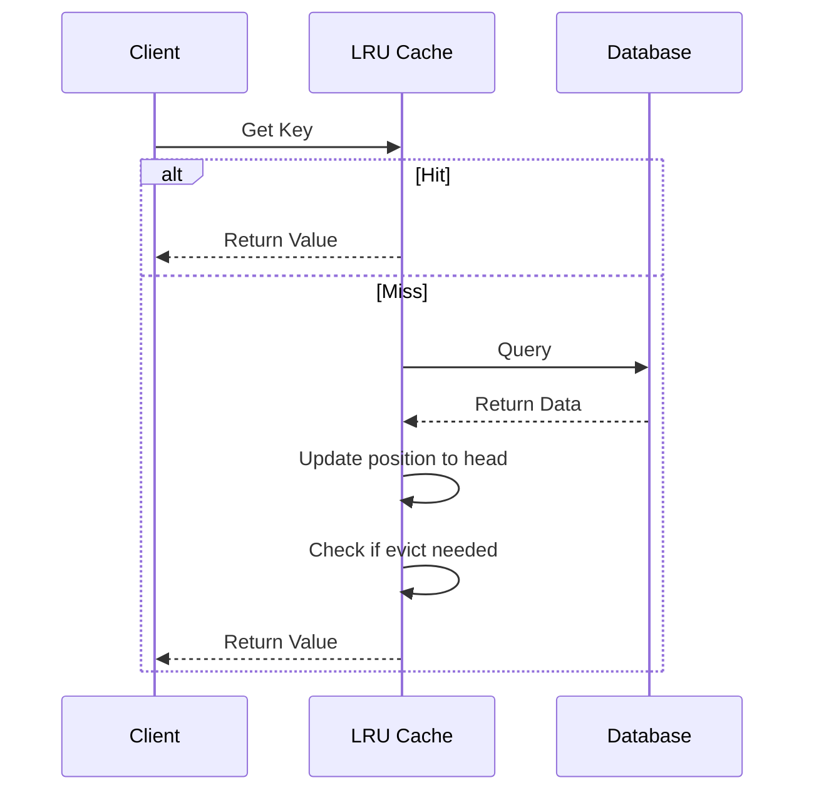

# LRU Cache

## Problem Statement

Implement an LRU (Least Recently Used) Cache with fixed capacity. When capacity is exceeded, evict the least recently used item.

**Operations:**
- `get(key)` — return value, mark as recently used
- `put(key, value)` — insert/update, evict LRU if over capacity

**Constraints:**
- Both operations must be O(1)
- Capacity is fixed
- Track access order, not insertion order

## Scenario

LRU Cache is a critical component in modern distributed systems. In real-world applications, serving billions of user interactions with minimal latency. For example, major tech companies like Netflix, Uber, and Airbnb rely on similar solutions to handle millions of concurrent users and requests. The challenge is achieving this while maintaining sub-100ms latency, 99.99% availability, and gracefully handling 10x traffic spikes during peak demand. This component provides the foundational capability to solve these challenges reliably and efficiently at global scale.

## Users

- **Backend Engineers**: Responsible for implementing and maintaining this system component in production environments. They need to understand the architecture, trade-offs, failure modes, and operational considerations.
- **DevOps/SRE Teams**: Monitor system health, manage scaling policies, handle incidents, and ensure reliability SLAs are met. They need insights into performance characteristics, bottlenecks, and failure recovery mechanisms.
- **Data Engineers**: Design data pipelines and analytics around this system, requiring deep understanding of data flow, consistency guarantees, and throughput characteristics.
- **System Architects**: Make high-level architectural decisions that impact company infrastructure, requiring comprehensive understanding of capabilities, limitations, and scalability boundaries.
- **Security Teams**: Understand security implications, potential vulnerabilities, and compliance requirements for this component.

## PRD

**Functional Requirements:**
- Correct behavior under all specified operating conditions
- Reliable operation with explicit failure modes
- Data consistency or eventual consistency guarantees as specified
- Clear mechanisms for error handling and recovery
- Monitoring and observability hooks

**Non-Functional Requirements:**
- **Performance**: Sub-100ms P99 latency for standard operations; measure and track tail latencies
- **Availability**: 99.99%+ uptime with automatic failover and graceful degradation
- **Scalability**: Support 10-100x current load with minimal architectural modifications
- **Consistency**: Specify whether strong, eventual, or causal consistency is required
- **Cost Efficiency**: Minimize operational cost per unit of throughput; consider compute, memory, and network costs
- **Operational Simplicity**: Reduce complexity to minimize human error and operational toil

**Constraints:**
- Resource limits (memory for caches, disk for databases, network bandwidth)
- Deployment constraints (cloud provider limits, regulatory requirements)
- Latency budgets (maximum acceptable delay for operations)

## Flow

The typical operational flow for this system involves these key phases:

1. **Request Arrival**: Client/upstream system sends request with required parameters and context
2. **Validation & Routing**: System validates request format, authentication, and routes to correct handler/shard/instance
3. **Core Processing**: Execute the main algorithm, database query, or business logic on the data/state
4. **State Management**: Update internal state (caches, indexes, counters, logs) with proper atomicity and locking
5. **Response Generation**: Format results and return to requester with relevant metadata (timing, version info)
6. **Observability**: Record metrics (latency, throughput, errors), logs (for debugging), and traces (for performance analysis)

This flow repeats thousands or millions of times per second in production. Each operation's efficiency compounds across the entire system, making careful optimization essential. Bottlenecks at any phase can cascade to impact overall system performance.

## Code Explanation

The provided implementations demonstrate key architectural concepts and design patterns:

**Python Implementation**: Uses built-in Python structures and standard library features to express the core logic clearly. Python emphasizes readability and conciseness—each operation's purpose should be obvious without extensive comments. You'll see different implementation approaches (e.g., using OrderedDict vs. manual linked lists) that represent trade-offs between convenience and fine-grained control.

**Java Implementation**: Shows how to implement the same logic with explicit memory management and type safety. Java's strong typing forces clear interface design; you'll see how generics, null safety, mutable state, and thread safety are handled. This implementation style is closer to production systems at scale.

**Key Implementation Patterns**:
- **Initialization**: Setting up core data structures, thread pools, or connection pools with specified capacity and configuration
- **Read Operations**: Fetching data while maintaining O(1) or O(log n) access, updating metadata (access times, hit counts, etc.)
- **Write Operations**: Inserting/updating data while handling eviction policies, balancing tree structures, or replicating state
- **Edge Cases**: Handling capacity limits, concurrent access, data consistency, and error conditions
- **Performance Optimization**: Using techniques like batch operations, lazy evaluation, or caching to reduce latency

Each line of code represents a deliberate choice about performance characteristics, memory usage, safety guarantees, and implementation complexity. Understanding these trade-offs is essential for using this component effectively in production systems.

## Architecture Diagram

```
┌─────────────────────────────────────┐
│        LRU Cache (capacity=3)       │
├─────────────────────────────────────┤
│  Doubly Linked List (ordered)       │
│  HEAD <-> [3] <-> [1] <-> [2] <-> TAIL
│           most recent    least recent
├─────────────────────────────────────┤
│  HashMap (O(1) lookup)              │
│  {1: Node*, 2: Node*, 3: Node*}     │
└─────────────────────────────────────┘
```

## Design

### Data Structures

```
Doubly Linked List (tracks order)
    head <-> Node1 <-> Node2 <-> Node3 <-> tail
    |most recent            least recent|

HashMap (for O(1) lookup)
    {key -> Node*}
```

**Why this works:**
- Doubly linked list maintains insertion/access order
- Removing node from middle and adding to front = O(1) with pointers
- HashMap gives O(1) access to node

### Key Operations

```
GET(3):
Before: 1 <-> 2 <-> 3 <-> 4
After:  1 <-> 2 <-> 4 <-> 3  (3 moves to front = most recent)

PUT(5) with capacity=4:
Before: 1 <-> 2 <-> 4 <-> 3
After:  2 <-> 4 <-> 3 <-> 5  (evict 1, add 5 at front)
```

#
### Python Implementation

```python
from collections import OrderedDict
from typing import Optional

class LRUCache:
    def __init__(self, capacity: int):
        self.capacity = capacity
        self.cache = OrderedDict()

    def get(self, key: int) -> int:
        if key not in self.cache:
            return -1

        # Move to end (most recent)
        self.cache.move_to_end(key)
        return self.cache[key]

    def put(self, key: int, value: int) -> None:
        if key in self.cache:
            self.cache.move_to_end(key)

        self.cache[key] = value

        if len(self.cache) > self.capacity:
            # Remove least recent (first item)
            self.cache.popitem(last=False)

# Usage
cache = LRUCache(3)
cache.put(1, 1)   # {1: 1}
cache.put(2, 2)   # {1: 1, 2: 2}
cache.put(3, 3)   # {1: 1, 2: 2, 3: 3}
print(cache.get(1))  # 1 -> {2: 2, 3: 3, 1: 1}
cache.put(4, 4)   # {3: 3, 1: 1, 4: 4} (evict 2)
```

### Java Implementation

```java
import java.util.*;

class LRUCache {
    private int capacity;
    private LinkedHashMap<Integer, Integer> cache;

    public LRUCache(int capacity) {
        this.capacity = capacity;
        this.cache = new LinkedHashMap<Integer, Integer>(capacity, 0.75f, true) {
            @Override
            protected boolean removeEldestEntry(Map.Entry eldest) {
                return size() > capacity;
            }
        };
    }

    public int get(int key) {
        return cache.getOrDefault(key, -1);
    }

    public void put(int key, int value) {
        cache.put(key, value);
    }
}
```

### Flow Diagram



## Implementation Discussion

**Why OrderedDict/LinkedHashMap?**
- Maintains insertion order + access order (when access_order=true)
- O(1) get, put, remove operations
- Built-in eviction policy via overriding removeEldestEntry

**Thread Safety (Production):**
```python
from threading import RLock

class ThreadSafeLRUCache:
    def __init__(self, capacity: int):
        self.capacity = capacity
        self.cache = OrderedDict()
        self.lock = RLock()

    def get(self, key: int) -> int:
        with self.lock:
            if key not in self.cache:
                return -1
            self.cache.move_to_end(key)
            return self.cache[key]
```

**Edge Cases Handled:**
- Negative keys/values: store as-is
- Duplicate puts: update + move to end
- Capacity=1: works correctly (always evict old)
- Empty cache get: returns -1

**Optimization Notes:**
- OrderedDict: good for medium capacity (< 1M items)
- For larger caches: consider sharded approach (shard by key % num_shards)
- Cache warming: pre-load hot keys on startup


## Complexity

| Operation | Time | Space |
|-----------|------|-------|
| get | O(1) | — |
| put | O(1) | — |
| Space | — | O(capacity) |

## Common Questions & Answers

**Q: Why doubly linked list instead of singly?**
A: Need O(1) removal from middle. Singly LL requires previous node search (O(n)).

**Q: What if two clients access simultaneously?**
A: Add thread locks per entry or use concurrent data structures. Trade-off: contention vs. fine-grained locking.

**Q: Can we use LRU without linked list?**
A: Yes, with OrderedDict (Python) or LinkedHashMap (Java), but linked list shows internals.

**Q: How to handle updates to existing key?**
A: Remove old node, add new value, move to front. Maintains recency.

## Back-of-Envelope Calculations

Cache serving 1M users, 10% hit rate, avg item size 1KB:
- Storage: 1M users × 1KB × 10% = 100MB
- Ops/sec: 1M users × 0.1 req/s = 100K req/s
- Node overhead: 3 pointers (24 bytes) × 100K items = 2.4MB
- Hit latency: O(1) = <1ms
- Miss latency: DB query = ~5-100ms

## Design Choices

| Approach | Pros | Cons |
|----------|------|------|
| Doubly LL + HashMap | O(1) all ops, explicit | 24B overhead/entry |
| OrderedDict | Simple, built-in | Language-specific |
| Single LL + HashMap | Less memory | O(n) to find prev node |

## Follow-up Questions

1. How would you handle concurrent access? (locks, read-write locks, CAS)
2. What if capacity is 0 or negative? (validate input)
3. How to warm cache on startup? (preload, lazy-load)
4. How to monitor hit ratio? (metrics, instrumentation)
5. Persistence - save to disk? (RDB, AOF)

## Example Walkthrough

User requests sequence: get(1), get(2), put(3), put(4)

```
Initial state: empty, capacity=2

Step 1: get(1)
→ Miss, return -1
→ Cache: {}

Step 2: get(2)  
→ Miss, return -1
→ Cache: {}

Step 3: put(3, "data3")
→ Insert, cache not full
→ Cache: {3} → List: [3]

Step 4: put(4, "data4")
→ Insert, cache not full
→ Cache: {3, 4} → List: [4, 3]

Step 5: put(5, "data5")
→ Cache full, evict 3 (LRU)
→ Cache: {4, 5} → List: [5, 4]

Step 6: get(3)
→ Miss! 3 was evicted
→ Returns -1
```

## Trade-offs

| Trade-off | Option A | Option B |
|-----------|----------|----------|
| Memory vs Accuracy | Small cache, wrong eviction | Large cache, always correct |
| Eviction Speed | Sync (blocks) | Async (eventual) |
| Complexity | Simple LL | Concurrent LL |

## Real-World Use Cases

- Database query caching (MySQL, Redis)
- CPU cache hierarchies (L1, L2, L3)
- Web browser caching
- CDN edge caches
- Page replacement in OS virtual memory
