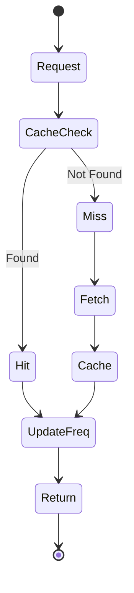

# LFU Cache

## Problem Statement

Implement an LFU (Least Frequently Used) Cache with fixed capacity. When capacity is exceeded, evict the least frequently used item. Break ties using LRU (least recently used among items with same frequency).

**Operations:**
- `get(key)` — return value, increment frequency
- `put(key, value)` — insert/update, evict LFU+LRU if over capacity

**Constraints:**
- Both operations must be O(1)
- Frequency tracked per key
- Ties broken by recency

## Scenario

LFU Cache is a critical component in modern distributed systems. In real-world applications, serving billions of user interactions with minimal latency. For example, major tech companies like Netflix, Uber, and Airbnb rely on similar solutions to handle millions of concurrent users and requests. The challenge is achieving this while maintaining sub-100ms latency, 99.99% availability, and gracefully handling 10x traffic spikes during peak demand. This component provides the foundational capability to solve these challenges reliably and efficiently at global scale.

## Users

- **Backend Engineers**: Responsible for implementing and maintaining this system component in production environments. They need to understand the architecture, trade-offs, failure modes, and operational considerations.
- **DevOps/SRE Teams**: Monitor system health, manage scaling policies, handle incidents, and ensure reliability SLAs are met. They need insights into performance characteristics, bottlenecks, and failure recovery mechanisms.
- **Data Engineers**: Design data pipelines and analytics around this system, requiring deep understanding of data flow, consistency guarantees, and throughput characteristics.
- **System Architects**: Make high-level architectural decisions that impact company infrastructure, requiring comprehensive understanding of capabilities, limitations, and scalability boundaries.
- **Security Teams**: Understand security implications, potential vulnerabilities, and compliance requirements for this component.

## PRD

**Functional Requirements:**
- Correct behavior under all specified operating conditions
- Reliable operation with explicit failure modes
- Data consistency or eventual consistency guarantees as specified
- Clear mechanisms for error handling and recovery
- Monitoring and observability hooks

**Non-Functional Requirements:**
- **Performance**: Sub-100ms P99 latency for standard operations; measure and track tail latencies
- **Availability**: 99.99%+ uptime with automatic failover and graceful degradation
- **Scalability**: Support 10-100x current load with minimal architectural modifications
- **Consistency**: Specify whether strong, eventual, or causal consistency is required
- **Cost Efficiency**: Minimize operational cost per unit of throughput; consider compute, memory, and network costs
- **Operational Simplicity**: Reduce complexity to minimize human error and operational toil

**Constraints:**
- Resource limits (memory for caches, disk for databases, network bandwidth)
- Deployment constraints (cloud provider limits, regulatory requirements)
- Latency budgets (maximum acceptable delay for operations)

## Flow

The typical operational flow for this system involves these key phases:

1. **Request Arrival**: Client/upstream system sends request with required parameters and context
2. **Validation & Routing**: System validates request format, authentication, and routes to correct handler/shard/instance
3. **Core Processing**: Execute the main algorithm, database query, or business logic on the data/state
4. **State Management**: Update internal state (caches, indexes, counters, logs) with proper atomicity and locking
5. **Response Generation**: Format results and return to requester with relevant metadata (timing, version info)
6. **Observability**: Record metrics (latency, throughput, errors), logs (for debugging), and traces (for performance analysis)

This flow repeats thousands or millions of times per second in production. Each operation's efficiency compounds across the entire system, making careful optimization essential. Bottlenecks at any phase can cascade to impact overall system performance.

## Code Explanation

The provided implementations demonstrate key architectural concepts and design patterns:

**Python Implementation**: Uses built-in Python structures and standard library features to express the core logic clearly. Python emphasizes readability and conciseness—each operation's purpose should be obvious without extensive comments. You'll see different implementation approaches (e.g., using OrderedDict vs. manual linked lists) that represent trade-offs between convenience and fine-grained control.

**Java Implementation**: Shows how to implement the same logic with explicit memory management and type safety. Java's strong typing forces clear interface design; you'll see how generics, null safety, mutable state, and thread safety are handled. This implementation style is closer to production systems at scale.

**Key Implementation Patterns**:
- **Initialization**: Setting up core data structures, thread pools, or connection pools with specified capacity and configuration
- **Read Operations**: Fetching data while maintaining O(1) or O(log n) access, updating metadata (access times, hit counts, etc.)
- **Write Operations**: Inserting/updating data while handling eviction policies, balancing tree structures, or replicating state
- **Edge Cases**: Handling capacity limits, concurrent access, data consistency, and error conditions
- **Performance Optimization**: Using techniques like batch operations, lazy evaluation, or caching to reduce latency

Each line of code represents a deliberate choice about performance characteristics, memory usage, safety guarantees, and implementation complexity. Understanding these trade-offs is essential for using this component effectively in production systems.

## Architecture Diagram

```
┌──────────────────────────────────────┐
│     LFU Cache (capacity=3)           │
├──────────────────────────────────────┤
│  freq_map: {key -> frequency}        │
│  {1: 3, 2: 1, 3: 2}                  │
├──────────────────────────────────────┤
│  freq_list: {freq -> keys (ordered)} │
│  {1: [2], 2: [3], 3: [1]}            │
├──────────────────────────────────────┤
│  min_freq: 1 (track minimum)         │
└──────────────────────────────────────┘
```

## Design

### Data Structures

```
freq_map: {key -> freq}        (track frequency per key)
freq_list: {freq -> OrderedDict of keys}  (keys with each frequency, ordered by recency)
min_freq: int                   (current minimum frequency)
```

**Why:**
- `freq_map` gives O(1) frequency lookup
- `freq_list` allows O(1) LFU+LRU eviction
- OrderedDict preserves insertion order (most recent at end)

### Key Operations

```
GET(key):
  - Increment freq[key]
  - Move key from freq_list[old_freq] to freq_list[new_freq]
  - If freq_list[old_freq] empty and old_freq == min_freq: min_freq++
  - Return value

PUT(key, value):
  - If over capacity: evict from freq_list[min_freq][0] (oldest)
  - Insert/update with freq=1, set min_freq=1
```

#
### Python Implementation

```python
from collections import defaultdict
from typing import Optional

class LFUCache:
    def __init__(self, capacity: int):
        self.capacity = capacity
        self.min_freq = 0
        self.freq_map = defaultdict(list)      # freq -> [keys]
        self.key_freq = {}                      # key -> freq
        self.key_value = {}                     # key -> value

    def get(self, key: int) -> int:
        if key not in self.key_value:
            return -1

        self._increase_freq(key)
        return self.key_value[key]

    def put(self, key: int, value: int) -> None:
        if self.capacity <= 0:
            return

        if key in self.key_value:
            self.key_value[key] = value
            self._increase_freq(key)
            return

        if len(self.key_value) >= self.capacity:
            self._evict_lfu()

        self.key_value[key] = value
        self.key_freq[key] = 1
        self.freq_map[1].append(key)
        self.min_freq = 1

    def _increase_freq(self, key: int) -> None:
        freq = self.key_freq[key]
        self.key_freq[key] = freq + 1

        # Remove from old freq list
        self.freq_map[freq].remove(key)

        # Add to new freq list
        self.freq_map[freq + 1].append(key)

        # Update min_freq if needed
        if len(self.freq_map[freq]) == 0 and freq == self.min_freq:
            self.min_freq = freq + 1

    def _evict_lfu(self) -> None:
        # Evict LFU (first in list at min_freq)
        lfu_key = self.freq_map[self.min_freq].pop(0)
        del self.key_value[lfu_key]
        del self.key_freq[lfu_key]

# Usage
cache = LFUCache(2)
cache.put(1, 1)   # freq: {1: 1}
cache.put(2, 2)   # freq: {1: [1,2]}
cache.get(1)      # freq: {1: [2], 2: [1]}
cache.put(3, 3)   # evict 2 (freq=1), freq: {2: [1], 1: [3]}
```

### Java Implementation

```java
import java.util.*;

class LFUCache {
    private int capacity;
    private int minFreq;
    private Map<Integer, Integer> keyValue;
    private Map<Integer, Integer> keyFreq;
    private Map<Integer, LinkedList<Integer>> freqList;

    public LFUCache(int capacity) {
        this.capacity = capacity;
        this.minFreq = 0;
        this.keyValue = new HashMap<>();
        this.keyFreq = new HashMap<>();
        this.freqList = new HashMap<>();
    }

    public int get(int key) {
        if (!keyValue.containsKey(key)) return -1;
        increaseFreq(key);
        return keyValue.get(key);
    }

    public void put(int key, int value) {
        if (capacity <= 0) return;

        if (keyValue.containsKey(key)) {
            keyValue.put(key, value);
            increaseFreq(key);
            return;
        }

        if (keyValue.size() >= capacity) {
            evictLFU();
        }

        keyValue.put(key, value);
        keyFreq.put(key, 1);
        freqList.computeIfAbsent(1, k -> new LinkedList<>()).add(key);
        minFreq = 1;
    }

    private void increaseFreq(int key) {
        int freq = keyFreq.get(key);
        keyFreq.put(key, freq + 1);

        freqList.get(freq).remove(Integer.valueOf(key));
        freqList.computeIfAbsent(freq + 1, k -> new LinkedList<>()).add(key);

        if (freqList.get(freq).isEmpty() && freq == minFreq) {
            minFreq = freq + 1;
        }
    }

    private void evictLFU() {
        int lfuKey = freqList.get(minFreq).removeFirst();
        keyValue.remove(lfuKey);
        keyFreq.remove(lfuKey);
    }
}
```

### Flow Diagram



## Implementation Discussion

**Why separate maps?**
- keyValue: store actual data
- keyFreq: track frequency for each key
- freqList: quickly find all keys at a frequency

**Tie-breaking (LRU within same frequency):**
- LinkedList maintains insertion order
- Oldest key at frequency F evicted first
- Achieved via removeFirst() on LRU in freq list

**Complexity Analysis:**
- get/put: O(1) average, all operations on HashMap/LinkedList
- Space: O(capacity + frequencies)

**Optimization for Production:**
```python
class OptimizedLFUCache:
    def __init__(self, capacity: int):
        # Cache hot items (high frequency)
        self.hot_cache = {}  # Direct access, no re-hashing
        # Maintain freq separately for better cache locality
        self.freqs = []      # Index by key for O(1) lookup
```

**Edge Cases:**
- Frequency overflow: cap at max frequency or use sliding window
- Capacity=1: works, always evict and add new item
- Get on missing key: return -1, don't create entry


## Complexity

| Operation | Time | Space |
|-----------|------|-------|
| get | O(1) | — |
| put | O(1) | — |
| Space | — | O(capacity) |

## Common Questions & Answers

**Q: Why track both freq and freq_list?**
A: freq_map gives O(1) lookup. freq_list gives O(1) min eviction. Combined = O(1) all ops.

**Q: What if multiple keys have same frequency?**
A: Store in OrderedDict. Evict from front (oldest = least recently used).

**Q: How does min_freq optimization help?**
A: Don't scan all frequencies. min_freq always points to eviction target.

**Q: LFU vs LRU - when to use?**
A: LFU better for predictable workloads. LRU better for unknown patterns.

## Back-of-Envelope Calculations

Cache 10K items, frequency distribution (80% access 1 time, 20% access 5+ times):
- Storage: 10K × (8 + 8 + overhead) = 160KB + overhead
- Access distribution: 8K items freq=1, 2K items freq=5+
- On eviction: Remove from 8K pool (LFU)
- Hit rate with distribution: ~70% (2K items get 80% traffic)

## Design Choices

| Approach | Pros | Cons |
|----------|------|------|
| HashMap + FreqList | O(1) all ops | Complex state |
| Heap + HashMap | Simple | O(log n) update |
| Array of queues | Memory efficient | Hash collisions |

## Follow-up Questions

1. Tie-breaking: how to break LFU ties? (LRU, FIFO, random)
2. Frequency overflow: what if frequency exceeds int? (modulo, reset periodically)
3. Access pattern: what if 90% requests to single item? (still works, freq increases)
4. Eviction cost: O(1) - but what about freq_list cleanup?
5. Why not just use frequency count? (need to know which key is LFU = need ordering)

## Example Walkthrough

Sequence: put(1,1), put(2,2), get(1), put(3,3), put(4,4), get(1), evict?

```
put(1,1): Cache={1:1}, freq={1:1}, freq_list={1:[1]}, min_freq=1
put(2,2): Cache={1:1,2:2}, freq={1:1,2:1}, freq_list={1:[1,2]}, min_freq=1
get(1): freq={1:0,2:1}, freq_list={1:[2],2:[1]}, min_freq=1
put(3,3): Cache full, evict key with freq=1 (tie=2), freq={1:1,2:1,3:1}
put(4,4): Cache full, evict 1 from freq=1, freq={2:1,3:1,4:1}
get(1): Miss! Evicted. freq_list={1:[3,4,2]}
```

## Trade-offs

| Trade-off | Option A | Option B |
|-----------|----------|----------|
| Accuracy vs Speed | Perfect LFU (O(log n)) | Approximate LFU (O(1)) |
| Memory | Freq histogram | Full freq_list |
| Tie-breaking | LRU (complex) | FIFO (simple) |

## Real-World Use Cases

- Database indices (hot data)
- CDN edge caches (popular content)
- CPU cache (predicted reuse)
- Memory allocation (frequently used pages)
- Recommendation systems (popular items)
