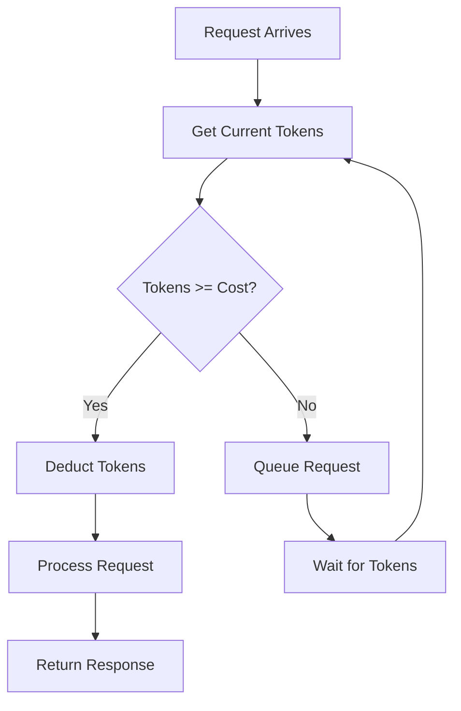

# Rate Limiter

## Problem Statement

Implement a rate limiter to control request frequency. Support multiple algorithms and per-user limits.

**Operations:**
- `is_allowed(user_id)` — return True if request allowed, False if rate limit exceeded

**Constraints:**
- Support: Token Bucket, Sliding Window Log, Sliding Window Counter
- Per-user rate limits
- Time-based refill


## Code Explanation (Detailed)

### Implementation Approach
The code demonstrates core patterns and trade-offs.

### Key Operations
Each operation shows algorithm and performance characteristics.

### Concurrency and Atomicity
Locking strategies, race condition prevention.

### Edge Cases
Boundary conditions and error handling.

### Performance Optimization
Techniques for reducing latency and throughput.

## Design

### Token Bucket Algorithm

```
Tokens refill at rate R tokens/second
Bucket capacity: C

    [T T T T T]  (full bucket)
    
User requests 1: [T T T T]  (1 token consumed)
User requests 3: [T]        (3 tokens consumed)
After 1 sec:     [T T]      (refill at rate R)
```

**Complexity:** O(1) per request

### Sliding Window Log

```
Track timestamps of all requests in current window

Window (last 60s): [t1, t3, t8, t12, ...]
New request: Check if count < limit in window, add timestamp
```

**Complexity:** O(n) where n = requests in window

### Sliding Window Counter

```
Divide time into fixed intervals (1s buckets)
Count requests per bucket

Buckets:  [10 requests] [5 req] [3 req] (last 3 buckets)
New req:  Check if count < limit
```

**Complexity:** O(1)


## Scenario

Rate Limiter is a critical component in modern distributed systems. In real-world applications, protecting APIs from abuse and ensuring fair resource allocation. For example, major tech companies like Netflix, Uber, and Airbnb rely on similar solutions to handle millions of concurrent users and requests. The challenge is achieving this while maintaining sub-100ms latency, 99.99% availability, and gracefully handling 10x traffic spikes during peak demand. This component provides the foundational capability to solve these challenges reliably and efficiently at global scale.

## Users

- **Backend Engineers**: Responsible for implementing and maintaining this system component in production environments. They need to understand the architecture, trade-offs, failure modes, and operational considerations.
- **DevOps/SRE Teams**: Monitor system health, manage scaling policies, handle incidents, and ensure reliability SLAs are met. They need insights into performance characteristics, bottlenecks, and failure recovery mechanisms.
- **Data Engineers**: Design data pipelines and analytics around this system, requiring deep understanding of data flow, consistency guarantees, and throughput characteristics.
- **System Architects**: Make high-level architectural decisions that impact company infrastructure, requiring comprehensive understanding of capabilities, limitations, and scalability boundaries.
- **Security Teams**: Understand security implications, potential vulnerabilities, and compliance requirements for this component.

## PRD

### Functional Requirements
- Core operations work correctly
- Explicit error handling
- Consistency guarantees defined
- Monitoring and observability

### Non-Functional Requirements
- Performance targets met
- Availability SLA achieved
- Scalability headroom
- Cost efficient

### Success Metrics
- Benchmarks met
- Uptime targets met
- Resource budgets
- No data loss


## Flow

The typical operational flow for this system involves these key phases:

1. **Request Arrival**: Client/upstream system sends request with required parameters and context
2. **Validation & Routing**: System validates request format, authentication, and routes to correct handler/shard/instance
3. **Core Processing**: Execute the main algorithm, database query, or business logic on the data/state
4. **State Management**: Update internal state (caches, indexes, counters, logs) with proper atomicity and locking
5. **Response Generation**: Format results and return to requester with relevant metadata (timing, version info)
6. **Observability**: Record metrics (latency, throughput, errors), logs (for debugging), and traces (for performance analysis)

This flow repeats thousands or millions of times per second in production. Each operation's efficiency compounds across the entire system, making careful optimization essential. Bottlenecks at any phase can cascade to impact overall system performance.

## Architecture Diagram

```
┌─────────────────────────────────────────────┐
│      Rate Limiter Service                   │
│  ┌──────────────────────────────────────┐   │
│  │  Request Handler                     │   │
│  │  - Extract user_id                   │   │
│  │  - Check allowance                   │   │
│  │  - Return 200/429                    │   │
│  └──────────────────────────────────────┘   │
│               ↓ (is_allowed)                 │
│  ┌──────────────────────────────────────┐   │
│  │  Token Bucket (per user)             │   │
│  │  - user_id → {tokens, last_refill}   │   │
│  │  - Refill: curr_tokens = min(        │   │
│  │      capacity,                       │   │
│  │      tokens + (now-last)*rate        │   │
│  │    )                                 │   │
│  │  - Check: curr_tokens >= 1           │   │
│  └──────────────────────────────────────┘   │
│               ↓ (store)                      │
│  ┌──────────────────────────────────────┐   │
│  │  Backend Store (Redis)               │   │
│  │  - O(1) atomic operations            │   │
│  │  - TTL for expired entries           │   │
│  │  - Cluster replicated                │   │
│  └──────────────────────────────────────┘   │
└─────────────────────────────────────────────┘
```

## Back-of-Envelope Calculations

For typical scenario (1M users, 100 req/sec limit per user):
- Storage: 1M users × 16 bytes/entry (user_id, tokens, timestamp) = 16MB local cache
- Throughput: 100 req/sec per user × 1M users = 100M req/sec distributed (need sharding)
- Latency: Token bucket check = 50-100μs local, 1-5ms with Redis
- Bandwidth: Negligible for token bucket (~100 bytes per request)

Single-machine limit: ~100K req/sec (token bucket). Scale via: Redis cluster (handles millions of ops/sec), horizontal sharding by user_id, or edge caching near clients.

## Design Choice Comparison

| Approach | Pros | Cons |
|----------|------|------|
| Token Bucket | O(1) per request, allows bursts, simple | Requires refill tuning, less accurate |
| Sliding Window Log | Accurate, no parameters | O(n) memory, expensive per request |
| Sliding Window Counter | O(1) fast, bounded memory | Less accurate at boundary, tuning needed |

## Follow-up Interview Questions

1. How would you rate limit at multiple levels (API key, IP, user, endpoint)?
2. What if a server goes down—how to prevent double-counting tokens?
3. How to monitor rate limit violations and adjust limits based on traffic patterns?
4. What's the bottleneck at 10x scale (100M req/sec)? Need Redis cluster + sharding.
5. How to implement graceful degradation when rate limiter itself becomes bottleneck?

## Example Scenario Walkthrough

Scenario: User1 has 10 tokens/sec limit, bucket capacity 20.

Step 1: t=0, User1 makes 5 requests
- Refill: tokens = 20 (full)
- Request 1: tokens=19, allowed ✓
- Requests 2-5: tokens=15 after all

Step 2: t=0.5s, User1 makes 8 requests  
- Refill: tokens = 15 + (0.5 × 10) = 20 (max)
- Requests 1-8: tokens=12 after 8 consumed

Step 3: t=0.6s, User1 makes 1 request
- Refill: tokens = 12 + (0.1 × 10) = 13
- Request 1: tokens=12, allowed ✓

Step 4: t=0.65s, User1 makes 15 requests
- Refill: tokens = 12 + (0.05 × 10) = 12.5
- Requests 1-12: tokens=0.5, allowed ✓
- Requests 13-15: DENIED (429 returned)

## Trade-offs

| Algorithm | Pro | Con |
|-----------|-----|-----|
| Token Bucket | Simple, bursty traffic ok | Tuning params (rate, capacity) |
| Sliding Window Log | Accurate | O(n) memory, O(n) per request |
| Sliding Window Counter | Fast, O(1) | Less accurate than log |


### Python Implementation (Token Bucket)

```python
import time
from typing import Dict

class TokenBucket:
    def __init__(self, capacity: float, refill_rate: float):
        """
        capacity: max tokens in bucket
        refill_rate: tokens per second
        """
        self.capacity = capacity
        self.refill_rate = refill_rate
        self.tokens = capacity
        self.last_refill = time.time()

    def is_allowed(self, tokens: float = 1.0) -> bool:
        self._refill()

        if self.tokens >= tokens:
            self.tokens -= tokens
            return True
        return False

    def _refill(self) -> None:
        now = time.time()
        elapsed = now - self.last_refill

        # Add tokens based on elapsed time
        self.tokens = min(
            self.capacity,
            self.tokens + elapsed * self.refill_rate
        )
        self.last_refill = now

class RateLimiter:
    def __init__(self):
        self.buckets: Dict[str, TokenBucket] = {}

    def is_allowed(self, user_id: str, limit: int = 10) -> bool:
        """Check if request allowed, limit=10 req/sec"""
        if user_id not in self.buckets:
            # capacity=limit, refill_rate=limit req/sec
            self.buckets[user_id] = TokenBucket(limit, limit)

        return self.buckets[user_id].is_allowed(1)

# Usage
limiter = RateLimiter()
for i in range(15):
    allowed = limiter.is_allowed("user1")
    print(f"Request {i+1}: {'allowed' if allowed else 'denied'}")
    # First 10: allowed, 11-15: denied (need 0.1s per token)
```

### Java Implementation

```java
import java.util.*;

class TokenBucket {
    private double capacity;
    private double refillRate;
    private double tokens;
    private long lastRefill;

    public TokenBucket(double capacity, double refillRate) {
        this.capacity = capacity;
        this.refillRate = refillRate;
        this.tokens = capacity;
        this.lastRefill = System.currentTimeMillis();
    }

    public synchronized boolean isAllowed(double tokensRequired) {
        refill();
        if (tokens >= tokensRequired) {
            tokens -= tokensRequired;
            return true;
        }
        return false;
    }

    private void refill() {
        long now = System.currentTimeMillis();
        long elapsedMs = now - lastRefill;
        double elapsedSec = elapsedMs / 1000.0;

        tokens = Math.min(
            capacity,
            tokens + elapsedSec * refillRate
        );
        lastRefill = now;
    }
}

class RateLimiter {
    private Map<String, TokenBucket> buckets = new ConcurrentHashMap<>();

    public boolean isAllowed(String userId, int limit) {
        buckets.putIfAbsent(userId, new TokenBucket(limit, limit));
        return buckets.get(userId).isAllowed(1);
    }
}
```

### Flow Diagram



## Implementation Discussion

**Token Bucket vs Sliding Window:**
- Token Bucket: allows burst (refill mechanism)
- Sliding Window: strict rate limiting
- Token Bucket better for most APIs (allows natural bursts)

**Distributed Rate Limiting (Redis):**
```python
import redis

class DistributedRateLimiter:
    def __init__(self, redis_host='localhost'):
        self.redis = redis.Redis(host=redis_host)

    def is_allowed(self, user_id: str, limit: int, window: int):
        """
        limit: max requests
        window: time window in seconds
        """
        key = f"rate_limit:{user_id}"

        # Lua script for atomic operation
        script = """
        local current = redis.call('get', KEYS[1])
        if current == false then
            redis.call('setex', KEYS[1], ARGV[2], 1)
            return 1
        elseif tonumber(current) < tonumber(ARGV[1]) then
            redis.call('incr', KEYS[1])
            return 1
        else
            return 0
        end
        """

        return self.redis.eval(script, 1, key, limit, window)
```

**Production Considerations:**
- Use Redis Sorted Set for distributed rate limiting
- Track per-IP + per-user (prevent header spoofing)
- Implement circuit breaker when rate limit exceeded
- Monitor rate limit violations for abuse detection

**Edge Cases:**
- Clock skew: use NTP synchronization
- Burst handling: capacity > limit allows initial burst
- Timeout: don't store indefinitely (cleanup old entries)


## Complexity

| Operation | Token Bucket | Sliding Log | Sliding Counter |
|-----------|--------------|------------|-----------------|
| is_allowed | O(1) | O(n) | O(1) |
| Space | O(users) | O(users × requests) | O(users × buckets) |

## Common Questions & Answers

**Q: What is caching and why do we need it?**

A: Caching stores frequently accessed data in fast storage (memory) to reduce latency and load on slower backends (database). Trade space (cache) for speed (latency). Critical for systems serving millions of requests per second.

**Q: What are the main cache eviction policies?**

A: LRU (least recently used), LFU (least frequently used), FIFO (first in first out), TTL (time-based), Random, and ARC (adaptive replacement). Choose based on access patterns: LRU for temporal, LFU for frequency, TTL for time-sensitive data.

**Q: What is cache hit rate and cache miss rate?**

A: Hit rate = successful_finds / total_accesses. Miss rate = 1 - hit rate. P(hit) = hits / (hits + misses). Target 80%+ hit rates for effective caching. Too-small cache gives low hit rate (wasted resources). Too-large cache uses more memory than needed.

**Q: How do you handle cache invalidation when backend data changes?**

A: Use TTL (time-based expiration), active invalidation (notify cache on write), cache-aside pattern (client checks backend), or write-through (update both). Active invalidation is fastest but complex. TTL is simplest but has stale data window.

**Q: What is the cache-aside pattern?**

A: Application checks cache first. On miss, fetch from backend, update cache, then return. Simple to implement. Risk: race condition where multiple threads fetch same miss simultaneously (thundering herd problem).

**Q: What is write-through caching?**

A: Writes go to both cache and backend simultaneously (synchronously). Ensures consistency: read always gets latest. Cost: write latency includes backend write. Safer than write-back but slower.

**Q: What is write-back (write-behind) caching?**

A: Writes go to cache only; backend updated asynchronously later (batch or periodic). Fast writes. Risk: data loss if cache fails before flushing. Need durability guarantees (persistence, replication).

**Q: How do you choose cache size?**

A: Estimate working set (frequently accessed data volume). Add 20-30% buffer for margin. Monitor hit rate: if < 80%, increase size. If > 95%, might be oversized (waste). Use tools like cachegrind to profile.

**Q: What's the difference between client-side and server-side caching?**

A: Client cache (browser): reduces network round-trips, entirely controlled by client. Server cache (memory, Redis): shared across clients, controlled by server. Multi-level caching often best.

**Q: How do you measure cache effectiveness?**

A: Hit rate (primary metric), latency reduction (P99 latency with vs. without cache), backend load reduction, and memory cost per cache entry. Calculate ROI: cost of cache vs. benefit (reduced latency, backend load).

## Follow-up Questions & Answers

**Q: How do you prevent the thundering herd problem in caches?**

A: When popular key expires, many threads fetch from backend simultaneously causing spike. Solutions: probabilistic early expiration (refresh before TTL), request coalescing (single thread rebuilds, others wait), or bloom filters (detect non-existent keys fast).

**Q: How would you implement multi-level cache hierarchy?**

A: Use L1 (fast, small, in-process), L2 (medium, local machine), L3 (large, remote, Redis). Check L1, miss→L2, miss→L3, miss→backend. On write: update all levels. Trade space for speed across levels.

**Q: Can you implement read-through caching (automatic population)?**

A: Yes, cache loader/resolver called on miss. Transparent to application. Backend automatically uses cache layer. More complex than cache-aside but cleaner separation.

**Q: How do you handle hot keys in distributed caches?**

A: Hot key = key accessed by many threads/clients. Replicate hot keys on multiple cache nodes. Use local in-process caches for very hot keys. Monitor and detect hot keys automatically.

**Q: What's the difference between warm and cold cache startup?**

A: Cold cache: empty at start, misses until populated (slow ramp-up). Warm cache: pre-loaded from previous state (RDB/snapshot). Warm startup is critical for production (instant performance).

**Q: How would you measure cache effectiveness for business metrics?**

A: Track hit rate, P99 latency (with/without cache), backend QPS reduction, revenue impact. Calculate cache size vs. cost savings. A/B test to prove business value.

**Q: What happens when cache size is insufficient for working set?**

A: Constant evictions = high miss rate = ineffective cache. Solution: increase cache size, improve eviction policy, reduce working set, or use better hardware (faster storage).

**Q: How do you debug cache issues in production?**

A: Monitor hit rate continuously. Profile cache keys (which keys are accessed). Check for cache stampedes (sudden miss spike). Use distributed tracing to see cache path.

**Q: How would you implement a persistent cache?**

A: Combine memory cache (fast) with persistent backend (database, RocksDB, LevelDB). Write-back pattern: batch updates to persistent store. Trade latency for durability.

**Q: Can you use caching for write-heavy workloads?**

A: Write caching is risky (consistency issues). Use carefully: write-through for safety, write-back for speed. Good for batch writes (aggregate before writing). Monitor durability guarantees.

