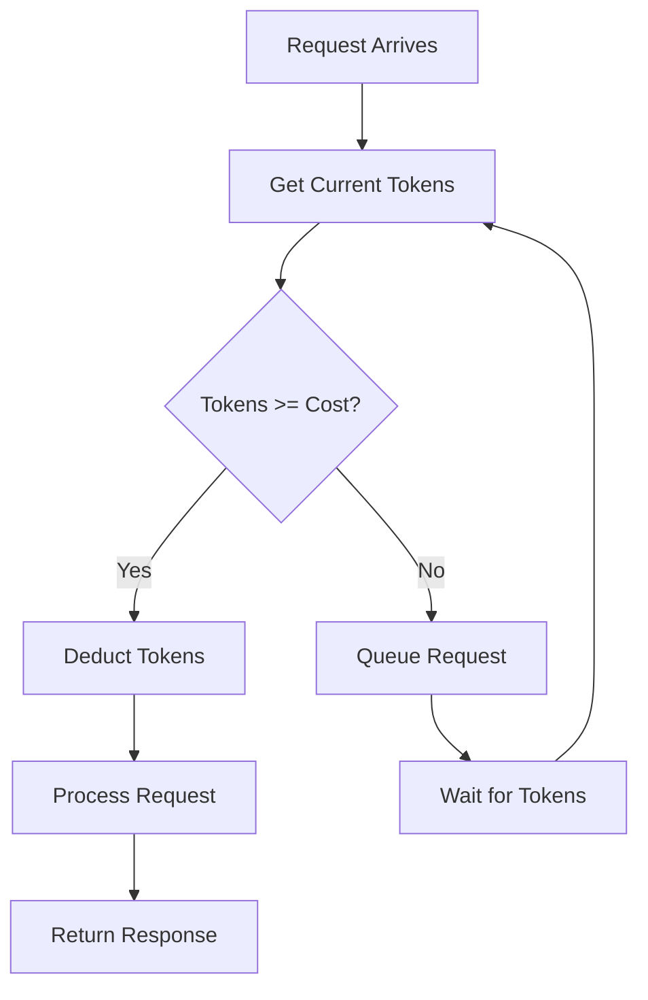

# Rate Limiter

## Problem Statement

Implement a rate limiter to control request frequency. Support multiple algorithms and per-user limits.

**Operations:**
- `is_allowed(user_id)` — return True if request allowed, False if rate limit exceeded

**Constraints:**
- Support: Token Bucket, Sliding Window Log, Sliding Window Counter
- Per-user rate limits
- Time-based refill

## Design

### Token Bucket Algorithm

```
Tokens refill at rate R tokens/second
Bucket capacity: C

    [T T T T T]  (full bucket)
    
User requests 1: [T T T T]  (1 token consumed)
User requests 3: [T]        (3 tokens consumed)
After 1 sec:     [T T]      (refill at rate R)
```

**Complexity:** O(1) per request

### Sliding Window Log

```
Track timestamps of all requests in current window

Window (last 60s): [t1, t3, t8, t12, ...]
New request: Check if count < limit in window, add timestamp
```

**Complexity:** O(n) where n = requests in window

### Sliding Window Counter

```
Divide time into fixed intervals (1s buckets)
Count requests per bucket

Buckets:  [10 requests] [5 req] [3 req] (last 3 buckets)
New req:  Check if count < limit
```

**Complexity:** O(1)


## Architecture Diagram

```
┌─────────────────────────────────────────────┐
│      Rate Limiter Service                   │
│  ┌──────────────────────────────────────┐   │
│  │  Request Handler                     │   │
│  │  - Extract user_id                   │   │
│  │  - Check allowance                   │   │
│  │  - Return 200/429                    │   │
│  └──────────────────────────────────────┘   │
│               ↓ (is_allowed)                 │
│  ┌──────────────────────────────────────┐   │
│  │  Token Bucket (per user)             │   │
│  │  - user_id → {tokens, last_refill}   │   │
│  │  - Refill: curr_tokens = min(        │   │
│  │      capacity,                       │   │
│  │      tokens + (now-last)*rate        │   │
│  │    )                                 │   │
│  │  - Check: curr_tokens >= 1           │   │
│  └──────────────────────────────────────┘   │
│               ↓ (store)                      │
│  ┌──────────────────────────────────────┐   │
│  │  Backend Store (Redis)               │   │
│  │  - O(1) atomic operations            │   │
│  │  - TTL for expired entries           │   │
│  │  - Cluster replicated                │   │
│  └──────────────────────────────────────┘   │
└─────────────────────────────────────────────┘
```

## Common Questions & Answers

**Q: Why token bucket over sliding window?**
A: Token bucket has better memory efficiency (O(1) per client) vs sliding window (O(n) requests stored). Token bucket allows burst traffic within limits, while sliding window enforces strict rate control. Token bucket requires periodic refilling (background task), while sliding window checks window immediately.

**Q: How to handle distributed rate limiting?**
A: Use Redis to maintain global token count across servers. Each server atomically decrements tokens via Lua script to prevent race conditions. Tradeoff: adds latency for Redis calls (1-5ms) but ensures correctness. Alternative: local rate limiting per server with clock synchronization.

**Q: What happens when client hits rate limit?**
A: Return HTTP 429 Too Many Requests with Retry-After header. Queue requests in buffer (limited size) for later processing. May drop requests (hard limit) or delay them gracefully. For APIs, implement exponential backoff on client side.

**Q: How to prevent rate limit bypass?**
A: Rate limit by IP + user ID (prevents header spoofing). Track aggregated usage across all client IPs for accounts. Implement feedback loop to detect suspicious patterns. Use circuit breaker to stop accepting requests from abusive sources.

## Back-of-Envelope Calculations

For typical scenario (1M users, 100 req/sec limit per user):
- Storage: 1M users × 16 bytes/entry (user_id, tokens, timestamp) = 16MB local cache
- Throughput: 100 req/sec per user × 1M users = 100M req/sec distributed (need sharding)
- Latency: Token bucket check = 50-100μs local, 1-5ms with Redis
- Bandwidth: Negligible for token bucket (~100 bytes per request)

Single-machine limit: ~100K req/sec (token bucket). Scale via: Redis cluster (handles millions of ops/sec), horizontal sharding by user_id, or edge caching near clients.

## Design Choice Comparison

| Approach | Pros | Cons |
|----------|------|------|
| Token Bucket | O(1) per request, allows bursts, simple | Requires refill tuning, less accurate |
| Sliding Window Log | Accurate, no parameters | O(n) memory, expensive per request |
| Sliding Window Counter | O(1) fast, bounded memory | Less accurate at boundary, tuning needed |

## Follow-up Interview Questions

1. How would you rate limit at multiple levels (API key, IP, user, endpoint)?
2. What if a server goes down—how to prevent double-counting tokens?
3. How to monitor rate limit violations and adjust limits based on traffic patterns?
4. What's the bottleneck at 10x scale (100M req/sec)? Need Redis cluster + sharding.
5. How to implement graceful degradation when rate limiter itself becomes bottleneck?

## Example Scenario Walkthrough

Scenario: User1 has 10 tokens/sec limit, bucket capacity 20.

Step 1: t=0, User1 makes 5 requests
- Refill: tokens = 20 (full)
- Request 1: tokens=19, allowed ✓
- Requests 2-5: tokens=15 after all

Step 2: t=0.5s, User1 makes 8 requests  
- Refill: tokens = 15 + (0.5 × 10) = 20 (max)
- Requests 1-8: tokens=12 after 8 consumed

Step 3: t=0.6s, User1 makes 1 request
- Refill: tokens = 12 + (0.1 × 10) = 13
- Request 1: tokens=12, allowed ✓

Step 4: t=0.65s, User1 makes 15 requests
- Refill: tokens = 12 + (0.05 × 10) = 12.5
- Requests 1-12: tokens=0.5, allowed ✓
- Requests 13-15: DENIED (429 returned)

## Trade-offs

| Algorithm | Pro | Con |
|-----------|-----|-----|
| Token Bucket | Simple, bursty traffic ok | Tuning params (rate, capacity) |
| Sliding Window Log | Accurate | O(n) memory, O(n) per request |
| Sliding Window Counter | Fast, O(1) | Less accurate than log |


### Python Implementation (Token Bucket)

```python
import time
from typing import Dict

class TokenBucket:
    def __init__(self, capacity: float, refill_rate: float):
        """
        capacity: max tokens in bucket
        refill_rate: tokens per second
        """
        self.capacity = capacity
        self.refill_rate = refill_rate
        self.tokens = capacity
        self.last_refill = time.time()

    def is_allowed(self, tokens: float = 1.0) -> bool:
        self._refill()

        if self.tokens >= tokens:
            self.tokens -= tokens
            return True
        return False

    def _refill(self) -> None:
        now = time.time()
        elapsed = now - self.last_refill

        # Add tokens based on elapsed time
        self.tokens = min(
            self.capacity,
            self.tokens + elapsed * self.refill_rate
        )
        self.last_refill = now

class RateLimiter:
    def __init__(self):
        self.buckets: Dict[str, TokenBucket] = {}

    def is_allowed(self, user_id: str, limit: int = 10) -> bool:
        """Check if request allowed, limit=10 req/sec"""
        if user_id not in self.buckets:
            # capacity=limit, refill_rate=limit req/sec
            self.buckets[user_id] = TokenBucket(limit, limit)

        return self.buckets[user_id].is_allowed(1)

# Usage
limiter = RateLimiter()
for i in range(15):
    allowed = limiter.is_allowed("user1")
    print(f"Request {i+1}: {'allowed' if allowed else 'denied'}")
    # First 10: allowed, 11-15: denied (need 0.1s per token)
```

### Java Implementation

```java
import java.util.*;

class TokenBucket {
    private double capacity;
    private double refillRate;
    private double tokens;
    private long lastRefill;

    public TokenBucket(double capacity, double refillRate) {
        this.capacity = capacity;
        this.refillRate = refillRate;
        this.tokens = capacity;
        this.lastRefill = System.currentTimeMillis();
    }

    public synchronized boolean isAllowed(double tokensRequired) {
        refill();
        if (tokens >= tokensRequired) {
            tokens -= tokensRequired;
            return true;
        }
        return false;
    }

    private void refill() {
        long now = System.currentTimeMillis();
        long elapsedMs = now - lastRefill;
        double elapsedSec = elapsedMs / 1000.0;

        tokens = Math.min(
            capacity,
            tokens + elapsedSec * refillRate
        );
        lastRefill = now;
    }
}

class RateLimiter {
    private Map<String, TokenBucket> buckets = new ConcurrentHashMap<>();

    public boolean isAllowed(String userId, int limit) {
        buckets.putIfAbsent(userId, new TokenBucket(limit, limit));
        return buckets.get(userId).isAllowed(1);
    }
}
```

### Flow Diagram



## Implementation Discussion

**Token Bucket vs Sliding Window:**
- Token Bucket: allows burst (refill mechanism)
- Sliding Window: strict rate limiting
- Token Bucket better for most APIs (allows natural bursts)

**Distributed Rate Limiting (Redis):**
```python
import redis

class DistributedRateLimiter:
    def __init__(self, redis_host='localhost'):
        self.redis = redis.Redis(host=redis_host)

    def is_allowed(self, user_id: str, limit: int, window: int):
        """
        limit: max requests
        window: time window in seconds
        """
        key = f"rate_limit:{user_id}"

        # Lua script for atomic operation
        script = """
        local current = redis.call('get', KEYS[1])
        if current == false then
            redis.call('setex', KEYS[1], ARGV[2], 1)
            return 1
        elseif tonumber(current) < tonumber(ARGV[1]) then
            redis.call('incr', KEYS[1])
            return 1
        else
            return 0
        end
        """

        return self.redis.eval(script, 1, key, limit, window)
```

**Production Considerations:**
- Use Redis Sorted Set for distributed rate limiting
- Track per-IP + per-user (prevent header spoofing)
- Implement circuit breaker when rate limit exceeded
- Monitor rate limit violations for abuse detection

**Edge Cases:**
- Clock skew: use NTP synchronization
- Burst handling: capacity > limit allows initial burst
- Timeout: don't store indefinitely (cleanup old entries)


## Complexity

| Operation | Token Bucket | Sliding Log | Sliding Counter |
|-----------|--------------|------------|-----------------|
| is_allowed | O(1) | O(n) | O(1) |
| Space | O(users) | O(users × requests) | O(users × buckets) |
