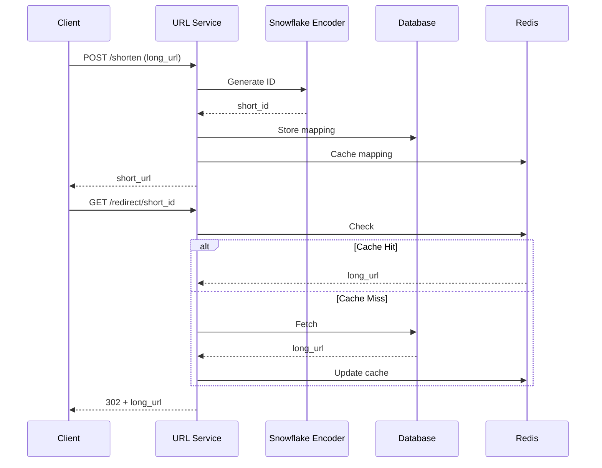

# URL Shortener

## Problem Statement

Design a service to shorten long URLs. Convert long URL to short unique identifier, support reverse mapping.

**Operations:**
- `shorten(long_url)` -> short_code
- `expand(short_code)` -> long_url

**Constraints:**
- Short codes should be unique
- Fixed-length short codes (6-8 chars)
- Support distributed generation

## Design

### Encoding Approach

```
Use Base62 (a-z, A-Z, 0-9)

Counter: 1 -> 1
Counter: 62 -> 10
Counter: 3844 -> 100

ID generation: Atomic counter or distributed ID service
```

**Complexity:** O(log n) to encode/decode counter

### Collision Handling

1. **Distributed IDs (Recommended)**
   - Use Snowflake-like ID generator (timestamp + machine_id + counter)
   - Guarantees uniqueness across servers
   - No collisions

2. **Hash-based**
   - Hash URL, take first N chars
   - Handle collisions by appending random suffix

### Data Structure

```
HashMap:
  {short_code -> long_url}
  {long_url -> short_code}  (optional, for dedup)
```


## Architecture Diagram

```
┌─────────────────────────────────────────────┐
│      URL Shortener Service                  │
│  ┌──────────────────────────────────────┐   │
│  │  Shorten API                         │   │
│  │  POST /shorten {long_url}            │   │
│  │  Response: {short_code}              │   │
│  └──────────────────────────────────────┘   │
│         ↓ (get unique ID)                    │
│  ┌──────────────────────────────────────┐   │
│  │  ID Generator (Snowflake)            │   │
│  │  ┌─────┬──────────┬────────────┐     │   │
│  │  │TS   │ Machine  │ Sequence   │     │   │
│  │  │41b  │ 10b      │ 12b        │     │   │
│  │  └─────┴──────────┴────────────┘     │   │
│  │  Encodes to: Base62 (6-8 chars)      │   │
│  └──────────────────────────────────────┘   │
│         ↓ (store mapping)                    │
│  ┌──────────────────────────────────────┐   │
│  │  Cache (Redis) + DB (MySQL)          │   │
│  │  short_code → long_url mapping       │   │
│  │  long_url → short_code (dedup)       │   │
│  │  TTL: 1 year default                 │   │
│  └──────────────────────────────────────┘   │
│  ┌──────────────────────────────────────┐   │
│  │  Expand API                          │   │
│  │  GET /{short_code}                   │   │
│  │  Response: 301 redirect to long_url  │   │
│  └──────────────────────────────────────┘   │
└─────────────────────────────────────────────┘
```

## Common Questions & Answers

**Q: Why Snowflake ID instead of hashing?**
A: Snowflake IDs guarantee uniqueness without collisions (timestamp + machine + sequence). Hashing requires collision detection/retry, adding complexity. Snowflake: simple, distributed, monotonically increasing. Hash: less predictable, needs rehashing on collision.

**Q: How to deduplicate if same URL shortened multiple times?**
A: Check if long_url already exists in DB before generating new ID. Return existing short_code. Requires reverse mapping (long_url → short_code). Tradeoff: adds O(1) lookup but saves storage and multiple codes per URL.

**Q: How to handle expired/deleted URLs?**
A: Store creation_time and TTL. Cron job deletes expired entries (1 year default). Soft delete: mark deleted but keep for analytics. On expand, check deletion status—return 404 or redirect to archive.

**Q: What if ID generator becomes bottleneck?**
A: Distribute ID generation across multiple machines (Snowflake uses machine_id). Each machine gets unique range. Use shard key (user_id) to route to same machine for batched IDs. Local generation with NTP sync avoids centralized bottleneck.

## Back-of-Envelope Calculations

For typical scenario (1B URLs shortened, 100K req/sec shorten, 10M req/sec expand):
- Storage: 1B URLs × 200 bytes avg (short_code, long_url, metadata) = 200GB
- Throughput shorten: 100K req/sec needs 100K IDs/sec (sequential, no bottleneck)
- Latency: 10ms DB write + 2ms Redis cache = 12ms p99
- Bandwidth: ~5TB/month (100K × 50KB avg URL × 86400s)

Base62 with 8 chars: 62^8 ≈ 218 trillion URLs, more than enough.

## Design Choice Comparison

| Approach | Pros | Cons |
|----------|------|------|
| Distributed ID (Snowflake) | No collision, scalable, simple | Requires ID service |
| Hash-based | No coordination needed | Collision handling, less uniform |
| Counter with DB sequence | Simple | Central bottleneck, single point of failure |

## Follow-up Interview Questions

1. How would you shard the database to handle 10B URLs? Shard by short_code prefix or user_id?
2. What if a machine in the Snowflake cluster goes down? How to reclaim its ID range?
3. How to monitor short code collisions and ID generation latency?
4. What's the bottleneck at 10x scale (1M req/sec)? Need: Snowflake cluster, DB sharding, Redis cluster.
5. How would you implement analytics (tracking who created, expanded, when)?

## Example Scenario Walkthrough

Scenario: Shorten "https://www.example.com/very/long/path?param=value"

Step 1: POST /shorten request arrives
- Input validation: URL length < 2048 chars ✓
- Check dedup: long_url exists in DB? No

Step 2: Generate unique ID
- Snowflake: TS=1715728900, Machine=5, Seq=42
- ID = (1715728900 << 22) | (5 << 12) | 42 = 461234567890
- Base62 encode: 461234567890 → "a3kP2x"

Step 3: Store mapping
- Redis: set "a3kP2x" → "https://www.example.com/..." (TTL=1yr)
- MySQL: INSERT (short_code="a3kP2x", long_url=..., created=now)
- Reverse: set long_url hash → "a3kP2x"

Step 4: Return response
- Response: {"short_url": "https://short.com/a3kP2x"}

Step 5: User clicks shortened URL
- GET /a3kP2x
- Redis hit (99% case): return long_url in 2ms
- Redirect: HTTP 301 to original URL

## Trade-offs

| Approach | Pro | Con |
|----------|-----|-----|
| Atomic Counter | Simple, predictable | Central bottleneck |
| Distributed ID | Scalable, distributed | Complex, more state |
| Hash + Random | No coordination | Collision handling |


### Python Implementation

```python
import hashlib
import time
from typing import Optional

class URLShortener:
    def __init__(self):
        self.counter = 0
        self.url_map = {}  # short_code -> long_url
        self.reverse_map = {}  # long_url -> short_code

    def shorten(self, long_url: str) -> str:
        # Check if already shortened
        if long_url in self.reverse_map:
            return self.reverse_map[long_url]

        # Generate short code using counter + base62
        self.counter += 1
        short_code = self._to_base62(self.counter)

        # Store mapping
        self.url_map[short_code] = long_url
        self.reverse_map[long_url] = short_code

        return f"https://short.url/{short_code}"

    def expand(self, short_code: str) -> Optional[str]:
        return self.url_map.get(short_code)

    def _to_base62(self, num: int) -> str:
        """Convert number to base62 (0-9, a-z, A-Z)"""
        if num == 0:
            return '0'

        chars = '0123456789abcdefghijklmnopqrstuvwxyzABCDEFGHIJKLMNOPQRSTUVWXYZ'
        result = []

        while num:
            result.append(chars[num % 62])
            num //= 62

        return ''.join(reversed(result))

class SnowflakeIDGenerator:
    """
    Distributed ID generator (simplified Snowflake)
    64-bit: [timestamp(41) | machine_id(10) | sequence(12)]
    """

    def __init__(self, machine_id: int):
        self.machine_id = machine_id
        self.sequence = 0
        self.last_timestamp = 0

    def generate_id(self) -> int:
        timestamp = int(time.time() * 1000)  # milliseconds

        if timestamp == self.last_timestamp:
            self.sequence += 1
            if self.sequence >= (1 << 12):  # overflow
                self.sequence = 0
                timestamp += 1  # wait for next ms
        else:
            self.sequence = 0

        self.last_timestamp = timestamp

        # Combine: [timestamp(41) | machine_id(10) | sequence(12)]
        return (timestamp << 22) | (self.machine_id << 12) | self.sequence

# Usage
shortener = URLShortener()
long_url = "https://www.example.com/very/long/path?param=value"
short = shortener.shorten(long_url)
print(f"Short: {short}")
print(f"Expand: {shortener.expand(short.split('/')[-1])}")
```

### Java Implementation

```java
import java.util.*;

class URLShortener {
    private long counter;
    private Map<String, String> urlMap;
    private Map<String, String> reverseMap;
    private static final String BASE62 =
        "0123456789abcdefghijklmnopqrstuvwxyzABCDEFGHIJKLMNOPQRSTUVWXYZ";

    public URLShortener() {
        this.counter = 0;
        this.urlMap = new HashMap<>();
        this.reverseMap = new HashMap<>();
    }

    public String shorten(String longUrl) {
        if (reverseMap.containsKey(longUrl)) {
            return reverseMap.get(longUrl);
        }

        String shortCode = toBase62(++counter);
        urlMap.put(shortCode, longUrl);
        reverseMap.put(longUrl, shortCode);

        return "https://short.url/" + shortCode;
    }

    public String expand(String shortCode) {
        return urlMap.get(shortCode);
    }

    private String toBase62(long num) {
        if (num == 0) return "0";

        StringBuilder result = new StringBuilder();
        while (num > 0) {
            result.insert(0, BASE62.charAt((int)(num % 62)));
            num /= 62;
        }
        return result.toString();
    }
}
```

### Flow Diagram



## Implementation Discussion

**ID Generation Strategies:**

1. **Counter-based (Simple):**
   - Pros: simple, sequential
   - Cons: central bottleneck, not distributed

2. **Snowflake (Production):**
   - Pros: distributed, no conflicts
   - Cons: requires NTP sync, bit allocation

3. **Hash-based (Alternative):**
```python
def hash_based_shorten(long_url: str) -> str:
    hash_val = int(hashlib.md5(long_url.encode()).hexdigest(), 16)
    short_code = to_base62(hash_val % (62**6))  # 6 chars
    return short_code
```

**Deduplication:**
- Store reverse mapping (long_url → short_code)
- Check before generating new code
- Saves storage, enables caching

**Production Considerations:**
- Store in DB with TTL (1 year default)
- Cache in Redis (hot URLs)
- Handle collisions gracefully
- Track stats (creation time, expiry, access)


## Complexity

| Operation | Time | Space |
|-----------|------|-------|
| shorten | O(log n) | O(1) |
| expand | O(1) | O(1) |
| Space | — | O(n) |
