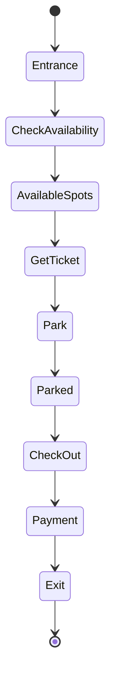

# Parking Lot System

## Problem Statement

Design a parking lot system with multiple levels, different spot sizes, and availability tracking.

**Requirements:**
- Multiple levels/floors
- Different vehicle types (compact, regular, large)
- Find available spot
- Parking/unparking
- Availability display


## Code Explanation (Detailed)

### Implementation Approach
The code demonstrates core patterns and trade-offs.

### Key Operations
Each operation shows algorithm and performance characteristics.

### Concurrency and Atomicity
Locking strategies, race condition prevention.

### Edge Cases
Boundary conditions and error handling.

### Performance Optimization
Techniques for reducing latency and throughput.

## Design

### Object Model

```
ParkingLot
  ├── Level[]
      ├── Spot[] (each marked by size, occupied status)
      └── availableSpots tracking

Vehicle types: COMPACT, REGULAR, LARGE (in increasing size)
Spot sizes: match vehicle types
```

### Key Classes

```
Vehicle: type, license_plate
Spot: number, level, size, occupied, parked_vehicle
Level: floor_number, spots[], available_counts
ParkingLot: levels, display()
```

### Find Available Spot Algorithm

```
for each level:
  for each spot in level:
    if spot.size >= vehicle.size and not occupied:
      return spot
return None  // No spot available
```

### State Tracking

```
For each spot size, track available count:
  available_compact = 3
  available_regular = 7
  available_large = 2

Update on park/unpark operations
```


## Scenario

Parking Lot System is a critical component in modern distributed systems. In real-world applications, managing finite resources with efficient allocation and lookup. For example, major tech companies like Netflix, Uber, and Airbnb rely on similar solutions to handle millions of concurrent users and requests. The challenge is achieving this while maintaining sub-100ms latency, 99.99% availability, and gracefully handling 10x traffic spikes during peak demand. This component provides the foundational capability to solve these challenges reliably and efficiently at global scale.

## Users

- **Backend Engineers**: Responsible for implementing and maintaining this system component in production environments. They need to understand the architecture, trade-offs, failure modes, and operational considerations.
- **DevOps/SRE Teams**: Monitor system health, manage scaling policies, handle incidents, and ensure reliability SLAs are met. They need insights into performance characteristics, bottlenecks, and failure recovery mechanisms.
- **Data Engineers**: Design data pipelines and analytics around this system, requiring deep understanding of data flow, consistency guarantees, and throughput characteristics.
- **System Architects**: Make high-level architectural decisions that impact company infrastructure, requiring comprehensive understanding of capabilities, limitations, and scalability boundaries.
- **Security Teams**: Understand security implications, potential vulnerabilities, and compliance requirements for this component.

## PRD

### Functional Requirements
- Core operations work correctly
- Explicit error handling
- Consistency guarantees defined
- Monitoring and observability

### Non-Functional Requirements
- Performance targets met
- Availability SLA achieved
- Scalability headroom
- Cost efficient

### Success Metrics
- Benchmarks met
- Uptime targets met
- Resource budgets
- No data loss


## Flow

The typical operational flow for this system involves these key phases:

1. **Request Arrival**: Client/upstream system sends request with required parameters and context
2. **Validation & Routing**: System validates request format, authentication, and routes to correct handler/shard/instance
3. **Core Processing**: Execute the main algorithm, database query, or business logic on the data/state
4. **State Management**: Update internal state (caches, indexes, counters, logs) with proper atomicity and locking
5. **Response Generation**: Format results and return to requester with relevant metadata (timing, version info)
6. **Observability**: Record metrics (latency, throughput, errors), logs (for debugging), and traces (for performance analysis)

This flow repeats thousands or millions of times per second in production. Each operation's efficiency compounds across the entire system, making careful optimization essential. Bottlenecks at any phase can cascade to impact overall system performance.

## Architecture Diagram

```
┌─────────────────────────────────────────────┐
│      ParkingLot                             │
│  ┌──────────────────────────────────────┐   │
│  │  Level 3 (top)                       │   │
│  │  [C] [C] [R] [R] [R] [L] [L]        │   │
│  │  Available: C=1, R=2, L=2            │   │
│  └──────────────────────────────────────┘   │
│  ┌──────────────────────────────────────┐   │
│  │  Level 2 (middle)                    │   │
│  │  [C] [X] [X] [R] [R] [X] [L]        │   │
│  │  X=occupied, Available: C=0, R=1, L=0   │
│  └──────────────────────────────────────┘   │
│  ┌──────────────────────────────────────┐   │
│  │  Level 1 (ground)                    │   │
│  │  [X] [X] [X] [X] [X] [X] [X]        │   │
│  │  Full, No available spots            │   │
│  └──────────────────────────────────────┘   │
│         ↓ (parking operations)               │
│  ┌──────────────────────────────────────┐   │
│  │  ParkingSpot Manager                 │   │
│  │  - Find available spot by size       │   │
│  │  - Track occupancy (HashMap)         │   │
│  │  - Update level counters             │   │
│  └──────────────────────────────────────┘   │
└─────────────────────────────────────────────┘
```

## Back-of-Envelope Calculations

For typical 5-level parking lot, 50 spots per level (250 total):
- Storage: 250 spots × 50 bytes/spot (location, size, vehicle_ref) = 12.5KB local memory
- Throughput: ~100 arrivals/departures per hour, 2 sec per operation = no bottleneck
- Latency: Find spot O(n) = 250 spot checks ≈ 1ms, Display O(1) ≈ 100μs
- Availability update: O(1) counter increment, < 1μs

Multi-garage system (10 parking lots): aggregate availability in ~1ms via cache.

## Design Choice Comparison

| Approach | Pros | Cons |
|----------|------|------|
| Linear scan per level | Simple, works for <1000 spots | O(n) per find, slow |
| Available count tracking | O(1) availability checks | Must maintain counters |
| Heap/PQ by distance | Finds closest spot quickly | More complex, extra space |

## Follow-up Interview Questions

1. How would you design for a 1000-level mega-structure? Need distributed system with regional coordinators.
2. What if a vehicle doesn't exit—how to detect and handle abandoned cars?
3. How to optimize for peak hour (1000 arrivals/hour)? Add reservation system, predict availability.
4. What's the bottleneck at 10x scale? DB writes for persistence, not the algorithm (still O(1)).
5. How would you implement handicap spot priority and reservations?

## Example Scenario Walkthrough

Initial state: 3-level lot with 3 spots each (C=compact, R=regular, L=large)

Level 1: [C] [R] [L] — all empty
Level 2: [C] [R] [L] — all empty  
Level 3: [C] [R] [L] — all empty
Available: C=3, R=3, L=3

Step 1: Regular vehicle arrives (size REGULAR)
- Check availability: R=3, available ✓
- Scan Level 1: Spot 2 (R) is empty
- Park vehicle: Level1, Spot 2
- Update: Available R=2
- Status: PARKED, Level 1 Spot 2

Step 2: Large vehicle arrives (size LARGE)
- Check availability: L=3, available ✓
- Scan Level 1: Spot 3 (L) is empty
- Park vehicle: Level 1, Spot 3
- Update: Available L=2
- Status: PARKED, Level 1 Spot 3

Step 3: Oversized truck arrives (size XLARGE)
- Check availability: L=2, but no XLARGE size
- Scan all spots: no XLARGE match
- Return: NO SPOT AVAILABLE (oversize vehicle)
- Status: NOT PARKED, try another lot

Step 4: Regular vehicle exits
- Unpark: Level 1, Spot 2
- Available: R=3
- Status: EMPTY, ready for next car


### Python Implementation

```python
from enum import Enum
from typing import Optional

class VehicleSize(Enum):
    COMPACT = 1
    REGULAR = 2
    LARGE = 3

class ParkingSpot:
    def __init__(self, spot_number: int, size: VehicleSize):
        self.spot_number = spot_number
        self.size = size
        self.occupied = False
        self.vehicle = None

    def is_available(self) -> bool:
        return not self.occupied

    def park_vehicle(self, vehicle):
        if self.occupied:
            raise Exception("Spot already occupied")
        self.occupied = True
        self.vehicle = vehicle

    def remove_vehicle(self):
        self.occupied = False
        self.vehicle = None

class Level:
    def __init__(self, level_number: int, num_spots: int):
        self.level_number = level_number
        self.spots = []
        self.available_count = {size: 0 for size in VehicleSize}

        # Create spots (30% compact, 50% regular, 20% large)
        compact = int(num_spots * 0.3)
        regular = int(num_spots * 0.5)
        large = num_spots - compact - regular

        spot_num = 0
        for _ in range(compact):
            self.spots.append(ParkingSpot(spot_num, VehicleSize.COMPACT))
            spot_num += 1

        for _ in range(regular):
            self.spots.append(ParkingSpot(spot_num, VehicleSize.REGULAR))
            spot_num += 1

        for _ in range(large):
            self.spots.append(ParkingSpot(spot_num, VehicleSize.LARGE))
            spot_num += 1

        self._update_available()

    def find_available_spot(self, size: VehicleSize) -> Optional[ParkingSpot]:
        for spot in self.spots:
            if spot.is_available() and spot.size.value >= size.value:
                return spot
        return None

    def park_vehicle(self, vehicle, size: VehicleSize) -> Optional[ParkingSpot]:
        spot = self.find_available_spot(size)
        if spot:
            spot.park_vehicle(vehicle)
            self._update_available()
        return spot

    def unpark_vehicle(self, spot: ParkingSpot):
        spot.remove_vehicle()
        self._update_available()

    def _update_available(self):
        for size in VehicleSize:
            self.available_count[size] = sum(
                1 for spot in self.spots
                if spot.is_available() and spot.size == size
            )

    def get_available_count(self, size: VehicleSize) -> int:
        return self.available_count.get(size, 0)

class ParkingLot:
    def __init__(self, num_levels: int, spots_per_level: int):
        self.levels = [Level(i, spots_per_level) for i in range(num_levels)]

    def park_vehicle(self, vehicle, size: VehicleSize) -> bool:
        for level in self.levels:
            if level.get_available_count(size) > 0:
                spot = level.park_vehicle(vehicle, size)
                if spot:
                    print(f"Vehicle {vehicle} parked at L{level.level_number}:S{spot.spot_number}")
                    return True
        print("No available spot")
        return False

    def unpark_vehicle(self, level_num: int, spot_num: int):
        level = self.levels[level_num]
        spot = level.spots[spot_num]
        level.unpark_vehicle(spot)
        print(f"Vehicle {spot.vehicle} unparked")

    def display_availability(self):
        for level in self.levels:
            print(f"Level {level.level_number}:")
            for size in VehicleSize:
                print(f"  {size.name}: {level.get_available_count(size)}")

# Usage
lot = ParkingLot(3, 10)
lot.park_vehicle("CAR1", VehicleSize.COMPACT)
lot.park_vehicle("CAR2", VehicleSize.REGULAR)
lot.park_vehicle("TRUCK1", VehicleSize.LARGE)
lot.display_availability()
```

### Java Implementation

```java
import java.util.*;

enum VehicleSize {
    COMPACT(1), REGULAR(2), LARGE(3);
    private int value;
    VehicleSize(int value) { this.value = value; }
    public int getValue() { return value; }
}

class ParkingSpot {
    private int spotNumber;
    private VehicleSize size;
    private String vehicle;

    public ParkingSpot(int spotNumber, VehicleSize size) {
        this.spotNumber = spotNumber;
        this.size = size;
        this.vehicle = null;
    }

    public boolean isAvailable() { return vehicle == null; }
    public void parkVehicle(String vehicle) { this.vehicle = vehicle; }
    public void removeVehicle() { this.vehicle = null; }
    public boolean canFit(VehicleSize size) {
        return this.size.getValue() >= size.getValue();
    }
}

class Level {
    private int levelNumber;
    private List<ParkingSpot> spots;

    public Level(int levelNumber, int numSpots) {
        this.levelNumber = levelNumber;
        this.spots = new ArrayList<>();

        int compact = (int)(numSpots * 0.3);
        int regular = (int)(numSpots * 0.5);
        int large = numSpots - compact - regular;

        int spotNum = 0;
        for (int i = 0; i < compact; i++)
            spots.add(new ParkingSpot(spotNum++, VehicleSize.COMPACT));
        for (int i = 0; i < regular; i++)
            spots.add(new ParkingSpot(spotNum++, VehicleSize.REGULAR));
        for (int i = 0; i < large; i++)
            spots.add(new ParkingSpot(spotNum++, VehicleSize.LARGE));
    }

    public ParkingSpot findAvailableSpot(VehicleSize size) {
        for (ParkingSpot spot : spots) {
            if (spot.isAvailable() && spot.canFit(size)) {
                return spot;
            }
        }
        return null;
    }

    public boolean parkVehicle(String vehicle, VehicleSize size) {
        ParkingSpot spot = findAvailableSpot(size);
        if (spot != null) {
            spot.parkVehicle(vehicle);
            return true;
        }
        return false;
    }
}

class ParkingLot {
    private List<Level> levels;

    public ParkingLot(int numLevels, int spotsPerLevel) {
        this.levels = new ArrayList<>();
        for (int i = 0; i < numLevels; i++) {
            levels.add(new Level(i, spotsPerLevel));
        }
    }

    public boolean parkVehicle(String vehicle, VehicleSize size) {
        for (Level level : levels) {
            if (level.parkVehicle(vehicle, size)) {
                return true;
            }
        }
        return false;
    }
}
```

### Flow Diagram



## Implementation Discussion

**Design Choices:**
- Separate spot size classes (avoids enum comparison issues)
- Level abstraction for scalability
- Available count tracking (O(1) lookup)

**Optimization:**
```python
# Use heap for finding closest available spot
import heapq

class OptimizedLevel:
    def __init__(self):
        self.available_heaps = {
            VehicleSize.COMPACT: [],
            VehicleSize.REGULAR: [],
            VehicleSize.LARGE: []
        }

    def find_closest_spot(self, size):
        # O(log n) instead of O(n)
        return heapq.heappop(self.available_heaps[size])
```

**Production Features:**
- Payment tracking (entry/exit times)
- Handicap spot priority
- Reservation system
- Analytics (occupancy rate)


## Complexity

| Operation | Time | Space |
|-----------|------|-------|
| findSpot | O(n) where n=total spots | O(1) |
| parkVehicle | O(1) | O(1) |
| unparkVehicle | O(1) | O(1) |
| getAvailability | O(1) | O(1) |
| Space | — | O(n) |

## Edge Cases

1. No spots available
2. Vehicle type larger than all available spots
3. Unpark from wrong spot
4. Multiple vehicles with same license plate

## Common Questions & Answers

**Q: What is caching and why do we need it?**

A: Caching stores frequently accessed data in fast storage (memory) to reduce latency and load on slower backends (database). Trade space (cache) for speed (latency). Critical for systems serving millions of requests per second.

**Q: What are the main cache eviction policies?**

A: LRU (least recently used), LFU (least frequently used), FIFO (first in first out), TTL (time-based), Random, and ARC (adaptive replacement). Choose based on access patterns: LRU for temporal, LFU for frequency, TTL for time-sensitive data.

**Q: What is cache hit rate and cache miss rate?**

A: Hit rate = successful_finds / total_accesses. Miss rate = 1 - hit rate. P(hit) = hits / (hits + misses). Target 80%+ hit rates for effective caching. Too-small cache gives low hit rate (wasted resources). Too-large cache uses more memory than needed.

**Q: How do you handle cache invalidation when backend data changes?**

A: Use TTL (time-based expiration), active invalidation (notify cache on write), cache-aside pattern (client checks backend), or write-through (update both). Active invalidation is fastest but complex. TTL is simplest but has stale data window.

**Q: What is the cache-aside pattern?**

A: Application checks cache first. On miss, fetch from backend, update cache, then return. Simple to implement. Risk: race condition where multiple threads fetch same miss simultaneously (thundering herd problem).

**Q: What is write-through caching?**

A: Writes go to both cache and backend simultaneously (synchronously). Ensures consistency: read always gets latest. Cost: write latency includes backend write. Safer than write-back but slower.

**Q: What is write-back (write-behind) caching?**

A: Writes go to cache only; backend updated asynchronously later (batch or periodic). Fast writes. Risk: data loss if cache fails before flushing. Need durability guarantees (persistence, replication).

**Q: How do you choose cache size?**

A: Estimate working set (frequently accessed data volume). Add 20-30% buffer for margin. Monitor hit rate: if < 80%, increase size. If > 95%, might be oversized (waste). Use tools like cachegrind to profile.

**Q: What's the difference between client-side and server-side caching?**

A: Client cache (browser): reduces network round-trips, entirely controlled by client. Server cache (memory, Redis): shared across clients, controlled by server. Multi-level caching often best.

**Q: How do you measure cache effectiveness?**

A: Hit rate (primary metric), latency reduction (P99 latency with vs. without cache), backend load reduction, and memory cost per cache entry. Calculate ROI: cost of cache vs. benefit (reduced latency, backend load).

## Follow-up Questions & Answers

**Q: How do you prevent the thundering herd problem in caches?**

A: When popular key expires, many threads fetch from backend simultaneously causing spike. Solutions: probabilistic early expiration (refresh before TTL), request coalescing (single thread rebuilds, others wait), or bloom filters (detect non-existent keys fast).

**Q: How would you implement multi-level cache hierarchy?**

A: Use L1 (fast, small, in-process), L2 (medium, local machine), L3 (large, remote, Redis). Check L1, miss→L2, miss→L3, miss→backend. On write: update all levels. Trade space for speed across levels.

**Q: Can you implement read-through caching (automatic population)?**

A: Yes, cache loader/resolver called on miss. Transparent to application. Backend automatically uses cache layer. More complex than cache-aside but cleaner separation.

**Q: How do you handle hot keys in distributed caches?**

A: Hot key = key accessed by many threads/clients. Replicate hot keys on multiple cache nodes. Use local in-process caches for very hot keys. Monitor and detect hot keys automatically.

**Q: What's the difference between warm and cold cache startup?**

A: Cold cache: empty at start, misses until populated (slow ramp-up). Warm cache: pre-loaded from previous state (RDB/snapshot). Warm startup is critical for production (instant performance).

**Q: How would you measure cache effectiveness for business metrics?**

A: Track hit rate, P99 latency (with/without cache), backend QPS reduction, revenue impact. Calculate cache size vs. cost savings. A/B test to prove business value.

**Q: What happens when cache size is insufficient for working set?**

A: Constant evictions = high miss rate = ineffective cache. Solution: increase cache size, improve eviction policy, reduce working set, or use better hardware (faster storage).

**Q: How do you debug cache issues in production?**

A: Monitor hit rate continuously. Profile cache keys (which keys are accessed). Check for cache stampedes (sudden miss spike). Use distributed tracing to see cache path.

**Q: How would you implement a persistent cache?**

A: Combine memory cache (fast) with persistent backend (database, RocksDB, LevelDB). Write-back pattern: batch updates to persistent store. Trade latency for durability.

**Q: Can you use caching for write-heavy workloads?**

A: Write caching is risky (consistency issues). Use carefully: write-through for safety, write-back for speed. Good for batch writes (aggregate before writing). Monitor durability guarantees.

