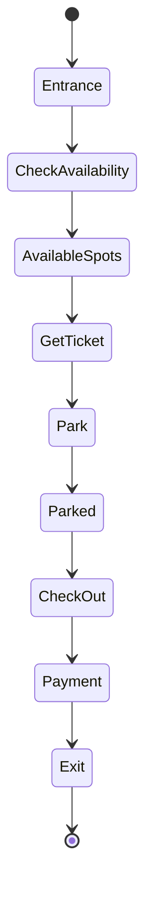

# Parking Lot System

## Problem Statement

Design a parking lot system with multiple levels, different spot sizes, and availability tracking.

**Requirements:**
- Multiple levels/floors
- Different vehicle types (compact, regular, large)
- Find available spot
- Parking/unparking
- Availability display

## Design

### Object Model

```
ParkingLot
  ├── Level[]
      ├── Spot[] (each marked by size, occupied status)
      └── availableSpots tracking

Vehicle types: COMPACT, REGULAR, LARGE (in increasing size)
Spot sizes: match vehicle types
```

### Key Classes

```
Vehicle: type, license_plate
Spot: number, level, size, occupied, parked_vehicle
Level: floor_number, spots[], available_counts
ParkingLot: levels, display()
```

### Find Available Spot Algorithm

```
for each level:
  for each spot in level:
    if spot.size >= vehicle.size and not occupied:
      return spot
return None  // No spot available
```

### State Tracking

```
For each spot size, track available count:
  available_compact = 3
  available_regular = 7
  available_large = 2

Update on park/unpark operations
```


## Architecture Diagram

```
┌─────────────────────────────────────────────┐
│      ParkingLot                             │
│  ┌──────────────────────────────────────┐   │
│  │  Level 3 (top)                       │   │
│  │  [C] [C] [R] [R] [R] [L] [L]        │   │
│  │  Available: C=1, R=2, L=2            │   │
│  └──────────────────────────────────────┘   │
│  ┌──────────────────────────────────────┐   │
│  │  Level 2 (middle)                    │   │
│  │  [C] [X] [X] [R] [R] [X] [L]        │   │
│  │  X=occupied, Available: C=0, R=1, L=0   │
│  └──────────────────────────────────────┘   │
│  ┌──────────────────────────────────────┐   │
│  │  Level 1 (ground)                    │   │
│  │  [X] [X] [X] [X] [X] [X] [X]        │   │
│  │  Full, No available spots            │   │
│  └──────────────────────────────────────┘   │
│         ↓ (parking operations)               │
│  ┌──────────────────────────────────────┐   │
│  │  ParkingSpot Manager                 │   │
│  │  - Find available spot by size       │   │
│  │  - Track occupancy (HashMap)         │   │
│  │  - Update level counters             │   │
│  └──────────────────────────────────────┘   │
└─────────────────────────────────────────────┘
```

## Common Questions & Answers

**Q: Why track available counts per size separately?**
A: O(1) availability lookup for each size type without scanning all spots. Enables fast "can vehicle fit" check. Alternative: scan all levels (O(n)), but too slow for real-time display systems.

**Q: How to find a spot efficiently across multiple levels?**
A: Iterate levels in order (ground to top). For each level, check available counts for vehicle size. If count > 0, scan spots linearly until found. Combine with heap/priority queue for "closest available" queries.

**Q: What happens if a vehicle overstays?**
A: Implement manual payment on exit (toll booth). Optional: add timer/expiration to spot. Parking enforcement marks spot as "reserved for towing". Manual override by admin to release stuck vehicle.

**Q: How to handle vehicle size validation?**
A: Enum sizes (COMPACT=1, REGULAR=2, LARGE=3). Spot size >= vehicle size required. Never allow oversized vehicle (car gets stuck). On failure, return "no available spot" message.

## Back-of-Envelope Calculations

For typical 5-level parking lot, 50 spots per level (250 total):
- Storage: 250 spots × 50 bytes/spot (location, size, vehicle_ref) = 12.5KB local memory
- Throughput: ~100 arrivals/departures per hour, 2 sec per operation = no bottleneck
- Latency: Find spot O(n) = 250 spot checks ≈ 1ms, Display O(1) ≈ 100μs
- Availability update: O(1) counter increment, < 1μs

Multi-garage system (10 parking lots): aggregate availability in ~1ms via cache.

## Design Choice Comparison

| Approach | Pros | Cons |
|----------|------|------|
| Linear scan per level | Simple, works for <1000 spots | O(n) per find, slow |
| Available count tracking | O(1) availability checks | Must maintain counters |
| Heap/PQ by distance | Finds closest spot quickly | More complex, extra space |

## Follow-up Interview Questions

1. How would you design for a 1000-level mega-structure? Need distributed system with regional coordinators.
2. What if a vehicle doesn't exit—how to detect and handle abandoned cars?
3. How to optimize for peak hour (1000 arrivals/hour)? Add reservation system, predict availability.
4. What's the bottleneck at 10x scale? DB writes for persistence, not the algorithm (still O(1)).
5. How would you implement handicap spot priority and reservations?

## Example Scenario Walkthrough

Initial state: 3-level lot with 3 spots each (C=compact, R=regular, L=large)

Level 1: [C] [R] [L] — all empty
Level 2: [C] [R] [L] — all empty  
Level 3: [C] [R] [L] — all empty
Available: C=3, R=3, L=3

Step 1: Regular vehicle arrives (size REGULAR)
- Check availability: R=3, available ✓
- Scan Level 1: Spot 2 (R) is empty
- Park vehicle: Level1, Spot 2
- Update: Available R=2
- Status: PARKED, Level 1 Spot 2

Step 2: Large vehicle arrives (size LARGE)
- Check availability: L=3, available ✓
- Scan Level 1: Spot 3 (L) is empty
- Park vehicle: Level 1, Spot 3
- Update: Available L=2
- Status: PARKED, Level 1 Spot 3

Step 3: Oversized truck arrives (size XLARGE)
- Check availability: L=2, but no XLARGE size
- Scan all spots: no XLARGE match
- Return: NO SPOT AVAILABLE (oversize vehicle)
- Status: NOT PARKED, try another lot

Step 4: Regular vehicle exits
- Unpark: Level 1, Spot 2
- Available: R=3
- Status: EMPTY, ready for next car


### Python Implementation

```python
from enum import Enum
from typing import Optional

class VehicleSize(Enum):
    COMPACT = 1
    REGULAR = 2
    LARGE = 3

class ParkingSpot:
    def __init__(self, spot_number: int, size: VehicleSize):
        self.spot_number = spot_number
        self.size = size
        self.occupied = False
        self.vehicle = None

    def is_available(self) -> bool:
        return not self.occupied

    def park_vehicle(self, vehicle):
        if self.occupied:
            raise Exception("Spot already occupied")
        self.occupied = True
        self.vehicle = vehicle

    def remove_vehicle(self):
        self.occupied = False
        self.vehicle = None

class Level:
    def __init__(self, level_number: int, num_spots: int):
        self.level_number = level_number
        self.spots = []
        self.available_count = {size: 0 for size in VehicleSize}

        # Create spots (30% compact, 50% regular, 20% large)
        compact = int(num_spots * 0.3)
        regular = int(num_spots * 0.5)
        large = num_spots - compact - regular

        spot_num = 0
        for _ in range(compact):
            self.spots.append(ParkingSpot(spot_num, VehicleSize.COMPACT))
            spot_num += 1

        for _ in range(regular):
            self.spots.append(ParkingSpot(spot_num, VehicleSize.REGULAR))
            spot_num += 1

        for _ in range(large):
            self.spots.append(ParkingSpot(spot_num, VehicleSize.LARGE))
            spot_num += 1

        self._update_available()

    def find_available_spot(self, size: VehicleSize) -> Optional[ParkingSpot]:
        for spot in self.spots:
            if spot.is_available() and spot.size.value >= size.value:
                return spot
        return None

    def park_vehicle(self, vehicle, size: VehicleSize) -> Optional[ParkingSpot]:
        spot = self.find_available_spot(size)
        if spot:
            spot.park_vehicle(vehicle)
            self._update_available()
        return spot

    def unpark_vehicle(self, spot: ParkingSpot):
        spot.remove_vehicle()
        self._update_available()

    def _update_available(self):
        for size in VehicleSize:
            self.available_count[size] = sum(
                1 for spot in self.spots
                if spot.is_available() and spot.size == size
            )

    def get_available_count(self, size: VehicleSize) -> int:
        return self.available_count.get(size, 0)

class ParkingLot:
    def __init__(self, num_levels: int, spots_per_level: int):
        self.levels = [Level(i, spots_per_level) for i in range(num_levels)]

    def park_vehicle(self, vehicle, size: VehicleSize) -> bool:
        for level in self.levels:
            if level.get_available_count(size) > 0:
                spot = level.park_vehicle(vehicle, size)
                if spot:
                    print(f"Vehicle {vehicle} parked at L{level.level_number}:S{spot.spot_number}")
                    return True
        print("No available spot")
        return False

    def unpark_vehicle(self, level_num: int, spot_num: int):
        level = self.levels[level_num]
        spot = level.spots[spot_num]
        level.unpark_vehicle(spot)
        print(f"Vehicle {spot.vehicle} unparked")

    def display_availability(self):
        for level in self.levels:
            print(f"Level {level.level_number}:")
            for size in VehicleSize:
                print(f"  {size.name}: {level.get_available_count(size)}")

# Usage
lot = ParkingLot(3, 10)
lot.park_vehicle("CAR1", VehicleSize.COMPACT)
lot.park_vehicle("CAR2", VehicleSize.REGULAR)
lot.park_vehicle("TRUCK1", VehicleSize.LARGE)
lot.display_availability()
```

### Java Implementation

```java
import java.util.*;

enum VehicleSize {
    COMPACT(1), REGULAR(2), LARGE(3);
    private int value;
    VehicleSize(int value) { this.value = value; }
    public int getValue() { return value; }
}

class ParkingSpot {
    private int spotNumber;
    private VehicleSize size;
    private String vehicle;

    public ParkingSpot(int spotNumber, VehicleSize size) {
        this.spotNumber = spotNumber;
        this.size = size;
        this.vehicle = null;
    }

    public boolean isAvailable() { return vehicle == null; }
    public void parkVehicle(String vehicle) { this.vehicle = vehicle; }
    public void removeVehicle() { this.vehicle = null; }
    public boolean canFit(VehicleSize size) {
        return this.size.getValue() >= size.getValue();
    }
}

class Level {
    private int levelNumber;
    private List<ParkingSpot> spots;

    public Level(int levelNumber, int numSpots) {
        this.levelNumber = levelNumber;
        this.spots = new ArrayList<>();

        int compact = (int)(numSpots * 0.3);
        int regular = (int)(numSpots * 0.5);
        int large = numSpots - compact - regular;

        int spotNum = 0;
        for (int i = 0; i < compact; i++)
            spots.add(new ParkingSpot(spotNum++, VehicleSize.COMPACT));
        for (int i = 0; i < regular; i++)
            spots.add(new ParkingSpot(spotNum++, VehicleSize.REGULAR));
        for (int i = 0; i < large; i++)
            spots.add(new ParkingSpot(spotNum++, VehicleSize.LARGE));
    }

    public ParkingSpot findAvailableSpot(VehicleSize size) {
        for (ParkingSpot spot : spots) {
            if (spot.isAvailable() && spot.canFit(size)) {
                return spot;
            }
        }
        return null;
    }

    public boolean parkVehicle(String vehicle, VehicleSize size) {
        ParkingSpot spot = findAvailableSpot(size);
        if (spot != null) {
            spot.parkVehicle(vehicle);
            return true;
        }
        return false;
    }
}

class ParkingLot {
    private List<Level> levels;

    public ParkingLot(int numLevels, int spotsPerLevel) {
        this.levels = new ArrayList<>();
        for (int i = 0; i < numLevels; i++) {
            levels.add(new Level(i, spotsPerLevel));
        }
    }

    public boolean parkVehicle(String vehicle, VehicleSize size) {
        for (Level level : levels) {
            if (level.parkVehicle(vehicle, size)) {
                return true;
            }
        }
        return false;
    }
}
```

### Flow Diagram



## Implementation Discussion

**Design Choices:**
- Separate spot size classes (avoids enum comparison issues)
- Level abstraction for scalability
- Available count tracking (O(1) lookup)

**Optimization:**
```python
# Use heap for finding closest available spot
import heapq

class OptimizedLevel:
    def __init__(self):
        self.available_heaps = {
            VehicleSize.COMPACT: [],
            VehicleSize.REGULAR: [],
            VehicleSize.LARGE: []
        }

    def find_closest_spot(self, size):
        # O(log n) instead of O(n)
        return heapq.heappop(self.available_heaps[size])
```

**Production Features:**
- Payment tracking (entry/exit times)
- Handicap spot priority
- Reservation system
- Analytics (occupancy rate)


## Complexity

| Operation | Time | Space |
|-----------|------|-------|
| findSpot | O(n) where n=total spots | O(1) |
| parkVehicle | O(1) | O(1) |
| unparkVehicle | O(1) | O(1) |
| getAvailability | O(1) | O(1) |
| Space | — | O(n) |

## Edge Cases

1. No spots available
2. Vehicle type larger than all available spots
3. Unpark from wrong spot
4. Multiple vehicles with same license plate
