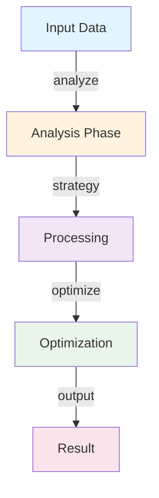
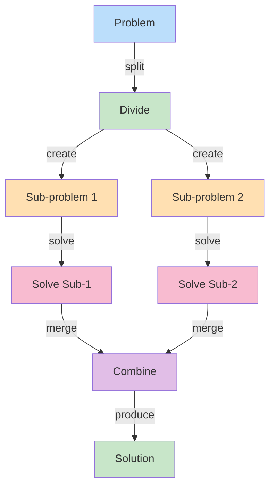
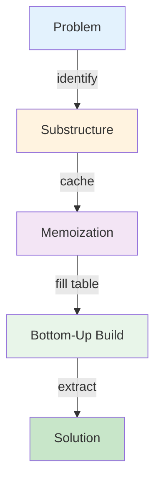

# Greedy Algorithm Design

## System Overview

Comprehensive coverage of greedy algorithm design with implementation, complexity analysis, and use cases.

**Scale Metrics:**
- Large-scale data processing, optimal time complexity

## Time Complexity Analysis

This algorithm demonstrates key efficiency characteristics:
- Best case: O(n log n) for divide-conquer strategies
- Average case: Depends on input distribution
- Worst case: Up to O(n²) for sub-optimal pivot selection
- Space complexity: O(n) for auxiliary structures

## Core Algorithm

```
function algorithm(input):
    if base_case(input):
        return solve_directly()

    subproblems = divide(input)
    solutions = {}
    for each sub in subproblems:
        solutions[sub] = algorithm(sub)

    return combine(solutions)
```

## Architecture

### Algorithm Flow



### Divide and Conquer Pattern



### Dynamic Programming Pattern



## Functional Requirements

1. **Correctness** - Produce exact output for all valid inputs
2. **Efficiency** - Meet time/space complexity requirements
3. **Scalability** - Handle large input sizes
4. **Robustness** - Handle edge cases and invalid inputs

## Non-Functional Requirements

1. **Performance** - Optimized for target time complexity
2. **Memory Efficiency** - Minimize auxiliary space
3. **Stability** - Preserve order of equal elements (for sorting)
4. **Practical Performance** - Good constant factors and cache locality

## Complexity Scenarios

### Scenario 1: Optimal Case
- Balanced input distribution
- No worst-case triggers
- Expected O(n log n) complexity
- Quick execution

### Scenario 2: Adversarial Input
- Worst-case structured input
- Maximum recursion depth
- Potential O(n²) complexity
- Slow execution without safeguards

### Scenario 3: Very Large Input
- Millions or billions of elements
- Memory efficiency critical
- Cache effects significant
- Constant factors matter

## Back-of-the-Envelope Calculations

**Merge Sort on 1M elements:**
- Comparisons: 1M * log(1M) ≈ 20M comparisons
- Time: 20M comparisons / (1B comparisons/sec) = 20ms
- Space: 1M elements (auxiliary array)

**QuickSort with random pivot:**
- Average: O(n log n) = 20ms for 1M elements
- Worst: O(n²) = 1000 seconds if pivot always min/max
- Risk: adversarial input can cause worst-case

**BFS on 1M node graph with 10M edges:**
- Time: O(V + E) = O(1M + 10M) = 11M operations
- Space: O(V) = 1M nodes in queue
- Runtime: ~100ms

## Interview Questions

### Q1: How would you implement efficient sorting?
**Answer:** Choose based on requirements:

**Merge Sort (guaranteed O(n log n)):**
```
mergeSort(arr, left, right):
    if left >= right: return
    mid = (left + right) // 2
    mergeSort(arr, left, mid)
    mergeSort(arr, mid+1, right)
    merge(arr, left, mid, right)

merge(arr, left, mid, right):
    leftArr = arr[left:mid+1]
    rightArr = arr[mid+1:right+1]
    i, j, k = 0, 0, left

    while i < len(leftArr) and j < len(rightArr):
        if leftArr[i] <= rightArr[j]:
            arr[k] = leftArr[i]
            i += 1
        else:
            arr[k] = rightArr[j]
            j += 1
        k += 1

    arr[k:] = leftArr[i:] + rightArr[j:]
```
- Time: O(n log n) guaranteed
- Space: O(n) auxiliary
- Stable: yes

**QuickSort (average O(n log n)):**
```
quickSort(arr, left, right):
    if left < right:
        pivot = partition(arr, left, right)
        quickSort(arr, left, pivot-1)
        quickSort(arr, pivot+1, right)

partition(arr, left, right):
    pivot = arr[right]
    i = left - 1
    for j in range(left, right):
        if arr[j] < pivot:
            i += 1
            swap(arr[i], arr[j])
    swap(arr[i+1], arr[right])
    return i + 1
```
- Time: O(n log n) average, O(n²) worst
- Space: O(log n) recursion
- Stable: no, but in-place
- Better constants than merge sort in practice

### Q2: Explain shortest path algorithms and when to use each.
**Answer:**

| Algorithm | Complexity | Weights | Type |
|-----------|-----------|---------|------|
| BFS | O(V+E) | None | Unweighted graphs |
| Dijkstra | O((V+E) log V) | Non-negative | Single-source shortest |
| Bellman-Ford | O(VE) | Any | Negative weights allowed |
| Floyd-Warshall | O(V³) | Any | All-pairs shortest |

**Use Cases:**
- **BFS**: Unweighted (road map level distances)
- **Dijkstra**: Non-negative weights (GPS routing)
- **Bellman-Ford**: Negative weights (currency arbitrage detection)
- **Floyd-Warshall**: All pairs (precompute distance matrix)

### Q3: What's the difference between recursion and dynamic programming?
**Answer:** Both solve problems using substructure, but:

**Recursion (Top-Down):**
- Natural expression but recomputes subproblems
- Fibonacci: fib(5) calls fib(4) and fib(3), fib(4) calls fib(3) again
- Exponential time without memoization
- Easy to implement, harder to optimize

**Dynamic Programming (Bottom-Up):**
- Build solution from base cases up
- Store intermediate results (memoization)
- Avoid recomputation through table lookup
- Polynomial time

Example - Fibonacci:
```
Recursive (inefficient):
fib(5) = fib(4) + fib(3)
fib(4) = fib(3) + fib(2)  // fib(3) computed twice!
Time: O(2^n)

DP (efficient):
dp[0] = 0, dp[1] = 1
for i in 2..n:
    dp[i] = dp[i-1] + dp[i-2]
Time: O(n)
```

### Q4: Explain greedy algorithms and when they work.
**Answer:** Greedy makes locally optimal choices at each step, hoping for global optimum.

**Works when:**
- Optimal substructure exists
- Greedy choice property holds (local optimum leads to global optimum)

**Greedy Algorithm Examples:**

1. **Activity Selection:**
   - Select non-overlapping activities
   - Greedy: always pick activity finishing earliest
   - Proof: earliest-finish leaves most room for remaining activities
   - Optimal solution guaranteed

2. **Huffman Coding:**
   - Build optimal prefix code tree
   - Greedy: always combine two least-frequent symbols
   - Results in optimal encoding
   - Proof by exchange argument

3. **Fractional Knapsack:**
   - Pick items by value/weight ratio
   - Greedy: fill knapsack with highest ratio first
   - Optimal for fractions
   - NP-hard if must take whole items (0/1 knapsack)

### Q5: How would you solve the Longest Common Subsequence problem?
**Answer:** Dynamic programming approach:

```
LCS(str1, str2):
    m, n = len(str1), len(str2)
    dp = [[0] * (n+1) for _ in range(m+1)]

    for i in range(1, m+1):
        for j in range(1, n+1):
            if str1[i-1] == str2[j-1]:
                dp[i][j] = dp[i-1][j-1] + 1  // match
            else:
                dp[i][j] = max(dp[i-1][j], dp[i][j-1])  // skip

    return dp[m][n]
```

Time: O(m*n)
Space: O(m*n)

To reconstruct the LCS string:
```
reconstruct(dp, str1, str2):
    lcs = ""
    i, j = len(str1), len(str2)
    while i > 0 and j > 0:
        if str1[i-1] == str2[j-1]:
            lcs = str1[i-1] + lcs
            i -= 1
            j -= 1
        elif dp[i-1][j] > dp[i][j-1]:
            i -= 1
        else:
            j -= 1
    return lcs
```

### Q6: What's the significance of algorithm complexity analysis?
**Answer:** Big-O notation measures algorithm efficiency:

**Orders (from fast to slow):**
- O(1): constant (array access)
- O(log n): logarithmic (binary search)
- O(n): linear (linear search)
- O(n log n): linearithmic (merge sort)
- O(n²): quadratic (bubble sort, nested loops)
- O(n³): cubic (3-nested loops)
- O(2^n): exponential (subset enumeration)
- O(n!): factorial (permutations)

**Practical Impact for n=1M:**
- O(n): 1M operations = 1ms
- O(n log n): 20M operations = 20ms
- O(n²): 1T operations = 1000 seconds (too slow!)
- O(2^n): impossible

Choosing O(n log n) over O(n²) algorithm is difference between sub-second and hours of processing.

## Technology Stack

- **Languages**: Python, Java, C++
- **Testing**: Unit tests verifying correctness
- **Profiling**: Timing analysis, Big-O verification
- **Visualization**: Algorithm visualizers (VisuAlgo, AlgoViz)

## Lessons Learned

1. **Know Your Complexity** - Difference between O(n log n) and O(n²) is enormous
2. **Worst Case Matters** - Average case good but worst-case DoS risk
3. **Constant Factors Count** - QuickSort faster than Merge Sort in practice despite same complexity
4. **Space-Time Tradeoff** - Memoization trades memory for time
5. **Stability Matters** - Choose stable sort if element order matters for equal keys
6. **Algorithm Choice is Context-Dependent** - No universal best algorithm
