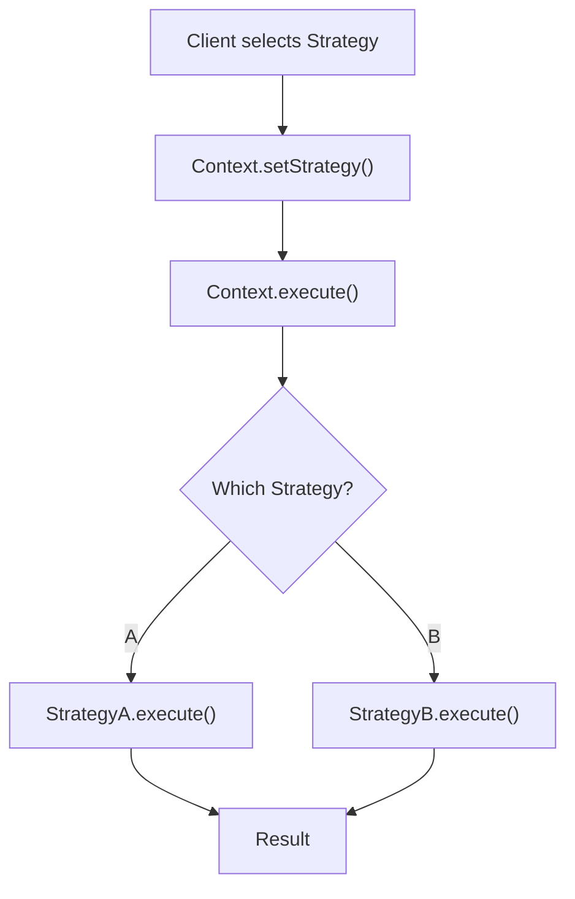

# Strategy Pattern

## Problem Statement

Define a family of algorithms, encapsulate each one, and make them interchangeable. Strategy lets the algorithm vary independently from clients.

**Use Cases:**
- Payment methods (credit card, PayPal, Bitcoin)
- Sorting algorithms (select at runtime)
- Compression algorithms (zip, gzip, bzip2)
- File parsing strategies


## Code Explanation (Detailed)

### Implementation Approach
The code demonstrates core patterns and trade-offs.

### Key Operations
Each operation shows algorithm and performance characteristics.

### Concurrency and Atomicity
Locking strategies, race condition prevention.

### Edge Cases
Boundary conditions and error handling.

### Performance Optimization
Techniques for reducing latency and throughput.

## Design

### Class Diagram

```
        Strategy (interface)
        ├── execute()
        │
    ┌───┴───┬──────┐
    │       │      │
ConcreteStrategyA/B/C (implement execute differently)

Context
  ├── strategy: Strategy
  └── executeStrategy()
```

### Key Components

```
Strategy: Interface defining algorithm operations
ConcreteStrategy: Implements specific algorithm
Context: Holds reference to Strategy, delegates work
```

### Pattern Flow

```
1. Create concrete strategies
2. Context holds reference to strategy
3. At runtime, switch strategies
4. Context delegates to strategy.execute()
```


## Scenario

Strategy Pattern is a critical component in modern distributed systems. In real-world applications, handling complex business logic at scale with high reliability. For example, major tech companies like Netflix, Uber, and Airbnb rely on similar solutions to handle millions of concurrent users and requests. The challenge is achieving this while maintaining sub-100ms latency, 99.99% availability, and gracefully handling 10x traffic spikes during peak demand. This component provides the foundational capability to solve these challenges reliably and efficiently at global scale.

## Users

- **Backend Engineers**: Responsible for implementing and maintaining this system component in production environments. They need to understand the architecture, trade-offs, failure modes, and operational considerations.
- **DevOps/SRE Teams**: Monitor system health, manage scaling policies, handle incidents, and ensure reliability SLAs are met. They need insights into performance characteristics, bottlenecks, and failure recovery mechanisms.
- **Data Engineers**: Design data pipelines and analytics around this system, requiring deep understanding of data flow, consistency guarantees, and throughput characteristics.
- **System Architects**: Make high-level architectural decisions that impact company infrastructure, requiring comprehensive understanding of capabilities, limitations, and scalability boundaries.
- **Security Teams**: Understand security implications, potential vulnerabilities, and compliance requirements for this component.

## PRD

### Functional Requirements
- Core operations work correctly
- Explicit error handling
- Consistency guarantees defined
- Monitoring and observability

### Non-Functional Requirements
- Performance targets met
- Availability SLA achieved
- Scalability headroom
- Cost efficient

### Success Metrics
- Benchmarks met
- Uptime targets met
- Resource budgets
- No data loss


## Flow

The typical operational flow for this system involves these key phases:

1. **Request Arrival**: Client/upstream system sends request with required parameters and context
2. **Validation & Routing**: System validates request format, authentication, and routes to correct handler/shard/instance
3. **Core Processing**: Execute the main algorithm, database query, or business logic on the data/state
4. **State Management**: Update internal state (caches, indexes, counters, logs) with proper atomicity and locking
5. **Response Generation**: Format results and return to requester with relevant metadata (timing, version info)
6. **Observability**: Record metrics (latency, throughput, errors), logs (for debugging), and traces (for performance analysis)

This flow repeats thousands or millions of times per second in production. Each operation's efficiency compounds across the entire system, making careful optimization essential. Bottlenecks at any phase can cascade to impact overall system performance.

## Architecture Diagram

```
┌─────────────────────────────────────────────┐
│      PaymentProcessor (Context)             │
│  ┌──────────────────────────────────────┐   │
│  │  - strategy: PaymentStrategy         │   │
│  │  - amount: float                     │   │
│  │                                      │   │
│  │  + setStrategy(strategy)             │   │
│  │  + pay() -> strategy.pay(amount)     │   │
│  └──────────────────────────────────────┘   │
│              ↑ uses                          │
│  ┌───────────┴─────────────────────────┐    │
│  │   PaymentStrategy (interface)       │    │
│  │   + pay(amount): bool               │    │
│  └───────────┬─────────────────────────┘    │
│              ↑ implements                    │
│  ┌───────────┴──────────────┬──────────┐    │
│  │                          │          │    │
│  ▼                          ▼          ▼    │
│CreditCardStrategy    PayPalStrategy   BitcoinStrategy
│+ pay(amt): bool      + pay(amt): bool + pay(amt): bool
└─────────────────────────────────────────────┘
```

## Back-of-Envelope Calculations

For typical payment processor with 5 strategies (credit card, debit, PayPal, Apple Pay, Bitcoin):
- Storage: 5 strategy classes × 2KB code = 10KB, minimal instance overhead
- Throughput: Strategy selection O(1) + execution varies (CC=50ms, PayPal=200ms, Bitcoin=300ms)
- Latency: Strategy overhead negligible (< 1μs), dominated by payment gateway latency
- Bandwidth: Minimal (O(1) per strategy)

Scaling: Add new strategies without modifying PaymentProcessor.

## Design Choice Comparison

| Approach | Pros | Cons |
|----------|------|------|
| Strategy Pattern | OCP, extensible, clean | Extra classes, indirection |
| If-else Conditionals | Simple, fewer classes | Violates OCP, hard to extend |
| Factory + Strategy | Decouples creation | More infrastructure |

## Follow-up Interview Questions

1. How would you handle strategy-specific configuration (PayPal API key, Bitcoin wallet)?
2. What if strategies have different success rates (Bitcoin has failed payments)? Implement retry logic.
3. How to monitor which strategies are used and their performance metrics?
4. What's the bottleneck at 10x scale (1M payments/sec)? Strategy choice doesn't scale; parallel payment gateways do.
5. How would you implement strategy composition (combine multiple payment methods)?

## Example Scenario Walkthrough

Scenario: User pays $50 using different payment strategies

Initial state:
- PaymentProcessor with amount=$50
- Available strategies: CreditCard, PayPal, Bitcoin

Step 1: User selects credit card
- processor.setStrategy(new CreditCardStrategy())
- Current strategy = CreditCardStrategy

Step 2: Process payment
- processor.pay() calls strategy.pay(50)
- CreditCardStrategy.pay(50):
  - Validate card number
  - Check expiry
  - Connect to payment gateway
  - Authorize transaction
  - Return true

Step 3: Payment succeeds
- Response: $50 charged to credit card ending in 4242
- Transaction ID: TXN-12345

Step 4: User wants different payment method
- processor.setStrategy(new PayPalStrategy())
- Current strategy = PayPalStrategy

Step 5: Process payment with PayPal
- processor.pay() calls strategy.pay(50)
- PayPalStrategy.pay(50):
  - Redirect to PayPal login
  - User authenticates
  - PayPal confirms payment
  - Return true

Step 6: Payment succeeds
- Response: $50 charged from PayPal account
- Transaction ID: PP-67890

Step 7: Bitcoin strategy (hypothetical)
- processor.setStrategy(new BitcoinStrategy())
- BitcoinStrategy.pay(50):
  - Convert $50 to BTC (e.g., 0.001 BTC)
  - Generate wallet address
  - Wait for blockchain confirmation (10 min)
  - Return true/false based on confirmation

Each strategy encapsulated; PaymentProcessor doesn't know implementation details.

## Trade-offs

| Pro | Con |
|-----|-----|
| Runtime algorithm switching | Increased classes |
| Open/Closed principle | Overhead if few strategies |
| Avoids conditionals | Context must know strategy interface |
| Easy testing | Extra indirection |

### Strategy Pattern - Python

```python
from abc import ABC, abstractmethod

class PaymentStrategy(ABC):
    @abstractmethod
    def pay(self, amount):
        pass

class CreditCardPayment(PaymentStrategy):
    def pay(self, amount):
        print(f'Paying {amount} via Credit Card')
        # Validate card, charge
        return True

class PayPalPayment(PaymentStrategy):
    def pay(self, amount):
        print(f'Paying {amount} via PayPal')
        # OAuth, transfer funds
        return True

class PaymentProcessor:
    def __init__(self, strategy: PaymentStrategy):
        self.strategy = strategy
    
    def process(self, amount):
        return self.strategy.pay(amount)

# Usage
processor = PaymentProcessor(CreditCardPayment())
processor.process(100)  # Credit Card

processor = PaymentProcessor(PayPalPayment())
processor.process(100)  # PayPal
```

### Architecture Diagram

```mermaid
graph TB
    Context["Context<br/>strategy: Strategy"]
    Strategy["Strategy<br/>execute()"]
    StrategyA["ConcreteA<br/>execute()"]
    StrategyB["ConcreteB<br/>execute()"]

    Context -->|uses| Strategy
    Strategy <|--|StrategyA
    Strategy <|--|StrategyB
```

### Flow Diagram



## Complexity

| Operation | Time |
|-----------|------|
| setStrategy | O(1) |
| execute | O(1) |

## Common Questions & Answers

**Q: What is caching and why do we need it?**

A: Caching stores frequently accessed data in fast storage (memory) to reduce latency and load on slower backends (database). Trade space (cache) for speed (latency). Critical for systems serving millions of requests per second.

**Q: What are the main cache eviction policies?**

A: LRU (least recently used), LFU (least frequently used), FIFO (first in first out), TTL (time-based), Random, and ARC (adaptive replacement). Choose based on access patterns: LRU for temporal, LFU for frequency, TTL for time-sensitive data.

**Q: What is cache hit rate and cache miss rate?**

A: Hit rate = successful_finds / total_accesses. Miss rate = 1 - hit rate. P(hit) = hits / (hits + misses). Target 80%+ hit rates for effective caching. Too-small cache gives low hit rate (wasted resources). Too-large cache uses more memory than needed.

**Q: How do you handle cache invalidation when backend data changes?**

A: Use TTL (time-based expiration), active invalidation (notify cache on write), cache-aside pattern (client checks backend), or write-through (update both). Active invalidation is fastest but complex. TTL is simplest but has stale data window.

**Q: What is the cache-aside pattern?**

A: Application checks cache first. On miss, fetch from backend, update cache, then return. Simple to implement. Risk: race condition where multiple threads fetch same miss simultaneously (thundering herd problem).

**Q: What is write-through caching?**

A: Writes go to both cache and backend simultaneously (synchronously). Ensures consistency: read always gets latest. Cost: write latency includes backend write. Safer than write-back but slower.

**Q: What is write-back (write-behind) caching?**

A: Writes go to cache only; backend updated asynchronously later (batch or periodic). Fast writes. Risk: data loss if cache fails before flushing. Need durability guarantees (persistence, replication).

**Q: How do you choose cache size?**

A: Estimate working set (frequently accessed data volume). Add 20-30% buffer for margin. Monitor hit rate: if < 80%, increase size. If > 95%, might be oversized (waste). Use tools like cachegrind to profile.

**Q: What's the difference between client-side and server-side caching?**

A: Client cache (browser): reduces network round-trips, entirely controlled by client. Server cache (memory, Redis): shared across clients, controlled by server. Multi-level caching often best.

**Q: How do you measure cache effectiveness?**

A: Hit rate (primary metric), latency reduction (P99 latency with vs. without cache), backend load reduction, and memory cost per cache entry. Calculate ROI: cost of cache vs. benefit (reduced latency, backend load).

## Follow-up Questions & Answers

**Q: How do you prevent the thundering herd problem in caches?**

A: When popular key expires, many threads fetch from backend simultaneously causing spike. Solutions: probabilistic early expiration (refresh before TTL), request coalescing (single thread rebuilds, others wait), or bloom filters (detect non-existent keys fast).

**Q: How would you implement multi-level cache hierarchy?**

A: Use L1 (fast, small, in-process), L2 (medium, local machine), L3 (large, remote, Redis). Check L1, miss→L2, miss→L3, miss→backend. On write: update all levels. Trade space for speed across levels.

**Q: Can you implement read-through caching (automatic population)?**

A: Yes, cache loader/resolver called on miss. Transparent to application. Backend automatically uses cache layer. More complex than cache-aside but cleaner separation.

**Q: How do you handle hot keys in distributed caches?**

A: Hot key = key accessed by many threads/clients. Replicate hot keys on multiple cache nodes. Use local in-process caches for very hot keys. Monitor and detect hot keys automatically.

**Q: What's the difference between warm and cold cache startup?**

A: Cold cache: empty at start, misses until populated (slow ramp-up). Warm cache: pre-loaded from previous state (RDB/snapshot). Warm startup is critical for production (instant performance).

**Q: How would you measure cache effectiveness for business metrics?**

A: Track hit rate, P99 latency (with/without cache), backend QPS reduction, revenue impact. Calculate cache size vs. cost savings. A/B test to prove business value.

**Q: What happens when cache size is insufficient for working set?**

A: Constant evictions = high miss rate = ineffective cache. Solution: increase cache size, improve eviction policy, reduce working set, or use better hardware (faster storage).

**Q: How do you debug cache issues in production?**

A: Monitor hit rate continuously. Profile cache keys (which keys are accessed). Check for cache stampedes (sudden miss spike). Use distributed tracing to see cache path.

**Q: How would you implement a persistent cache?**

A: Combine memory cache (fast) with persistent backend (database, RocksDB, LevelDB). Write-back pattern: batch updates to persistent store. Trade latency for durability.

**Q: Can you use caching for write-heavy workloads?**

A: Write caching is risky (consistency issues). Use carefully: write-through for safety, write-back for speed. Good for batch writes (aggregate before writing). Monitor durability guarantees.

