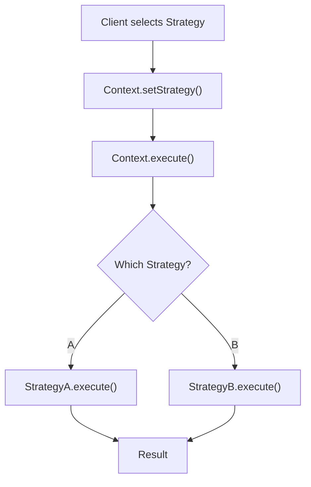

# Strategy Pattern

## Problem Statement

Define a family of algorithms, encapsulate each one, and make them interchangeable. Strategy lets the algorithm vary independently from clients.

**Use Cases:**
- Payment methods (credit card, PayPal, Bitcoin)
- Sorting algorithms (select at runtime)
- Compression algorithms (zip, gzip, bzip2)
- File parsing strategies

## Design

### Class Diagram

```
        Strategy (interface)
        ├── execute()
        │
    ┌───┴───┬──────┐
    │       │      │
ConcreteStrategyA/B/C (implement execute differently)

Context
  ├── strategy: Strategy
  └── executeStrategy()
```

### Key Components

```
Strategy: Interface defining algorithm operations
ConcreteStrategy: Implements specific algorithm
Context: Holds reference to Strategy, delegates work
```

### Pattern Flow

```
1. Create concrete strategies
2. Context holds reference to strategy
3. At runtime, switch strategies
4. Context delegates to strategy.execute()
```


## Architecture Diagram

```
┌─────────────────────────────────────────────┐
│      PaymentProcessor (Context)             │
│  ┌──────────────────────────────────────┐   │
│  │  - strategy: PaymentStrategy         │   │
│  │  - amount: float                     │   │
│  │                                      │   │
│  │  + setStrategy(strategy)             │   │
│  │  + pay() -> strategy.pay(amount)     │   │
│  └──────────────────────────────────────┘   │
│              ↑ uses                          │
│  ┌───────────┴─────────────────────────┐    │
│  │   PaymentStrategy (interface)       │    │
│  │   + pay(amount): bool               │    │
│  └───────────┬─────────────────────────┘    │
│              ↑ implements                    │
│  ┌───────────┴──────────────┬──────────┐    │
│  │                          │          │    │
│  ▼                          ▼          ▼    │
│CreditCardStrategy    PayPalStrategy   BitcoinStrategy
│+ pay(amt): bool      + pay(amt): bool + pay(amt): bool
└─────────────────────────────────────────────┘
```

## Common Questions & Answers

**Q: Strategy vs if-else conditionals?**
A: Strategy encapsulates algorithms; if-else hardcodes them. Strategy is extensible (add new payment method = new class). If-else requires modifying existing code (violates OCP). Strategy: better for 3+ variants, if-else fine for 2.

**Q: When to switch strategies—constructor or runtime?**
A: Constructor: strategy fixed for object lifetime (immutable). Runtime: switch dynamically based on conditions (flexible). Runtime switching needed for payment processor (user picks method). Constructor fine for sorting (strategy chosen once at creation).

**Q: How to pass context/data to strategy?**
A: Option 1: Pass data in execute() method. Option 2: Inject context in constructor. Option 3: Store in Context object that strategy accesses. Option 1 most flexible, Option 2 simplest. Choose based on data volume and coupling preferences.

**Q: Strategy leak—how to prevent exposing internal strategy?**
A: Don't expose strategy object; expose only execute() method. Client calls context.pay(), not context.strategy.pay(). Encapsulation: Context controls strategy switching, not client. Prevents accidental strategy access.

## Back-of-Envelope Calculations

For typical payment processor with 5 strategies (credit card, debit, PayPal, Apple Pay, Bitcoin):
- Storage: 5 strategy classes × 2KB code = 10KB, minimal instance overhead
- Throughput: Strategy selection O(1) + execution varies (CC=50ms, PayPal=200ms, Bitcoin=300ms)
- Latency: Strategy overhead negligible (< 1μs), dominated by payment gateway latency
- Bandwidth: Minimal (O(1) per strategy)

Scaling: Add new strategies without modifying PaymentProcessor.

## Design Choice Comparison

| Approach | Pros | Cons |
|----------|------|------|
| Strategy Pattern | OCP, extensible, clean | Extra classes, indirection |
| If-else Conditionals | Simple, fewer classes | Violates OCP, hard to extend |
| Factory + Strategy | Decouples creation | More infrastructure |

## Follow-up Interview Questions

1. How would you handle strategy-specific configuration (PayPal API key, Bitcoin wallet)?
2. What if strategies have different success rates (Bitcoin has failed payments)? Implement retry logic.
3. How to monitor which strategies are used and their performance metrics?
4. What's the bottleneck at 10x scale (1M payments/sec)? Strategy choice doesn't scale; parallel payment gateways do.
5. How would you implement strategy composition (combine multiple payment methods)?

## Example Scenario Walkthrough

Scenario: User pays $50 using different payment strategies

Initial state:
- PaymentProcessor with amount=$50
- Available strategies: CreditCard, PayPal, Bitcoin

Step 1: User selects credit card
- processor.setStrategy(new CreditCardStrategy())
- Current strategy = CreditCardStrategy

Step 2: Process payment
- processor.pay() calls strategy.pay(50)
- CreditCardStrategy.pay(50):
  - Validate card number
  - Check expiry
  - Connect to payment gateway
  - Authorize transaction
  - Return true

Step 3: Payment succeeds
- Response: $50 charged to credit card ending in 4242
- Transaction ID: TXN-12345

Step 4: User wants different payment method
- processor.setStrategy(new PayPalStrategy())
- Current strategy = PayPalStrategy

Step 5: Process payment with PayPal
- processor.pay() calls strategy.pay(50)
- PayPalStrategy.pay(50):
  - Redirect to PayPal login
  - User authenticates
  - PayPal confirms payment
  - Return true

Step 6: Payment succeeds
- Response: $50 charged from PayPal account
- Transaction ID: PP-67890

Step 7: Bitcoin strategy (hypothetical)
- processor.setStrategy(new BitcoinStrategy())
- BitcoinStrategy.pay(50):
  - Convert $50 to BTC (e.g., 0.001 BTC)
  - Generate wallet address
  - Wait for blockchain confirmation (10 min)
  - Return true/false based on confirmation

Each strategy encapsulated; PaymentProcessor doesn't know implementation details.

## Trade-offs

| Pro | Con |
|-----|-----|
| Runtime algorithm switching | Increased classes |
| Open/Closed principle | Overhead if few strategies |
| Avoids conditionals | Context must know strategy interface |
| Easy testing | Extra indirection |

### Strategy Pattern - Python

```python
from abc import ABC, abstractmethod

class PaymentStrategy(ABC):
    @abstractmethod
    def pay(self, amount):
        pass

class CreditCardPayment(PaymentStrategy):
    def pay(self, amount):
        print(f'Paying {amount} via Credit Card')
        # Validate card, charge
        return True

class PayPalPayment(PaymentStrategy):
    def pay(self, amount):
        print(f'Paying {amount} via PayPal')
        # OAuth, transfer funds
        return True

class PaymentProcessor:
    def __init__(self, strategy: PaymentStrategy):
        self.strategy = strategy
    
    def process(self, amount):
        return self.strategy.pay(amount)

# Usage
processor = PaymentProcessor(CreditCardPayment())
processor.process(100)  # Credit Card

processor = PaymentProcessor(PayPalPayment())
processor.process(100)  # PayPal
```

### Architecture Diagram

```mermaid
graph TB
    Context["Context<br/>strategy: Strategy"]
    Strategy["Strategy<br/>execute()"]
    StrategyA["ConcreteA<br/>execute()"]
    StrategyB["ConcreteB<br/>execute()"]

    Context -->|uses| Strategy
    Strategy <|--|StrategyA
    Strategy <|--|StrategyB
```

### Flow Diagram



## Complexity

| Operation | Time |
|-----------|------|
| setStrategy | O(1) |
| execute | O(1) |
