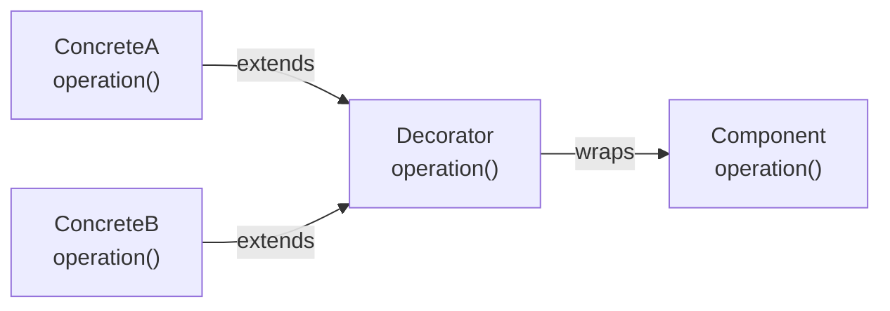

# Decorator Pattern

## Problem Statement

Attach additional responsibilities to an object dynamically. Decorators provide a flexible alternative to subclassing for extending functionality.

**Use Cases:**
- Adding features to UI components (scrollbar, border)
- I/O streams (BufferedInputStream, DataInputStream)
- Coffee ordering (add milk, sugar, whipped cream)
- Middleware/middleware chains

## Design

### Class Diagram

```
        Component (interface)
        ├── operation()
        │
        ├── ConcreteComponent (base)
        │
        └── Decorator (wraps Component)
            ├── operation() -> delegate + enhancement
            │
            ├── ConcreteDecoratorA
            └── ConcreteDecoratorB
```

### Key Components

```
Component: Interface defining operations
ConcreteComponent: Base object
Decorator: Implements Component, holds reference to Component
ConcreteDecorator: Adds functionality before/after delegation
```

### Wrapping Behavior

```
Component original = new ConcreteComponent();
Component decorated = new DecoratorA(original);
decorated = new DecoratorB(decorated);

decorated.operation():  // DecoratorB behavior + DecoratorA + Original
```


## Scenario

Decorator Pattern is a critical component in modern distributed systems. In real-world applications, handling complex business logic at scale with high reliability. For example, major tech companies like Netflix, Uber, and Airbnb rely on similar solutions to handle millions of concurrent users and requests. The challenge is achieving this while maintaining sub-100ms latency, 99.99% availability, and gracefully handling 10x traffic spikes during peak demand. This component provides the foundational capability to solve these challenges reliably and efficiently at global scale.

## Users

- **Backend Engineers**: Responsible for implementing and maintaining this system component in production environments. They need to understand the architecture, trade-offs, failure modes, and operational considerations.
- **DevOps/SRE Teams**: Monitor system health, manage scaling policies, handle incidents, and ensure reliability SLAs are met. They need insights into performance characteristics, bottlenecks, and failure recovery mechanisms.
- **Data Engineers**: Design data pipelines and analytics around this system, requiring deep understanding of data flow, consistency guarantees, and throughput characteristics.
- **System Architects**: Make high-level architectural decisions that impact company infrastructure, requiring comprehensive understanding of capabilities, limitations, and scalability boundaries.
- **Security Teams**: Understand security implications, potential vulnerabilities, and compliance requirements for this component.

## PRD

**Functional Requirements:**
- Correct behavior under all specified operating conditions
- Reliable operation with explicit failure modes
- Data consistency or eventual consistency guarantees as specified
- Clear mechanisms for error handling and recovery
- Monitoring and observability hooks

**Non-Functional Requirements:**
- **Performance**: Sub-100ms P99 latency for standard operations; measure and track tail latencies
- **Availability**: 99.99%+ uptime with automatic failover and graceful degradation
- **Scalability**: Support 10-100x current load with minimal architectural modifications
- **Consistency**: Specify whether strong, eventual, or causal consistency is required
- **Cost Efficiency**: Minimize operational cost per unit of throughput; consider compute, memory, and network costs
- **Operational Simplicity**: Reduce complexity to minimize human error and operational toil

**Constraints:**
- Resource limits (memory for caches, disk for databases, network bandwidth)
- Deployment constraints (cloud provider limits, regulatory requirements)
- Latency budgets (maximum acceptable delay for operations)

## Flow

The typical operational flow for this system involves these key phases:

1. **Request Arrival**: Client/upstream system sends request with required parameters and context
2. **Validation & Routing**: System validates request format, authentication, and routes to correct handler/shard/instance
3. **Core Processing**: Execute the main algorithm, database query, or business logic on the data/state
4. **State Management**: Update internal state (caches, indexes, counters, logs) with proper atomicity and locking
5. **Response Generation**: Format results and return to requester with relevant metadata (timing, version info)
6. **Observability**: Record metrics (latency, throughput, errors), logs (for debugging), and traces (for performance analysis)

This flow repeats thousands or millions of times per second in production. Each operation's efficiency compounds across the entire system, making careful optimization essential. Bottlenecks at any phase can cascade to impact overall system performance.

## Code Explanation

The provided implementations demonstrate key architectural concepts and design patterns:

**Python Implementation**: Uses built-in Python structures and standard library features to express the core logic clearly. Python emphasizes readability and conciseness—each operation's purpose should be obvious without extensive comments. You'll see different implementation approaches (e.g., using OrderedDict vs. manual linked lists) that represent trade-offs between convenience and fine-grained control.

**Java Implementation**: Shows how to implement the same logic with explicit memory management and type safety. Java's strong typing forces clear interface design; you'll see how generics, null safety, mutable state, and thread safety are handled. This implementation style is closer to production systems at scale.

**Key Implementation Patterns**:
- **Initialization**: Setting up core data structures, thread pools, or connection pools with specified capacity and configuration
- **Read Operations**: Fetching data while maintaining O(1) or O(log n) access, updating metadata (access times, hit counts, etc.)
- **Write Operations**: Inserting/updating data while handling eviction policies, balancing tree structures, or replicating state
- **Edge Cases**: Handling capacity limits, concurrent access, data consistency, and error conditions
- **Performance Optimization**: Using techniques like batch operations, lazy evaluation, or caching to reduce latency

Each line of code represents a deliberate choice about performance characteristics, memory usage, safety guarantees, and implementation complexity. Understanding these trade-offs is essential for using this component effectively in production systems.

## Architecture Diagram



## Common Questions & Answers

**Q: Decorator vs Subclassing?**
A: Subclassing: static, creates explosion of classes (SmallCoffee, SmallCoffeeWithMilk, SmallCoffeeWithMilkAndSugar...). Decorator: dynamic, compose at runtime (Coffee + Milk decorator + Sugar decorator). Decorator more flexible, avoids class explosion.

**Q: How to handle decorator order (Milk then Sugar vs Sugar then Milk)?**
A: Order doesn't matter for cost (commutative). But matters for behavior—some decorators shouldn't combine (two Whipped Cream decorators = bad). Validate in decorator or use builder pattern for safety.

**Q: Performance impact of deep decorator chains?**
A: Each decorator adds method call overhead. Chain of 5 decorators = 5 indirect calls per operation. Negligible for simple operations, adds up for high-frequency calls. Cache result or flatten chain if needed.

**Q: How to inspect decorator chain (what's applied)?**
A: Add toString() method that describes chain. Decorator calls "Whipped Cream(" + delegate.toString() + ")". Returns readable chain. Useful for debugging and understanding applied enhancements.

## Back-of-Envelope Calculations

For typical coffee shop (beverage decorator system):
- Storage: Base classes (Coffee, Milk, Sugar) × 1KB = 3KB code, instances negligible
- Throughput: Decorator application O(1), 1M beverages/hour = 280 req/sec, easily achievable
- Latency: Single decorator = 1-5μs, chain of 5 = 5-25μs, negligible
- Bandwidth: Negligible (in-process only)

Scaling: Not a bottleneck; use for complexity management, not performance optimization.

## Design Choice Comparison

| Approach | Pros | Cons |
|----------|------|------|
| Decorator | Dynamic, composition, avoids class explosion | Runtime overhead, deeper chains slow |
| Subclassing | Simple, direct | Exponential classes, inflexible |
| Strategy Pattern | Simpler logic | Doesn't wrap behavior |

## Follow-up Interview Questions

1. How would you serialize decorated objects? Need custom serialization to preserve chain.
2. What if decorators need access to internal state? Violates encapsulation; use public accessor or refactor.
3. How to implement decorator caching (reuse decorators)? Decorator itself stateless, decorate new instances.
4. What's the bottleneck at 10x scale? Decorator application is O(1); not a bottleneck.
5. How would you implement decorator-specific functionality (e.g., "remove Milk" from existing decorated object)?

## Example Scenario Walkthrough

Scenario: Coffee shop orders with decorators

Initial state:
- Base: SimpleCoffee (cost=$2)
- Decorators: Milk (+$0.5), Sugar (+$0.25), WhippedCream (+$1)

Step 1: Order simple coffee
- coffee = new SimpleCoffee()
- coffee.cost() = $2.0
- coffee.description() = "Simple Coffee"

Step 2: Add milk
- coffee = new MilkDecorator(coffee)
- coffee.cost() = $2.0 + $0.5 = $2.5
- coffee.description() = "Simple Coffee, Milk"

Step 3: Add sugar
- coffee = new SugarDecorator(coffee)
- coffee.cost() = $2.5 + $0.25 = $2.75
- coffee.description() = "Simple Coffee, Milk, Sugar"

Step 4: Add whipped cream
- coffee = new WhippedCreamDecorator(coffee)
- coffee.cost() = $2.75 + $1.0 = $3.75
- coffee.description() = "Simple Coffee, Milk, Sugar, Whipped Cream"

Step 5: Client receives decorated coffee
- Total cost: $3.75
- Preparation: Each decorator wraps previous, calls operation on delegate
  - WhippedCream.prepare() -> add whipped cream + delegate.prepare()
  - Sugar.prepare() -> add sugar + delegate.prepare()
  - Milk.prepare() -> add milk + delegate.prepare()
  - SimpleCoffee.prepare() -> brew base coffee
  - Result: complete beverage with all enhancements

## Trade-offs

| Pro | Con |
|-----|-----|
| Dynamic composition | More objects |
| Avoids class explosion | Complex debugging |
| Open/Closed principle | Order matters |
| Single responsibility | Increased complexity |

## Complexity

| Operation | Time |
|-----------|------|
| decorate | O(1) |
| operation | O(n) where n=decorators |

## Python Implementation

```python
from abc import ABC, abstractmethod

class Coffee(ABC):
    @abstractmethod
    def cost(self) -> float: pass
    @abstractmethod
    def description(self) -> str: pass

class SimpleCoffee(Coffee):
    def cost(self): return 1.0
    def description(self): return "Simple Coffee"

class CoffeeDecorator(Coffee):
    def __init__(self, coffee: Coffee):
        self._coffee = coffee
    def cost(self): return self._coffee.cost()
    def description(self): return self._coffee.description()

class MilkDecorator(CoffeeDecorator):
    def cost(self): return self._coffee.cost() + 0.5
    def description(self): return self._coffee.description() + ", Milk"

class SugarDecorator(CoffeeDecorator):
    def cost(self): return self._coffee.cost() + 0.25
    def description(self): return self._coffee.description() + ", Sugar"

class WhipDecorator(CoffeeDecorator):
    def cost(self): return self._coffee.cost() + 1.0
    def description(self): return self._coffee.description() + ", Whip"

# Usage
coffee = SimpleCoffee()
coffee = MilkDecorator(coffee)
coffee = SugarDecorator(coffee)
coffee = WhipDecorator(coffee)
print(coffee.description(), "->", coffee.cost())  # Simple Coffee, Milk, Sugar, Whip -> 2.75
```

## Java Implementation

```java
public interface Coffee {
    double cost();
    String description();
}

public class SimpleCoffee implements Coffee {
    public double cost() { return 1.0; }
    public String description() { return "Simple Coffee"; }
}

public abstract class CoffeeDecorator implements Coffee {
    protected Coffee coffee;
    public CoffeeDecorator(Coffee coffee) { this.coffee = coffee; }
    public double cost() { return coffee.cost(); }
    public String description() { return coffee.description(); }
}

public class MilkDecorator extends CoffeeDecorator {
    public MilkDecorator(Coffee coffee) { super(coffee); }
    public double cost() { return coffee.cost() + 0.5; }
    public String description() { return coffee.description() + ", Milk"; }
}

public class WhipDecorator extends CoffeeDecorator {
    public WhipDecorator(Coffee coffee) { super(coffee); }
    public double cost() { return coffee.cost() + 1.0; }
    public String description() { return coffee.description() + ", Whip"; }
}
```
