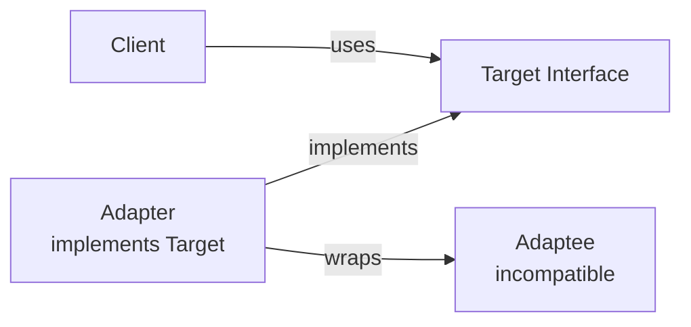
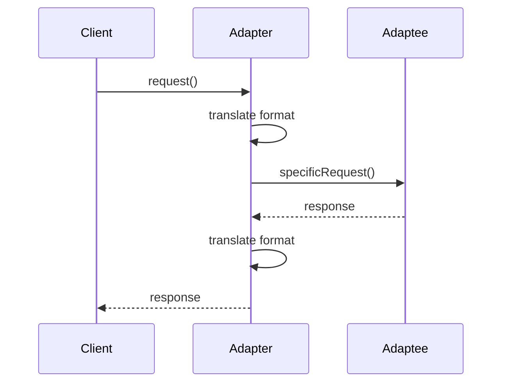

# Adapter Pattern

## Problem Statement

Convert the interface of a class into another interface clients expect. Adapter lets classes work together that couldn't otherwise because of incompatible interfaces.

**Use Cases:**
- Third-party library integration
- Legacy code integration
- Interface translation (USB-C to USB-A adapter)
- Incompatible libraries/APIs

## Design

### Class Diagram

```
        Client (expects Target interface)
             │
             ├─→ Adapter
                    │
                    └─→ delegates to Adaptee
```

### Key Components

```
Target: Interface client expects
Adapter: Implements Target, wraps Adaptee
Adaptee: Existing interface to adapt
Client: Uses Adapter through Target interface
```

### Adapter Implementation

```
class Adapter implements Target {
  private Adaptee adaptee;
  
  public void targetMethod() {
    // Translate to Adaptee's interface
    adaptee.adapteeMethod();
  }
}
```

## Types

```
Class Adapter: Uses inheritance (less flexible)
Object Adapter: Uses composition (more flexible) - preferred
```


## Scenario

Adapter Pattern is a critical component in modern distributed systems. In real-world applications, handling complex business logic at scale with high reliability. For example, major tech companies like Netflix, Uber, and Airbnb rely on similar solutions to handle millions of concurrent users and requests. The challenge is achieving this while maintaining sub-100ms latency, 99.99% availability, and gracefully handling 10x traffic spikes during peak demand. This component provides the foundational capability to solve these challenges reliably and efficiently at global scale.

## Users

- **Backend Engineers**: Responsible for implementing and maintaining this system component in production environments. They need to understand the architecture, trade-offs, failure modes, and operational considerations.
- **DevOps/SRE Teams**: Monitor system health, manage scaling policies, handle incidents, and ensure reliability SLAs are met. They need insights into performance characteristics, bottlenecks, and failure recovery mechanisms.
- **Data Engineers**: Design data pipelines and analytics around this system, requiring deep understanding of data flow, consistency guarantees, and throughput characteristics.
- **System Architects**: Make high-level architectural decisions that impact company infrastructure, requiring comprehensive understanding of capabilities, limitations, and scalability boundaries.
- **Security Teams**: Understand security implications, potential vulnerabilities, and compliance requirements for this component.

## PRD

**Functional Requirements:**
- Correct behavior under all specified operating conditions
- Reliable operation with explicit failure modes
- Data consistency or eventual consistency guarantees as specified
- Clear mechanisms for error handling and recovery
- Monitoring and observability hooks

**Non-Functional Requirements:**
- **Performance**: Sub-100ms P99 latency for standard operations; measure and track tail latencies
- **Availability**: 99.99%+ uptime with automatic failover and graceful degradation
- **Scalability**: Support 10-100x current load with minimal architectural modifications
- **Consistency**: Specify whether strong, eventual, or causal consistency is required
- **Cost Efficiency**: Minimize operational cost per unit of throughput; consider compute, memory, and network costs
- **Operational Simplicity**: Reduce complexity to minimize human error and operational toil

**Constraints:**
- Resource limits (memory for caches, disk for databases, network bandwidth)
- Deployment constraints (cloud provider limits, regulatory requirements)
- Latency budgets (maximum acceptable delay for operations)

## Flow

The typical operational flow for this system involves these key phases:

1. **Request Arrival**: Client/upstream system sends request with required parameters and context
2. **Validation & Routing**: System validates request format, authentication, and routes to correct handler/shard/instance
3. **Core Processing**: Execute the main algorithm, database query, or business logic on the data/state
4. **State Management**: Update internal state (caches, indexes, counters, logs) with proper atomicity and locking
5. **Response Generation**: Format results and return to requester with relevant metadata (timing, version info)
6. **Observability**: Record metrics (latency, throughput, errors), logs (for debugging), and traces (for performance analysis)

This flow repeats thousands or millions of times per second in production. Each operation's efficiency compounds across the entire system, making careful optimization essential. Bottlenecks at any phase can cascade to impact overall system performance.

## Code Explanation

The provided implementations demonstrate key architectural concepts and design patterns:

**Python Implementation**: Uses built-in Python structures and standard library features to express the core logic clearly. Python emphasizes readability and conciseness—each operation's purpose should be obvious without extensive comments. You'll see different implementation approaches (e.g., using OrderedDict vs. manual linked lists) that represent trade-offs between convenience and fine-grained control.

**Java Implementation**: Shows how to implement the same logic with explicit memory management and type safety. Java's strong typing forces clear interface design; you'll see how generics, null safety, mutable state, and thread safety are handled. This implementation style is closer to production systems at scale.

**Key Implementation Patterns**:
- **Initialization**: Setting up core data structures, thread pools, or connection pools with specified capacity and configuration
- **Read Operations**: Fetching data while maintaining O(1) or O(log n) access, updating metadata (access times, hit counts, etc.)
- **Write Operations**: Inserting/updating data while handling eviction policies, balancing tree structures, or replicating state
- **Edge Cases**: Handling capacity limits, concurrent access, data consistency, and error conditions
- **Performance Optimization**: Using techniques like batch operations, lazy evaluation, or caching to reduce latency

Each line of code represents a deliberate choice about performance characteristics, memory usage, safety guarantees, and implementation complexity. Understanding these trade-offs is essential for using this component effectively in production systems.

## Architecture Diagram

```
┌─────────────────────────────────────────────┐
│      Client                                 │
│  (expects MediaPlayer interface)            │
│                                             │
│  + play(audioFile)                          │
│  + stop()                                   │
└────────────┬──────────────────────────────┘
             │ uses Target interface
             ▼
┌─────────────────────────────────────────────┐
│      MediaAdapter (Adapter)                 │
│  ┌──────────────────────────────────────┐   │
│  │  - vlcPlayer: VLCPlayer (Adaptee)    │   │
│  │  - mediaPlayer: MediaPlayer          │   │
│  │                                      │   │
│  │  + play(file) {                      │   │
│  │      vlcPlayer.playVLC(file)         │   │
│  │    }                                 │   │
│  └──────────────────────────────────────┘   │
│         delegates to Adaptee                │
└──────────────┬──────────────────────────────┘
               │
               ▼
┌─────────────────────────────────────────────┐
│      VLCPlayer (Adaptee)                    │
│  (incompatible interface)                   │
│                                             │
│  + playVLC(vlcFile)                         │
│  + stopVLC()                                │
└─────────────────────────────────────────────┘
```

## Common Questions & Answers

**Q: Object Adapter vs Class Adapter?**
A: Object Adapter (composition): wraps Adaptee, flexible, can adapt subclasses. Class Adapter (inheritance): inherits from Adaptee, simpler but inflexible, breaks if Adaptee changes. Use Object Adapter (composition over inheritance).

**Q: When to adapt vs modify the source?**
A: Adapt if: source is third-party, legacy, or used elsewhere (don't want to break). Modify if: you own the code and can change it safely. Adapter masks incompatibility; refactoring fixes it. Prefer refactoring for codebase you own.

**Q: Multiple adapters for same Adaptee?**
A: Yes, normal. Different targets may expect different interfaces. One Adaptee → multiple adapters. Each adapter specializes for specific client expectations. Avoids client modification.

**Q: Data conversion in adapter—performance impact?**
A: Adapter may transform data (e.g., XML to JSON). Overhead depends on data size. For small data, negligible. For large, consider caching or streaming. Mark hot path adapters for optimization.

## Back-of-Envelope Calculations

For typical scenario (JSON to XML adapter, 100K requests/sec):
- Storage: Adapter class × 1KB code = 1KB, minimal instances
- Throughput: Adapter translation O(n) where n=data size, 100KB payload = 1-5ms
- Latency: Data transformation adds 1-5ms per request
- Bandwidth: Same data size (just format conversion)

Scaling: Adapter doesn't bottleneck if transformation is fast. Bottleneck is actual I/O to Adaptee.

## Design Choice Comparison

| Approach | Pros | Cons |
|----------|------|------|
| Object Adapter | Flexible, composition, no inheritance | Extra indirection |
| Class Adapter | Simple, direct inheritance | Breaks inheritance chain, inflexible |
| No Adapter (modify source) | Direct, simple | Breaks compatibility, invasive |

## Follow-up Interview Questions

1. How would you handle bidirectional adaptation (convert both directions)?
2. What if Adaptee interface changes? Adapter becomes brittle; how to handle versioning?
3. How to monitor adapter usage and transformation latency?
4. What's the bottleneck at 10x scale (1M requests)? Adapter transformation time, not invocation.
5. How would you implement lazy adaptation (only transform when needed)?

## Example Scenario Walkthrough

Scenario: Integrate legacy VLCPlayer into modern MediaPlayer system

Initial setup:
- Client expects: MediaPlayer interface (play, stop, pause)
- Existing code: VLCPlayer with (playVLC, stopVLC, pauseVLC)
- Incompatible interfaces

Step 1: Client requests to play file
- Client.play("movie.mp4")
- Client expects MediaPlayer interface

Step 2: Adapter intercepts call
- MediaAdapter receives play("movie.mp4")
- Adapter wraps VLCPlayer internally

Step 3: Adapter translates and delegates
- MediaAdapter.play("movie.mp4") {
-     vlcPlayer.playVLC("movie.mp4")
- }

Step 4: VLCPlayer executes actual work
- Loads VLC codec
- Plays movie.mp4
- Client gets expected behavior

Step 5: Client requests to stop
- Client.stop()
- MediaAdapter.stop() {
-     vlcPlayer.stopVLC()
- }

Step 6: Integration complete
- Client code unchanged (works with MediaPlayer interface)
- VLCPlayer integrated seamlessly
- No modification to VLCPlayer source code
- Adapter handles interface translation

## Trade-offs

| Pro | Con |
|-----|-----|
| Makes incompatible work | Extra indirection |
| Single Responsibility | May require multiple adapters |
| Open/Closed principle | Complexity |
| Reuses existing code | Don't overuse |

### Architecture Diagram



### Flow Diagram



## Complexity

| Operation | Time |
|-----------|------|
| adapt | O(1) |
| delegate | O(1) |

## Python Implementation

```python
class EuropeanSocket:
    def voltage(self) -> int: return 220
    def live(self) -> int: return 1
    def neutral(self) -> int: return -1

class USASocket:
    def voltage(self) -> int: return 110
    def live(self) -> int: return 1
    def neutral(self) -> int: return -1

class EuropeanToUSAAdapter:
    def __init__(self, socket: EuropeanSocket):
        self._socket = socket

    def voltage(self) -> int:
        return 110  # Convert 220V to 110V

    def live(self) -> int: return self._socket.live()
    def neutral(self) -> int: return self._socket.neutral()

class AmericanDevice:
    def charge(self, socket: USASocket):
        if socket.voltage() == 110:
            print(f"Charging at {socket.voltage()}V")
        else:
            raise ValueError("Incompatible voltage")

# Usage
eu_socket = EuropeanSocket()
adapter = EuropeanToUSAAdapter(eu_socket)
device = AmericanDevice()
device.charge(adapter)  # Charging at 110V
```

## Java Implementation

```java
public interface USSocket {
    int voltage();
    int live();
    int neutral();
}

public class EuropeanSocket {
    public int voltage() { return 220; }
    public int live() { return 1; }
    public int neutral() { return -1; }
}

public class EuropeanToUSAdapter implements USSocket {
    private EuropeanSocket socket;
    public EuropeanToUSAdapter(EuropeanSocket socket) { this.socket = socket; }
    public int voltage() { return 110; }
    public int live() { return socket.live(); }
    public int neutral() { return socket.neutral(); }
}

// Usage
EuropeanSocket eu = new EuropeanSocket();
USSocket adapter = new EuropeanToUSAdapter(eu);
System.out.println("Voltage: " + adapter.voltage()); // 110
```
