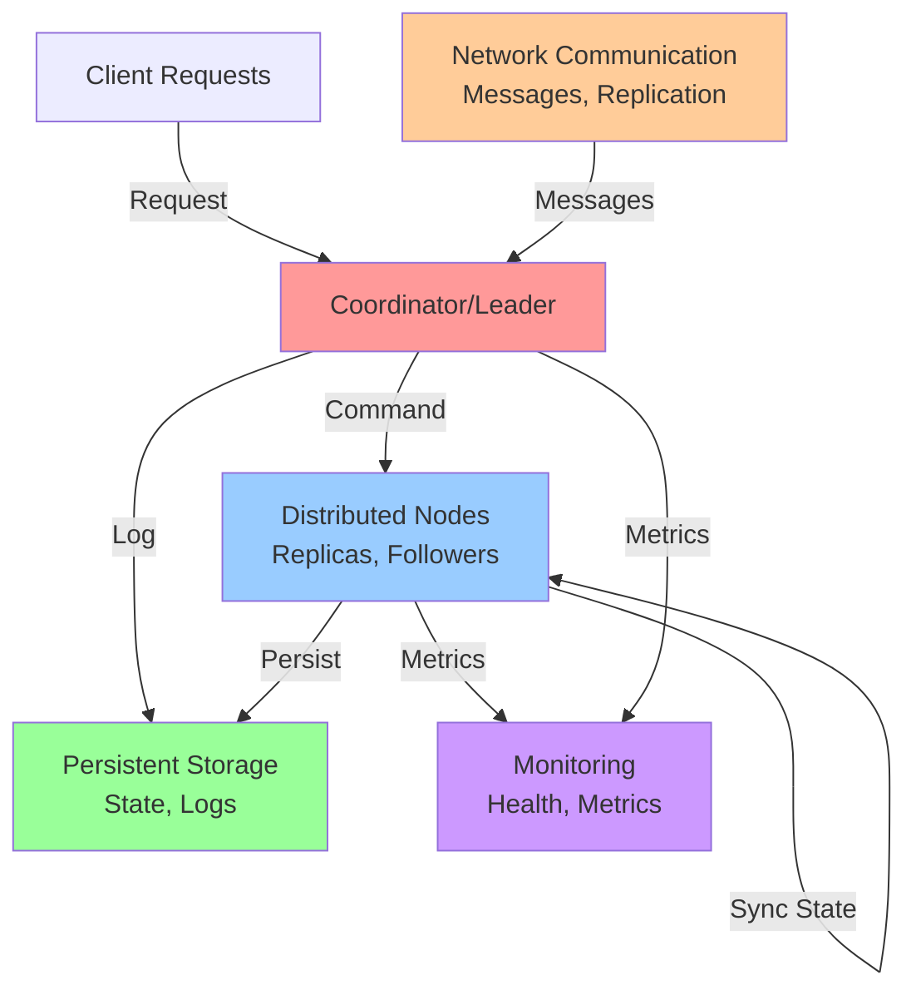

## System Overview

**Scale Metrics:**
- **Scale:** Variable based on topic
- **Key Components:** Distributed nodes, coordination, state management
- **Primary Use Case:** Distributed systems, reliability, consistency

## Problem Statement

### Functional Requirements
- [Core requirement 1]
- [Core requirement 2]
- [Core requirement 3]
- [Core requirement 4]
- [Core requirement 5]

### Non-Functional Requirements
- **Correctness:** Guarantees under failure conditions
- **Availability:** Tolerance for node failures
- **Consistency:** Data consistency guarantees
- **Scalability:** Handle millions of nodes/requests
- **Latency:** Response time under normal and failure conditions

## Architecture

### High-Level Design

### Core Concepts

#### Node Roles
- **Coordinator/Leader:** Authoritative decision maker
- **Followers/Replicas:** State replication
- **Learners:** Receiving updates without voting

#### Communication Patterns
- **Synchronous:** Wait for acknowledgments
- **Asynchronous:** Proceed without waiting
- **Quorum:** Majority agreement

#### Failure Models
- **Fail-stop:** Node simply crashes
- **Byzantine:** Node acts maliciously
- **Partition:** Network splits isolate nodes

## Data Flow Scenarios

### Scenario 1: Normal Operation
1. Client sends request to coordinator
2. Coordinator receives request
3. Coordinator logs request durably
4. Coordinator broadcasts to replicas
5. Replicas acknowledge receipt
6. Coordinator responds to client
7. Replicas apply to state machine

### Scenario 2: Node Failure
1. Node stops sending heartbeats
2. Detection timeout expires
3. Leader triggers election or failover
4. New leader elected by quorum
5. New leader catches up on logs
6. System resumes normal operation

### Scenario 3: Network Partition
1. Network splits into partitions
2. One partition has majority (leader)
3. Minority partition cannot operate
4. Majority continues with degraded set
5. Partition heals
6. Minority catches up on missed updates

## Scalability Considerations

### Horizontal Scaling
- Adding more nodes increases availability
- Increases communication overhead
- Quorum size grows
- Decision latency increases

### Consistency vs Scalability
- **Strong consistency:** Requires coordination (slower)
- **Eventual consistency:** Allows divergence (faster)
- Trade-offs based on use case

### Network Topology
- **Star:** Central coordinator (single point of failure)
- **Mesh:** Full connectivity (high overhead)
- **Ring:** Limited connections (failure propagation)

## High Availability & Reliability

### Fault Tolerance
- **Single node failure:** System continues with n-1 nodes
- **Multiple node failures:** Quorum ensures consistency
- **Network partition:** Majority partition continues
- **Byzantine failures:** Need f+2 replicas for f faulty nodes

### Recovery Mechanisms
- **Log replay:** Reconstruct state from logs
- **Snapshots:** Checkpoint state periodically
- **Catch-up:** Lagging nodes apply missed operations
- **Rebuilding:** Full replication from leader

### Failure Detection
- **Heartbeat:** Periodic signals from leaders
- **Timeout:** Detect failure when signals stop
- **Confirmation:** Multiple failure confirmations before action
- **Distributed:** Gossip-based failure detection

## Data Consistency

### Consistency Models

**Strong Consistency:**
- All reads see latest write
- Requires synchronous replication
- Higher latency, lower availability

**Eventual Consistency:**
- Reads may see stale data
- Asynchronous replication
- Lower latency, higher availability

**Causal Consistency:**
- Causally related operations ordered
- Uncommitted operations visible only to originator
- Balance between strong and eventual

### Ordering Guarantees
- **Total order:** Single serial order for all operations
- **Partial order:** Operations without dependencies are unordered
- **Causal order:** Preserve dependency ordering

## Performance Optimization

### Latency Reduction
- **Batching:** Combine multiple operations
- **Pipelining:** Multiple in-flight requests
- **Caching:** Store frequently accessed data
- **Async:** Non-blocking operations

### Throughput Optimization
- **Replication factor:** Balance durability vs overhead
- **Batching size:** Larger batches = higher overhead but better amortization
- **Parallelism:** Process independent operations concurrently
- **Connection pooling:** Reuse connections

### Resource Efficiency
- **Message compression:** Reduce network bandwidth
- **Incremental updates:** Send only changes
- **Tiered storage:** Hot/cold data management
- **Garbage collection:** Remove old logs/snapshots

## Security Considerations

### Authentication
- Verify node identity
- Prevent unauthorized participation
- Mutual TLS for inter-node communication

### Encryption
- Encrypt data in transit
- Encrypt sensitive data at rest
- Key management and rotation

### Byzantine Resilience
- Verify all messages
- Use cryptographic signatures
- Tolerate f faulty nodes with 3f+1 replicas

## Monitoring & Observability

### Key Metrics
- **Latency:** Request processing time
- **Throughput:** Operations per second
- **Availability:** Uptime percentage
- **Consistency:** Staleness of replicas
- **Replication lag:** How far behind followers are

### Failure Scenarios to Monitor
- Node failures
- Network partitions
- Cascading failures
- Leader election events
- Replication lag spikes

## Common Patterns

### Quorum Reads/Writes
- Ensure consistency with subset of replicas
- Read from quorum: n/2 + 1
- Write to quorum: n/2 + 1

### Linearizability
- All operations appear in a total order
- Reads return most recent write
- Achieved through leader election

### Atomic Broadcast
- All nodes deliver messages in same order
- Tolerance for failures
- Used in consensus protocols

## Technology Stack Comparison

| Aspect | Raft | Paxos | Gossip | CRDT |
|--------|------|-------|--------|------|
| **Consistency** | Strong | Strong | Eventual | CvRDT |
| **Latency** | Low | Medium | High | Very Low |
| **Complexity** | Medium | High | Low | Low |
| **Partition Tolerance** | Yes | Yes | Yes | Yes |
| **Byzantine Safety** | No | Yes | No | No |

## Lessons Learned

1. **Consensus is Hard:** Multiple rounds of communication needed for safety
2. **Partition Tolerance:** Network failures are inevitable, plan for them
3. **Failure Detection:** Timeouts are imprecise, expect false positives
4. **Replication Lag:** Always present, impacts consistency guarantees
5. **Byzantine Failures:** Rare but catastrophic, require stronger protocols

## Common Interview Questions

1. **Design a distributed lock service**
   - Leader election mechanism
   - Failure handling and timeouts
   - Deadlock prevention

2. **How would you handle network partitions?**
   - Quorum-based decisions
   - Majority partition continues
   - Minority partition waits

3. **What's the difference between Raft and Paxos?**
   - Complexity vs safety tradeoffs
   - When to use each
   - Real-world implementations

4. **How do you detect failures?**
   - Heartbeat mechanisms
   - Timeout tuning
   - False positive handling

5. **Explain eventual consistency**
   - What it guarantees and doesn't
   - When to use it
   - Convergence properties

6. **Design a system that tolerates f Byzantine failures**
   - Need 3f+1 nodes
   - Message authentication
   - Safety and liveness proofs

## Related Systems

- **Consensus:** Raft, Paxos, Zookeeper, Etcd
- **Replication:** Master-slave, Multi-master
- **Failure Detection:** Gossip protocols, Heartbeats
- **Consistency:** Strong, Eventual, Causal
- **Coordination:** Leader election, Distributed locks

---

**Difficulty:** Advanced
**Time to Master:** 3-4 weeks
**Prerequisite Knowledge:** Distributed systems fundamentals, networking
**Common in Interviews:** Yes - Hard problems requiring deep understanding
